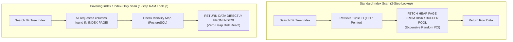

# Index Design Patterns — Composite, Covering, Partial, Expression Indexes

## Mental Model

Indexes are not magic wands added randomly to columns whenever a query is slow; every index incurs a **write tax** on `INSERT`/`UPDATE`/`DELETE` and consumes valuable Buffer Pool RAM. 

Advanced **Index Design Patterns** are architectural techniques used by database engineers to maximize query speedup while minimizing index overhead. Instead of building five individual indexes on five columns, a single thoughtfully ordered **Composite Index** can service multiple queries. A **Covering Index** allows queries to execute entirely within RAM index pages without touching disk heap tables (**Index-Only Scan**). A **Partial Index** indexes only the 1% of active data that actually gets queried, saving 99% of memory and write overhead.

---

## 1. Composite Indexes & The Leftmost Prefix Rule

A **Composite Index** (Multi-Column Index) indexes data across multiple columns in a specified left-to-right sequence: `(col1, col2, col3)`.

### Internal B+ Tree Storage Order
Tuples in a composite index B+ Tree are sorted first by `col1`. For equal values of `col1`, they are sorted by `col2`. For equal values of `col1` and `col2`, they are sorted by `col3`.

```text
Index Definition: (country, status, created_at)

Logical Sorting Order in B+ Tree Leaf Pages:
('CA', 'ACTIVE',  '2026-01-01')
('CA', 'ACTIVE',  '2026-01-02')
('CA', 'PENDING', '2026-01-01')
('US', 'ACTIVE',  '2026-01-01')
('US', 'ACTIVE',  '2026-01-03')
```

### The Leftmost Prefix Rule Matrix

Given index `(A, B, C)`:

| Query WHERE Clause Predicate | Index Usable? | Scan Type | Explanation |
|---|---|---|---|
| `WHERE A = 5` | **YES** | Index Range Scan | Matches leading column $A$. |
| `WHERE A = 5 AND B = 10` | **YES** | Index Range Scan | Matches leading prefix $(A, B)$. |
| `WHERE A = 5 AND B = 10 AND C = 20` | **YES** | Index Range Scan | Full key match $(A, B, C)$. |
| `WHERE A = 5 AND C = 20` | **PARTIAL** | Index Scan + Filter | Uses $A$ to narrow range; $C$ evaluated as filter. |
| `WHERE B = 10 AND C = 20` | **NO** | Sequential Scan / Skip Scan | Violates leftmost prefix rule (missing $A$). |
| `WHERE A = 5 AND B > 10 AND C = 20` | **PARTIAL** | Index Scan | $A$ equality and $B$ range scan used. $C$ cannot be used for range lookup because $B$ is a range inequality! |

> **Rule of Thumb for Column Ordering in Composite Indexes:**
> Put **Equality columns** first, followed by **Range (`>`, `<`, `BETWEEN`) columns**, followed by **Sort (`ORDER BY`) columns**.

$$\text{Column Order} = [\text{Equality Columns}] \to [\text{Range Columns}] \to [\text{Sort Columns}]$$

---

## 2. Covering Indexes & Index-Only Scans

A **Covering Index** is an index that contains **all** columns requested by a query (in `SELECT`, `WHERE`, `JOIN`, and `GROUP BY`).

### Index Scan vs. Index-Only Scan



### The `INCLUDE` Clause (Non-Key Covered Columns)

In standard composite indexes `(A, B, C)`, all three columns form the B+ Tree search key, controlling node splits and tree ordering.

The `INCLUDE` clause allows engineers to attach non-key payload columns to the **leaf pages only**, keeping upper internal nodes smaller and preserving high fan-out:

```sql
-- PostgreSQL / SQL Server Covering Index syntax
CREATE INDEX idx_orders_customer_covering 
ON orders (customer_id, status) 
INCLUDE (amount, order_date);
```

- `customer_id, status`: Form the B+ Tree search key (used for filtering/sorting).
- `amount, order_date`: Stored **only in leaf pages** to satisfy `SELECT amount, order_date` without heap fetches.

---

## 3. Partial Indexes (Filtered Indexes)

A **Partial Index** indexes a subset of rows in a table defined by a conditional `WHERE` clause.

### Use Case: Unprocessed Queue Data
Consider a `tasks` table with 10,000,000 completed tasks (`status = 'COMPLETED'`) and 500 pending tasks (`status = 'PENDING'`).

```sql
-- BAD: Indexing all 10 million rows when 99.9% are never queried
CREATE INDEX idx_tasks_all ON tasks (status); -- Size: 220 MB

-- ELEGANT: Partial Index indexing ONLY pending tasks
CREATE INDEX idx_tasks_pending ON tasks (created_at) 
WHERE status = 'PENDING'; -- Size: 32 KB!
```

### Performance & Storage Benefits
1. **Tiny RAM Footprint:** 32 KB fits instantly in L1 CPU cache vs 220 MB clogging the Buffer Pool.
2. **Zero Maintenance Overhead:** `INSERT` or `UPDATE` operations on `status = 'COMPLETED'` rows do **not** modify the partial index!

---

## 4. Expression / Functional Indexes

An **Expression Index** (Functional Index) is built on the result of a function or scalar expression evaluated over column values.

### The Non-SARGable Query Problem
A query predicate is **Non-SARGable** (Search Argument Able) when a column is wrapped in a function, preventing standard index lookups:

```sql
-- NON-SARGable Query: Cannot use standard index on 'email'!
SELECT * FROM users WHERE LOWER(email) = 'user@example.com';
-- Result: Full Table Sequential Scan over 5,000,000 rows!
```

### Solution: Expression Index

```sql
-- Create index directly on the expression LOWER(email)
CREATE INDEX idx_users_lower_email ON users (LOWER(email));

-- Now the optimizer uses an Index Scan on LOWER(email)!
```

#### Other Common Expression Index Patterns:

```sql
-- Index on JSONB field extraction
CREATE INDEX idx_events_user_id ON events (((payload->>'user_id')::int));

-- Index on Date truncations for reporting
CREATE INDEX idx_orders_date ON orders (DATE_TRUNC('day', created_at));
```

---

## 5. Summary Matrix of Index Patterns

| Pattern | SQL Syntax Example | Key Advantage | Best Use Case |
|---|---|---|---|
| **Composite Index** | `CREATE INDEX ON orders (tenant_id, status, created_at)` | Services multiple query patterns with 1 index. | Multi-filter queries, composite primary keys. |
| **Covering Index (`INCLUDE`)** | `CREATE INDEX ON orders (customer_id) INCLUDE (total_amount)` | Enables **Index-Only Scan**; 0 heap reads. | Read-heavy dashboard queries selecting specific columns. |
| **Partial Index** | `CREATE INDEX ON users (email) WHERE is_active = true` | 90%+ smaller index size; 0 write tax on non-matching rows. | Low-cardinality flags (`is_unprocessed`, `deleted_at IS NULL`). |
| **Expression Index** | `CREATE INDEX ON users (LOWER(username))` | Optimizes queries wrapping columns in functions/JSON. | Case-insensitive searches, JSONB field extraction. |

---

## 6. Production Operations & Inspection Commands

### Verifying Index Usage via EXPLAIN ANALYZE

```sql
-- Check if query uses Index-Only Scan
EXPLAIN (ANALYZE, BUFFERS)
SELECT customer_id, status, amount 
FROM orders 
WHERE customer_id = 5421 AND status = 'SHIPPED';

-- Desired EXPLAIN Output:
-- Index Only Scan using idx_orders_customer_covering on orders  (cost=0.42..8.44 rows=1 width=16) (actual time=0.012..0.014 rows=1 loops=1)
--   Heap Fetches: 0   <-- CRITICAL: 0 heap reads required!
```

### Finding Unused and Duplicate Indexes in PostgreSQL

```sql
-- Find indexes that waste disk space and write overhead but are never used by queries
SELECT 
    schemaname || '.' || relname AS table_name,
    indexrelname AS index_name,
    pg_size_pretty(pg_relation_size(i.indexrelid)) AS index_size,
    idx_scan AS number_of_scans
FROM pg_stat_user_indexes i
JOIN pg_index using (indexrelid)
WHERE idx_scan = 0 
  AND indisunique = false
ORDER BY pg_relation_size(i.indexrelid) DESC;
```

---

## 7. Failure Modes and Trade-offs

1. **Over-Indexing (Write Tax Inflation)** — Adding an index for every single query pattern. A table with 15 indexes slows `INSERT` throughput by 500% because every inserted row forces 15 separate B+ Tree modifications and WAL writes. *Mitigation*: Consolidate single-column indexes into multi-column composite indexes; audit and drop unused indexes (`idx_scan = 0`).
2. **Missing Visibility Map Maintenance (Index-Only Scan Degradation)** — In PostgreSQL, an Index-Only Scan must check the **Visibility Map** to ensure dead MVCC tuples aren't returned. If `autovacuum` falls behind, heap fetches increase, turning an Index-Only Scan back into a slower Index Scan. *Mitigation*: Tune `autovacuum` to run frequently on active tables.
3. **Range Column Position Error in Composite Index** — Placing a range column before an equality column in a composite index (e.g., `(created_at, status)` instead of `(status, created_at)`) prevents the optimizer from using the index for equality filtering on `status`. *Mitigation*: Always follow the `[Equality] -> [Range] -> [Sort]` column ordering rule.

---

## 8. Active-Recall Prompts

1. **Why does the column order `(status, created_at)` work for `WHERE status = 'ACTIVE' AND created_at > '2026-01-01'`, but `(created_at, status)` fails to optimize the exact same query?**
2. **What is an Index-Only Scan, what role does the `INCLUDE` clause play in enabling it, and why does PostgreSQL's Visibility Map affect its performance?**
3. **How does a Partial Index on `WHERE is_processed = false` save both disk memory and write latency compared to a standard full index?**
4. **Why is `WHERE UPPER(lastname) = 'SMITH'` non-SARGable, and how does an Expression Index fix it?**

---

## Related Notes

- [[B-Tree and B+ Tree Indexes - Structure, Search, Insert, Split]]
- [[Cost-Based Optimizer - Statistics, Cardinality Estimation, Join Ordering]]
- [[Query Execution - Join Algorithms, Aggregation, Sorting, Parallel Query]]
- [[Database Performance Tuning - EXPLAIN ANALYZE, Slow Query Log, Connection Pooling]]

> **Interview Style Question:** *"Your e-commerce application has an `orders` table with 50 million rows. Users frequently run a dashboard query: `SELECT order_id, total_amount, order_date FROM orders WHERE tenant_id = 45 AND status = 'PENDING' ORDER BY order_date DESC LIMIT 20`. The current single-column index on `tenant_id` takes 4.2 seconds. Design the optimal index for this query, explain its column ordering, explain why it eliminates sorting, and calculate how it achieves zero heap disk reads."*

---
