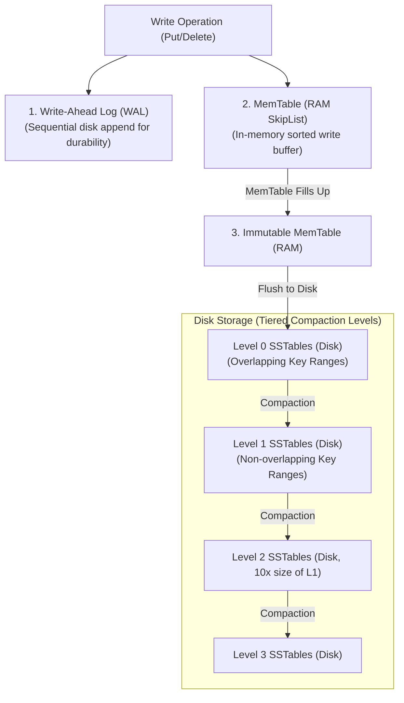
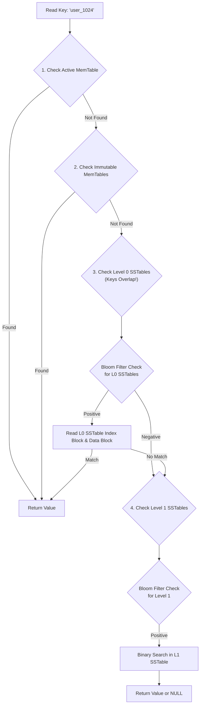
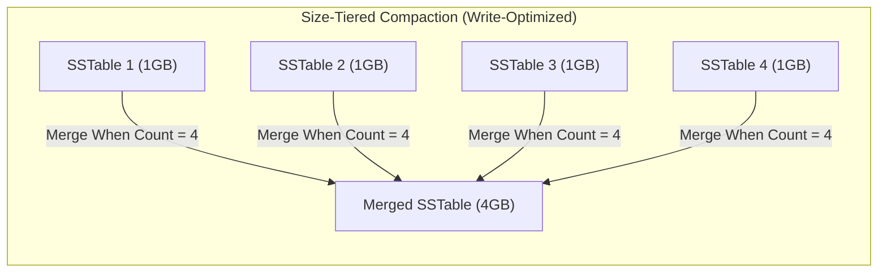
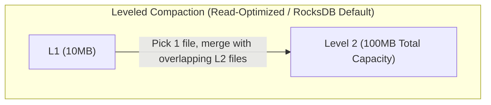

# LSM Tree — Log-Structured Merge Tree, Compaction, RocksDB

## Mental Model

Think of an **LSM Tree (Log-Structured Merge-Tree)** as an efficient **high-speed manufacturing inbox** for write-heavy applications. 

In a B+ Tree, every incoming write forces an in-place random modification to an 8KB page on disk (like running to a specific filing cabinet in a huge warehouse for every incoming piece of paper). 

In an LSM Tree, you never modify existing disk files. Instead, you quickly write incoming updates into a fast **in-memory notepad (MemTable)** and append to a sequential log. When the notepad fills up, you freeze it and dump it to disk as an **immutable, pre-sorted file (SSTable)**. To prevent millions of small files from accumulating, background workers periodically merge and deduplicate older files (**Compaction**). LSM trees convert random write workloads into 100% sequential I/O.

---

## 1. LSM Tree Core Architecture

An LSM Tree organizes data across memory and multi-tiered disk storage layers.



### Component Breakdown

| Component | Storage Location | Data Structure | Purpose & Mechanics |
|---|---|---|---|
| **WAL (Write-Ahead Log)** | Disk | Sequential Log | Guarantees durability before RAM flush. Appended sequentially. |
| **MemTable** | RAM | SkipList or Concurrent Red-Black Tree | Buffers incoming writes/deletes in sorted order. $O(\log N)$ inserts. |
| **Immutable MemTable** | RAM | Read-Only SkipList | Read-only copy of filled MemTable awaiting background disk flush. |
| **SSTable (Sorted String Table)** | Disk | Immutable File Array | Immutable disk file containing sorted key-value pairs + index block + Bloom filter. |
| **Bloom Filter** | RAM / Disk Header | Probabilistic Bit Array | Quickly checks if a key **definitely does not exist** in an SSTable ($O(1)$). |

---

## 2. Write, Read, and Delete Paths

### A. The Write Path ($O(1)$ Sequential Ingest)
1. Append write `(key, value)` to WAL file on disk.
2. Insert `(key, value)` into active MemTable SkipList in RAM.
3. Return `SUCCESS` to client. **Zero random disk I/O performed!**

### B. The Read Path ($O(K \log N)$ Range Search)
Because keys can exist across memory and multiple SSTable levels on disk, reads are more complex than writes.



### C. The Delete Path (Tombstones)
LSM Trees cannot perform in-place deletions on immutable SSTables. A deletion is executed by writing a special marker called a **Tombstone**:
`Put("user_1024", TOMBSTONE)`

During background Compaction, when a Tombstone meets the old key value in a lower level, both entries are discarded.

---

## 3. Compaction Strategies: Size-Tiered vs. Leveled

Compaction is the garbage collection and merging engine of LSM trees. It merges multiple SSTables, removes duplicate keys, and purges Tombstones.





### Size-Tiered vs. Leveled Compaction Matrix

| Property | Size-Tiered Compaction (STCS) | Leveled Compaction (LCS) |
|---|---|---|
| **Core Idea** | Merges SSTables of similar sizes together when file count threshold is hit. | Divides disk into levels ($L_1, L_2, \dots$), each $10\times$ larger than previous. |
| **Key Overlap** | SSTables within the same level **have overlapping key ranges**. | SSTables within $L_1, L_2, \dots$ **have zero overlapping keys**. |
| **Write Amplification** | Lower (~4x to 8x). | Higher (~10x to 30x). |
| **Read Amplification** | Higher (must check multiple SSTables per level). | Lower (at most 1 SSTable checked per level $L_1+$). |
| **Space Amplification** | High (requires up to 50% free disk space for temporary merges). | Low (~10% free disk space required). |
| **Best Engine Fit** | Apache Cassandra write-heavy workloads. | RocksDB, LevelDB, CockroachDB read/write balanced. |

---

## 4. Amplification Metrics: Write, Read, Space

LSM Tree tuning revolves around managing the fundamental trade-offs between three amplification metrics:

1. **Write Amplification Factor (WAF):**
   $$\text{WAF} = \frac{\text{Total Bytes Written to Disk (WAL + Flushes + Compactions)}}{\text{Logical Bytes Written by Application}}$$
   *(High WAF wears out SSD flash endurance).*

2. **Read Amplification Factor (RAF):**
   $$\text{RAF} = \frac{\text{Total Disk Page Bytes Read}}{\text{Logical Bytes Requested by Query}}$$

3. **Space Amplification Factor (SAF):**
   $$\text{SAF} = \frac{\text{Total Disk Space Used by Database Files}}{\text{Size of De-duplicated Logical Data}}$$

---

## 5. RocksDB Production Operations & Diagnostics

RocksDB is the open-source industry-standard C++ LSM engine embedded inside CockroachDB, TiKV, Kafka Streams, and MySQL (MyRocks).

### Tuning RocksDB Options in C++ / Configuration

```cpp
#include "rocksdb/db.h"

rocksdb::Options options;
// Create database if missing
options.create_if_missing = true;

// Set MemTable size to 128MB
options.write_buffer_size = 128 * 1024 * 1024;

// Max number of MemTables in memory before stalling writes
options.max_write_buffer_number = 4;

// Use Leveled Compaction
options.compaction_style = rocksdb::kCompactionStyleLevel;

// Enable Bloom Filter (10 bits per key = ~1% false positive rate)
rocksdb::BlockBasedTableOptions table_options;
table_options.filter_policy.reset(rocksdb::NewBloomFilterPolicy(10));
options.table_factory.reset(rocksdb::NewBlockBasedTableFactory(table_options));
```

### Inspecting RocksDB Compaction & Memory Metrics

```bash
# Inspect RocksDB LOG file for Compaction Stats
grep "Compaction Stats" /var/lib/rocksdb/LOG -A 15

# Example RocksDB Log Output:
# Level  Files Size(MB) Score Read(GB) Write(GB) W-Amp
#  L0      4     120    1.2    0.0       1.2     1.0
#  L1      9     105    1.0    4.2       4.1     3.8
#  L2     85    1020    1.0   12.5      12.1     2.9
```

---

## 6. Failure Modes and Trade-offs

1. **Write Stalls (Compaction Backlog)** — If the application write rate exceeds the background I/O bandwidth of the compaction threads, Level 0 files accumulate rapidly ($>20$ files). RocksDB deliberately **stalls or throttles incoming writes** to allow compaction to catch up. *Mitigation*: Increase `max_background_compactions`, allocate dedicated NVMe I/O bandwidth, tune `write_buffer_size`.
2. **High Write Amplification Burnout on SSDs** — Leveled compaction can result in a WAF of $20\text{x}$–$30\text{x}$. Writing 1 TB of application data causes 30 TB of disk writes, wearing out flash memory SSD drive endurance (TBW rating). *Mitigation*: Switch to Size-Tiered compaction or Universal compaction for extreme write workloads.
3. **Space Amplification Spikes during Large Deletions** — Deleting millions of records adds Tombstones, actually **increasing** total disk usage until compactions process all affected SSTable levels. *Mitigation*: Trigger manual range compaction (`DB::CompactRange()`).

---

## 7. Active-Recall Prompts

1. **Why does an LSM Tree achieve 10x–50x higher write throughput than a B+ Tree on the same disk storage hardware?**
2. **What is a Bloom Filter, where is it positioned in the LSM read path, and how does it prevent unnecessary disk reads for non-existent keys?**
3. **Compare Size-Tiered Compaction (STCS) vs. Leveled Compaction (LCS) in terms of Write Amplification, Read Amplification, and Space Amplification.**
4. **What causes a "Write Stall" in RocksDB, and what metrics indicate that compaction is falling behind incoming writes?**

---

## Related Notes

- [[B-Tree and B+ Tree Indexes - Structure, Search, Insert, Split]]
- [[Write-Ahead Logging - WAL, Redo Log, Undo Log, fsync Guarantees]]
- [[Wide-Column Stores - Apache Cassandra, SSTable, Consistent Hashing, Tunable Consistency]]
- [[Key-Value Stores - Redis Architecture, Data Structures, Persistence, Cluster]]

> **Interview Style Question:** *"You are designing a high-frequency telemetry ingestion system receiving 500,000 writes/sec. A senior engineer recommends B+ Tree-based PostgreSQL, while another advocates for LSM-tree-based RocksDB/Cassandra. Compare the disk I/O patterns, Write Amplification Factor (WAF), and compaction/page-split overheads of both architectures to justify your decision."*

---
