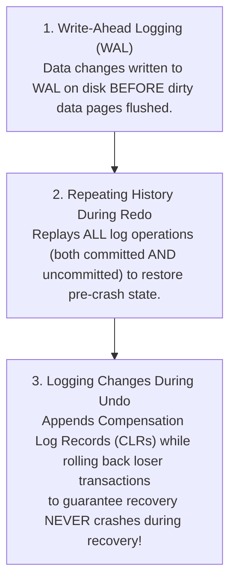
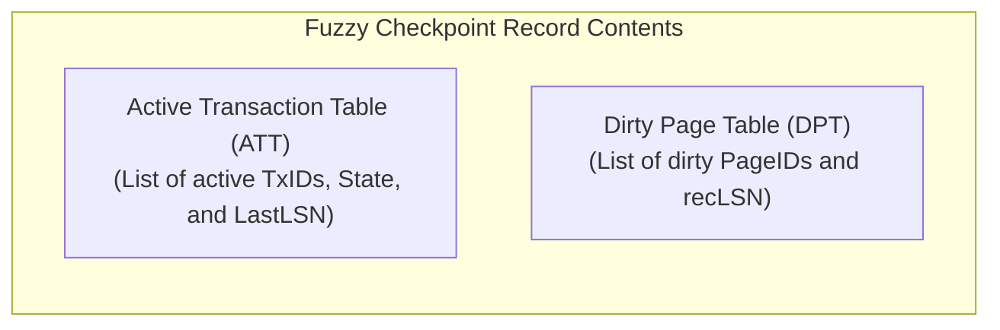
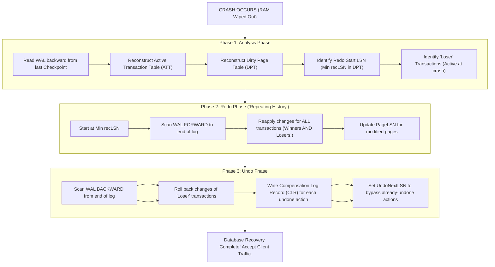
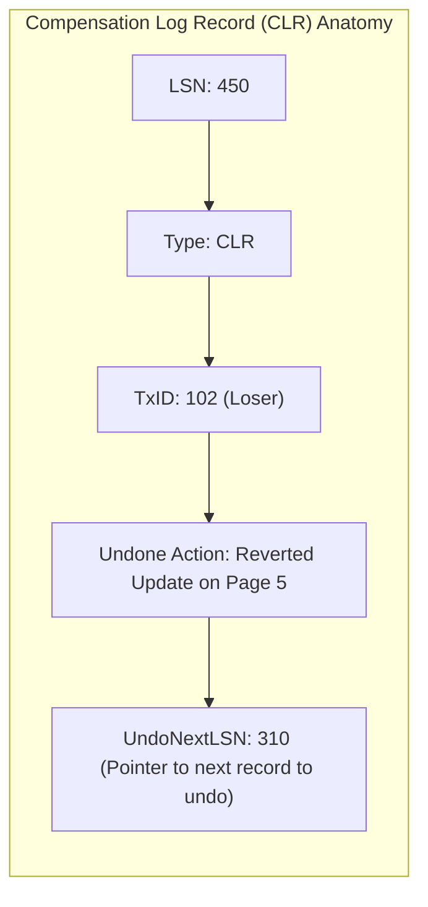

# ARIES Recovery Protocol — Analysis, Redo, Undo Phases, Checkpointing

## Mental Model

Think of the **ARIES (Algorithm for Recovery and Isolation Exploiting Semantics)** protocol as an expert forensic investigator rebuilding a crime scene after a sudden disaster.

When a database crashes mid-flight, RAM is instantly wiped out, leaving behind a half-written WAL log on disk and a set of disk pages containing a mixture of committed updates, uncommitted dirty data, and un-flushed writes. 

ARIES recovers the system by strictly applying three phases: First, **Analysis** inspects the scene from the last saved checkpoint to determine which transactions were active (losers) and which data pages were dirty at the moment of the crash. Second, **Redo ("Repeating History")** re-executes **all** logged actions forward in time to return the database to the exact state it was in at the instant of the crash. Third, **Undo** walks backward in time to roll back only the actions of the uncommitted "loser" transactions, leaving behind a 100% consistent database.

---

## 1. Core Principles of ARIES

Developed by C. Mohan at IBM Research, ARIES is the gold-standard crash recovery algorithm used by almost all modern relational database engines (DB2, SQL Server, PostgreSQL, MySQL InnoDB).

### The Three Foundational Principles

---

## 2. Checkpointing Mechanics: Non-Fuzzy vs. Fuzzy Checkpointing

If a crash occurs, scanning the entire WAL log file from the beginning of database history would take hours or days. **Checkpointing** writes metadata to disk periodically to limit how far back the recovery engine must scan.

### A. Non-Fuzzy Checkpointing (Naïve & Slow)
1. Stop accepting new transactions.
2. Flush ALL dirty pages from Buffer Pool RAM to Disk.
3. Flush WAL buffer to Disk.
4. Write `CHECKPOINT` record to WAL.
5. Resume transactions.
> ⚠️ **Major Drawback:** Pauses all database operations for seconds or minutes!

### B. ARIES Fuzzy Checkpointing (High-Performance & Non-Blocking)
Fuzzy Checkpointing writes metadata **without forcing dirty data pages to be flushed to disk immediately**!

- **`recLSN` (Recovery LSN):** The earliest LSN that made a page dirty since it was last flushed to disk. The minimum `recLSN` across all pages in the DPT defines the **Redo Start Point**!

---

## 3. The Three Phases of ARIES Crash Recovery

When a database restarts after a crash, ARIES executes three sequential phases:

---

### Phase 1: Analysis Phase
- **Goal:** Determine the state of the system at the time of the crash.
- **Actions:**
  1. Read the last `CHECKPOINT` record.
  2. Populate initial **Active Transaction Table (ATT)** and **Dirty Page Table (DPT)** from the checkpoint payload.
  3. Scan WAL **forward** to the end of the log:
     - If a log record for transaction $T$ is found, add $T$ to ATT (or update $T$'s `LastLSN`).
     - If a `COMMIT` or `ABORT` record is found for $T$, remove $T$ from ATT.
     - If a page $P$ is modified and not in DPT, add $(P, \text{recLSN} = \text{CurrentLSN})$ to DPT.
  4. At the end of Analysis, transactions remaining in ATT are classified as **Losers**.

---

### Phase 2: Redo Phase ("Repeating History")
- **Goal:** Restore the database state to the **exact moment of the crash**.
- **Start Point:** Smallest `recLSN` in the Dirty Page Table (DPT).
- **Actions:**
  1. Scan WAL **forward** from `Smallest recLSN` to the very end of the log.
  2. For each log record modifying Page $P$:
     - Re-apply the change (Redo) **UNLESS** the page on disk already contains the change:
       $$\text{Skip Redo IF } P \text{ is not in DPT OR } P.\text{recLSN} > \text{CurrentLSN} \text{ OR } \text{PageLSN} \ge \text{CurrentLSN}$$
  3. Set `PageLSN = CurrentLSN` after applying.

---

### Phase 3: Undo Phase
- **Goal:** Roll back the effects of all **Loser** transactions active at crash time.
- **Actions:**
  1. Scan WAL **backward**, processing the `LastLSN` of all Loser transactions in descending LSN order.
  2. For each log record of a Loser transaction:
     - Perform the inverse operation (Undo).
     - Write a **Compensation Log Record (CLR)** to the WAL log.
     - The CLR contains a field `UndoNextLSN` pointing to the next LSN to be undone for that transaction.

> **Why CLRs are Revolutionary:** If the database crashes AGAIN during Phase 3 Undo, upon restart the Analysis and Redo phases process the CLRs. When Phase 3 runs again, it uses `UndoNextLSN` to **skip already-undone actions**, eliminating infinite crash-recovery loops!

---

## 4. Comprehensive Example Timeline

Consider a database modifying Page 1 ($P_1$) and Page 2 ($P_2$):

| LSN | Transaction | Action | ATT State | DPT State |
|---|---|---|---|---|
| 100 | $T_1$ | Update $P_1$ | $T_1$ (LastLSN=100) | $P_1$ (recLSN=100) |
| 110 | $T_2$ | Update $P_2$ | $T_1, T_2$ (LastLSN=110) | $P_1(100), P_2(110)$ |
| 120 | — | **Fuzzy Checkpoint** | ATT: $\{T_1, T_2\}$ | DPT: $\{P_1(100), P_2(110)\}$ |
| 130 | $T_1$ | Commit | $T_2$ ($T_1$ removed) | $P_1(100), P_2(110)$ |
| 140 | $T_3$ | Update $P_1$ | $T_2, T_3$ | $P_1(100), P_2(110)$ |
| 150 | — | **CRASH!** | — | — |

### Recovery Walkthrough:
1. **Analysis:** Reads Checkpoint (LSN 120). Scans forward. $T_1$ committed at LSN 130 $\to$ removed from ATT. $T_3$ added at LSN 140. End ATT = $\{T_2, T_3\}$ (**Losers**). Smallest `recLSN` = 100 ($P_1$).
2. **Redo:** Starts at LSN 100. Replays LSN 100 ($T_1$), 110 ($T_2$), 130 ($T_1$ commit), 140 ($T_3$). Database is now at exact LSN 150 state!
3. **Undo:** Losers are $T_2$ and $T_3$. Rolls back LSN 140 ($T_3$), writes CLR (UndoNextLSN=0). Rolls back LSN 110 ($T_2$), writes CLR.
4. **Result:** Database fully recovered!

---

## 5. Failure Modes and Trade-offs

1. **Repeated Crash Loops During Recovery (Solved by CLRs)** — A system with 500 MB of uncommitted updates crashes mid-recovery. Without Compensation Log Records (CLRs), the recovery process would attempt to undo the same updates repeatedly, potentially failing on already-undone pages. *ARIES Solution*: CLRs contain `UndoNextLSN` so recovery jumps past finished undos.
2. **Checkpoint Lag Recovery Delays** — Setting the fuzzy checkpoint interval too high (e.g., once every 2 hours) forces the Redo phase to scan gigabytes of WAL logs upon restart, taking 30 minutes to recover. *Mitigation*: Trigger checkpoints frequently (e.g., every 5–10 minutes or every 1GB of WAL).
3. **Buffer Pool Dirty Page Eviction Pressure** — If the buffer pool is forced to evict dirty pages constantly, `recLSN` stays very close to the current LSN, requiring `VACUUM` and log flushing coordination.

---

## 6. Active-Recall Prompts

1. **What are the three phases of ARIES crash recovery, and what is the primary goal of each phase?**
2. **What is a Fuzzy Checkpoint? How does the Dirty Page Table (DPT) `recLSN` determine the exact Redo Start Point?**
3. **Why does the ARIES Redo phase replay changes for ALL transactions (both committed AND uncommitted/loser transactions)?**
4. **What is a Compensation Log Record (CLR), and how does the `UndoNextLSN` field prevent infinite crash loops if a second crash occurs during recovery?**

---

## Related Notes

- [[Write-Ahead Logging - WAL, Redo Log, Undo Log, fsync Guarantees]]
- [[Transactions and ACID Properties - Atomicity, Consistency, Isolation, Durability]]
- [[Buffer Pool Manager - Page Cache, Replacement Policies, Dirty Pages]]
- [[PostgreSQL Internals - MVCC Implementation, Tuple Header, VACUUM, Toast]]

> **Interview Style Question:** *"Explain why ARIES uses 'Repeating History' during the Redo phase instead of only replaying committed transactions. Walk through a step-by-step scenario where a database crashes during Phase 3 (Undo), showing how Compensation Log Records (CLRs) and `UndoNextLSN` allow the database to recover safely on the second reboot."*

---
