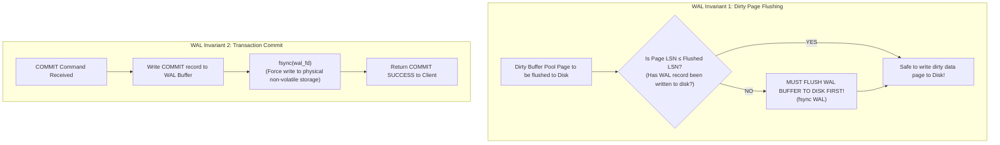
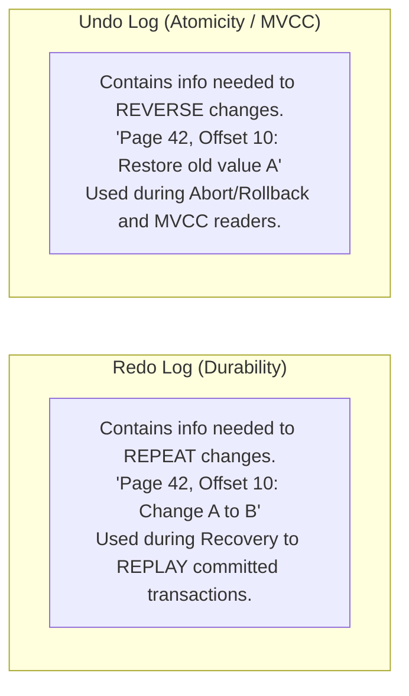

# Write-Ahead Logging — WAL, Redo Log, Undo Log, fsync Guarantees

## Mental Model

Think of **Write-Ahead Logging (WAL)** as an accountant's sequential transaction journal written in permanent ink. 

If an accountant updates account ledgers (database data pages on disk), going to individual ledgers across a huge office to update numbers in-place is slow, and if power cuts mid-way, ledgers become corrupt. 

Instead, the accountant writes every debit and credit in a single **append-only, sequential physical journal** on their desk and immediately signs it ("fsync to disk"). Only *after* the journal entry is safely written to disk can the actual ledger books (dirty buffer pool pages) be updated lazily in the background. If a fire or power outage strikes, the ledger books might be half-written, but the journal remains pristine. During recovery, the accountant simply reads the journal to replay committed transactions (**Redo**) and erase half-baked uncommitted work (**Undo**).

---

## 1. The WAL Protocol Core Invariants

The **Write-Ahead Logging Protocol** dictates two fundamental rules for database storage engines:



### Core WAL Rules

1. **Rule 1 (Data Page Flush Rule):** Before any dirty data page in the buffer pool can be written to disk, all log records describing modifications to that page up to its current `PageLSN` **MUST** be flushed to non-volatile disk storage.
2. **Rule 2 (Commit Durability Rule):** A transaction is not officially committed until its `COMMIT` log record has been flushed to non-volatile disk storage via `fsync()`.

---

## 2. LSN Anatomy & Log Record Structures

Database log entries are indexed by a monotonically increasing 64-bit integer called a **Log Sequence Number (LSN)**. The LSN represents the exact byte offset inside the WAL log stream.

### Key LSN Pointers in Memory & Disk

```text
WAL Stream (Append-Only Sequential File)
+-------------------------------------------------------------------------------+
| LSN 100: INSERT | LSN 180: UPDATE | LSN 260: COMMIT | LSN 320: UPDATE (Dirty) |
+-------------------------------------------------------------------------------+
                                                      ▲                      ▲
                                                      │                      │
                                               flushed_to_disk_lsn     current_wal_lsn
```

- **`PageLSN`:** Every 8KB/16KB data page header contains the LSN of the **most recent** WAL record that modified it.
- **`flushed_to_disk_lsn`:** The highest LSN safely written and `fsync`'d to non-volatile disk storage.
- **Data Flush Condition:** A page can be flushed to disk if and only if:
  $$\text{PageLSN} \le \text{flushed\_to\_disk\_lsn}$$

---

## 3. Redo Logs vs. Undo Logs

Relational engines split logging functions into **Redo Logs** (for Durability) and **Undo Logs** (for Atomicity and MVCC).



### Redo vs. Undo Comparison Matrix

| Property | Redo Log | Undo Log |
|---|---|---|
| **Primary ACID Purpose** | **Durability (D)** | **Atomicity (A)** & MVCC (I) |
| **Recovery Phase** | Redo Phase (Replays forward) | Undo Phase (Rolls back backward) |
| **Content Payload** | New image / state modification payload. | Old image / inverse operation payload. |
| **When Applied** | During system restart after crash. | During transaction `ROLLBACK` or crash recovery. |
| **PostgreSQL Fit** | Combined in `pg_wal` files. | Handled via heap tuples (`t_xmin`/`t_xmax`). |
| **MySQL InnoDB Fit** | `ib_logfile0` / `ib_logfile1` | Separate Undo Tablespace (`undo_001`). |

---

## 4. Disk Subsystem & Operating System `fsync()` Guarantees

When a database calls `write()` in C/C++, data is copied into the **OS Page Cache (Kernel Memory)**, NOT the physical storage device!

```mermaid
flowchart TD
    DBRAM["Database Buffer (WAL Buffer in User RAM)"] -->|1. write() Syscall| KernelCache["OS Page Cache (Kernel RAM)"]
    KernelCache -->|DANGER: Power Loss here loses data!| DriveCache["Disk Controller RAM Cache (Volatile)"]
    
    DBRAM -->|2. fsync() / fdatasync() Syscall| FsyncCmd["fsync() Execution"]
    FsyncCmd --> DriveCache
    DriveCache -->|3. Flush Cache Command| NonVolatileFlash["NAND Flash / NVMe Storage (Non-Volatile Disk)"]
```

### Group Commit Optimization

Calling `fsync()` for every microsecond commit causes severe disk bottlenecking (an NVMe `fsync` takes ~50–100 microseconds, capping throughput at 10,000 to 20,000 commits/sec per thread).

**Group Commit** batches concurrent transaction commits into a single `fsync()` call:

```mermaid
flowchart LR
    Tx1["Tx 1 Commit"] & Tx2["Tx 2 Commit"] & Tx3["Tx 3 Commit"] -->|Batch into WAL Buffer| GroupLeader["Group Leader Thread"]
    GroupLeader -->|Executes SINGLE fsync() for all 3| Disk["Physical NVMe Disk"]
    Disk -->|Wakes up Tx1, Tx2, Tx3| ReturnCommitted["All 3 Transactions Committed!"]
```

---

## 5. Production Operations & Configuration Parameters

### Tuning WAL Durability in PostgreSQL

```sql
-- View current WAL configuration parameters
SHOW synchronous_commit;
SHOW wal_buffers;
SHOW max_wal_size;

-- Maximum durability (Default): fsync on every commit
SET synchronous_commit = ON;

-- High-performance mode: Asynchronous commit (Risk: up to 3x wal_writer_delay lost on crash)
SET synchronous_commit = OFF;
```

| `synchronous_commit` Setting | Durability Guarantee | Commit Latency | Best Use Case |
|---|---|---|---|
| `on` (Default) | **100% Guaranteed** (flushed to local disk). | High (`fsync` bound) | Financial transactions, payments. |
| `off` | Committed transactions safe in WAL buffer; flushed asynchronously every `wal_writer_delay` (10ms). | **Ultra Low** | High-ingest metrics, non-critical logs. |
| `remote_apply` | Flushed to disk AND applied on standby replicas. | Highest | Zero Data Loss Read-Replicas. |

### Tuning MySQL InnoDB Redo Log & `innodb_flush_log_at_trx_commit`

```sql
-- Inspect InnoDB flush behavior
SHOW VARIABLES LIKE 'innodb_flush_log_at_trx_commit';
```

| Value | Durability Behavior | Risk Exposure |
|---|---|---|
| `1` (Default) | Redo log written AND `fsync`'d to disk at **every commit**. | Full Durability (0 data loss). |
| `0` | Redo log written AND `fsync`'d once per second in background. | Up to **1 second of committed data lost** on OS/power crash. |
| `2` | Redo log written to OS Page Cache at commit; `fsync`'d once per second. | Safe against DB crash; **1 second lost on OS/power crash**. |

---

## 6. Failure Modes and Trade-offs

1. **Torn Page Writes (Partial Page Write Failure)** — A database page is 8KB (PostgreSQL) or 16KB (MySQL). Disks write in 4KB/512B sectors. If power dies while writing bytes 2048 to 4096 of a page, the page on disk becomes **corrupt** (half old data, half new data). *Mitigation*: PostgreSQL uses **Full Page Writes (FPW)** (writes full page image to WAL after first checkpoint update); MySQL InnoDB uses the **Doublewrite Buffer**.
2. **Disk Drive Volatile Cache Deception** — Cheap consumer SSDs report `fsync` completion to the OS while data is still sitting in volatile drive DRAM. On power outage, data disappears despite successful `fsync` calls! *Mitigation*: Use enterprise NVMe SSDs with Power Loss Protection (PLP) capacitors; disable drive write cache via `hdparm -W 0 /dev/sda`.
3. **WAL Storage Exhaustion Outage** — If archived WAL files or long-running transactions prevent WAL segment recycling, the database fills the disk partition and shuts down instantly to prevent corruption. *Mitigation*: Place WAL logs on a dedicated, isolated NVMe disk volume; set `max_wal_size`.

---

## 7. Active-Recall Prompts

1. **State the two core rules of the Write-Ahead Logging (WAL) protocol. What does `PageLSN <= flushed_to_disk_lsn` enforce?**
2. **How does an Undo Log differ from a Redo Log in terms of ACID properties and crash recovery phases?**
3. **Why is calling `write()` in OS C code insufficient for transaction durability, and what is the role of `fsync()`?**
4. **Explain how Group Commit increases transaction commit throughput without sacrificing durability.**

---

## Related Notes

- [[ARIES Recovery Protocol - Analysis, Redo, Undo Phases, Checkpointing]]
- [[Transactions and ACID Properties - Atomicity, Consistency, Isolation, Durability]]
- [[Buffer Pool Manager - Page Cache, Replacement Policies, Dirty Pages]]
- [[PostgreSQL Internals - MVCC Implementation, Tuple Header, VACUUM, Toast]]

> **Interview Style Question:** *"A payment gateway platform running PostgreSQL experiences a power failure. Upon reboot, the database logs show `LOG: database system was not shut down cleanly; automatic recovery in progress`. Explain the exact WAL replay process, how Full Page Writes (FPW) prevent torn page corruption, and why `synchronous_commit = off` would have caused missing customer balances."*

---
