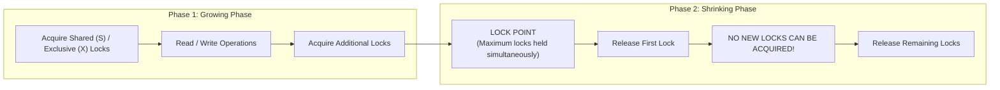
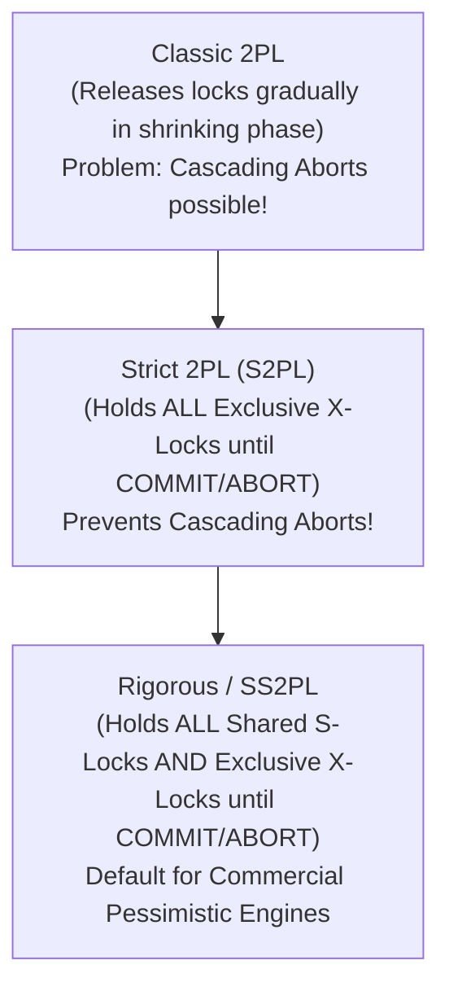
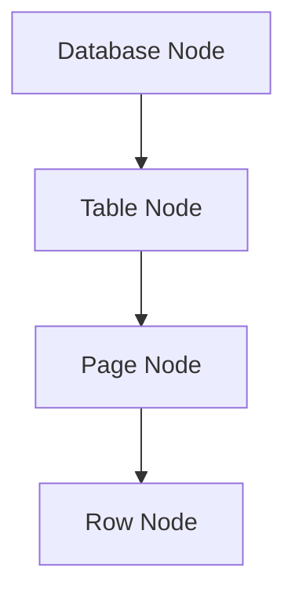
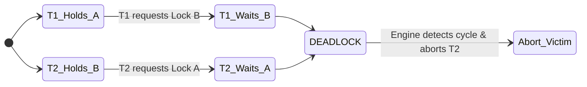

# Concurrency Control — Two-Phase Locking, Deadlock Detection, Lock Granularity

## Mental Model

Think of **Pessimistic Concurrency Control (2-Phase Locking)** as a multi-room physical security checkpoint in a bank. 

To ensure that multiple inspectors don't alter documents simultaneously, an inspector must **acquire physical keys (locks)** to rooms, file cabinets, and individual folders before reading or writing. Under **Two-Phase Locking (2PL)**, an inspector can gather keys during the first phase (Growing Phase), but once they return any key (Shrinking Phase), **they are strictly forbidden from acquiring any new keys**. 

If Inspector A holds the key to Cabinet 1 and waits for Cabinet 2, while Inspector B holds Cabinet 2 and waits for Cabinet 1, they freeze in a **Deadlock**. The security system must periodically step in, detect the circular wait graph, and forcibly evict (abort) one of the inspectors.

---

## 1. Two-Phase Locking (2PL) Protocol

**Two-Phase Locking (2PL)** is a pessimistic concurrency control protocol that mathematically guarantees **Conflict Serializability**.

### The Two Phases



1. **Growing Phase:** Transactions may acquire locks, but **cannot release any locks**.
2. **Shrinking Phase:** Transactions may release locks, but **cannot acquire any new locks**.

---

### Variants of 2PL



| Variant | Shared Locks (S) Released | Exclusive Locks (X) Released | Prevents Cascading Aborts? | Enables Strict Serializability? |
|---|---|---|---|---|
| **Basic 2PL** | During Shrinking Phase | During Shrinking Phase | ❌ No | ❌ No |
| **Strict 2PL (S2PL)** | During Shrinking Phase | **At Commit / Abort ONLY** | ✅ **Yes** | ❌ No |
| **Rigorous 2PL (SS2PL)** | **At Commit / Abort ONLY** | **At Commit / Abort ONLY** | ✅ **Yes** | ✅ **Yes** |

---

## 2. Lock Compatibility & Lock Hierarchy

Databases support multiple lock modes to allow high concurrency across different granularities (Database $\to$ Table $\to$ Page $\to$ Row).

### Basic Lock Compatibility Matrix

| Held / Requested | Shared (S) | Exclusive (X) |
|---|---|---|
| **Shared (S)** | ✅ **Granted** | ❌ Blocked |
| **Exclusive (X)** | ❌ Blocked | ❌ Blocked |

### Lock Hierarchy & Intent Locks

To prevent a transaction from acquiring a Table-level Exclusive Lock when another transaction is modifying a single row inside that table, databases use **Intent Locks**.



| Intent Lock Mode | Meaning | Typical Usage |
|---|---|---|
| **Intent Shared (IS)** | Intends to acquire S-lock at a lower level (row/page). | `SELECT` query scanning rows. |
| **Intent Exclusive (IX)** | Intends to acquire X-lock at a lower level. | `UPDATE`/`DELETE` modifying rows. |
| **Shared Intent Exclusive (SIX)** | Holds S-lock on whole table, plus IX lock for lower updates. | Reading whole table while updating specific rows. |

#### Full Multiple Granularity Lock Compatibility Matrix

| Requested \ Held | IS | IX | S | SIX | X |
|---|---|---|---|---|---|
| **Intent Shared (IS)** | ✅ | ✅ | ✅ | ✅ | ❌ |
| **Intent Exclusive (IX)** | ✅ | ✅ | ❌ | ❌ | ❌ |
| **Shared (S)** | ✅ | ❌ | ✅ | ❌ | ❌ |
| **Shared Intent Exclusive (SIX)** | ✅ | ❌ | ❌ | ❌ | ❌ |
| **Exclusive (X)** | ❌ | ❌ | ❌ | ❌ | ❌ |

---

## 3. Deadlocks: Detection, Prevention, and Recovery

A **Deadlock** occurs when two or more transactions are in a circular wait state, each holding a lock that the other needs.



### A. Deadlock Prevention Algorithms

Deadlock prevention uses transaction timestamps $T(Tx)$ to decide actions when a conflict occurs:

1. **Wait-Die Scheme (Non-Preemptive):**
   - If **Older** transaction requests lock held by **Younger**: Older is allowed to **WAIT**.
   - If **Younger** transaction requests lock held by **Older**: Younger **DIES** (aborts and restarts).

2. **Wound-Wait Scheme (Preemptive):**
   - If **Older** transaction requests lock held by **Younger**: Older **WOUNDS** Younger (forces Younger to abort and yield lock).
   - If **Younger** transaction requests lock held by **Older**: Younger is allowed to **WAIT**.

| Scheme | Older Tx Behavior | Younger Tx Behavior | Starvation Risk? |
|---|---|---|---|
| **Wait-Die** | Waits for younger | Aborts & dies | Low (retained timestamp) |
| **Wound-Wait** | Wounds/Aborts younger | Waits for older | Low (retained timestamp, less aborts) |

---

### B. Deadlock Detection (Wait-For Graph)

Commercial engines like PostgreSQL and MySQL InnoDB use background **Deadlock Detectors** based on **Wait-For Graphs (WFG)**.
- Nodes = Active Transactions.
- Directed Edges $(T_1 \to T_2)$ = $T_1$ is waiting for a lock held by $T_2$.
- **Algorithm:** Periodically run Tarjan's or Johnson's algorithm to detect **cycles** in the WFG.
- **Victim Selection:** When a cycle is found, select the cheapest transaction to abort (fewest locks held, fewest writes executed).

---

## 4. Production Operations & Diagnostic Commands

### Monitoring Locks and Deadlocks in PostgreSQL

```sql
-- View active locks and blocked processes in PostgreSQL
SELECT 
    blocked_locks.pid     AS blocked_pid,
    blocked_activity.usename  AS blocked_user,
    blocking_locks.pid    AS blocking_pid,
    blocking_activity.usename AS blocking_user,
    blocked_activity.query    AS blocked_statement,
    blocking_activity.query   AS blocking_statement
FROM  pg_catalog.pg_locks         blocked_locks
JOIN pg_catalog.pg_stat_activity blocked_activity ON blocked_activity.pid = blocked_locks.pid
JOIN pg_catalog.pg_locks         blocking_locks 
    ON blocking_locks.locktype = blocked_locks.locktype
    AND blocking_locks.database IS NOT DISTINCT FROM blocked_locks.database
    AND blocking_locks.relation IS NOT DISTINCT FROM blocked_locks.relation
    AND blocking_locks.page IS NOT DISTINCT FROM blocked_locks.page
    AND blocking_locks.tuple IS NOT DISTINCT FROM blocked_locks.tuple
    AND blocking_locks.pid != blocked_locks.pid
JOIN pg_catalog.pg_stat_activity blocking_activity ON blocking_activity.pid = blocking_locks.pid
WHERE NOT blocked_locks.granted;
```

### Tuning Deadlock Timeout in PostgreSQL

```sql
-- Set deadlock check delay (default is 1000ms = 1s)
SET deadlock_timeout = '500ms';

-- Set statement execution timeout to prevent indefinite lock waiting
SET statement_timeout = '5000ms';
SET lock_timeout = '3000ms';
```

### Inspecting MySQL InnoDB Deadlock Logs

```sql
-- Show last deadlock details in MySQL InnoDB
SHOW ENGINE INNODB STATUS\G

----------------------------------------
-- LATEST DETECTED DEADLOCK SECTION:
----------------------------------------
-- *** (1) TRANSACTION:
-- TRANSACTION 42105, ACTIVE 2 sec starting index read
-- mysql tables in use 1, locked 1
-- LOCK WAIT 3 lock struct(s), heap size 1136, 2 row lock(s)
-- RECORD LOCKS space id 42 page no 3 n bits 72 index PRIMARY of table `shop`.`orders` ...
-- *** (2) TRANSACTION:
-- TRANSACTION 42106, ACTIVE 1 sec updating or deleting
-- *** WE ROLL BACK TRANSACTION (2)
```

---

## 5. Failure Modes and Trade-offs

1. **Lock Escalation Exhaustion** — When a transaction updates 100,000 individual rows, storing 100,000 row locks consumes massive memory. SQL Server escalates 100,000 Row Locks into a single Table Lock, unexpectedly blocking all other concurrent queries! *Mitigation*: Process massive batch updates in smaller chunked transactions (e.g., 1,000 rows per batch). PostgreSQL avoids lock escalation by allocating locks in fixed shared memory structures.
2. **Lock-Ordering Deadlock Pattern** — Transaction A updates `Account 1` then `Account 2`. Concurrent Transaction B updates `Account 2` then `Account 1`. This guarantees deadlocks under high load. *Mitigation*: Enforce strict deterministic sorting of resource IDs before acquiring locks in application code (e.g., `SELECT * FROM accounts WHERE id IN (1, 2) ORDER BY id FOR UPDATE`).
3. **Indefinite Lock Stalls (`lock_timeout` Missing)** — A background reporting query acquires a shared lock on a critical table. An `ALTER TABLE` DDL statement requests an Exclusive Lock, queuing behind it and blocking all subsequent API `SELECT` queries. *Mitigation*: Always set explicit `SET lock_timeout = '2s'` before running DDL migrations.

---

## 6. Active-Recall Prompts

1. **Explain the fundamental rule of the Two-Phase Locking (2PL) protocol. What is the difference between Basic 2PL and Strict 2PL (S2PL)?**
2. **Why are Intent Locks (IS, IX) necessary in multi-granularity locking hierarchies? How do they prevent table-level locking conflicts?**
3. **Compare the Wait-Die and Wound-Wait deadlock prevention algorithms. Which one is preemptive, and why does neither suffer from starvation?**
4. **Why should multi-resource application transactions always acquire locks in a deterministically sorted order (e.g., `ORDER BY id`)?**

---

## Related Notes

- [[Transactions and ACID Properties - Atomicity, Consistency, Isolation, Durability]]
- [[MVCC - Multi-Version Concurrency Control, Snapshot Isolation, PostgreSQL vs MySQL]]
- [[Write-Ahead Logging - WAL, Redo Log, Undo Log, fsync Guarantees]]
- [[Database Performance Tuning - EXPLAIN ANALYZE, Slow Query Log, Connection Pooling]]

> **Interview Style Question:** *"In a high-throughput payment processing engine, 2% of transactions fail with `Deadlock detected`. An analysis reveals two concurrent workflows updating user balances in opposite order. Walk through how you would use Wait-For Graphs to diagnose the issue, enforce deterministic lock ordering in SQL, and configure application retry parameters to achieve zero customer-facing errors."*

---
