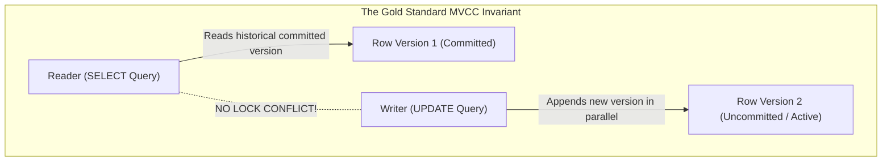
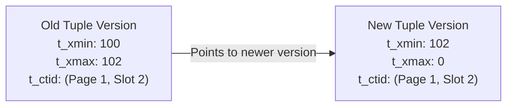
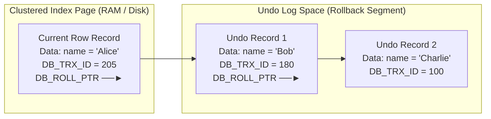

# MVCC — Multi-Version Concurrency Control, Snapshot Isolation, PostgreSQL vs. MySQL

## Mental Model

Think of **Multi-Version Concurrency Control (MVCC)** as an immutable append-only version control system for database rows (like Git for database tuples). 

In traditional pessimistic locking (2PL), if a long-running reporting query reads a table, it holds read locks that block all incoming writes. Under MVCC, **readers never block writers, and writers never block readers**. 

When a transaction updates a row, the database does not overwrite the existing data in place. Instead, it creates a **new version (snapshot)** of the row tagged with a transaction timestamp. Readers looking at the database see a consistent point-in-time snapshot of committed data corresponding to their start timestamp, completely unaffected by uncommitted or newer modifications happening in parallel.

---

## 1. MVCC Core Concepts & The "Readers Never Block Writers" Invariant



### Key Advantages of MVCC over 2PL
1. **High Read Concurrency:** Long-running analytical queries (`SELECT SUM(amount)`) execute concurrently with heavy write workloads without taking shared locks or blocking `UPDATE`/`INSERT` operations.
2. **Snapshot Isolation:** Every query or transaction reads from a consistent snapshot of the database state taken at a specific point in time.
3. **Rollback Simplicity:** Aborting a transaction simply marks its transaction ID as aborted or discards its uncommitted versions—no complex in-place data restoration needed.

---

## 2. PostgreSQL MVCC Architecture (In-Heap Versioning)

PostgreSQL stores multiple tuple versions **directly inside the main data heap pages**.

### Tuple Header Metadata Fields

Every tuple in a PostgreSQL heap page contains hidden header fields:

```text
+-------------------------------------------------------------------------+
| t_xmin | t_xmax | t_cid | t_ctid | Tuple Data Payload (Columns...)       |
+-------------------------------------------------------------------------+
```

| Header Field | Description | Role in MVCC Visibility |
|---|---|---|
| `t_xmin` | Transaction ID (XID) that **inserted** this tuple version. | Tuple is visible only to transactions starting AFTER `t_xmin` committed. |
| `t_xmax` | Transaction ID (XID) that **deleted or updated** this tuple version (0 if active). | Tuple becomes invisible to transactions starting AFTER `t_xmax` committed. |
| `t_cid` | Command ID within the transaction (0, 1, 2...). | Distinguishes operations executed inside the same multi-statement transaction. |
| `t_ctid` | Physical Tuple ID `(page_number, item_offset)`. | Pointer to the current tuple or the newer tuple version created by an `UPDATE`. |

### Tuple Update Chain & Visibility Rules

When an `UPDATE` modifies a row in PostgreSQL:
1. The existing tuple's `t_xmax` is set to the current Transaction ID ($XID_{102}$).
2. A **brand new tuple** is inserted into the heap page (or a new page), with its `t_xmin` set to $XID_{102}$.
3. The old tuple's `t_ctid` points to the physical location of the new tuple.



### Visibility Horizon & Garbage Collection (`VACUUM`)
Because old tuple versions ("dead tuples") accumulate directly inside main table heap files, PostgreSQL requires a background garbage collector called **`VACUUM`**.

- **Dead Tuples:** Tuples where `t_xmax < OldestXmin` (the transaction ID of the oldest active transaction in the database).
- `VACUUM` scans heap pages, identifies dead tuples, marks page space as free for reuse, and removes dead index pointers.

---

## 3. MySQL InnoDB MVCC Architecture (Undo-Log Versioning)

Unlike PostgreSQL, MySQL InnoDB stores **only the latest committed tuple version** in the clustered index heap page. All historical versions are stored in **Undo Logs**.

### InnoDB Row Structure & Rollback Segment

Every InnoDB row contains hidden system columns:

```text
+--------------------------------------------------------------------------+
| DATA COLUMNS | DB_TRX_ID (6 Bytes) | DB_ROLL_PTR (7 Bytes) | DB_ROW_ID  |
+--------------------------------------------------------------------------+
```

| Hidden Column | Purpose |
|---|---|
| `DB_TRX_ID` | Transaction ID of the last transaction that inserted or updated the row. |
| `DB_ROLL_PTR` | **Rollback Pointer** pointing to the exact Undo Log record in the Undo Tablespace. |
| `DB_ROW_ID` | Auto-incrementing row ID (used if table lacks an explicit Primary Key). |



### Reconstructing Historical Snapshots
When a read query starts:
1. The engine reads the current tuple from the Clustered Index.
2. If `DB_TRX_ID` is newer than the transaction's `Read View`, the engine follows `DB_ROLL_PTR` into the **Undo Log delta chain**, stepping back in time until it finds a tuple version visible to the snapshot!

---

## 4. Architectural Comparison: PostgreSQL vs. MySQL InnoDB

| Dimension | PostgreSQL MVCC | MySQL InnoDB MVCC |
|---|---|---|
| **Storage Location of Old Versions** | Directly inside main table **Heap Pages**. | Separated in **Undo Log Tablespace**. |
| **Primary Data Page Bloat** | **High:** Unvacuumed updates cause table heap bloat. | **Low:** Data pages store only current row versions. |
| **Garbage Collection Mechanism** | Background **`VACUUM`** process cleans dead tuples. | Background **Purge Thread** frees undo log pages. |
| **Read Cost for Old Versions** | Low (direct tuple fetch from heap page). | Higher (must traverse `DB_ROLL_PTR` delta chain). |
| **Secondary Index Updates** | `UPDATE` requires updating **all secondary indexes** (unless HOT applies). | `UPDATE` modifies primary page; secondary indexes untouched if key unchanged. |
| **Aborted Transaction Cleanup** | Zero file changes (leaves `t_xmin` status as aborted in `pg_xact`). | Reverts row via Undo Log. |

---

## 5. Production Diagnostics & Troubleshooting

### Identifying Long-Running Transactions Blocking Garbage Collection

In both PostgreSQL and MySQL, a single long-running `SELECT` transaction keeps the **Visibility Horizon** frozen, preventing garbage collection across the entire database!

#### In PostgreSQL (Dead Tuple Bloat):

```sql
-- Identify long-running transactions holding back vacuum horizon
SELECT 
    pid, 
    usename, 
    age(backend_xmin), 
    now() - xact_start AS duration, 
    query 
FROM pg_stat_activity 
WHERE backend_xmin IS NOT NULL 
ORDER BY age(backend_xmin) DESC;

-- Inspect dead tuple count per table
SELECT 
    relname, 
    n_live_tup, 
    n_dead_tup, 
    ROUND(n_dead_tup::numeric / NULLIF(n_live_tup + n_dead_tup, 0) * 100, 2) AS dead_tuple_percent,
    last_vacuum, 
    last_autovacuum
FROM pg_stat_user_tables
WHERE n_dead_tup > 10000
ORDER BY n_dead_tup DESC;
```

#### In MySQL (Undo Log Bloat):

```sql
-- Check History List Length (HLL) in InnoDB status
SHOW ENGINE INNODB STATUS\G

----------------------------------------
-- TRANSACTIONS SECTION:
----------------------------------------
-- History list length 154210   <-- DANGER: High HLL indicates Purge Thread is blocked!
```

---

## 6. Failure Modes and Trade-offs

1. **Table Bloat & Out of Disk Space (PostgreSQL `autovacuum` Lag)** — High UPDATE workloads produce millions of dead tuples faster than default `autovacuum` can clean. Table size explodes from 10 GB to 300 GB. *Mitigation*: Tune autovacuum aggressively (`autovacuum_vacuum_scale_factor = 0.05`, `autovacuum_cost_limit = 2000`).
2. **Undo Tablespace Exhaustion (MySQL Long Transaction)** — An idle analytics connection opened at 9 AM with `REPEATABLE READ` retains an active Read View. 500,000 updates occur during the day. The Undo Log history list length (HLL) reaches millions of records, filling up disk space and slowing down all point lookups. *Mitigation*: Configure `max_execution_time` and kill idle transaction sessions (`wait_timeout`).
3. **Transaction ID (XID) Wraparound Emergency (PostgreSQL)** — PostgreSQL XIDs are 32-bit integers ($2^{32} \approx 4.2 \text{ billion}$). If a database executes 2 billion transactions without `VACUUM FREEZE`, PostgreSQL enters emergency read-only mode to prevent data corruption. *Mitigation*: Monitor `age(datfrozenxid)` via Prometheus/Datadog and alert when age $> 1.5 \text{ billion}$.

---

## 7. Active-Recall Prompts

1. **What is the fundamental invariant of MVCC, and how does it improve concurrency compared to 2-Phase Locking (2PL)?**
2. **Where are historical row versions stored in PostgreSQL vs. MySQL InnoDB, and what are the trade-offs of each approach?**
3. **Why does a single 4-hour idle `SELECT` transaction cause table bloat in PostgreSQL and Undo Log history list bloat in MySQL?**
4. **Explain the roles of `t_xmin` and `t_xmax` in PostgreSQL tuple visibility calculation.**

---

## Related Notes

- [[Transactions and ACID Properties - Atomicity, Consistency, Isolation, Durability]]
- [[Concurrency Control - Two-Phase Locking, Deadlock Detection, Lock Granularity]]
- [[PostgreSQL Internals - MVCC Implementation, Tuple Header, VACUUM, Toast]]
- [[MySQL InnoDB Architecture - Clustered Index, Buffer Pool, Doublewrite Buffer]]

> **Interview Style Question:** *"Compare PostgreSQL and MySQL InnoDB MVCC implementations. If an application executes 1,000 `UPDATE` operations per second on a single table, analyze the physical disk I/O, secondary index maintenance overhead, and garbage collection mechanisms for both database engines."*

---
