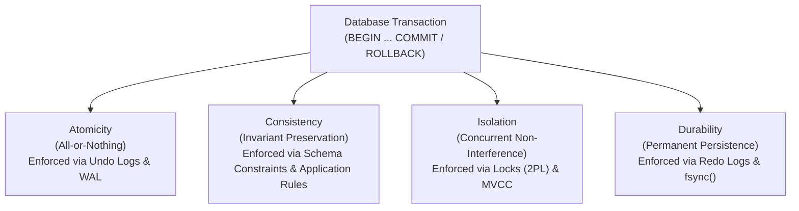
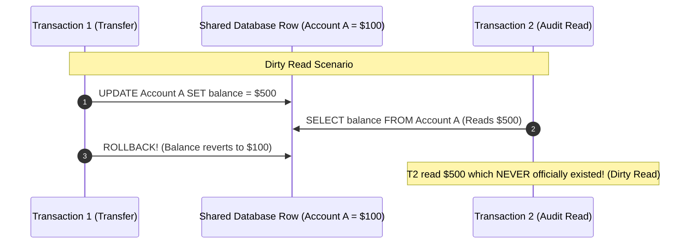
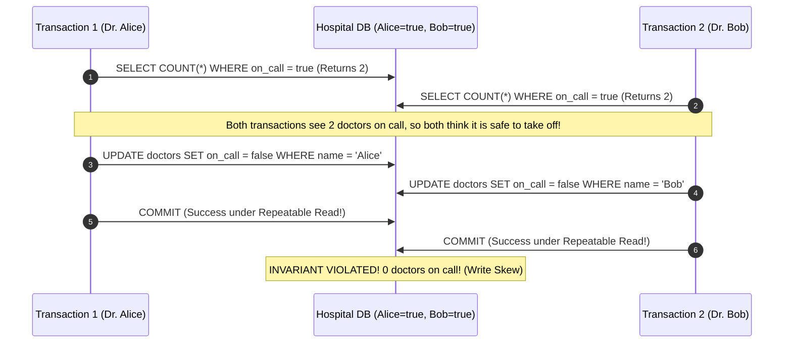

# Transactions and ACID Properties — Atomicity, Consistency, Isolation, Durability

## Mental Model

Think of a **Database Transaction** as a sealed, tamper-proof bank vault operation. When you transfer $500 from Account A to Account B, the operation consists of two separate steps: deducting $500 from A and adding $500 to B. 

**Atomicity** guarantees that either *both* steps complete or *neither* happens—there is no state where money vanishes into thin air. **Consistency** ensures that the bank's invariant (Total Balance A + B = $1,000) holds true before and after the transfer. **Isolation** guarantees that if 100 people transfer money simultaneously, each customer's transaction behaves as if they were the only person standing in the bank vault. **Durability** guarantees that once the receipt prints ("Transaction Committed"), even a city-wide power outage a microsecond later will not erase the transaction.

---

## 1. Deep Dive into the ACID Guarantees



### Architectural Breakdown of ACID Enforcers

| ACID Property | What It Guarantees | Core Database Mechanism That Enforces It | Failure Mode Addressed |
|---|---|---|---|
| **Atomicity** | All operations inside transaction commit together, or all are rolled back. | **Undo Log** (MySQL InnoDB) / **MVCC Abort Status** (PostgreSQL `pg_xact`) + **WAL**. | Power loss mid-transaction, explicit `ROLLBACK`, system crash. |
| **Consistency** | Database moves from one valid state satisfying all invariants to another. | **Schema Constraints** (`FOREIGN KEY`, `NOT NULL`, `CHECK`) + Application logic. | Invalid business state, corrupt key references. |
| **Isolation** | Concurrent execution of transactions produces a state equivalent to serial execution. | **Concurrency Control Engines:** 2PL (Locks), MVCC (Snapshot Isolation), SSI. | Race conditions, dirty reads, phantom rows, lost updates. |
| **Durability** | Committed transactions survive crash, power outage, or OS crash. | **Redo Log** / **Write-Ahead Log (WAL)** flushed to non-volatile disk via `fsync()`. | Hardware power loss, kernel panic, storage controller crash. |

---

## 2. Read Phenomena (Concurrency Anomalies)

When multiple transactions execute concurrently without strict isolation, four classic read anomalies can occur:



### The 4 Standard ANSI SQL Read Anomalies

1. **Dirty Read (ANSI P1):** Transaction $T_2$ reads uncommitted data written by transaction $T_1$. If $T_1$ aborts/rolls back, $T_2$ has acted on phantom data that never existed.
2. **Non-Repeatable Read / Fuzzy Read (ANSI P2):** Transaction $T_1$ reads a row. Transaction $T_2$ modifies or deletes that row and commits. $T_1$ re-reads the same row and sees changed data or missing values.
3. **Phantom Read (ANSI P3):** Transaction $T_1$ executes a range query (`WHERE age > 30`) returning 10 rows. Transaction $T_2$ inserts a new row (`age = 35`) and commits. $T_1$ re-runs the range query and sees 11 rows (a "phantom" row appeared).
4. **Lost Update (P4 / Extended):** Transactions $T_1$ and $T_2$ both read a row (balance = $100). $T_1$ adds $50 (calculates $150). $T_2$ adds $20 (calculates $120). Both write back. $T_2$'s write overwrites $T_1$'s write. Total should be $170, but end result is $120!

---

## 3. ANSI SQL & Real-World Isolation Levels

ANSI SQL defined 4 standard isolation levels based on which anomalies they permit.

| Isolation Level | Dirty Read | Non-Repeatable Read | Phantom Read | Serialization Anomaly / Lost Update |
|---|---|---|---|---|
| **Read Uncommitted** | ❌ Allowed | ❌ Allowed | ❌ Allowed | ❌ Allowed |
| **Read Committed** | ✅ **Prevented** | ❌ Allowed | ❌ Allowed | ❌ Allowed |
| **Repeatable Read** | ✅ **Prevented** | ✅ **Prevented** | ❌ Allowed (ANSI) / ✅ **Prevented in PG/MySQL** | ❌ Allowed (Write Skew possible) |
| **Serializable** | ✅ **Prevented** | ✅ **Prevented** | ✅ **Prevented** | ✅ **Prevented** |

### Implementation Realities: PostgreSQL vs. MySQL InnoDB

> ⚠️ **CRITICAL REALITY CHECK:** Real database engines deviate significantly from ANSI SQL 1992 specifications!

- **PostgreSQL Read Committed (Default):** Each statement sees a fresh snapshot of committed data.
- **PostgreSQL Repeatable Read:** Implemented via Snapshot Isolation (SI). It prevents **both** Non-Repeatable Reads AND Phantom Reads! However, it is vulnerable to **Write Skew**.
- **MySQL InnoDB Repeatable Read (Default):** Uses Consistent Non-locking Reads (MVCC) for plain SELECTs and **Next-Key Locking** (Gap Locks) for locking SELECTs (`FOR UPDATE`), preventing Phantom Reads.
- **Serializable:**
  - **PostgreSQL:** Uses **Serializable Snapshot Isolation (SSI)**—optimistic, tracking predicate dependencies without blocking locks.
  - **MySQL InnoDB:** Automatically converts all plain `SELECT` queries to `SELECT ... FOR SHARE` (pessimistic 2-Phase Locking).

---

## 4. Write Skew & Serializable Snapshot Isolation (SSI)

### The Write Skew Anomaly

Consider a hospital database constraint: *"At least one doctor must be on call at all times."*
Currently, Dr. Alice and Dr. Bob are on call (`on_call = true`).



### Solution: Serializable Isolation

To prevent Write Skew without manually locking rows (`SELECT FOR UPDATE`), databases use **Serializable Isolation**:
- **PostgreSQL (SSI):** Detects **rw-antidependencies** in the dependency graph during commit. If a cycle is formed, one transaction is aborted with `ERROR: 40001: could not serialize access due to read/write dependencies`.
- **Manual Pessimistic Fix:**
  ```sql
  BEGIN;
  SELECT COUNT(*) FROM doctors WHERE on_call = true FOR UPDATE; -- Locks rows!
  UPDATE doctors SET on_call = false WHERE name = 'Alice';
  COMMIT;
  ```

---

## 5. Production Operations & Inspection Commands

### Setting Isolation Levels in SQL

```sql
-- Set isolation level for current transaction
BEGIN TRANSACTION ISOLATION LEVEL REPEATABLE READ;

-- Set global default isolation level in PostgreSQL
ALTER DATABASE production_db SET default_transaction_isolation = 'read committed';

-- Set session isolation level in MySQL
SET SESSION TRANSACTION ISOLATION LEVEL SERIALIZABLE;
```

### Handling Serialization Failures in Application Code (Retry Loop Pattern)

When using `SERIALIZABLE` or `REPEATABLE READ`, applications **MUST** implement an automatic retry loop to catch serialization abort errors (`SQLSTATE 40001`).

```python
import psycopg2
import time

def execute_with_retry(db_conn, transaction_fn, max_retries=5):
    for attempt in range(max_retries):
        try:
            with db_conn:
                with db_conn.cursor() as cursor:
                    return transaction_fn(cursor)
        except psycopg2.errors.SerializationFailure:
            # SQLSTATE 40001: Serialization failure - retry transaction
            time.sleep(0.05 * (2 ** attempt)) # Exponential backoff
            continue
        except Exception as e:
            raise e
    raise Exception("Transaction failed after maximum retries due to serialization conflict.")
```

---

## 6. Failure Modes and Trade-offs

1. **Lost Updates in Web Applications (Read-Modify-Write Anti-Pattern)** — Web API fetches row data, presents it to user form, user submits 10 seconds later, API runs `UPDATE table SET val = new_val WHERE id = 1`. Another user's edit in between is silently overwritten. *Mitigation*: Use **Optimistic Concurrency Control** (`UPDATE table SET val = new_val, version = version + 1 WHERE id = 1 AND version = old_version`) or atomic updates (`UPDATE table SET val = val + 1`).
2. **`Read Committed` Statement-Level Inconsistency** — In `Read Committed`, two SELECT queries within the same transaction can return different data if another transaction commits between them. *Mitigation*: Use `REPEATABLE READ` for multi-query reporting tasks.
3. **Application Crashes from Unhandled 40001 Errors** — Upgrading isolation level to `SERIALIZABLE` without building application-level retry loops causes 500 Internal Server Errors under concurrent traffic. *Mitigation*: Always deploy an exponential backoff retry loop in the application data access layer.

---

## 7. Active-Recall Prompts

1. **Which database components enforce Atomicity and Durability respectively, and how do Undo Logs differ from Redo Logs?**
2. **Explain the Dirty Read anomaly. Why is it impossible in PostgreSQL even under the lowest `Read Uncommitted` isolation level?**
3. **What is Write Skew, why does standard Repeatable Read / Snapshot Isolation fail to prevent it, and how does Serializable Snapshot Isolation (SSI) detect it?**
4. **Write a python or SQL pseudo-code snippet demonstrating the Optimistic Locking pattern using a `version` column to prevent lost updates.**

---

## Related Notes

- [[Concurrency Control - Two-Phase Locking, Deadlock Detection, Lock Granularity]]
- [[MVCC - Multi-Version Concurrency Control, Snapshot Isolation, PostgreSQL vs MySQL]]
- [[Write-Ahead Logging - WAL, Redo Log, Undo Log, fsync Guarantees]]
- [[Relational Model - Tables, Keys, Functional Dependencies, Normalization]]

> **Interview Style Question:** *"Your engineering team is building a high-traffic ticketing platform where 10,000 users attempt to reserve the last 5 concert seats simultaneously. Walk through how lost updates and overbooking occur under default Read Committed isolation, and evaluate three remediation strategies: Pessimistic Locking (`SELECT FOR UPDATE`), Optimistic Locking (`version` checks), and PostgreSQL Serializable Snapshot Isolation."*

---
