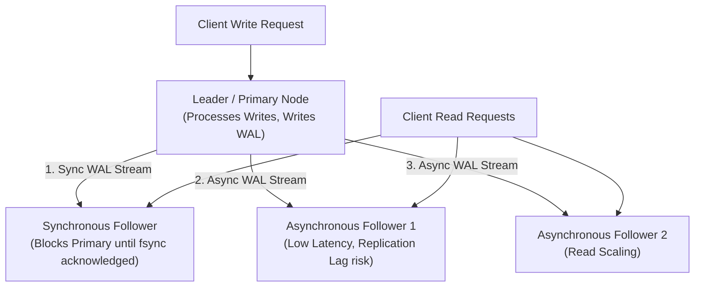
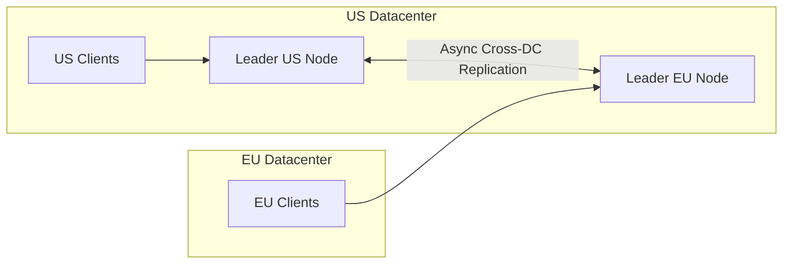
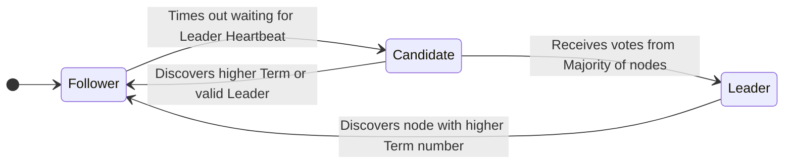

# Database Replication — Single-Leader, Multi-Leader, Leaderless, Raft Consensus

## Mental Model

Think of **Database Replication** as a news publishing organization distributing articles to global subscribers. 

Under **Single-Leader Replication**, there is one Editor-in-Chief (Leader). All authors send draft articles directly to the leader, who reviews them, publishes the master copy, and broadcasts copies to branch reporters (Followers/Replicas). Readers can read from any branch, but updates only go through headquarters. Under **Leaderless Replication (Gossip / Dynamo-style)**, there is no boss; authors send copies to any available branch reporters directly, and reporters compare notes via gossip to resolve conflicting stories. Under **Raft Consensus**, a strict democratic voting algorithm ensures that a leader is elected by majority vote, and no decision is published unless a majority of nodes sign off on the exact same log entry sequence.

---

## 1. Single-Leader (Primary-Replica) Architecture

In **Single-Leader Replication**, all write operations (`INSERT`, `UPDATE`, `DELETE`) are processed exclusively by a single **Leader (Primary)** node. The leader writes changes to its local storage and streams the log stream to one or more **Followers (Replicas)**.



### Synchronous vs. Asynchronous Replication

| Mode | Write Latency | Durability Guarantee | Availability Impact |
|---|---|---|---|
| **Synchronous** | High (Primary blocks until replica writes and acknowledges). | **Zero Data Loss:** Replica has identical WAL log. | Lower: If replica fails, primary write pipeline halts. |
| **Asynchronous** | **Minimal** (Primary returns success immediately after local WAL write). | **Potential Data Loss:** Un-replicated writes lost if primary crashes. | High: Replica failures do not block primary write pipeline. |
| **Semi-Synchronous** | Medium (1 replica synchronous, remaining async). | **Zero Data Loss** (tolerates 1 replica loss). | Balanced: Primary continues if 1 replica is healthy. |

---

## 2. Multi-Leader (Multi-Region / Active-Active) Replication

In **Multi-Leader Replication**, multiple nodes act as Leaders, accepting writes simultaneously across different geographic datacenters.



### The Conflict Resolution Problem

Since multi-leader nodes accept writes independently, concurrent modifications to the same row produce **write conflicts**:

```text
Time t1: Leader US updates User 42 name = 'Alice'
Time t1: Leader EU updates User 42 name = 'Bob'
```

#### Conflict Resolution Strategies:
1. **Conflict Avoidance:** Route all writes for a specific user to the same geographic leader (e.g., user home region).
2. **Last-Write-Wins (LWW):** Use physical timestamps to pick the latest write. **Danger:** Clock skew can overwrite legitimate updates!
3. **Merge Data Structure (CRDTs):** Use Conflict-Free Replicated Data Types (e.g., PN-Counters, Observed-Remove Sets) that merge deterministically without locks.

---

## 3. Leaderless Replication (Dynamo / Cassandra Architecture)

Pioneered by Amazon's Dynamo paper, **Leaderless Replication** eliminates the leader entirely. Clients send writes and reads to multiple replica nodes directly.

```mermaid
flowchart TD
    Client["Client / Coordinator Node"] -->|Parallel Writes (W=2)| NodeA["Node A (Ack)"]
    Client -->|Parallel Writes (W=2)| NodeB["Node B (Ack)"]
    Client -->|Parallel Writes (W=2)| NodeC["Node C (Offline / Timeout)"]
    
    Note over Client: Write Success! (Acknowledged by 2/3 Nodes)
```

### Self-Healing Mechanisms in Leaderless Systems

1. **Read Repair:** When a client reads with $R=2$, it compares responses from multiple nodes. If Node A has version 5 and Node B has version 4, the coordinator returns version 5 to the client AND asynchronously sends a **Write Repair** to update Node B!
2. **Hinted Handoff:** If Node C is offline during a write, Node A stores a temporary "hint" file on its disk. When Node C comes back online, Node A streams the missed updates to Node C.
3. **Anti-Entropy Background Repair:** Background processes compare Merkle Trees (hash trees of key ranges) between nodes to synchronize missing data efficiently without transferring full datasets.

---

## 4. Distributed Consensus: The Raft Protocol

To maintain a replicated, fault-tolerant state machine (WAL log) across independent nodes without single points of failure, databases use **Consensus Algorithms** like **Raft** or **Paxos**.



### The 3 Core Sub-Problems of Raft

#### 1. Leader Election
- Nodes exist in one of three states: **Follower**, **Candidate**, or **Leader**.
- Time is divided into **Terms** (numbered logical clocks).
- Followers expect periodic **Heartbeats** (`AppendEntries` RPCs) from the Leader.
- If a Follower's randomized election timer (150ms–300ms) expires without a heartbeat, it converts to a **Candidate**, increments the Term, votes for itself, and requests votes (`RequestVote` RPC) from peers.
- If it receives votes from a **Majority of nodes** ($\lfloor N/2 \rfloor + 1$), it becomes the new **Leader**.

#### 2. Log Replication
- Clients send commands to the Leader.
- Leader appends the command to its local WAL log, then sends `AppendEntries` RPCs to all Followers.
- When the log entry is safely replicated on a **Majority of Followers**, the Leader **Commits** the entry, applies it to its local state machine, and returns success to the client.

#### 3. Safety Invariant
- **Leader Completeness:** If a log entry is committed in a given term, that entry will be present in the logs of the leaders for all higher-numbered terms. A candidate cannot win an election unless its log is **at least as up-to-date** as the majority of nodes.

---

## 5. Production Operations & Inspection Commands

### Verifying Raft Cluster Health in CockroachDB / Etcd

```bash
# Check Raft cluster health and node membership in etcd
etcdctl endpoint health --write-out=table
etcdctl member list --write-out=table

# Inspect CockroachDB Raft status via CLI
cockroach node status --insecure
```

### Configuring PostgreSQL Semi-Synchronous Replication

```sql
-- On PostgreSQL Primary (postgresql.conf)
synchronous_commit = 'on'
synchronous_standby_names = 'FIRST 1 (replica_node_1, replica_node_2)'
```

---

## 6. Failure Modes and Trade-offs

1. **Replication Lag Stale Reads** — In asynchronous single-leader replication, replica lag can grow to minutes during heavy write bursts. Users reading from replicas see outdated data. *Mitigation*: Route read-after-write user requests to the Primary node for 10 seconds following a write (Sticky Primary Routing).
2. **Split-Brain Election Loops** — Un-tuned election timers on jittery networks cause nodes to repeatedly trigger elections, cycling through candidates without electing a stable leader. *Mitigation*: Ensure election timeouts are significantly larger than network RTT latency ($T_{election} \gg \text{RTT}$), and use randomized election timeouts (e.g., 150ms–300ms).
3. **Last-Write-Wins (LWW) Data Corruption** — Using physical NTP timestamps to resolve multi-leader conflicts overwrites valid updates if node clocks drift by even a few milliseconds. *Mitigation*: Avoid LWW on financial/critical data; use CRDTs or explicit database locks.

---

## 7. Active-Recall Prompts

1. **Compare Single-Leader vs. Leaderless (Dynamo-style) replication in terms of write routing and conflict handling.**
2. **What are the three state transitions of a node in the Raft Consensus protocol, and how does randomized election timeout prevent split votes?**
3. **What is the mathematical definition of a Majority Quorum in Raft for a 5-node cluster, and how many node failures can it tolerate?**
4. **How do Read Repair and Anti-Entropy (Merkle Trees) maintain data consistency in leaderless systems like Cassandra?**

---

## Related Notes

- [[Distributed Database Fundamentals - CAP Theorem, PACELC, Consistency Models]]
- [[Database Sharding - Horizontal Partitioning, Consistent Hashing, Routing]]
- [[Google Spanner and CockroachDB - TrueTime, Serializable Distributed Transactions]]
- [[Wide-Column Stores - Apache Cassandra, SSTable, Consistent Hashing, Tunable Consistency]]

> **Interview Style Question:** *"You are building a global distributed database cluster across 5 nodes. A network partition isolates 2 nodes from the other 3. Explain how the Raft Consensus protocol handles leader election and log replication in both sub-groups, proving why split-brain data corruption is mathematically impossible."*

---
