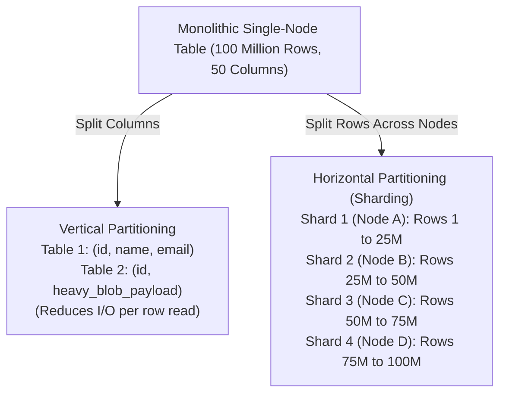
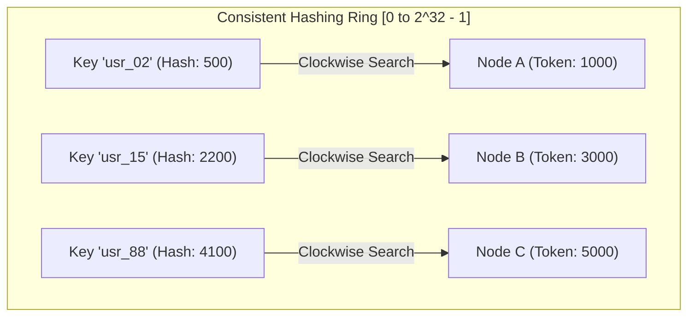
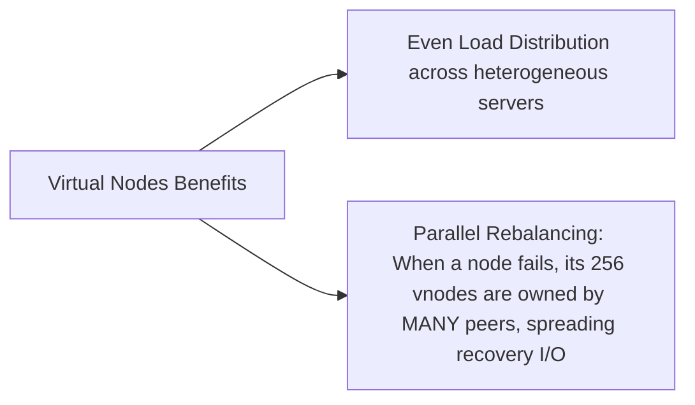
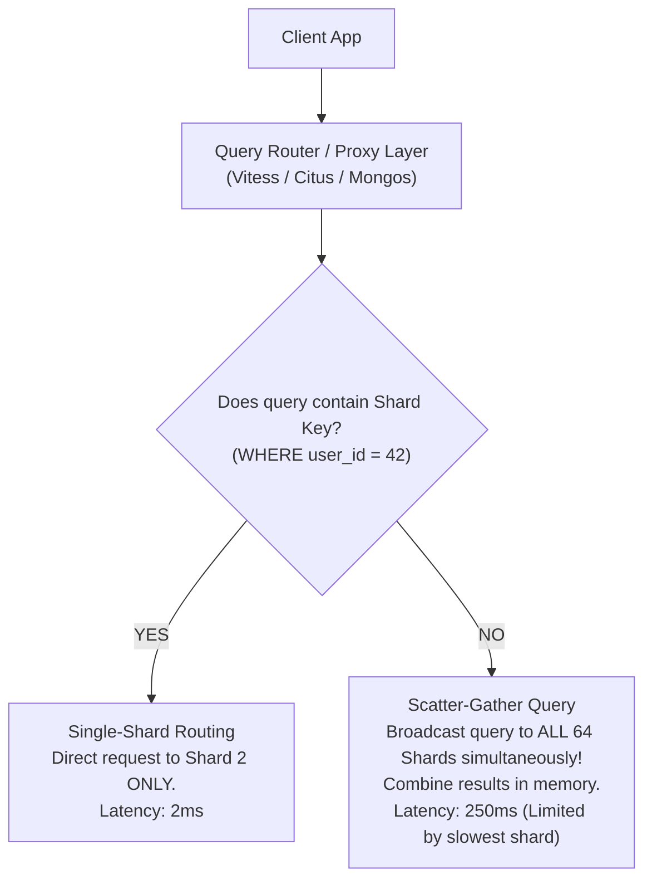

# Database Sharding — Horizontal Partitioning, Consistent Hashing, Routing

## Mental Model

Think of **Database Sharding** as splitting an enormous library that no single building can hold into multiple specialized branches (Shards). 

If you split books alphabetically by Author Name (Range-Based Sharding), all books by "King" sit in Branch 3. But if a million people suddenly want to read King's new book, Branch 3 experiences a **Hotspot Bottleneck** while Branch 1 sits empty. 

If you instead hash author names onto a **Consistent Hashing Ring** (like assigning authors to a circular 360-degree dial), books are evenly distributed among branches. Adding a new branch library requires moving only a small fraction of books from adjacent neighbors, rather than reorganizing the entire library from scratch!

---

## 1. Vertical Partitioning vs. Horizontal Partitioning (Sharding)



---

## 2. Partitioning Strategies: Range, Hash, List, Directory

### Comparison Matrix of Sharding Schemes

| Strategy | Partitioning Logic | Major Advantage | Major Disadvantage / Failure Mode |
|---|---|---|---|
| **Range-Based** | Assign continuous key ranges to shards: $[A-F] \to \text{Shard 1}, [G-M] \to \text{Shard 2}$. | Excellent for **Range Scans** (`WHERE id BETWEEN 100 AND 500`). | **Hotspots** on sequential keys (e.g., autoincrement IDs, timestamps). |
| **Hash-Based (`key % N`)** | Assign shard ID via modulo: $\text{Shard} = \text{Hash}(K) \pmod N$. | Uniform data distribution; eliminates sequential hotspots. | **Re-sharding Disaster:** Changing $N \to N+1$ remaps almost **100% of all keys**! |
| **Consistent Hashing** | Map keys and nodes onto a 360-degree hash ring $H(K) \in [0, 2^{32}-1]$. | Adding/removing a node requires moving only $1/N$ of total keys! | Non-uniform distribution without **Virtual Nodes**. |
| **List / Directory** | Explicit mapping table: `US -> Shard 1`, `EU -> Shard 2`. | Precise data sovereignty & geo-locality control. | Single point of failure/bottleneck on Lookup Directory DB. |

---

## 3. Consistent Hashing Mechanics & Virtual Nodes

### The Consistent Hashing Ring

In Consistent Hashing, both **Physical Storage Nodes** and **Data Keys** are mapped to the same 32-bit integer space $[0, 2^{32}-1]$ using a cryptographic hash function (e.g., MurmurHash3 or MD5).



To find the destination node for a key:
1. Compute hash value $H(\text{key})$.
2. Travel **clockwise** around the ring until you hit the first node whose token position $\ge H(\text{key})$.

### Rebalancing Performance: Modulo vs. Consistent Hashing

When scaling a cluster from $N=4$ to $N=5$ nodes:
- **Standard Modulo Hashing (`key % N`):** $\frac{N}{N+1} = \frac{4}{5} = \mathbf{80\%}$ of all existing keys must be migrated across the network!
- **Consistent Hashing:** Only $\frac{1}{N+1} = \frac{1}{5} = \mathbf{20\%}$ of keys are migrated (only keys falling in the newly added node's slice are moved from its immediate clockwise neighbor).

### Virtual Nodes (vnodes) for Uniform Balance

Without virtual nodes, random physical node positions produce unequal ring segment sizes, causing uneven load distribution.

**Solution:** Map each physical node to 128 or 256 **Virtual Nodes (vnodes)** distributed randomly across the ring.

```text
Physical Node A -> Assigned vnodes: A#1 (120), A#2 (1540), A#3 (3800)...
Physical Node B -> Assigned vnodes: B#1 (450), B#2 (2100), B#3 (4900)...
```



---

## 4. Query Routing & Cross-Shard Joins

Executing queries in a sharded environment requires a routing layer.



### The Cross-Shard Join Problem

Joining two tables sharded on different keys (e.g., `orders` sharded by `order_id` and `customers` sharded by `customer_id`) requires transferring massive table chunks across the network (**Distributed Hash Join**).

#### Production Solutions for Cross-Shard Joins:
1. **Co-location (Entity Groups):** Shard all related tables using the **same shard key** (e.g., `tenant_id` or `user_id`). All orders, invoices, and profile rows for `tenant_id = 42` live on the exact same physical shard node, allowing fast local joins!
2. **Reference Table Duplication:** Replicate small, infrequently updated dimension tables (e.g., `countries`, `currencies`) to **every** shard node.

---

## 5. Production Operations & Frameworks

### Production Sharding Middleware Systems

| Database Ecosystem | Sharding Middleware | Architectural Approach |
|---|---|---|
| **MySQL** | **Vitess** (YouTube / PlanetScale) | Proxy layer hiding thousands of MySQL instances as a unified SQL engine. |
| **PostgreSQL** | **Citus** (Microsoft) | Open-source extension turning PostgreSQL into a distributed sharded database. |
| **MongoDB** | **Mongos Router** | Native sharding router maintaining cluster metadata via Config Servers. |

### Citus PostgreSQL Sharding Commands

```sql
-- Enable Citus extension
CREATE EXTENSION citus;

-- Add worker nodes to the cluster
SELECT citus_add_node('worker-node-1.internal', 5432);
SELECT citus_add_node('worker-node-2.internal', 5432);

-- Distribute (shard) the orders table across workers by tenant_id
SELECT create_distributed_table('orders', 'tenant_id');

-- Rebalance shards across cluster after adding new worker nodes
SELECT rebalance_table_shards('orders');
```

---

## 6. Failure Modes and Trade-offs

1. **Monolithic Shard Key Selection Error** — Selecting a high-frequency, low-cardinality column as the shard key (e.g., `gender` or `status`). Result: Only 2 or 3 shards receive 100% of data, completely defeating horizontal scaling. *Mitigation*: Select high-cardinality keys with uniform distribution (e.g., `user_id`, `tenant_id`, `UUIDv7`).
2. **Scatter-Gather Latency Amplification** — Running queries without specifying the shard key broadcasts to 128 shards. Query latency becomes bounded by the **tail latency of the single slowest node** (p99 latency explosion). *Mitigation*: Enforce mandatory shard key inclusion in API query paths via linter/ORMs.
3. **Resharding Operations Locking** — Changing shard key or re-partitioning live datasets creates massive cross-network data migration that saturates network interfaces and locks tables. *Mitigation*: Use online background rebalancing with CDC (Change Data Capture) and dual-writing.

---

## 7. Active-Recall Prompts

1. **Why does modulo hashing (`key % N`) fail during cluster scaling, and how does Consistent Hashing resolve it?**
2. **What is a Virtual Node (vnode) in Consistent Hashing, and what two major operational problems does it solve?**
3. **Explain the difference between Single-Shard Routing and Scatter-Gather Query execution. Why are Scatter-Gather queries dangerous at scale?**
4. **What is Table Co-location, and how does selecting a common Shard Key (e.g., `tenant_id`) enable fast local joins?**

---

## Related Notes

- [[Distributed Database Fundamentals - CAP Theorem, PACELC, Consistency Models]]
- [[Database Replication - Single-Leader, Multi-Leader, Leaderless, Raft Consensus]]
- [[Google Spanner and CockroachDB - TrueTime, Serializable Distributed Transactions]]
- [[Wide-Column Stores - Apache Cassandra, SSTable, Consistent Hashing, Tunable Consistency]]

> **Interview Style Question:** *"You are re-architecting a monolithic 20 TB PostgreSQL database experiencing heavy write bottlenecks. Walk through your shard key selection methodology, evaluate Citus vs. Vitess, explain how table co-location eliminates cross-shard joins, and design an online data migration strategy with zero customer downtime."*

---
