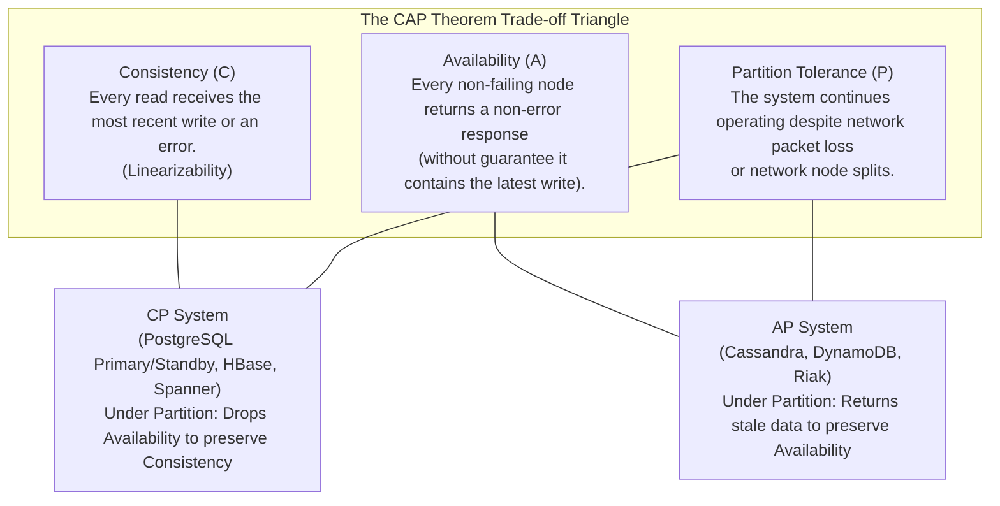
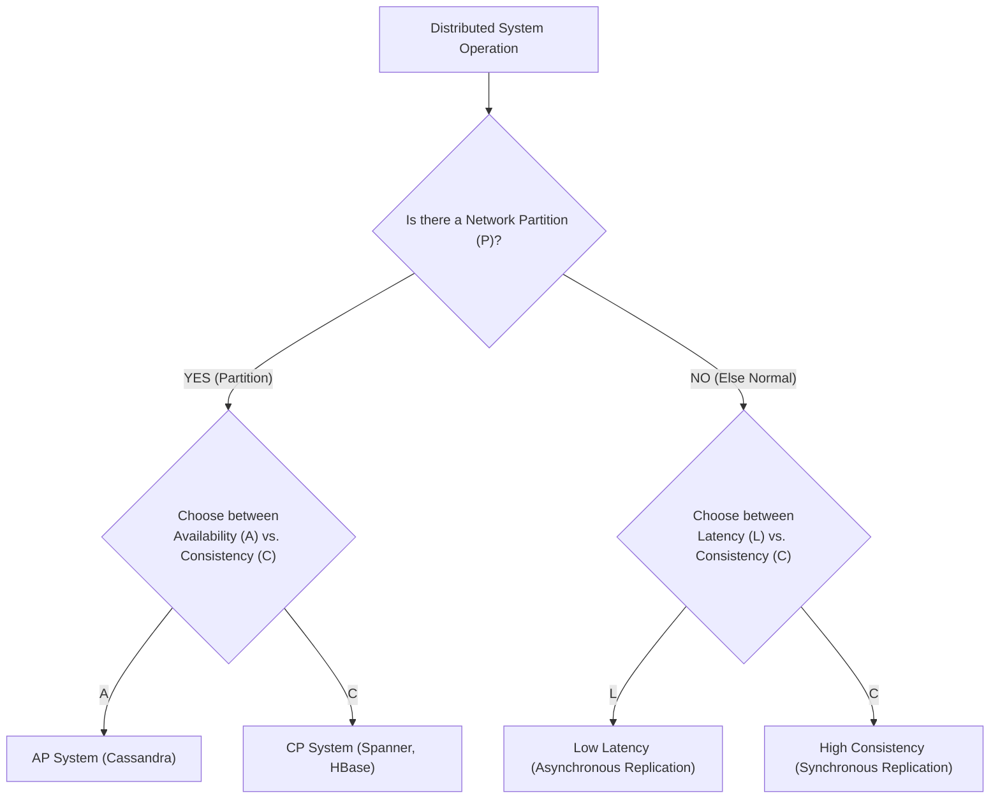
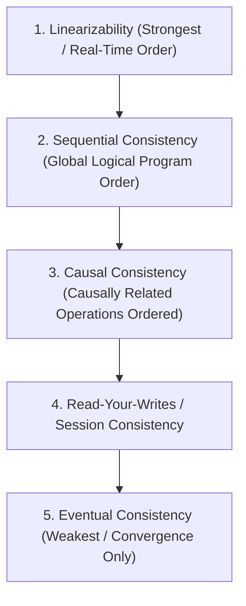

# Distributed Database Fundamentals — CAP Theorem, PACELC, Consistency Models

## Mental Model

Think of a **Distributed Database** as a chain of global bank branches connected by unreliable telephone lines (networks). 

If a customer deposits $100 in the London branch and their friend immediately attempts to withdraw $100 in the Tokyo branch, how does Tokyo know about the deposit? Under **Linearizability (Strong Consistency)**, Tokyo must wait until the telephone line confirms the deposit—if the transatlantic undersea cable snaps (**Network Partition**), Tokyo must refuse the withdrawal (**Choose Consistency over Availability**). Under **Eventual Consistency**, Tokyo allows the withdrawal immediately based on local data (**Choose Availability over Consistency**), accepting that the accounts might temporarily diverge until the network recovers and reconciles.

---

## 1. The CAP Theorem (Brewer's Theorem)

Formulated by Eric Brewer in 2000 and proven by Seth Gilbert and Nancy Lynch in 2002, the **CAP Theorem** states that a distributed data store can simultaneously provide at most **two** of the following three guarantees in the presence of a network partition:



> **The Reality of CAP:** In real-world networks, **Network Partitions (P) are an un-avoidable physical law of hardware failure** (router crashes, fiber cuts, packet loss). Therefore, the choice is **never** "Pick 2 out of 3 (CA, CP, AP)". The real choice is: **In the event of a Partition (P), do you choose Consistency (CP) or Availability (AP)?**

---

## 2. Beyond CAP: The PACELC Theorem

Formulated by Daniel Abadi in 2012, **PACELC** extends CAP to account for system behavior during **normal, partition-free execution**.

### The PACELC Taxonomy

$$\text{If } \mathbf{P} \text{ (Partition): } [\text{Choose } \mathbf{A} \text{ or } \mathbf{C}] \quad \mathbf{E} \text{lse (Normal): } [\text{Choose } \mathbf{L} \text{atency or } \mathbf{C} \text{onsistency}]$$



### PACELC Database Classification Matrix

| System | PACELC Rating | Behavior Under Partition (P) | Behavior Under Normal Operation (E) |
|---|---|---|---|
| **Google Spanner / CockroachDB** | **PC / EC** | Preserves Consistency; rejects writes if quorum lost. | Waits for synchronous multi-region consensus; higher latency. |
| **Apache Cassandra** | **PA / EL** | Returns local node data to remain Available. | Asynchronous local node reads/writes for minimal Latency. |
| **MongoDB (Majority Write/Read)** | **PC / EC** | Rejects writes if leader partitioned. | Synchronous majority acknowledgment. |
| **Amazon DynamoDB (Eventual)** | **PA / EL** | High availability local writes. | Eventual consistency reads for low latency. |

---

## 3. Hierarchy of Consistency Models

Consistency models define the contract between the programmer and the distributed database regarding the order and visibility of read/write operations across nodes.



### Consistency Model Spectrum

| Consistency Level | Definition | Real-World Analogy | Guarantees Provided |
|---|---|---|---|
| **Linearizability (Strong)** | Real-time global order. Once a write completes, all subsequent reads across ALL nodes MUST see that write or a newer one. | Instant global wall-clock synchronization. | Absolute recency; zero stale reads. Requires atomic clocks or synchronous consensus. |
| **Sequential Consistency** | Operations from all nodes appear in a single global logical sequence, respecting individual thread program order. | Single queue of operations without strict wall-clock times. | No real-time guarantee, but all nodes see operations in the *exact same order*. |
| **Causal Consistency** | Operations that are causally related ($A \to B$) must be seen by every node in the same order. Concurrent operations can be seen in different orders. | Message board thread (replies appear after original posts). | Prevents out-of-order cause-and-effect anomalies. |
| **Read-Your-Writes** | A process that writes a value will always see its own updated value on subsequent reads. | User updating profile picture and refreshing page. | Prevents user-facing "lost write" confusion. |
| **Eventual Consistency** | If no new updates occur, all replicas will eventually converge to identical data values. | Gossip among friends. | Weakest. High availability, zero latency penalty, but reads return stale data indefinitely. |

---

## 4. Quorum Consistency Mathematics ($N, W, R$)

Distributed storage systems (Cassandra, DynamoDB) achieve configurable consistency using **Quorum Mathematics**:

- $N$ = Total Replication Factor (number of node replicas storing the data).
- $W$ = Write Quorum (number of replica nodes that must acknowledge a write before success).
- $R$ = Read Quorum (number of replica nodes that must respond to a read before returning).

```mermaid
flowchart LR
    Client["Client Request"] --> W1["Replica Node 1 (Acknowledged)"]
    Client --> W2["Replica Node 2 (Acknowledged)"]
    Client --> W3["Replica Node 3 (Pending)"]
    
    Note over Client, W2: Quorum Condition Met (W=2, N=3)
```

### The Strong Quorum Formula

To guarantee **Linearizable / Strong Consistency** (ensuring at least one node in the Read Quorum contains the latest Write Quorum update):

$$W + R > N$$

#### Common Configuration Profiles ($N=3$):

| Strategy | $W$ | $R$ | $W+R > N$? | Consistency Level | Latency & Availability Profile |
|---|---|---|---|---|---|
| **Strong Quorum** | 2 | 2 | $2 + 2 = 4 > 3$ ✅ | **Strong / Linearizable** | Balanced. Can tolerate 1 node failure ($N-W=1$). |
| **Write-Heavy** | 1 | 3 | $1 + 3 = 4 > 3$ ✅ | **Strong / Linearizable** | Fast Writes ($W=1$), Slow Reads ($R=3$). |
| **Read-Heavy** | 3 | 1 | $3 + 1 = 4 > 3$ ✅ | **Strong / Linearizable** | Slow Writes ($W=3$), Fast Reads ($R=1$). |
| **Eventual / Weak** | 1 | 1 | $1 + 1 = 2 \le 3$ ❌ | **Eventual / Stale** | Ultra-Fast Reads & Writes, but risk reading stale data. |

---

## 5. Production Diagnostics & Configuration

### Configuring Quorum Consistency in Apache Cassandra (CQL)

```sql
-- Execute write with Quorum consistency (W = floor(N/2) + 1)
INSERT INTO user_profiles (user_id, email, status) 
VALUES ('usr_99', 'user@example.com', 'ACTIVE') 
USING CONSISTENCY QUORUM;

-- Execute read with Local Quorum (reads from local datacenter quorum)
SELECT email, status FROM user_profiles 
WHERE user_id = 'usr_99' 
USING CONSISTENCY LOCAL_QUORUM;
```

### Inspecting Replication Lag in PostgreSQL Replica

```sql
-- Execute on PostgreSQL Primary node to view standby replication lag
SELECT 
    client_addr AS replica_ip,
    application_name,
    state,
    sync_state, -- 'sync' (CP/EC) or 'async' (AP/EL)
    pg_wal_lsn_diff(pg_current_wal_lsn(), sent_lsn) AS sent_lag_bytes,
    pg_wal_lsn_diff(pg_current_wal_lsn(), write_lsn) AS write_lag_bytes,
    pg_wal_lsn_diff(pg_current_wal_lsn(), flush_lsn) AS flush_lag_bytes,
    pg_wal_lsn_diff(pg_current_wal_lsn(), replay_lsn) AS replay_lag_bytes
FROM pg_stat_replication;
```

---

## 6. Failure Modes and Trade-offs

1. **Split-Brain Syndrome** — A network partition divides a 5-node cluster into two sub-groups (3 nodes vs. 2 nodes). If both sub-groups accept writes independently, data diverges irreversibly. *Mitigation*: Enforce Strict Majority Quorum ($W > N/2$). The 2-node partition cannot achieve majority ($2 \le 2.5$) and rejects writes, preserving consistency.
2. **Causal Inversion / Time-Travel Reads** — A client writes data to Node A ($W=1$), then reads from Node B ($R=1$) before asynchronous replication finishes, seeing their write "disappear". *Mitigation*: Enforce `Read-Your-Writes` session consistency via sticky routing or `W + R > N`.
3. **Cascading Network Partition Outages** — Setting `W = N` (require all replicas to acknowledge) means a single node reboot or network blip causes **100% write outage** across the entire cluster. *Mitigation*: Avoid $W=N$; use $W = \lfloor N/2 \rfloor + 1$.

---

## 7. Active-Recall Prompts

1. **Why is it mathematically impossible to choose "CA" in a distributed database when a network partition (P) occurs?**
2. **What does the PACELC theorem add to the CAP theorem regarding normal, non-partitioned operation?**
3. **What is the mathematical condition ($W + R > N$) required to guarantee strong read consistency across replicated nodes, and why does $W=1, R=1, N=3$ fail it?**
4. **Define Linearizability vs. Eventual Consistency using a real-world example.**

---

## Related Notes

- [[Database Replication - Single-Leader, Multi-Leader, Leaderless, Raft Consensus]]
- [[Database Sharding - Horizontal Partitioning, Consistent Hashing, Routing]]
- [[Google Spanner and CockroachDB - TrueTime, Serializable Distributed Transactions]]
- [[Transactions and ACID Properties - Atomicity, Consistency, Isolation, Durability]]

> **Interview Style Question:** *"You are designing an e-commerce inventory system for Black Friday sales. The business team demands zero overselling (Consistency) AND 100% checkout uptime even during AWS region outages (Availability). Evaluate this requirement using the CAP and PACELC theorems, and propose an architectural compromise using quorum math or reservation pools."*

---
