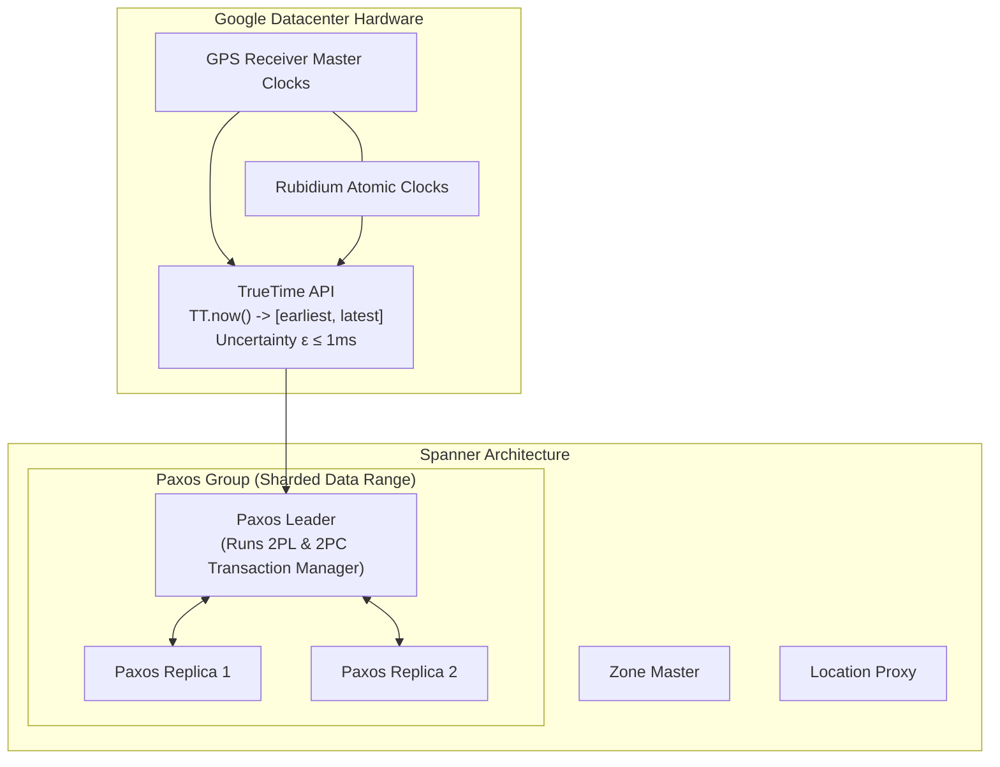
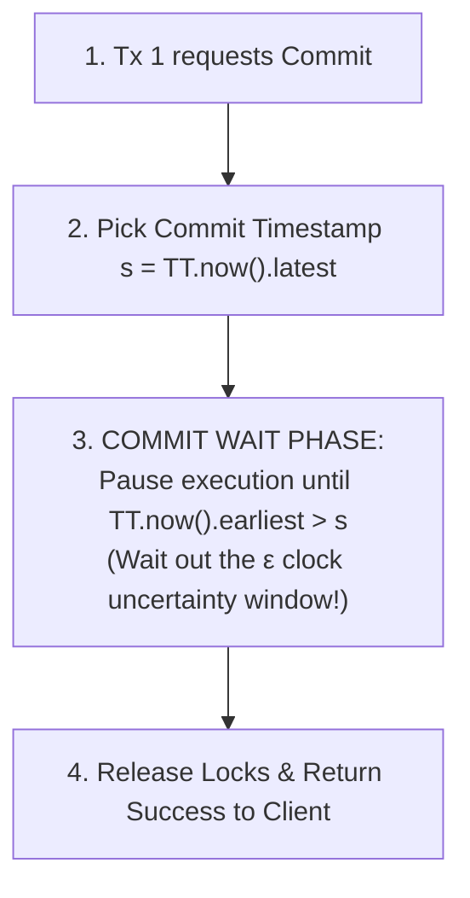
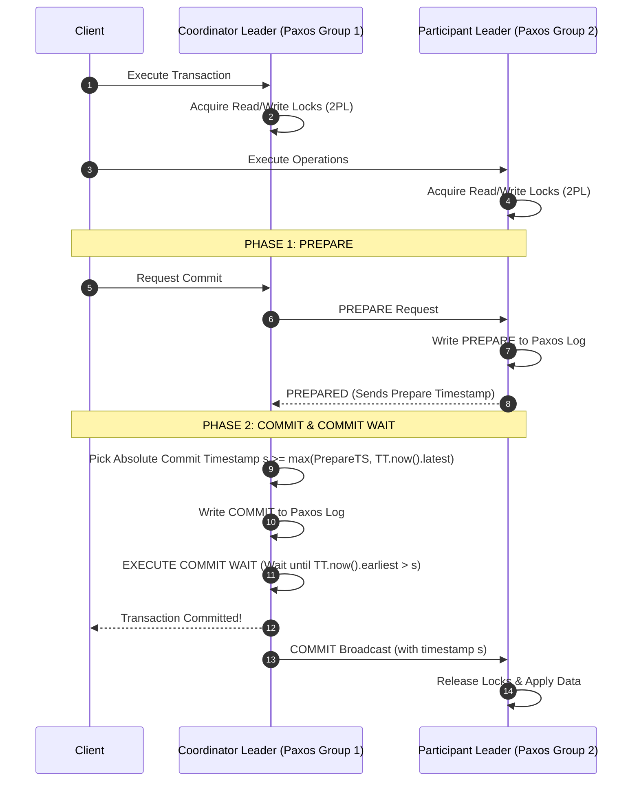
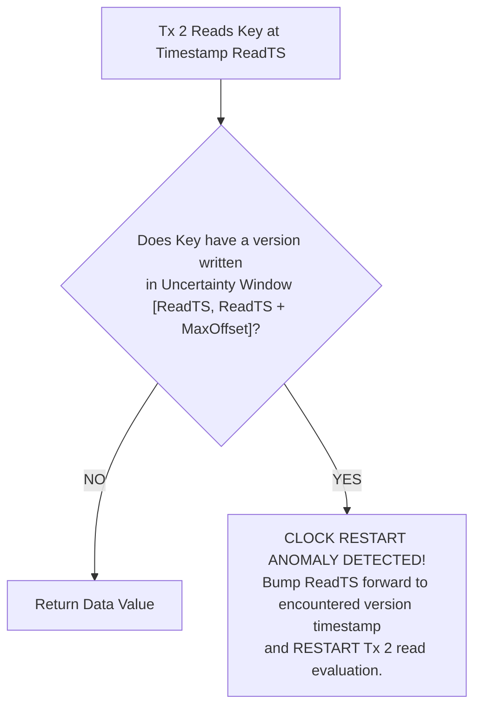

# Google Spanner and CockroachDB — TrueTime, Serializable Distributed Transactions

## Mental Model

Think of **Google Spanner** as a global, synchronized master clock system governing millions of safe bank transactions simultaneously across the planet. 

In standard distributed databases, physical computer clocks drift by hundreds of milliseconds, making it impossible to know if Event A in New York happened before Event B in Tokyo without stopping to communicate. Spanner solves this by equipping every datacenter with **atomic clocks and GPS receivers (TrueTime API)**. Instead of pretending clocks are perfect, TrueTime explicitly bounds clock uncertainty to a narrow window ($\epsilon \approx 1\text{ms}$ to $7\text{ms}$). By forcing a transaction to **wait out its clock uncertainty window** before committing, Spanner guarantees absolute real-time global ordering (**External Consistency / Strict Serializability**) across continent-spanning scale without blocking global reads!

---

## 1. The Distributed Transaction Challenge & External Consistency

Traditional single-node relational databases enforce Serializability locally using 2PL or MVCC. In a globally distributed database sharded across 1,000 nodes across 5 continents:
1. **Clock Drift Problem:** Physical CPU clocks (NTP) drift constantly due to temperature, network jitter, and hardware variance.
2. **External Consistency (Strict Serializability):** If transaction $T_2$ starts *after* transaction $T_1$ commits in real-world wall-clock time, $T_2$'s commit timestamp **MUST** be strictly greater than $T_1$'s commit timestamp ($s_{T2} > s_{T1}$).

```mermaid
flowchart LR
    subgraph WallClockTime["Real-World Wall-Clock Time Line"]
        T1["Tx 1 Commits in New York\n(Real Time: 12:00:00.100)"] --> T2["Tx 2 Starts in Tokyo\n(Real Time: 12:00:00.105)"]
    end
    
    T1 -.-|External Consistency Invariant| T2
    Note over T1, T2: System MUST guarantee CommitTimestamp(T2) > CommitTimestamp(T1)
```

---

## 2. Google Spanner Architecture & TrueTime API

Google Spanner achieves global Strict Serializability using a combination of **Hardware-assisted Synchronization (TrueTime)**, **Multi-Paxos Groups**, and **Two-Phase Commit (2PC)**.



### The TrueTime API Protocol

The TrueTime API exposes time not as a discrete integer, but as a bounded time interval $[t_{earliest}, t_{latest}]$ with uncertainty bound $\epsilon$:

$$\text{TT.now}() = [t_{now} - \epsilon, \; t_{now} + \epsilon] \quad \text{where } \epsilon \approx 1\text{ms} \text{ to } 7\text{ms}$$

### The Commit Wait Rule (Beating Clock Uncertainty)

To guarantee that $T_2$ receives a commit timestamp greater than $T_1$, Spanner enforces the **Commit Wait Rule**:



> **Why Commit Wait Works:** By waiting until real-world time has definitely passed timestamp $s$, any subsequent transaction $T_2$ anywhere in the world will invoke `TT.now()` and receive a timestamp strictly greater than $s$!

---

## 3. Distributed Two-Phase Commit (2PC) over Paxos

Spanner shards data into split ranges called **Tablets**. A single distributed transaction spanning multiple Tablets uses **Two-Phase Commit (2PC)** where each participant is itself a fault-tolerant **Paxos Group**.



---

## 4. CockroachDB: TrueTime Without Hardware Atomic Clocks

While Google Spanner relies on custom GPS and Atomic Clock hardware in proprietary datacenters, **CockroachDB** is an open-source Spanner derivative designed to run on commodity cloud infrastructure (AWS, GCP, Azure, Bare Metal) using standard NTP.

### How CockroachDB Handles Clock Uncertainty

Because standard NTP has a larger clock uncertainty ($\epsilon \approx 10\text{ms}$ to $250\text{ms}$), CockroachDB cannot use Spanner's Commit Wait rule (waiting 250ms per write would kill performance).



- **Hybrid Logical Clocks (HLC):** Combines physical NTP time with logical causality counters.
- **Read Restarts:** If a transaction encounters a value written within its clock uncertainty window, it advances its read timestamp and restarts the read evaluation phase to maintain strict serializability.

---

## 5. Spanner vs. CockroachDB Architectural Comparison

| Dimension | Google Spanner | CockroachDB |
|---|---|---|
| **Consensus Engine** | Multi-Paxos | Multi-Raft |
| **Clock Infrastructure** | TrueTime API (GPS + Rubidium Atomic Clocks). | Hybrid Logical Clocks (HLC) over standard NTP. |
| **Clock Uncertainty ($\epsilon$)** | Extremely Low ($\approx 1\text{ms}$). | Higher ($\approx 10\text{ms}$–$100\text{ms}$). |
| **Commit Latency Mechanism** | **Commit Wait** (pauses commit by $\epsilon$). | **Read Restarts** (re-evaluates reads on uncertainty collision). |
| **SQL Engine & Storage** | Proprietary C++ Engine, ROCKS-like storage. | Open-Source Go Engine, Pebble storage engine. |
| **Deployment Model** | Managed Google Cloud Platform service. | Self-hosted or Managed Multi-Cloud. |

---

## 6. Production Operations & Inspection Commands

### Monitoring TrueTime Uncertainty in Google Spanner

```sql
-- Query Spanner system table to check current TrueTime bounds
SELECT CURRENT_TIMESTAMP() AS current_time;
```

### Inspecting HLC Clock Jitter in CockroachDB

```bash
# Check CockroachDB cluster node clock offset and status
cockroach node status --ranges --stats

# View clock offset alerts in CockroachDB SQL shell
SELECT node_id, address, metrics->>'clock_offset.meanzero' AS clock_offset_ns 
FROM crdb_internal.kv_node_status;
```

> ⚠️ **CockroachDB Production Rule:** If clock offset on any node exceeds `max_offset` (default 500ms), CockroachDB **terminates the node process immediately** to prevent serializability violations.

---

## 7. Failure Modes and Trade-offs

1. **2PC Coordinator Failure Lock Freeze** — If the 2PC Coordinator Leader crashes *after* sending PREPARE to participants but *before* broadcasting COMMIT/ABORT, participant nodes remain locked on 2PL locks, blocking concurrent access. *Spanner/Cockroach Solution*: Because the Coordinator is itself a multi-replica Paxos/Raft group, a new leader is elected instantly to finish the 2PC commit decision.
2. **NTP Clock Drift Panic in CockroachDB** — Virtual machine live-migration or NTP synchronization failure causes a node clock to jump forward by 1 second. CockroachDB detects clock offset $> 500\text{ms}$ and crashes the node on purpose to preserve consistency. *Mitigation*: Run `chrony` instead of `ntpd` with local AWS/GCP PTP clock source (`ptp_kvm`).
3. **High Latency Cross-Region 2PC** — Transactions spanning tablets in US-East and EU-West must execute 2PC across the Atlantic Ocean, imposing a 150ms network RTT minimum. *Mitigation*: Design application schemas using entity groups to keep 99% of transactions within single Paxos ranges.

---

## 8. Active-Recall Prompts

1. **What is External Consistency (Strict Serializability), and why can't standard physical NTP clocks guarantee it in global distributed databases?**
2. **Explain Google Spanner's Commit Wait Rule. How does waiting for $\epsilon$ time before returning success guarantee global timestamp order?**
3. **How does CockroachDB achieve distributed serializable transactions on commodity hardware without atomic clocks? What is a Read Restart?**
4. **Walk through the two phases of a Distributed Two-Phase Commit (2PC) protocol running over Paxos groups.**

---

## Related Notes

- [[Distributed Database Fundamentals - CAP Theorem, PACELC, Consistency Models]]
- [[Database Replication - Single-Leader, Multi-Leader, Leaderless, Raft Consensus]]
- [[Database Sharding - Horizontal Partitioning, Consistent Hashing, Routing]]
- [[Transactions and ACID Properties - Atomicity, Consistency, Isolation, Durability]]

> **Interview Style Question:** *"Explain how Google Spanner solves the fundamental trade-off between strict ACID transactions and global multi-region scalability. Contrast Spanner's hardware-based TrueTime Commit Wait approach with CockroachDB's software-based HLC Read Restart approach, detailing the latency and failure-mode trade-offs of both architectures."*

---
