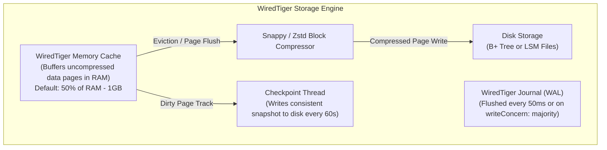
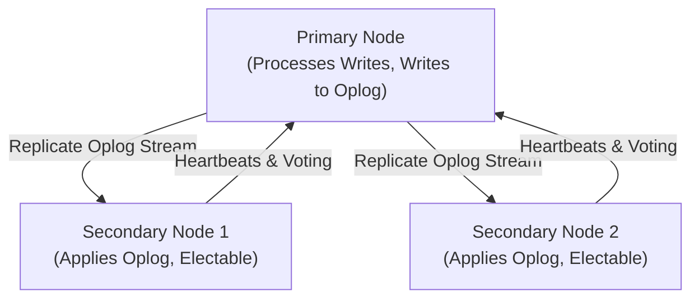
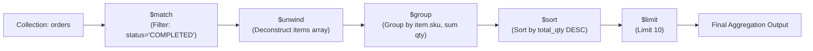

# Document Databases — MongoDB Architecture, WiredTiger, Aggregation Pipeline

## Mental Model

Think of a **Document Database (MongoDB)** as a digital filing cabinet of self-contained JSON/BSON folders rather than rigid relational ledger tables. 

In a relational database, an Order with 10 Line Items and a Shipping Address is shredded across 3 separate normalized tables (`orders`, `order_items`, `addresses`), requiring expensive SQL `JOIN` operations to assemble at runtime. In a Document Database, the entire order is stored as a single, hierarchical **BSON document**. You retrieve the entire nested object in a single disk read without joins. 

Under the hood, MongoDB relies on the **WiredTiger engine** to manage page memory, B+ Trees, checkpointing, and ticket-based concurrency control.

---

## 1. Relational vs. Document Model (BSON Serialization)

MongoDB stores records as **BSON (Binary JSON)** documents. BSON extends JSON by adding explicit binary data types (`ObjectId`, `Date`, `int32`, `int64`, `binData`, `Decimal128`) and enabling fast traversal by prefixing elements with length specifiers.

```json
{
  "_id": ObjectId("65ce23b8f1a2b3c4d5e6f7a8"),
  "customer_id": 4521,
  "status": "SHIPPED",
  "items": [
    { "sku": "LAPTOP-01", "qty": 1, "price": 1200.00 },
    { "sku": "MOUSE-05", "qty": 2, "price": 25.50 }
  ],
  "shipping_address": {
    "street": "100 Innovation Way",
    "city": "San Francisco",
    "zip": "94105"
  }
}
```

### Architectural Comparison

| Dimension | Relational Model (RDBMS) | Document Model (MongoDB) |
|---|---|---|
| **Data Representation** | Normalization into flat rows and columns across tables. | Denormalization into hierarchical BSON document trees. |
| **Schema Flexibility** | Rigid schema defined DDL; `ALTER TABLE` required. | Dynamic schema; documents in same collection can differ. |
| **Data Access Pattern** | Assembled at runtime via `JOIN` queries. | Read in a single I/O operation (Embedded Documents). |
| **Atomicity Scope** | Multi-table ACID Transactions (`BEGIN...COMMIT`). | Single-Document ACID (Multi-Document transactions supported since v4.0). |

---

## 2. MongoDB WiredTiger Storage Engine Internals

Since MongoDB 3.2, **WiredTiger** is the default pluggable storage engine.



### Key WiredTiger Subsystems

1. **Hazard Pointers & Lock-Free Concurrency:** WiredTiger uses hazard pointers and lock-free algorithms instead of global table locks, allowing thousands of threads to execute concurrent page reads and writes.
2. **Block Compression:** Compresses disk pages using **Snappy** (default for fast CPU decompression) or **Zstd** (high compression ratio), reducing disk I/O by 50%–70%.
3. **Memory Cache Allocation:** WiredTiger allocates 50% of total system RAM minus 1GB for its internal cache. The remaining RAM is left for the OS Page Cache.

---

## 3. High Availability: Replica Sets & Oplog

A MongoDB **Replica Set** provides automated failover and high availability using a Single-Leader primary model with an election mechanism based on Raft.



### The Operations Log (`local.oplog.rs`)
The **Oplog** is a special capped collection that records all write operations applied to the primary. 
- Replicas continuously tail the primary's oplog and apply operations to their local data.
- **Idempotency Invariant:** Oplog entries are transformed to be strictly **idempotent** (applying an oplog entry multiple times yields the exact same state). For example, `{$inc: {views: 1}}` is converted in the oplog to an absolute set: `{$set: {views: 42}}`.

### Write Concern & Read Concern Controls

```javascript
// Strict Financial Write: Wait for majority replica disk flush
db.orders.insertOne(
   { item: "Server", qty: 5 },
   { writeConcern: { w: "majority", j: true, wtimeout: 5000 } }
);

// Strict Consistency Read: Read data acknowledged by majority
db.orders.find({ status: "SHIPPED" }).readConcern("majority");
```

---

## 4. The Aggregation Pipeline Engine

The MongoDB **Aggregation Pipeline** is a multi-stage data processing framework modeled after Unix pipes (`cat file | grep | awk`).



### Production Aggregation Pipeline Code Example

```javascript
// Complex Aggregation: Top revenue customers in 2026 with join to customer profile
db.orders.aggregate([
  // Stage 1: Filter orders by date range (Uses B+ Tree Index on created_at!)
  {
    $match: {
      created_at: { 
        $gte: ISODate("2026-01-01T00:00:00Z"), 
        $lt: ISODate("2026-07-01T00:00:00Z") 
      },
      status: "COMPLETED"
    }
  },
  
  // Stage 2: Group by customer_id and calculate metrics
  {
    $group: {
      _id: "$customer_id",
      total_spent: { $sum: "$total_amount" },
      order_count: { $sum: 1 }
    }
  },
  
  // Stage 3: Filter groups having spent > $1,000
  {
    $match: { total_spent: { $gte: 1000.00 } }
  },
  
  // Stage 4: Left Outer Join with 'customers' collection
  {
    $lookup: {
      from: "customers",
      localField: "_id",
      foreignField: "_id",
      as: "customer_info"
    }
  },
  
  // Stage 5: Flatten joined customer_info array
  { $unwind: "$customer_info" },
  
  // Stage 6: Project clean response fields
  {
    $project: {
      _id: 0,
      customer_id: "$_id",
      name: "$customer_info.name",
      email: "$customer_info.email",
      total_spent: 1,
      order_count: 1
    }
  },
  
  // Stage 7: Sort by total_spent descending
  { $sort: { total_spent: -1 } },
  
  // Stage 8: Limit to Top 20
  { $limit: 20 }
]);
```

---

## 5. Production Operations & Optimization Commands

### Indexing Multikey (Array) & Compound Fields

```javascript
// Compound Index supporting leftmost prefix (tenant_id + status + created_at)
db.orders.createIndex({ tenant_id: 1, status: 1, created_at: -1 });

// Multikey Index on nested array of items
db.orders.createIndex({ "items.sku": 1 });

// Partial Index indexing active sessions only
db.sessions.createIndex(
  { last_activity: 1 }, 
  { partialFilterExpression: { active: true } }
);

// TTL Index automatically deleting logs after 30 days (2592000 seconds)
db.app_logs.createIndex({ timestamp: 1 }, { expireAfterSeconds: 2592000 });
```

### Explaining Aggregation Pipeline Execution Plan

```javascript
// Analyze query execution and index usage
db.orders.explain("executionStats").aggregate([
  { $match: { tenant_id: 42, status: "COMPLETED" } }
]);
```

---

## 6. Failure Modes and Trade-offs

1. **Unbounded Document Growth (BSON 16MB Limit Collision)** — Designing schemas with growing arrays (e.g., storing millions of sensor log entries inside a single user document). The document eventually hits the **hard 16MB BSON size limit**, throwing database write errors. *Mitigation*: Use Bucket Pattern (split logs into multi-document time buckets) or parent-referencing.
2. **Unindexed `$lookup` Pipeline Performance Collapse** — Executing `$lookup` (joins) between two large collections without an index on the `foreignField` forces a full collection scan for **every single incoming pipeline document** ($O(M \times N)$ execution time). *Mitigation*: Ensure index exists on `foreignField`.
3. **Dirty Reads with `readConcern: local` during Failover** — A client writes with default `writeConcern: 1` and reads with `readConcern: local`. If the primary crashes before replicating to secondaries, the secondary is elected primary and drops the un-replicated write. The client experiences a **Rollback Loss of Data**. *Mitigation*: Use `writeConcern: "majority"` and `readConcern: "majority"` for critical operations.

---

## 7. Active-Recall Prompts

1. **What is BSON, and how does storing denormalized embedded documents improve read performance compared to relational JOINs?**
2. **How does the MongoDB WiredTiger storage engine achieve high write concurrency without table-level locks?**
3. **What is the MongoDB Oplog, and why must all operations logged inside it be strictly idempotent?**
4. **Explain how `$match`, `$group`, and `$lookup` operate inside a MongoDB Aggregation Pipeline, and which stage must appear first to utilize a B+ Tree index.**

---

## Related Notes

- [[Key-Value Stores - Redis Architecture, Data Structures, Persistence, Cluster]]
- [[Wide-Column Stores - Apache Cassandra, SSTable, Consistent Hashing, Tunable Consistency]]
- [[B-Tree and B+ Tree Indexes - Structure, Search, Insert, Split]]
- [[Database Sharding - Horizontal Partitioning, Consistent Hashing, Routing]]

> **Interview Style Question:** *"You are re-designing an e-commerce platform schema in MongoDB. Compare an Embedded Document design (`items` array inside `orders` document) versus a Referenced Collection design (`order_id` in separate `order_items` collection). Detail how disk I/O, 16MB BSON size limits, indexing overhead, and atomic write guarantees differ between the two patterns."*

---
