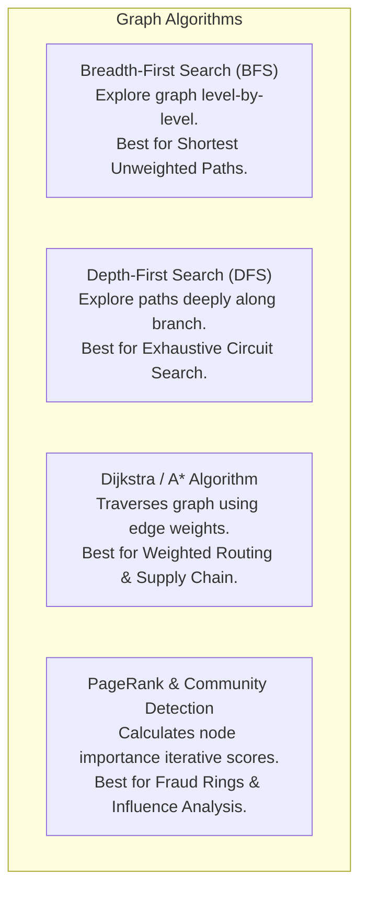

# Graph Databases — Neo4j, Property Graph Model, Cypher, Traversal Algorithms

## Mental Model

Think of a **Graph Database (Neo4j)** as a web of interconnected physical subway stations and direct rail tracks. 

In a relational database, finding a friend's friend's recommendation requires joining 4 massive tables (`users`, `friendships`, `likes`, `products`) at runtime. The database engine must perform expensive index lookups for every step ($O(\log N)$ per join), causing execution latency to explode exponentially as relationship depth increases. 

In a Graph Database, relationships are stored as **direct physical memory pointers** connecting nodes (**Index-Free Adjacency**). To find a 5th-degree connection, the query execution engine simply follows pointer addresses in RAM at $O(1)$ cost per step, regardless of whether the database holds 1,000 nodes or 10 billion nodes!

---

## 1. The Property Graph Model

A Property Graph consists of four fundamental elements:

```mermaid
flowchart LR
    NodeA["Node: Person\n{name: 'Alice', age: 30}"] -->|Relationship: KNODE_SINCE\n{since: 2020}| NodeB["Node: Person\n{name: 'Bob', age: 32}"]
    NodeA -->|Relationship: LIKES\n{weight: 0.95}| NodeC["Node: Product\n{title: 'Neo4j Book'}"]
```

1. **Nodes (Vertices):** Represent entities (e.g., `Person`, `Company`, `Product`). Nodes can have one or more **Labels**.
2. **Relationships (Edges):** Directed, typed connections between two nodes (e.g., `:KNOWS`, `:WORKS_AT`, `:PURCHASED`). Relationships **must** have a start node and an end node.
3. **Properties:** Key-value pairs attached to Nodes OR Relationships (e.g., `since: 2020`, `weight: 0.95`).
4. **Labels:** Categories used to group nodes and restrict index lookups (e.g., `:Person`, `:Product`).

---

## 2. Index-Free Adjacency (The Core Architecture of Neo4j)

The defining technical characteristic of a true Graph Database is **Index-Free Adjacency (IFA)**.

### Relational Join Lookup vs. Index-Free Pointer Traversal

```mermaid
flowchart TD
    subgraph RDBMSJoin["Relational Database Join (O(K log N))"]
        R1["Table A (Row 10)"] -->|Search Index| BTree["B+ Tree Index on Junction Table"]
        BTree -->|Log N Disk I/O| R2["Junction Table Row"]
        R2 -->|Search Index| BTree2["B+ Tree Index on Table B"]
        BTree2 -->|Log N Disk I/O| R3["Table B (Row 55)"]
    end
    
    subgraph Neo4jIFA["Neo4j Index-Free Adjacency (O(1) Step)"]
        N1["Node Record (In RAM)"] -->|Direct Memory Pointer Offset| EdgeRecord["Relationship Record (In RAM)"]
        EdgeRecord -->|Direct Memory Pointer Offset| N2["Target Node Record (In RAM)"]
    end
```



### Neo4j On-Disk Record Structure

Neo4j achieves $O(1)$ traversal by storing fixed-size binary records on disk and in RAM:

- **Node Record (15 Bytes):**
  `[in_use | first_rel_ptr | first_prop_ptr | label_ptr]`
- **Relationship Record (34 Bytes):**
  `[in_use | source_node | target_node | rel_type | prev_src_rel | next_src_rel | prev_tgt_rel | next_tgt_rel | prop_ptr]`

> **Why Traversal is $O(1)$ per step:** Every node record points directly to a doubly linked list of relationship records. Following a relationship to a neighbor requires zero index searches—it is a simple memory address dereference!

---

## 3. Querying Graphs with Cypher

**Cypher** is the standard declarative graph query language designed for ASCII-art pattern matching.

### Cypher ASCII-Art Pattern Syntax:
- Nodes: `(p:Person)`
- Directed Relationship: `-[:KNOWS]->`
- Full Pattern: `(a:Person)-[:KNOWS]->(b:Person)`

### Production Cypher Examples

#### 1. Friend-of-a-Friend Recommendation Engine (Depth 2 Traversal)

```cypher
// Find products liked by friends of Alice that Alice hasn't bought yet
MATCH (user:Person {name: 'Alice'})-[:KNOWS]->(friend:Person)-[:PURCHASED]->(prod:Product)
WHERE NOT (user)-[:PURCHASED]->(prod)
RETURN prod.title AS recommended_product, COUNT(friend) AS friend_count
ORDER BY friend_count DESC
LIMIT 10;
```

#### 2. Shortest Path & Fraud Detection (Variable Length Relationships)

```cypher
// Find shortest path between two suspected fraudulent accounts (up to 6 hops)
MATCH path = shortestPath(
  (acc1:Account {id: 'ACC-1001'})-[:TRANSFERRED_FUNDS*1..6]-(acc2:Account {id: 'ACC-9009'})
)
RETURN path, length(path) AS distance;
```

---

## 4. Graph Traversal Algorithms: BFS, DFS, Dijkstra, PageRank

Graph databases execute path-finding algorithms using specialized execution memory structures.



### Algorithmic Complexity Comparison

| Algorithm | Primary Use Case | Time Complexity | Space Complexity |
|---|---|---|---|
| **Breadth-First Search (BFS)** | Shortest path on unweighted graphs, social distance. | $O(V + E)$ | $O(V)$ (Queue memory) |
| **Depth-First Search (DFS)** | Cycle detection, topological sort, dependency trees. | $O(V + E)$ | $O(V)$ (Call stack) |
| **Dijkstra’s Algorithm** | Shortest path on weighted edges (cost, distance, risk). | $O((V + E) \log V)$ | $O(V)$ (Priority Queue) |
| **PageRank** | Measuring node influence and authority across graph. | $O(k \times (V + E))$ | $O(V)$ (Vector state) |

---

## 5. Production Operations & Schema Optimization

### Indexing in Neo4j (Used for Initial Entry Points Only!)

In Neo4j, indexes are used **only to find the starting node(s)** of a query (`MATCH (u:User {id: 42})`). Once the starting node is located, indexes are abandoned, and Index-Free Adjacency takes over!

```cypher
-- Create B-Tree Index on Label property for fast initial lookup
CREATE INDEX idx_person_name IF NOT EXISTS FOR (p:Person) ON (p.name);

-- Create Composite Index
CREATE INDEX idx_user_tenant IF NOT EXISTS FOR (u:User) ON (u.tenant_id, u.email);

-- Create Full-Text Search Index
CREATE FULLTEXT INDEX fts_product_desc IF NOT EXISTS FOR (p:Product) ON EACH [p.description];
```

---

## 6. Failure Modes and Trade-offs

1. **Supernode / Dense Node Traversal Explosion** — A "Supernode" is a node with millions of relationships (e.g., a celebrity Twitter account with 50M followers or a popular payment gateway node). Traversing through a supernode forces Neo4j to scan a 50-million-link relationship chain in memory, blowing up query latency. *Mitigation*: Use relationship properties to prune traversal early; refactor supernodes into intermediate bucket nodes.
2. **Global Un-indexed Graph Traversal Exhaustion** — Writing a Cypher query without specifying node labels or initial index constraints (`MATCH (a)-[*1..10]->(b) RETURN b`). Neo4j is forced to perform a full graph scan across billions of nodes, crashing RAM. *Mitigation*: Enforce `APOC` execution guards and mandatory label indexes.
3. **High Memory Overhead for Large Graphs** — Because Index-Free Adjacency keeps relationship pointers in RAM for optimal speed, storing massive graphs with hundreds of billions of edges requires huge RAM allocations (e.g., 512GB to 1TB RAM instances). *Mitigation*: Tune page cache allocation (`dbms.memory.pagecache.size`).

---

## 7. Active-Recall Prompts

1. **What is Index-Free Adjacency (IFA), and how does it allow Neo4j to execute multi-hop graph traversals in $O(1)$ time per step regardless of database size?**
2. **Compare how a 4-table join is executed in a Relational Database vs. a Graph Database.**
3. **What is a "Supernode" in a graph database, and why does it cause query latency spikes during graph traversals?**
4. **Write a Cypher query to find the shortest path between two nodes `(a:Person {id: 1})` and `(b:Person {id: 99})`.**

---

## Related Notes

- [[Document Databases - MongoDB Architecture, WiredTiger, Aggregation Pipeline]]
- [[Key-Value Stores - Redis Architecture, Data Structures, Persistence, Cluster]]
- [[Relational Model - Tables, Keys, Functional Dependencies, Normalization]]
- [[Query Execution - Join Algorithms, Aggregation, Sorting, Parallel Query]]

> **Interview Style Question:** *"Design a real-time financial fraud detection engine that identifies money-laundering rings (circular money transfers like Account A -> B -> C -> D -> A within 24 hours). Compare implementing this system in PostgreSQL vs. Neo4j, analyzing schema design, query complexity, Index-Free Adjacency vs. recursive CTEs, and how you handle supernodes (high-volume payment processors)."*

---
