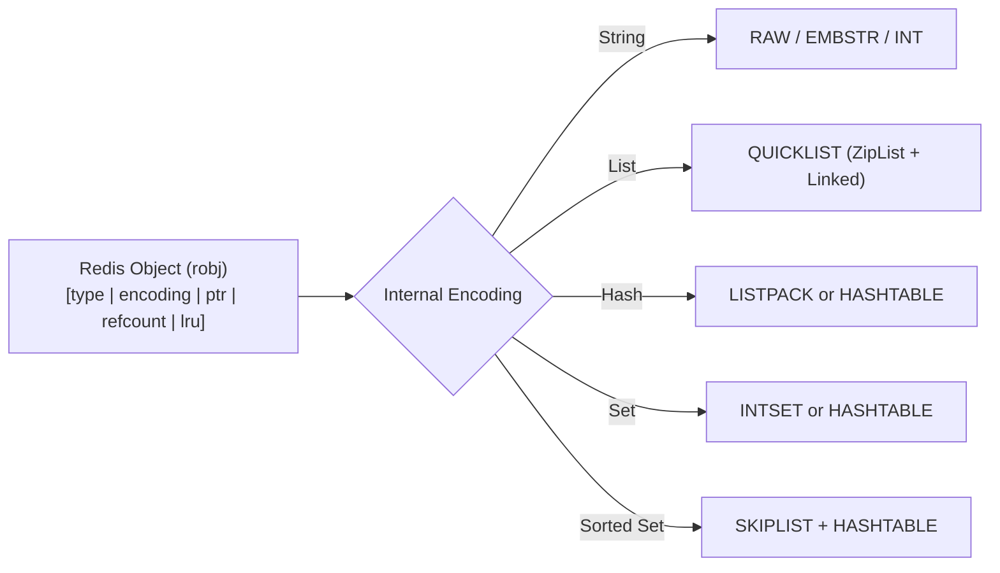
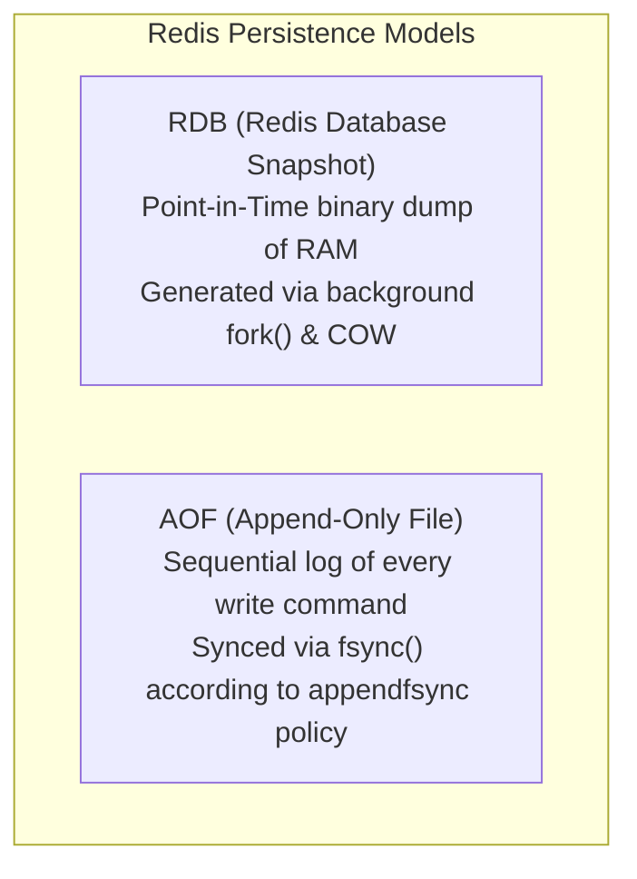

# Key-Value Stores — Redis Architecture, Data Structures, Persistence, Cluster

## Mental Model

Think of **Redis (Remote Dictionary Server)** as a ultra-fast, multi-threaded RAM dictionary server operating at lightspeed ($>100,000$ operations/sec per core). 

In a traditional disk-bound database, data lives on slow NVMe/HDDs and is cached in RAM as a secondary optimization. In Redis, **RAM is the primary home of data**. Commands execute in nanoseconds because there are zero disk page reads during request evaluation. To prevent data loss when power turns off, Redis streams modifications in the background to disk via dual persistence models (**RDB snapshots** and **AOF logs**), while distributing data across 16,384 **Hash Slots** in a Redis Cluster.

---

## 1. Single-Threaded Event Loop Architecture (epoll)

Prior to Redis 6.0, execution was strictly single-threaded. Redis 6.0+ uses multi-threading **exclusively for network I/O parsing**, but command execution on the core dictionary remains **strictly single-threaded**.

```mermaid
flowchart TD
    Client1["Client 1"] & Client2["Client 2"] & Client3["Client 3"] -->|TCP Packets (RESP Protocol)| IOTreads["I/O Threads (Redis 6.0+)\n(Parallel Network Read/Write & Protocol Parsing)"]
    
    IOTreads -->|Queue Parsed Commands| EventLoop["Main Thread Event Loop (aeEventLoop)\n(Non-blocking I/O multiplexing via epoll/kqueue)"]
    
    subgraph CoreEngine["Core In-Memory Execution Engine"]
        EventLoop -->|Sequential Execution| MainDict["Main Hash Table (RAM)\nExecutes 1 command at a time\nAtomicity Guaranteed!"]
    end
```

### Why Single-Threaded Execution Wins
1. **Zero Lock Overhead:** Eliminates mutex contention, spinlocks, context switching, and deadlock risks.
2. **CPU Cache Friendly:** Data remains pinned in CPU L1/L2 caches.
3. **RAM Memory Bottleneck:** Memory bandwidth (not CPU speed) is the bottleneck for in-memory key-value lookups.

---

## 2. Advanced Data Structures & Internal Encoding

Redis is not a simple string key-value store; it is a **data structures server**. Every Redis Object (`robj`) wraps a value with an optimized C internal encoding.



### Data Structure & Encoding Reference

| Data Structure | Operations & Complexity | Internal Encodings | Production Use Case |
|---|---|---|---|
| **String** | `GET`, `SET`, `INCR`, `SETNX` ($O(1)$) | `int`, `embstr`, `raw` | Caching, atomic counters, distributed locks (`SETNX`). |
| **List** | `LPUSH`, `RPOP`, `BLPOP` ($O(1)$) | `quicklist` (ziplist array nodes) | Message queues, job worker queues. |
| **Hash** | `HSET`, `HGET`, `HGETALL` ($O(1)$) | `listpack`, `hashtable` | User profile objects, session state. |
| **Set** | `SADD`, `SINTER`, `ISMEMBER` ($O(1)$) | `intset`, `hashtable` | Unique IP tracking, tag matching, social follower IDs. |
| **Sorted Set (ZSet)** | `ZADD`, `ZRANGEBYSCORE` ($O(\log N)$) | `listpack`, `skiplist` | Leaderboards, rate limiters (sliding window). |
| **HyperLogLog** | `PFADD`, `PFCOUNT` ($O(1)$) | Probabilistic 12KB register | Unique daily visitor counts (99.19% accurate cardinality). |
| **Pub/Sub & Stream** | `XADD`, `XREADGROUP` ($O(1)$) | Radix Tree (`rax`) | Distributed event streaming, log ingestion. |

---

## 3. Dual Persistence Models: RDB vs. AOF

Redis provides two independent persistence mechanisms to save RAM state to disk.



### A. RDB (Redis Database Snapshotting)
- **Mechanism:** Calls `fork()`. The OS creates a child process using **Copy-On-Write (COW)** memory semantics. The child writes the entire RAM contents to a compact binary `.rdb` file while the parent thread continues serving live traffic.
- **Pros:** Ultra-fast recovery; compact file size; minimal impact on main thread.
- **Cons:** **Data Loss Risk:** Loses all writes executed between snapshot intervals (e.g., last 5 minutes).

---

### B. AOF (Append-Only File Logging)
- **Mechanism:** Appends every state-modifying command to an ASCII log file (`appendonly.aof`).

#### `appendfsync` Policies:

| Policy | `fsync()` Timing | Latency | Data Loss Risk |
|---|---|---|---|
| `appendfsync always` | `fsync` after **every** command. | Slow | Zero data loss. |
| `appendfsync everysec` (Default) | `fsync` once per second in background thread. | **Fast** | Maximum 1 second of data lost. |
| `appendfsync no` | Flushed at OS discretion (30s). | Fastest | Unpredictable (OS crash dependent). |

- **AOF Rewrite (Compaction):** When `appendonly.aof` grows too large, Redis forks a background process to rebuild the AOF file from current RAM state, collapsing 100 `INCR counter` commands into a single `SET counter 100` command!

---

## 4. High Availability & Sharding: Redis Cluster

A **Redis Cluster** partitions data across multiple nodes without requiring a centralized proxy router.

```mermaid
flowchart TD
    subgraph HashSlotDistribution["16,384 Hash Slots Partitioning"]
        NodeA["Master Node A\nSlots [0 - 5460]"]
        NodeB["Master Node B\nSlots [5461 - 10922]"]
        NodeC["Master Node C\nSlots [10923 - 16383]"]
    end

    Client["Redis Cluster Client"] -->|1. Key: 'user:42' -> HashSlot(user:42) = 7120| NodeA
    NodeA -->|2. MOVED 7120 NodeB_IP:6379| Client
    Client -->|3. Re-send Query| NodeB
```

### The Hash Slot Algorithm

Redis Cluster uses **16,384 Hash Slots**:

$$\text{Slot} = \text{CRC16}(\text{key}) \pmod{16384}$$

- **Hash Tags:** To force related keys onto the exact same node for multi-key operations (`MGET`, Lua scripts), use hash tags:
  - `SET {user:42}:profile "data"` $\to$ Hashes **only** `user:42` inside `{}`.
  - `SET {user:42}:orders "data"` $\to$ Guaranteed to land on the **exact same Hash Slot**!

---

## 5. Production Operations & Inspection Commands

### Memory Analysis & Slowlog Commands

```bash
# View memory consumption breakdown via redis-cli
redis-cli INFO memory

# Find memory-heavy keys using scanning sampling (Never use KEYS * in production!)
redis-cli --bigkeys

# Inspect slow commands executing > 10ms
redis-cli SLOWLOG GET 10
```

### Redis Production Configuration (`redis.conf`)

```text
# Max RAM limit (e.g., 8GB)
maxmemory 8gb

# Eviction policy when maxmemory is reached
maxmemory-policy volatile-lru

# Persistence setup: Enable AOF + RDB Hybrid Persistence
save 900 1
appendonly yes
appendfsync everysec
aof-use-rdb-preamble yes
```

### Memory Eviction Policies (`maxmemory-policy`)

| Policy | Behavior | Best Fit |
|---|---|---|
| `noeviction` | Returns out-of-memory errors on writes when full. | Dedicated DB storage. |
| `allkeys-lru` | Evicts Least Recently Used keys across ALL keys. | Standard Web Cache. |
| `volatile-lru` | Evicts LRU keys among keys with an **TTL expiration set**. | Shared Cache/DB. |
| `allkeys-lfu` | Evicts Least Frequently Used keys. | Frequency-skewed workloads. |

---

## 6. Failure Modes and Trade-offs

1. **Production Outage from `KEYS *` Execution** — Running `KEYS *` on a production Redis instance with 50 million keys blocks the single-threaded event loop for 15 seconds. All incoming API commands queue up, timing out the entire application tier. *Mitigation*: Disable `KEYS` in production config (`rename-command KEYS ""`); use `SCAN` instead.
2. **COW Memory Spike during RDB Snapshot / AOF Rewrite** — When `fork()` triggers RDB snapshotting under heavy write workloads, Copy-On-Write duplicates modified memory pages. RAM consumption can jump from 50% to **100%**, triggering the Linux OOM Killer. *Mitigation*: Set `vm.overcommit_memory = 1` in Linux sysctl; ensure 30%–40% head-room RAM.
3. **Split-Brain Replica Data Loss in Redis Cluster** — Redis cluster replication is **asynchronous**. If Master A is partitioned, Sentinel/Cluster promotes Replica A1 to Master. When Master A returns, it is demoted to Replica, wiping out un-replicated writes. *Mitigation*: Configure `min-replicas-to-write 1` and `min-replicas-max-lag 10`.

---

## 7. Active-Recall Prompts

1. **Why does Redis execute core commands on a single thread, and why does this architecture outperform multi-threaded engines for in-memory workloads?**
2. **Compare RDB snapshots vs. AOF persistence in terms of recovery speed, disk space, and data loss vulnerability.**
3. **How does Redis Cluster map keys to nodes using 16,384 Hash Slots, and what are Hash Tags `{...}` used for?**
4. **What happens when Linux Copy-On-Write (COW) memory usage spikes during an RDB snapshot on a node operating at 80% RAM capacity?**

---

## Related Notes

- [[Document Databases - MongoDB Architecture, WiredTiger, Aggregation Pipeline]]
- [[Wide-Column Stores - Apache Cassandra, SSTable, Consistent Hashing, Tunable Consistency]]
- [[Database Sharding - Horizontal Partitioning, Consistent Hashing, Routing]]
- [[Write-Ahead Logging - WAL, Redo Log, Undo Log, fsync Guarantees]]

> **Interview Style Question:** *"Design a distributed sliding-window rate limiter processing 200,000 requests/sec using Redis. Compare using a Redis Sorted Set (ZSet) vs. a Redis Fixed Window String with `INCR` and `EXPIRE`. Evaluate memory utilization, race conditions, atomic operations, and how Redis Cluster hash slots affect your design."*

---
