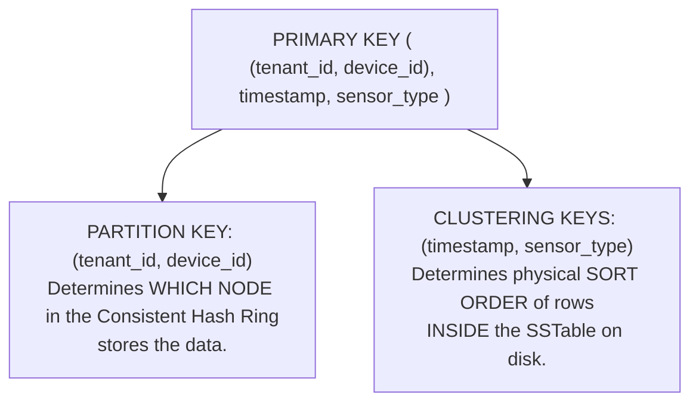
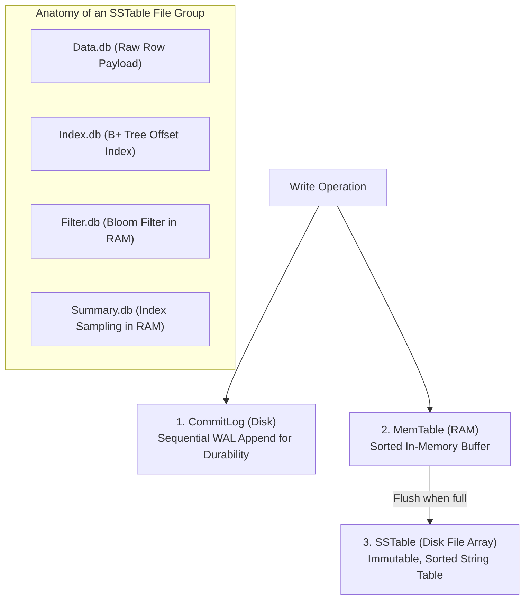

# Wide-Column Stores — Apache Cassandra, SSTable, Consistent Hashing, Tunable Consistency

## Mental Model

Think of **Apache Cassandra (Wide-Column Store)** as a peer-to-peer ring of ultra-scalable digital filing cabinets designed for massive, continuous write streams (e.g., millions of IoT sensor events or clickstream logs). 

Unlike relational databases that rely on a single primary master node, Cassandra is **completely masterless (Leaderless Peer-to-Peer)**. Every node in the cluster is identical and communicates via a **Gossip Protocol** over a **Consistent Hashing Ring**. Writes are processed using an **in-memory MemTable and on-disk SSTables (LSM Tree Architecture)**, ensuring ultra-fast, append-only disk performance.

---

## 1. Cassandra Data Model & Primary Key Anatomy

Cassandra is NOT a key-value store; it is a **Wide-Column Store** where data is organized into multidimensional sorted maps.



### Primary Key Component Breakdown

```sql
CREATE TABLE device_telemetry (
    tenant_id UUID,
    device_id UUID,
    timestamp TIMESTAMP,
    sensor_type VARCHAR,
    metric_value DOUBLE,
    PRIMARY KEY ((tenant_id, device_id), timestamp, sensor_type)
) WITH CLUSTERING ORDER BY (timestamp DESC, sensor_type ASC);
```

1. **Partition Key `(tenant_id, device_id)`:** Hashed using Murmur3Partitioner to assign the record to a specific token position on the Consistent Hashing Ring. All data sharing the same partition key lives on the exact same physical node set.
2. **Clustering Keys `(timestamp, sensor_type)`:** Controls physical storage sort order inside the partition. Range queries (`WHERE timestamp >= '2026-01-01'`) are blazingly fast because matching rows sit contiguously on disk!

---

## 2. Peer-to-Peer Cluster Architecture & Gossip Protocol

Cassandra has no master nodes, routing proxies, or single points of failure.

```mermaid
flowchart TD
    subgraph HashRing["Cassandra Masterless Ring (Gossip Protocol)"]
        Node1["Node 1 (Token: 0)"]
        Node2["Node 2 (Token: 3074457345618258602)"]
        Node3["Node 3 (Token: 6148914691236517204)"]
        
        Node1 <-->|Gossip Protocol (UDP 7000)| Node2
        Node2 <-->|Gossip Protocol (UDP 7000)| Node3
        Node3 <-->|Gossip Protocol (UDP 7000)| Node1
    end
    
    Client["Client Driver"] -->|Sends query to ANY node (Coordinator)| Node2
```

### Key Peer-to-Peer Subsystems

- **Coordinator Node:** Any node that receives a query from a client driver acts as the **Coordinator** for that request. It computes the partition hash, forwards operations to appropriate replica nodes, and gathers results.
- **Gossip Protocol:** Nodes exchange state metadata (node health, schema updates, token ranges) every second over UDP using Scuttlebutt gossip algorithm.
- **Phi Accrual Failure Detector:** Instead of a binary up/down heartbeat, Cassandra calculates a continuous probability value ($\Phi$) of node failure based on historic network latency, preventing false failover triggers during transient network spikes.

---

## 3. The Cassandra Storage Engine (LSM-Tree)

Cassandra's storage engine per node is a classic **LSM Tree** implementation.



### Write Path ($O(1)$ Sequential Write)
1. Write operation appends to disk `CommitLog`.
2. Data is written to in-memory `MemTable`.
3. Client receives acknowledgment. **Zero random disk I/O performed!**

### Read Path & Bloom Filter Optimizations
Because SSTables are immutable, reading a partition requires checking multiple files:
1. Check `MemTable`.
2. Check `Bloom Filter` in RAM for each SSTable. If Bloom filter returns **negative**, skip reading that SSTable entirely!
3. If positive, inspect `Index Summary` in RAM $\to$ `Index.db` on disk $\to$ fetch exact block from `Data.db`.

---

## 4. Tunable Consistency & Quorum Mechanics

Cassandra allows developers to specify consistency levels **per individual read or write query**.

### Write Consistency Levels
- `ONE` / `TWO` / `THREE`: Acknowledged by 1, 2, or 3 replicas.
- `QUORUM`: Acknowledged by a majority of replicas ($\lfloor N/2 \rfloor + 1$).
- `LOCAL_QUORUM`: Acknowledged by a majority of replicas in the **local datacenter** (prevents cross-DC WAN latency).
- `ALL`: Acknowledged by all $N$ replicas.

### Strong Consistency Equation

To guarantee that a read query returns the most up-to-date write, configure:

$$\text{Write Consistency} + \text{Read Consistency} > \text{Replication Factor } (N)$$

```text
Example Profile (N = 3):
Write Consistency = LOCAL_QUORUM (2 Replicas)
Read Consistency  = LOCAL_QUORUM (2 Replicas)
Total = 2 + 2 = 4 > 3  ==> STRONG CONSISTENCY GUARANTEED!
```

---

## 5. Production Operations & Inspection Commands

### CQL Schema Design Best Practices

```sql
-- Production Telemetry Schema optimized for time-series range queries
CREATE KEYSPACE iot_telemetry 
WITH replication = {
    'class': 'NetworkTopologyStrategy', 
    'us-east-1': 3, 
    'eu-west-1': 3
};

USE iot_telemetry;

CREATE TABLE sensor_readings (
    tenant_id uuid,
    bucket_date date, -- Bucket by YYYY-MM-DD to cap partition size < 100MB!
    sensor_id uuid,
    event_timestamp timestamp,
    temperature double,
    humidity double,
    PRIMARY KEY ((tenant_id, bucket_date), sensor_id, event_timestamp)
) WITH CLUSTERING ORDER BY (sensor_id ASC, event_timestamp DESC)
  AND compaction = {
      'class': 'TimeWindowCompactionStrategy',
      'compaction_window_unit': 'DAYS',
      'compaction_window_size': '1'
  };
```

### Inspecting Cluster Health via `nodetool`

```bash
# Check Cassandra node ring status and token load
nodetool status

# Inspect table compaction stats and SSTable counts
nodetool cfstats iot_telemetry.sensor_readings

# Trigger manual repair across replicas
nodetool repair --full
```

---

## 6. Failure Modes and Trade-offs

1. **Gigantic Partition Overheating ($>100\text{MB}$ Limit Violation)** — Designing a schema with a low-cardinality Partition Key (e.g., `PRIMARY KEY (country, timestamp)`). Over months, a single partition accumulates millions of rows, exceeding the recommended 100MB partition size limit. Results in heap memory exhaustion and garbage collection pauses. *Mitigation*: Use **Bucketing** (e.g., `(country, year_month)`).
2. **Tombstone Garbage Collection Overload** — Issuing massive `DELETE` statements or setting low TTLs creates millions of **Tombstone markers** inside SSTables. Subsequent read queries must scan through 100,000 tombstones to find a single valid row, causing `TombstoneOverwhelmingException`. *Mitigation*: Avoid high-frequency deletes; tune `tombstone_failure_threshold`.
3. **Write Path Stalls due to CommitLog Disk Saturation** — Placing `CommitLog` and `SSTables` on the same spinning HDD disk. Compaction I/O starves `CommitLog` sequential appends. *Mitigation*: Mount `CommitLog` on a dedicated NVMe SSD drive.

---

## 7. Active-Recall Prompts

1. **How do Partition Keys and Clustering Keys differ in Cassandra's primary key definition, and how do they determine physical disk storage layout?**
2. **What is the Phi Accrual Failure Detector, and why is it superior to fixed-heartbeat timeouts in peer-to-peer distributed networks?**
3. **What mathematical formula guarantees Strong Consistency in Cassandra, and why is `LOCAL_QUORUM` preferred over `QUORUM` in multi-datacenter clusters?**
4. **Why do massive `DELETE` operations in Cassandra degrade subsequent `SELECT` query performance instead of speeding it up?**

---

## Related Notes

- [[LSM Tree - Log-Structured Merge Tree, Compaction, RocksDB]]
- [[Distributed Database Fundamentals - CAP Theorem, PACELC, Consistency Models]]
- [[Database Replication - Single-Leader, Multi-Leader, Leaderless, Raft Consensus]]
- [[Database Sharding - Horizontal Partitioning, Consistent Hashing, Routing]]

> **Interview Style Question:** *"Design a global time-series ingestion engine for 10 million smart electric meters sending readings every 10 seconds. Write the Cassandra CQL schema, justify your Partition Key bucketing strategy to keep partitions under 50MB, select your compaction strategy, and calculate your replication/quorum parameters for zero data loss across 2 multi-region datacenters."*

---
