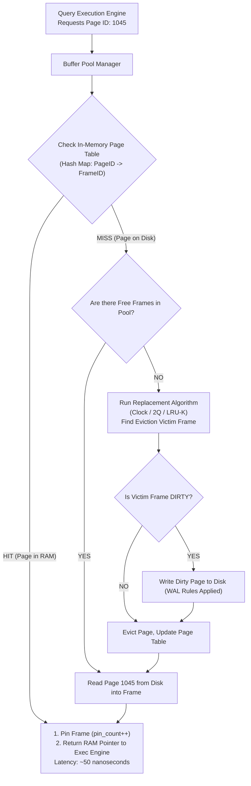
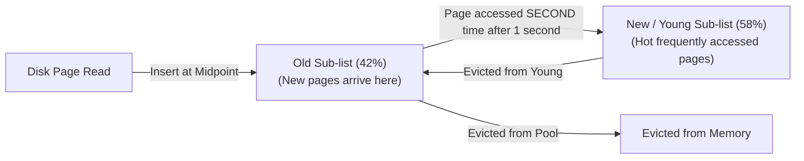

# Buffer Pool Manager — Page Cache, Replacement Policies, Dirty Pages

## Mental Model

Think of a **Buffer Pool Manager** as an elite hotel concierge managing a limited set of luxury suites (RAM Frame Slots) for guests (8KB/16KB Database Disk Pages). 

Because disk storage is thousands of times slower than system memory, the database cannot read disk pages on every SQL query. The Buffer Pool Manager maintains an in-memory array of fixed-size frames in RAM. When a query requests Page 42, the concierge checks if Page 42 is already staying in one of the RAM suites (**Buffer Hit**). If not (**Buffer Miss**), it fetches Page 42 from the disk warehouse, places it in an empty suite, and returns a pointer. 

When all RAM suites are occupied, the concierge uses a smart eviction policy (**Clock Algorithm or 2Q**) to select which inactive guest to evict back to disk.

---

## 1. Buffer Pool Architecture & Components

The Buffer Pool Manager bridges the gap between execution engine operators and disk storage.



### Key Buffer Pool Data Structures

1. **Buffer Frames Array:** Fixed-size memory array in RAM holding raw 8KB (PostgreSQL) or 16KB (MySQL) binary page bytes.
2. **Page Table (Hash Map):** In-memory hash index mapping logical `Page_ID (Table_ID, Page_Number)` to physical `Frame_ID` in RAM.
3. **Frame Header Metadata:**
   - **`pin_count` (Usage Counter):** Tracks how many active threads are currently reading/writing this frame. A frame **CANNOT** be evicted if `pin_count > 0`.
   - **`is_dirty` Flag:** Boolean indicating if the page was modified in RAM since being loaded from disk.

---

## 2. Page Replacement Policies

When the buffer pool is full and a buffer miss occurs, the manager must choose a frame to evict.

### A. LRU (Least Recently Used) & The Sequential Scan Pollution Problem
- **Algorithm:** Maintains a doubly linked list of frames. On every access, move frame to front. Evict from back.
- **The Sequential Scan Flaw:** A single `SELECT * FROM massive_table` scans millions of unheated pages sequentially, kicking **100% of hot cached index pages out of RAM**!

---

### B. The Clock Replacement Algorithm (PostgreSQL)

To avoid LRU linked-list lock contention, PostgreSQL uses the **Clock Algorithm (Second-Chance Algorithm)**.

```mermaid
flowchart TD
    subgraph ClockRing["Clock Hand Circular Array of Frames"]
        F0["Frame 0 (usage_count = 3)"]
        F1["Frame 1 (usage_count = 0)"]
        F2["Frame 2 (usage_count = 1)"]
        F3["Frame 3 (usage_count = 0, pin_count = 1)"]
    end
    
    Hand["Clock Hand Pointer"] --> F1
    
    F1 -->|1. usage_count == 0 & pin_count == 0| Evict["EVICT FRAME 1!"]
    F0 -.->|If checked: Decrement usage_count (3 -> 2)| AdvanceHand["Advance Hand to Next Frame"]
```

#### Clock Algorithm Steps:
1. Treat frames as a circular array. Maintain a `Clock Hand` pointer.
2. When eviction is required, inspect frame at `Clock Hand`:
   - If `pin_count > 0`: Skip (page in use).
   - If `usage_count > 0`: Decrement `usage_count` by 1 and advance hand to next frame ("Second Chance").
   - If `usage_count == 0` AND `pin_count == 0`: **EVICT THIS FRAME!**

---

### C. 2Q (Two-Queue) & LRU-K Replacement (MySQL InnoDB)

MySQL InnoDB modifies LRU by dividing the buffer pool list into two sub-lists: **New (Young) Sub-list (58%)** and **Old Sub-list (42%)**.



> **Why Midpoint Insertion Defeats Sequential Scans:** Pages read during a sequential scan enter the **Old Sub-list**. Since they are read only once, they age out of the Old sub-list quickly without ever contaminating the hot Young sub-list!

---

## 3. Dirty Page Flushing & Checkpoint Coordination

When a query updates a row, the page is modified in RAM and flagged `is_dirty = true`.

### The Background Writer & Checkpointer

Database engines do not write dirty pages to disk immediately on every SQL statement. Instead:
1. **Background Writer (bgwriter):** Periodically scans the buffer pool for dirty pages with low `usage_count` and flushes them to disk to ensure a continuous supply of clean frames for incoming queries.
2. **Checkpointer:** Periodically executes a system checkpoint, flushing all dirty pages modified before a target `recLSN` to guarantee fast WAL recovery time.

```mermaid
flowchart LR
    WAL["WAL Log Buffer"] -->|1. Must flush WAL FIRST (fsync)| WALDisk["WAL Log File on Disk"]
    WALDisk -->|2. Safe to flush dirty page| DataDisk["Data Heap File on Disk"]
```

---

## 4. Production Operations & Inspection Commands

### Inspecting PostgreSQL Buffer Cache Hit Ratio

```sql
-- Calculate overall Buffer Cache Hit Ratio (Should be > 99% in healthy OLTP systems)
SELECT 
    sum(heap_blks_read) AS heap_read_from_disk,
    sum(heap_blks_hit)  AS heap_hit_in_ram,
    ROUND(sum(heap_blks_hit) / NULLIF(sum(heap_blks_hit) + sum(heap_blks_read), 0) * 100, 2) AS buffer_hit_ratio
FROM pg_statio_user_tables;
```

### Inspecting Buffer Pool Usage via `pg_buffercache`

```sql
CREATE EXTENSION IF NOT EXISTS pg_buffercache;

-- View contents of PostgreSQL buffer pool by table name
SELECT 
    c.relname,
    count(*) AS buffers_count,
    ROUND(count(*) * 8 / 1024.0, 2) AS size_in_mb,
    ROUND(AVG(usagecount), 2) AS avg_usage_count,
    count(*) FILTER (WHERE isdirty) AS dirty_buffers_count
FROM pg_buffercache b
JOIN pg_class c ON b.relfilenode = pg_relation_filenode(c.oid)
JOIN pg_database d ON (b.reldatabase = d.oid AND d.datname = current_database())
GROUP BY c.relname
ORDER BY buffers_count DESC
LIMIT 10;
```

### Tuning InnoDB Buffer Pool in MySQL (`my.cnf`)

```text
[mysqld]
# Set Buffer Pool Size to 70-80% of total System RAM on dedicated DB server
innodb_buffer_pool_size = 32G

# Split Buffer Pool into 8 instances to reduce mutex lock contention
innodb_buffer_pool_instances = 8

# Midpoint insertion time window (ms) to prevent scan pollution
innodb_old_blocks_time = 1000
```

---

## 5. Failure Modes and Trade-offs

1. **Buffer Pool Cache Pollution (Sequential Scan Destabilization)** — Running an un-indexed full table report (`SELECT * FROM logs`) scans 100 GB of cold data, evicting warm application cache frames. *Mitigation*: Enable 2Q/Midpoint insertion (`innodb_old_blocks_time = 1000` in MySQL); PostgreSQL automatically uses a tiny 256KB ring-buffer for large sequential scans to prevent pool pollution.
2. **Buffer Pool Lock Contention (Single Instance Bottleneck)** — Hundreds of worker threads competing for exclusive locks on a single Buffer Pool Page Table hash map during high-throughput queries. *Mitigation*: Partition the buffer pool into multiple independent instances (`innodb_buffer_pool_instances = 8` or `16`).
3. **Dirty Page Checkpoint I/O Spikes (Checkpoint I/O Storm)** — Allowing dirty page percentage to reach 80% RAM capacity forces the checkpointer to issue massive concurrent disk writes, saturating NVMe disk I/O and spiking query latency. *Mitigation*: Tune background writer aggressive flushing (`innodb_max_dirty_pages_lwm = 10`).

---

## 6. Active-Recall Prompts

1. **What is a Buffer Hit vs. a Buffer Miss, and why must the Buffer Pool Manager check `pin_count` before selecting an eviction victim frame?**
2. **Explain the Sequential Scan Cache Pollution problem in basic LRU, and how the Clock Algorithm and 2Q/Midpoint Insertion algorithms prevent it.**
3. **What is a Dirty Page, and what strict Write-Ahead Logging (WAL) rule must be verified before a dirty page can be written to disk?**
4. **Why is dividing a large Buffer Pool into multiple instances (e.g., `innodb_buffer_pool_instances = 8`) beneficial for multi-core CPUs?**

---

## Related Notes

- [[Disk Storage and Page Format - Heap Files, Page Layout, Tuple Format]]
- [[PostgreSQL Internals - MVCC Implementation, Tuple Header, VACUUM, Toast]]
- [[MySQL InnoDB Architecture - Clustered Index, Buffer Pool, Doublewrite Buffer]]
- [[Write-Ahead Logging - WAL, Redo Log, Undo Log, fsync Guarantees]]

> **Interview Style Question:** *"During a black-friday load test, a database server's CPU drops to 15%, but disk read I/O saturates at 100% capacity and query latency increases 20x. Inspection shows a Buffer Cache Hit Ratio of 72%. Analyze the root cause of this memory-to-disk thrashing, evaluate why sequential scans degrade buffer performance, and design a memory tuning strategy to restore >99% hit ratio."*

---
