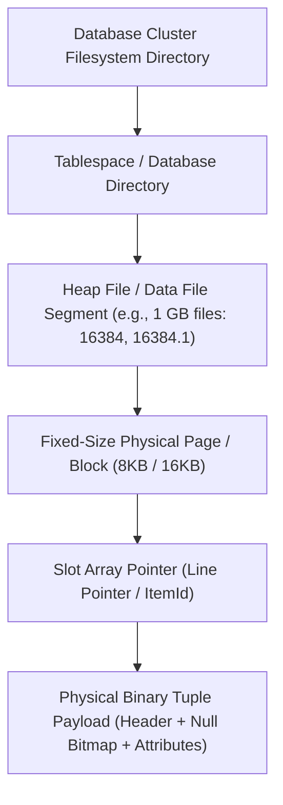
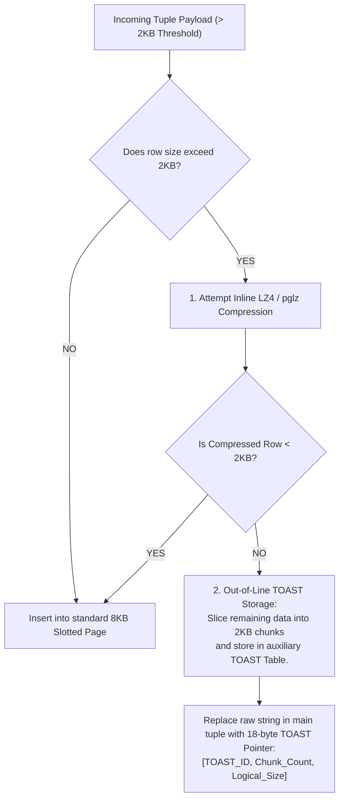

# Disk Storage and Page Format — Heap Files, Page Layout, Tuple Format

## Mental Model

Think of a **Database Storage Engine** as a precision-engineered physical warehouse. 

A database table is not a single continuous text file; it is a collection of **Heap Files** split into fixed-size physical blocks called **Pages** (8KB in PostgreSQL, 16KB in MySQL InnoDB). 

Because rows inside a table have variable lengths (short integers vs. long text descriptions), storing tuples directly end-to-end would cause nightmare alignment and fragment problems when rows are updated or deleted. Database engines use a **Slotted-Page Architecture**: an array of fixed-size pointers at the top of the page grows downward, while raw tuple data payloads at the bottom of the page grow upward. The gap in the middle represents available free space.

---

## 1. Physical Storage Hierarchy



### Storage Organization Types

1. **Heap File Organization:** Records are placed in disk pages in arbitrary order wherever space is available. Fast inserts ($O(1)$), but searching requires an index or sequential scan.
2. **Sequential / Clustered File Organization:** Records are physically stored sorted by a search key (e.g., MySQL InnoDB Primary Key Clustered B+ Tree).
3. **Hashing File Organization:** Record page location is computed via a hash function on a search key.

---

## 2. Slotted-Page Architecture

The **Slotted-Page Architecture** is the industry-standard page binary layout used by PostgreSQL, SQLite, and Oracle.

```text
+-----------------------------------------------------------------------+
| PAGE HEADER (LSN, Checksum, Flags, pd_lower, pd_upper, pd_special)    |
+-----------------------------------------------------------------------+
| Line Pointer Array (Slot Array: ItemId 1, ItemId 2, ItemId 3...)      |
| [Offset: 8120, Len: 64] | [Offset: 8056, Len: 64] | ...           |
| (Grows DOWNWARD --->)                                                 |
+-----------------------------------------------------------------------+
|                                                                       |
|                       <--- FREE SPACE GAP --->                        |
|                                                                       |
+-----------------------------------------------------------------------+
| (<--- Grows UPWARD)                                                   |
| Tuple Payload 3 [Bytes 7992 - 8055]                                   |
| Tuple Payload 2 [Bytes 8056 - 8119]                                   |
| Tuple Payload 1 [Bytes 8120 - 8183]                                   |
+-----------------------------------------------------------------------+
| SPECIAL SPACE (Index-specific metadata / B-Link pointers)             |
+-----------------------------------------------------------------------+
```

### Key Components of Slotted-Page Layout

1. **Page Header:** Metadata describing page state (`PageLSN`, checksum, free space offsets `pd_lower` and `pd_upper`).
2. **Line Pointer Array (Slot Array):** Array of 4-byte entries (`ItemIdData`). Each slot contains:
   - **Byte Offset:** Exact physical byte position of the tuple payload within the 8KB page.
   - **Flags:** Status (`USED`, `REDIRECT`, `DEAD`).
   - **Length:** Physical length of the tuple in bytes.
3. **Free Space Gap (`pd_lower` to `pd_upper`):**
   - `pd_lower`: Points to the byte offset after the last Line Pointer.
   - `pd_upper`: Points to the byte offset of the start of the lowest tuple payload.
   - **Available Free Space = $pd\_upper - pd\_lower$.**

### Tuple ID (`TID` / `ctid` / `ROWID`)

A tuple's physical address is represented as a 6-byte pair:

$$\text{Tuple ID (TID)} = (\text{Page\_Number}, \; \text{Slot\_Index})$$

> **Indirection Advantage:** If a tuple inside a page is updated or compacted, its byte offset changes, but its `Slot_Index` remains identical! Secondary indexes point to `(Page_Number, Slot_Index)`, so intra-page tuple movement **never breaks secondary index pointers**!

---

## 3. Physical Binary Tuple (Row) Format

A binary tuple payload consists of three sections: **Tuple Header**, **NULL Bitmap**, and **Attributes Payload**.

```text
Binary Tuple Layout:
+------------------------------------------------------------------------+
| TUPLE HEADER          | NULL BITMAP        | ATTRIBUTE PAYLOAD DATA    |
| (xmin, xmax, ctid...) | (1 bit per col)    | (col1 | col2 | col3...)   |
+------------------------------------------------------------------------+
```

### Detailed Field Breakdown

| Section | Size | Description & Alignment Rules |
|---|---|---|
| **Tuple Header** | 23 bytes (Postgres) | Stores MVCC transactional metadata (`t_xmin`, `t_xmax`, `t_cid`, `t_infomask`). |
| **NULL Bitmap** | $\lceil N_{cols} / 8 \rceil$ bytes | Bit array where bit `1` = column has data, bit `0` = column is `NULL`. **If a column is NULL, 0 bytes are allocated in the payload!** |
| **Padding Alignment** | Variable (1–7 bytes) | Align fields to CPU architecture boundaries (e.g., 4-byte `INT` aligned to 4-byte boundary, 8-byte `DOUBLE` aligned to 8-byte boundary). |
| **Attribute Payload** | Variable | Fixed-length columns followed by variable-length columns (`VARCHAR`, `BYTEA`). |

---

## 4. Handling Oversized Attributes: TOAST / Overflow Pages

When a single row contains massive data fields (e.g., a 10MB JSON string or PDF binary), it exceeds the physical 8KB page size.



### PostgreSQL TOAST Strategies

| Strategy | Compression Allowed? | Out-of-Line Storage Allowed? | Typical Column Types |
|---|---|---|---|
| `PLAIN` | ❌ No | ❌ No | Fixed-length types (`INT`, `DOUBLE`). |
| `EXTENDED` (Default) | ✅ **Yes** | ✅ **Yes** | Text, JSONB, Bytea (`VARCHAR`). |
| `EXTERNAL` | ❌ No | ✅ **Yes** | Uncompressible large strings. |
| `MAIN` | ✅ **Yes** | ❌ No (Unless page full) | Short text columns. |

---

## 5. Production Operations & Inspection Commands

### Inspecting Physical Page Layout in PostgreSQL (`pageinspect`)

```sql
-- Enable low-level page inspecting extension
CREATE EXTENSION IF NOT EXISTS pageinspect;

-- View 24-byte Page Header metadata of Page 0 of 'orders' table
SELECT * FROM page_header(get_raw_page('orders', 0));

-- Output:
-- lsn        | checksum | flags | lower | upper | special | pagesize 
-- -----------+----------+-------+-------+-------+---------+----------
-- 0/1A52B88  |   -24150 |     0 |   120 |  7152 |    8192 |     8192

-- Inspect individual Line Pointers (Slot Array) on Page 0
SELECT * FROM heap_page_items(get_raw_page('orders', 0)) LIMIT 5;
```

### Inspecting TOAST Storage Overhead

```sql
-- View physical disk space used by main table vs. TOAST auxiliary table
SELECT 
    relname AS table_name,
    pg_size_pretty(pg_relation_size(c.oid)) AS main_table_size,
    pg_size_pretty(pg_total_relation_size(reltoastrelid)) AS toast_size
FROM pg_class c
WHERE relname = 'documents';
```

---

## 6. Failure Modes and Trade-offs

1. **CPU Alignment Padding Memory Waste** — Poorly ordered column definitions in `CREATE TABLE` cause CPU padding alignment bytes to inflate tuple sizes. For example: `(char(1), int8, char(1), int8)` consumes 32 bytes due to 7-byte padding gaps, whereas `(int8, int8, char(1), char(1))` consumes only 18 bytes! *Mitigation*: Order table columns by data type size descending (`INT8` $\to$ `INT4` $\to$ `INT2` $\to$ `BOOL`).
2. **TOAST Access Latency Overhead** — Accessing a TOASTed `TEXT` column (`SELECT description FROM products`) forces auxiliary table lookups across multiple 2KB chunk rows, slowing down queries by 10x compared to inline columns. *Mitigation*: Select TOASTed columns explicitly only when needed; avoid `SELECT *`.
3. **Inter-Page Fragmentation from In-Place Updates** — Updating variable-length columns (`VARCHAR(50)` $\to$ `VARCHAR(500)`) expands row size, forcing the row to move to a new page and breaking physical proximity. *Mitigation*: Fill factor tuning (`fillfactor = 80`).

---

## 7. Active-Recall Prompts

1. **What is the Slotted-Page Architecture, and how does it manage free space between the Line Pointer array and Tuple payloads?**
2. **What is a Tuple ID (`TID` / `ctid`), and why does the indirection of slot arrays allow tuples to be moved inside a page without breaking secondary index pointers?**
3. **How does the NULL Bitmap optimize storage for `NULL` column values inside a binary tuple?**
4. **Explain PostgreSQL TOAST storage. What threshold triggers TOASTing, and how are oversized columns stored?**

---

## Related Notes

- [[Buffer Pool Manager - Page Cache, Replacement Policies, Dirty Pages]]
- [[PostgreSQL Internals - MVCC Implementation, Tuple Header, VACUUM, Toast]]
- [[MySQL InnoDB Architecture - Clustered Index, Buffer Pool, Doublewrite Buffer]]
- [[B-Tree and B+ Tree Indexes - Structure, Search, Insert, Split]]

> **Interview Style Question:** *"Analyze the physical binary page layout of a database page. Explain how `pd_lower` and `pd_upper` offsets measure available page capacity, calculate how column ordering impacts byte alignment padding, and detail the step-by-step process the storage engine takes when a `VARCHAR(2000)` column update exceeds the remaining free space gap."*

---
