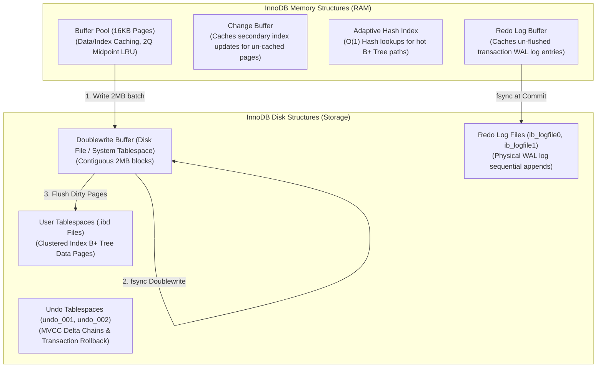
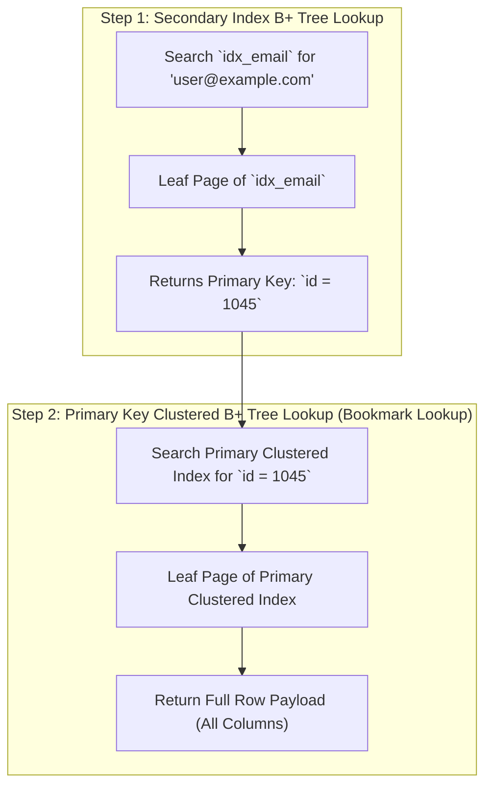
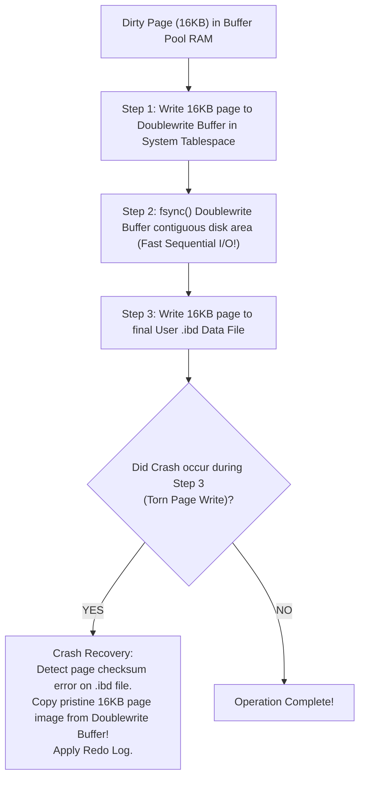

# MySQL InnoDB Architecture — Clustered Index, Buffer Pool, Doublewrite Buffer

## Mental Model

Think of **MySQL InnoDB** as a meticulously organized, bulletproof vault system designed for high-concurrency transactional safety. 

In InnoDB, data is not stored in loose heap files; data **IS** the Primary Key B+ Tree (**Clustered Index Architecture**). Every table is a single sorted index structure on disk. 

To prevent physical hardware corruption from partial page writes during power outages, InnoDB uses a dedicated safety net called the **Doublewrite Buffer**: dirty 16KB memory pages are written sequentially to a physical doublewrite storage area on disk *before* being written to their final table locations. If power fails mid-page write, InnoDB simply restores the uncorrupted original page from the Doublewrite Buffer during startup.

---

## 1. InnoDB Master Architecture

InnoDB manages memory structures, disk files, background threads, and transaction logs.



---

## 2. Clustered Index vs. Secondary Indexes

In InnoDB, every table **MUST** have a Clustered Index.

### A. Clustered Index Structure
- The Leaf pages of the Clustered Index contain the **complete binary row payload** (all columns).
- If an explicit `PRIMARY KEY` is defined, InnoDB uses it. If not, it uses the first `UNIQUE` non-null index. If neither exists, InnoDB generates an implicit 6-byte `DB_ROW_ID`.

### B. Secondary Index Structure & Double Search
- Leaf pages of Secondary Indexes do **NOT** contain physical disk pointers or row data; they contain the **Primary Key value**.



> **Performance Implications:** Secondary index lookups require **two B+ Tree traversals** ($O(\log N) + O(\log N)$). However, if the secondary index contains all requested columns (**Covering Index**), Step 2 is skipped completely!

---

## 3. The Doublewrite Buffer (Torn Page Protection)

Disks write data in 4KB or 512-byte physical sectors. An InnoDB page is **16KB**.

### The Torn Page Corruption Scenario
If a database server crashes while writing a 16KB dirty page to disk (e.g., after writing 8KB), the page on disk becomes **physically corrupted** (half old data, half new data). Redo log records cannot be applied to a corrupt page!



---

## 4. Change Buffer (Async Secondary Index Write Optimization)

When a query modifies a row, secondary index pages affected by the update might not be loaded in the Buffer Pool.

Instead of performing expensive random disk reads to load the secondary index page into RAM, InnoDB uses the **Change Buffer**:
1. Checks if the secondary index page is in the Buffer Pool.
2. If **not in RAM**, InnoDB records the index modification into the **Change Buffer** in memory.
3. When the secondary index page is later read into RAM by another query, the Change Buffer automatically **merges** the cached modifications into the page (**Buffer Merge**).

---

## 5. Production Operations & Inspection Commands

### Inspecting InnoDB Buffer Pool & Doublewrite Status

```sql
-- View detailed InnoDB status breakdown
SHOW ENGINE INNODB STATUS\G

-- Key Sections to Monitor:
-- 1. BUFFER POOL AND MEMORY:
-- Buffer pool size   2097152 (32GB)
-- Free buffers       1024
-- Database pages     2090128
-- Modified db pages  45120 (Dirty Pages)

-- 2. FILE I/O:
-- Pending normal aio reads: 0, aio writes: 0
-- 124500 doublewrite writes, 2451000 doublewrite pages written
```

### Measuring Doublewrite Performance via Information Schema

```sql
-- Check Doublewrite Buffer metrics
SHOW GLOBAL STATUS LIKE 'Innodb_dblwr%';

-- Innodb_dblwr_pages_written: Number of pages written to doublewrite buffer
-- Innodb_dblwr_writes: Number of doublewrite write operations performed
-- Ratio (Pages / Writes) should ideally be > 10 (High Sequential Batching!)
```

### Tuning Doublewrite Buffer in MySQL 8.0 (`my.cnf`)

```text
[mysqld]
# Enable Doublewrite Buffer (Mandatory for hardware without PLP SSDs)
innodb_doublewrite = ON

# Dedicated doublewrite files configuration (MySQL 8.0.20+)
innodb_doublewrite_dir = /var/lib/mysql-doublewrite
innodb_doublewrite_files = 2
innodb_doublewrite_pages = 128
```

---

## 6. Failure Modes and Trade-offs

1. **Disabling Doublewrite Buffer Risk** — Setting `innodb_doublewrite = OFF` to boost write throughput by 15%. A sudden power outage causes torn page corruption on `.ibd` files. The database refuses to boot, throwing `InnoDB: Page checksum mismatch`. *Mitigation*: Keep `innodb_doublewrite = ON` unless running on ZFS filesystems or NVMe drives with verified atomic 16KB write capability.
2. **Secondary Index Lookup Bloat (Double Search Penalty)** — Creating 10 secondary indexes on a table with a large 64-byte `VARCHAR` Primary Key. Every secondary index leaf node must store the 64-byte primary key value, inflating storage and doubling search I/O. *Mitigation*: Keep Primary Keys compact (e.g., 8-byte `BIGINT` or 16-byte `UUIDv7`).
3. **Change Buffer RAM Pressure** — High write volume on un-indexed secondary columns expands Change Buffer memory to its max cap (`innodb_change_buffer_max_size = 25`), starving the main Buffer Pool data cache. *Mitigation*: Reduce `innodb_change_buffer_max_size` to 10%.

---

## 7. Active-Recall Prompts

1. **What is a Clustered Index in MySQL InnoDB, and how does storing row data inside the primary key leaf pages alter secondary index lookups?**
2. **What is a Torn Page Write, and how does the InnoDB Doublewrite Buffer prevent database file corruption during power failures?**
3. **How does the Change Buffer optimize secondary index updates when target index pages are not currently loaded in the Buffer Pool?**
4. **Why is using a large composite string as a Primary Key particularly detrimental to secondary index memory footprint in InnoDB?**

---

## Related Notes

- [[PostgreSQL Internals - MVCC Implementation, Tuple Header, VACUUM, Toast]]
- [[Disk Storage and Page Format - Heap Files, Page Layout, Tuple Format]]
- [[Buffer Pool Manager - Page Cache, Replacement Policies, Dirty Pages]]
- [[Write-Ahead Logging - WAL, Redo Log, Undo Log, fsync Guarantees]]

> **Interview Style Question:** *"Compare the storage architectures of MySQL InnoDB and PostgreSQL. Detail how InnoDB's Clustered Index, Undo Log Tablespace, and Doublewrite Buffer differ from PostgreSQL's Heap File, In-Heap MVCC Tuple Header, and Full Page Writes (FPW), analyzing the write amplification, secondary index lookup costs, and crash recovery mechanics of both database engines."*

---
