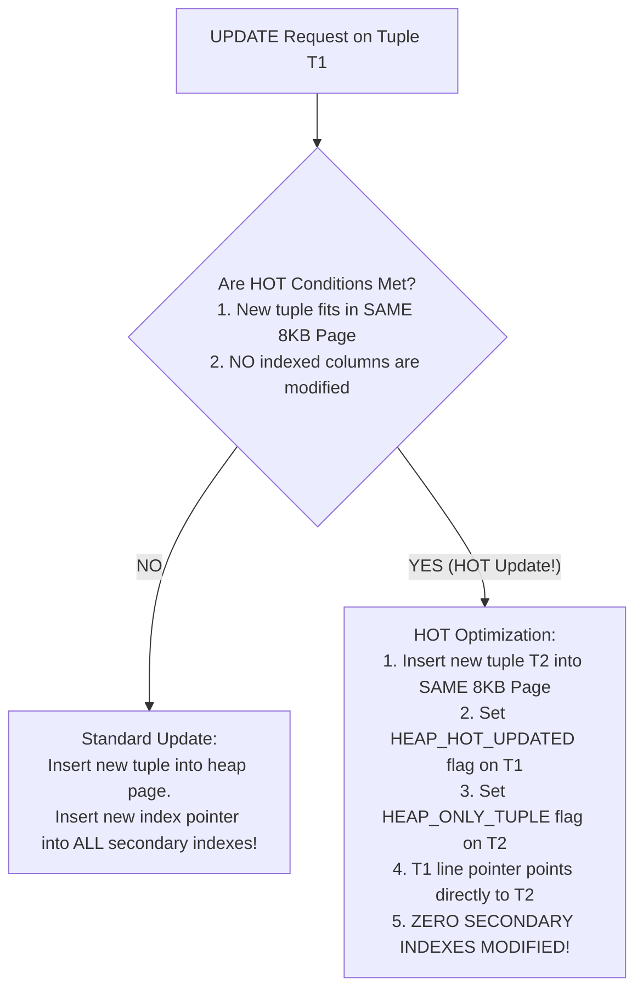
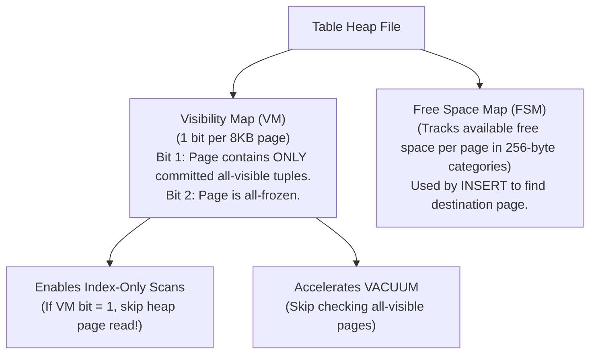

# PostgreSQL Internals — MVCC Implementation, Tuple Header, VACUUM, Toast

## Mental Model

Think of **PostgreSQL** as a high-performance system designed around **append-only heap immutability**. 

Instead of updating data in-place or maintaining separate Undo logs (like MySQL InnoDB), PostgreSQL treats every `UPDATE` as an `INSERT` of a new tuple version alongside the old version inside the main table heap file. 

To govern visibility across transactions, PostgreSQL tags every tuple with a 23-byte header containing transaction creation (`t_xmin`) and deletion (`t_xmax`) timestamps. Because dead historical tuples accumulate inside table files, PostgreSQL runs background maintenance engines: **`autovacuum`** (garbage collector) to reclaim dead space, **HOT Updates (Heap-Only Tuples)** to prevent secondary index bloat, and **Visibility Maps** to accelerate Index-Only Scans.

---

## 1. PostgreSQL Heap Tuple Header Architecture

Every row in PostgreSQL contains an uncompressed 23-byte `HeapTupleHeaderData` binary header followed by a NULL bitmap.

```text
PostgreSQL Heap Tuple Header (23 Bytes):
+-------------------------------------------------------------------------------+
| t_xmin (4B) | t_xmax (4B) | t_cid (4B) | t_ctid (6B) | t_infomask (4B) | Bitmap |
+-------------------------------------------------------------------------------+
```

### Detailed Field Reference

| Field | Size | Technical Role |
|---|---|---|
| `t_xmin` | 4 Bytes (32-bit uint) | **Insert XID:** The Transaction ID that created this tuple version. |
| `t_xmax` | 4 Bytes (32-bit uint) | **Delete/Update XID:** The Transaction ID that updated or deleted this tuple (0 if active). |
| `t_cid` | 4 Bytes | **Command ID:** Sequence number of SQL command within the transaction ($0, 1, 2 \dots$). |
| `t_ctid` | 6 Bytes (`BlockNo`, `Offset`) | **Item Pointer:** Physical location of tuple. If updated, points to the **newer version tuple** (`t_ctid` indirection link). |
| `t_infomask` | 2 Bytes (Bit flags) | Stores commit status flags (`HEAP_XMIN_COMMITTED`, `HEAP_XMAX_COMMITTED`, `HEAP_HOT_UPDATED`). |
| `t_infomask2` | 2 Bytes (Bit flags) | Stores column attribute count ($N_{cols}$) and HOT update flags (`HEAP_KEYS_UPDATED`). |

---

## 2. Transaction Status Commit Log (`pg_xact` / `pg_clog`)

To check if `t_xmin` has committed, PostgreSQL does NOT search WAL files on disk. Instead, it checks a ultra-fast in-memory/disk array called **`pg_xact`** (formerly `pg_clog`).

- **2 Bits Per Transaction:** `00` = In-Progress, `01` = Committed, `10` = Aborted, `11` = Sub-committed.
- **Optimization:** Once a tuple's `t_xmin` is verified committed via `pg_xact`, PostgreSQL sets the `HEAP_XMIN_COMMITTED` flag directly in `t_infomask` on the heap page (**Hint Bits**). Subsequent queries read the hint bit instantly without checking `pg_xact`!

---

## 3. HOT Updates (Heap-Only Tuples)

Standard updates in PostgreSQL force new tuple entries into heap pages AND new index pointers into **every** secondary index on the table (causing severe index bloat).

**HOT (Heap-Only Tuple)** is an architectural optimization that eliminates secondary index updates during an `UPDATE`.



```text
HOT Line Pointer Chain (Inside Single 8KB Page):
Secondary Index Pointer ──► Line Pointer 1 (Offset 8120) ──► Tuple T1 (Old)
                                 │ (HOT Chain Link)
                                 ▼
                            Line Pointer 2 (Offset 8056) ──► Tuple T2 (New)
```

---

## 4. Maintenance Subsystems: VACUUM, FSM, and VM



### The `VACUUM` Garbage Collection Process

When tuples are updated or deleted, dead tuples remain in heap pages. `VACUUM` performs four key tasks:

1. **Dead Tuple Reclamation:** Identifies dead tuples (`t_xmax < OldestXmin`), marks line pointers as dead, and updates `pd_lower`/`pd_upper` to free space.
2. **Visibility Map Update:** Flags pages where all tuples are committed as **All-Visible**.
3. **Free Space Map (FSM) Update:** Records available free bytes in the FSM file.
4. **Freezing Transaction IDs:** Replaces old `t_xmin` values with special frozen XID (`FrozenTransactionId = 2`) for tuples older than `autovacuum_freeze_max_age` to prevent **XID Wraparound**.

---

## 5. Production Operations & Inspection Commands

### Inspecting Hidden Tuple Headers via `pageinspect`

```sql
SELECT 
    lp AS line_pointer_slot,
    t_xmin,
    t_xmax,
    t_field3 AS t_cid,
    t_ctid,
    t_infomask::bit(16) AS infomask_bits
FROM heap_page_items(get_raw_page('orders', 0))
LIMIT 5;
```

### Monitoring Autovacuum Health and Dead Tuples

```sql
-- Check autovacuum worker activity and table dead tuple ratios
SELECT 
    schemaname || '.' || relname AS table_name,
    n_live_tup,
    n_dead_tup,
    ROUND(n_dead_tup::numeric / NULLIF(n_live_tup + n_dead_tup, 0) * 100, 2) AS dead_tuple_ratio,
    last_vacuum,
    last_autovacuum,
    autovacuum_count
FROM pg_stat_user_tables
ORDER BY n_dead_tup DESC;
```

### Tuning Autovacuum Parameters in `postgresql.conf`

```text
# Trigger autovacuum when dead tuples exceed 5% of table size (default is 20%)
autovacuum_vacuum_scale_factor = 0.05
autovacuum_vacuum_threshold = 50

# Increase I/O throughput for autovacuum workers
autovacuum_vacuum_cost_limit = 2000
autovacuum_max_workers = 4
```

---

## 6. Failure Modes and Trade-offs

1. **Transaction ID (XID) Wraparound Shutdown Emergency** — 32-bit transaction IDs wrap around after $2^{32} \approx 4.2 \text{ billion}$ transactions. If `VACUUM` fails to freeze old tuples before `age(datfrozenxid) > 2 \text{ billion}`, PostgreSQL shuts down and refuses all write connections to prevent data corruption. *Mitigation*: Monitor `age(datfrozenxid)` alerts; run manual `VACUUM FREEZE ANALYZE` during maintenance windows.
2. **HOT Chain Degradation from Low Fill Factor** — Setting table `fillfactor = 100` (default) leaves **zero free space** inside existing 8KB pages. Every single `UPDATE` fails HOT conditions and forces secondary index updates. *Mitigation*: Set `fillfactor = 80` or `70` on heavily updated tables (`ALTER TABLE orders SET (fillfactor = 80)`).
3. **Visibility Map Stale Index-Only Scan Degradation** — If `autovacuum` is disabled or throttled, Visibility Map bits remain `0`. Index-Only Scans are forced to fetch heap pages to verify visibility, degrading performance to standard Index Scans. *Mitigation*: Keep `autovacuum` enabled and tuned.

---

## 7. Active-Recall Prompts

1. **What are `t_xmin` and `t_xmax` in the PostgreSQL 23-byte tuple header, and how do they determine tuple visibility for concurrent transactions?**
2. **What is a HOT (Heap-Only Tuple) update? What two mandatory conditions must be satisfied for an update to qualify as a HOT update?**
3. **What is the Visibility Map (VM), and what two major performance features rely on its bit state?**
4. **Explain what Transaction ID (XID) Wraparound is, and how `VACUUM FREEZE` prevents catastrophic data corruption.**

---

## Related Notes

- [[MVCC - Multi-Version Concurrency Control, Snapshot Isolation, PostgreSQL vs MySQL]]
- [[Disk Storage and Page Format - Heap Files, Page Layout, Tuple Format]]
- [[Buffer Pool Manager - Page Cache, Replacement Policies, Dirty Pages]]
- [[MySQL InnoDB Architecture - Clustered Index, Buffer Pool, Doublewrite Buffer]]

> **Interview Style Question:** *"Explain the internal mechanics of PostgreSQL MVCC tuple headers, `pg_xact` hint bits, and HOT updates. Detail how an `UPDATE` on a non-indexed column inside an 80% filled page differs physically on disk from an `UPDATE` on an indexed column, analyzing the resulting WAL load, secondary index bloat, and `VACUUM` overhead."*

---
