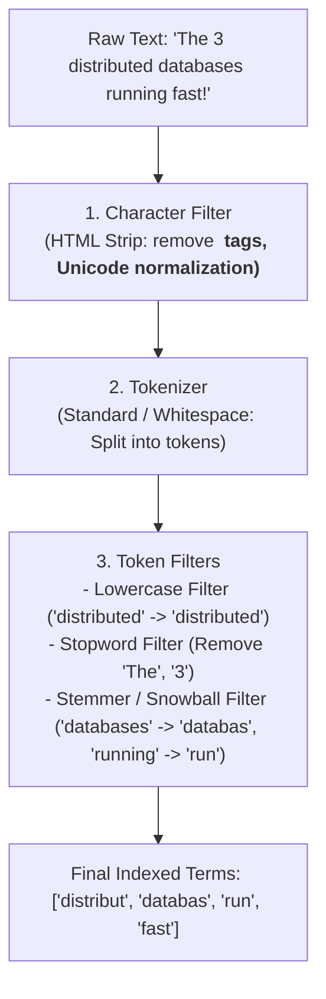
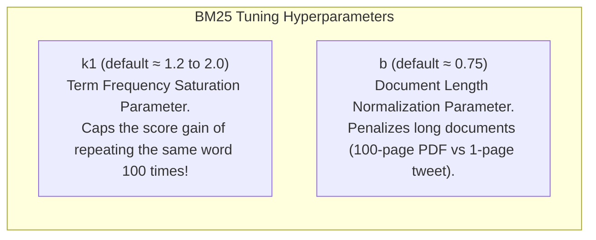

# Search Engines — Elasticsearch, Inverted Index, TF-IDF, BM25, Relevance Scoring

## Mental Model

Think of a **Search Engine (Elasticsearch / Apache Lucene)** as the comprehensive index at the back of a 1,000-page encyclopedia. 

If you want to find every page that mentions "Distributed Transactions", scanning every line of the book page-by-page takes hours (**Full Table Scan**). 

Instead, the search engine constructs an **Inverted Index**: a pre-sorted dictionary of every unique word (Term) extracted from all documents. Next to each word is a compressed list (**Posting List**) of the exact document IDs where that word appears. To find "Distributed AND Transactions", the search engine simply looks up both terms in its dictionary and calculates the set intersection of their posting lists in sub-millisecond time, ranking results using relevance scoring formulas (**BM25**).

---

## 1. The Inverted Index Architecture

The fundamental data structure powering search engines is the **Inverted Index**.

```text
Forward Index (Standard DB Storage):
Doc 1: "distributed consensus raft algorithm"
Doc 2: "raft consensus leader election"
Doc 3: "distributed database database optimization"

Inverted Index (Lucene / Elasticsearch Storage):
Term          Doc Frequency (DF)    Posting List [DocID : Term Frequency]
"algorithm"   ---> 1                ---> [ Doc 1 : (tf=1) ]
"consensus"   ---> 2                ---> [ Doc 1 : (tf=1) ], [ Doc 2 : (tf=1) ]
"database"    ---> 1                ---> [ Doc 3 : (tf=2) ]
"distributed" ---> 2                ---> [ Doc 1 : (tf=1) ], [ Doc 3 : (tf=1) ]
"election"    ---> 1                ---> [ Doc 2 : (tf=1) ]
"leader"      ---> 1                ---> [ Doc 2 : (tf=1) ]
"raft"        ---> 2                ---> [ Doc 1 : (tf=1) ], [ Doc 2 : (tf=1) ]
```

### Components of a Lucene Inverted Index

```mermaid
flowchart LR
    TermDict["Term Dictionary (RAM)\nFinite State Transducer (FST)\n(Prefix Trie + Compression)"] -->|O(1) Memory Lookup| TermIndex["Term Dictionary File"]
    TermIndex -->|Pointer Offset| PostingList["Posting List (Disk/RAM)\n[DocID_1, DocID_5, DocID_42]\n(Compressed via Frame-Of-Reference)"]
    PostingList --> Payload["Term Frequencies & Position Payload\n(Used for Phrase Matching & BM25 Scoring)"]
```

1. **Term Dictionary (FST - Finite State Transducer):** An in-memory, highly compressed prefix trie containing all terms.
2. **Posting List:** A sorted array of document IDs containing the term.
3. **Posting List Compression (FOR - Frame Of Reference):** Encodes integer delta arrays (e.g., DocIDs `[100, 102, 108]` $\to$ Deltas `[100, 2, 6]`), packing values into bit-aligned integers to fit millions of posting IDs into kilobytes of RAM.

---

## 2. Text Analysis Pipeline (Tokenization)

Before text is added to the inverted index or searched, it passes through the **Analysis Pipeline**.



---

## 3. Relevance Scoring Algorithms: TF-IDF vs. Okapi BM25

Search engines do not just return matching documents; they rank results by **Relevance Score**.

### A. Classic TF-IDF (Term Frequency - Inverse Document Frequency)

$$\text{TF-IDF}(t, d, D) = \text{TF}(t, d) \times \text{IDF}(t, D)$$

1. **Term Frequency $\text{TF}(t, d)$:** How frequently term $t$ appears in document $d$. More occurrences $\to$ higher score.
   $$\text{TF}(t, d) = \sqrt{\text{Count}(t, d)}$$
2. **Inverse Document Frequency $\text{IDF}(t, D)$:** Measures how rare or common term $t$ is across all documents in collection $D$. Rare words ("Raft") receive a massive score boost; common words ("the") receive near-zero score.
   $$\text{IDF}(t, D) = \ln\left( \frac{|D|}{\text{DocCount}(t)} \right)$$

---

### B. Okapi BM25 (Best Matching 25 — Modern Industry Standard)

BM25 refines TF-IDF by addressing two major flaws: **Term Frequency Saturation** and **Document Length Normalization**.

$$\text{Score}_{\text{BM25}}(d, Q) = \sum_{i=1}^{n} \text{IDF}(q_i) \cdot \frac{\text{TF}(q_i, d) \cdot (k_1 + 1)}{\text{TF}(q_i, d) + k_1 \cdot \left( 1 - b + b \cdot \frac{|d|}{\text{avgdl}} \right)}$$



```text
TF-IDF vs BM25 Score Gain Curve:
Score ^
      |       / TF-IDF (Linear/Unbounded Score Inflation)
      |      /
      |     /----------- BM25 (Saturates smoothly at upper limit!)
      |    /
      +------------------------> Term Frequency Count (TF)
```

---

## 4. Elasticsearch Cluster Architecture & Sharding

An **Elasticsearch Cluster** contains one or more nodes hosting distributed **Indices** partitioned into **Shards** (which are physical Apache Lucene instances).

```mermaid
flowchart TD
    Client["Client Query Request"] --> CoordinatingNode["Coordinating Node\n(Receives Query, Parses JSON)"]
    
    subgraph IndexShards["Distributed Index: 'products' (2 Shards, 1 Replica)"]
        Shard0_Primary["Shard 0 Primary (Node A)"]
        Shard0_Replica["Shard 0 Replica (Node B)"]
        Shard1_Primary["Shard 1 Primary (Node B)"]
        Shard1_Replica["Shard 1 Replica (Node A)"]
    end
    
    CoordinatingNode -->|Phase 1: Query Phase\n(Broadcast query to Shard 0 & 1)| Shard0_Primary & Shard1_Primary
    Shard0_Primary & Shard1_Primary -->|Return Top 10 DocIDs + BM25 Scores| CoordinatingNode
    
    CoordinatingNode -->|Phase 2: Fetch Phase\n(Fetch full JSON payloads for Top 10)| Shard0_Primary
    CoordinatingNode --> Client
```

---

## 5. Production Operations & JSON Query Code Examples

### Defining Index Mapping in Elasticsearch (REST API)

```json
PUT /tech_articles
{
  "settings": {
    "number_of_shards": 3,
    "number_of_replicas": 1,
    "analysis": {
      "analyzer": {
        "custom_tech_analyzer": {
          "type": "custom",
          "tokenizer": "standard",
          "filter": ["lowercase", "asciifolding", "stemmer"]
        }
      }
    }
  },
  "mappings": {
    "properties": {
      "title": { 
        "type": "text", 
        "analyzer": "custom_tech_analyzer",
        "fields": { "keyword": { "type": "keyword" } }
      },
      "content": { "type": "text", "analyzer": "standard" },
      "category": { "type": "keyword" },
      "publish_date": { "type": "date" },
      "views": { "type": "integer" }
    }
  }
}
```

### Advanced Boolean & BM25 Query Syntax

```json
POST /tech_articles/_search
{
  "query": {
    "bool": {
      "must": [
        { "match": { "content": { "query": "distributed consensus", "operator": "and" } } }
      ],
      "filter": [
        { "term": { "category": "databases" } },
        { "range": { "publish_date": { "gte": "2026-01-01" } } }
      ],
      "should": [
        { "match_phrase": { "title": { "query": "Raft Consensus", "slop": 1 } } }
      ],
      "minimum_should_match": 0
    }
  },
  "size": 10,
  "highlight": { "fields": { "content": {} } }
}
```

---

## 6. Failure Modes and Trade-offs

1. **Mapping Explosion Outage** — Indexing arbitrary user-generated JSON payloads with dynamic field names (`{"field_123": "val"}`). Each unique JSON key creates a new Lucene field entry, causing **Mapping Explosion** (exceeding `index.mapping.total_fields.limit = 1000`) and crashing cluster master node RAM. *Mitigation*: Turn off dynamic mapping (`"dynamic": "strict"` or `"flattened"`).
2. **Deep Pagination Cluster Crash (`from: 10000, size: 10`)** — Requesting page 1,000 of results forces coordinating nodes to fetch $10,010$ DocIDs from **every shard**, sort $10,010 \times N$ entries in memory, and discard 10,000. *Mitigation*: Use `search_after` (cursor-based pagination) instead of `from/size`.
3. **Heap Memory Pressure from Un-grained Aggregations** — Running high-cardinality `terms` aggregations on `text` fields without `doc_values` loads millions of string terms into JVM heap memory (FieldData), triggering long GC pauses. *Mitigation*: Run aggregations only on `keyword` fields (which use disk-backed `DocValues`).

---

## 7. Active-Recall Prompts

1. **How does an Inverted Index differ from a traditional SQL forward storage table, and why does Frame-Of-Reference (FOR) delta encoding speed up posting list reads?**
2. **Explain the two primary improvements that Okapi BM25 introduces over classic TF-IDF scoring.**
3. **What are the 3 stages of a text Analysis Pipeline (Character Filters, Tokenizer, Token Filters)?**
4. **Why is deep pagination (`from: 100000`) dangerous in distributed search engines, and how does `search_after` resolve it?**

---

## Related Notes

- [[Vector Databases - Embeddings, HNSW, ANN Search, pgvector]]
- [[Time-Series Databases - InfluxDB, TimescaleDB, Prometheus Storage]]
- [[Document Databases - MongoDB Architecture, WiredTiger, Aggregation Pipeline]]
- [[B-Tree and B+ Tree Indexes - Structure, Search, Insert, Split]]

> **Interview Style Question:** *"Design an enterprise full-text search platform for 50 million legal documents. Detail your index mapping schema, text analysis pipeline (stemming/lowercasing), BM25 hyperparameter tuning ($k_1, b$), shard allocation strategy, and demonstrate how you prevent heap memory OOM during deep pagination and high-cardinality aggregations."*

---
