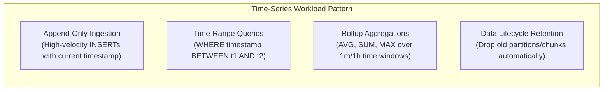
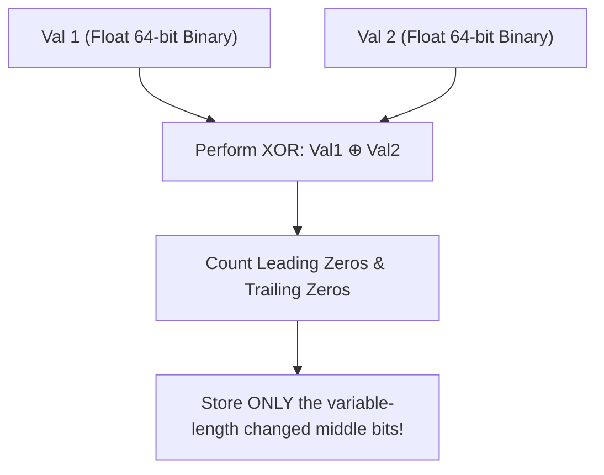
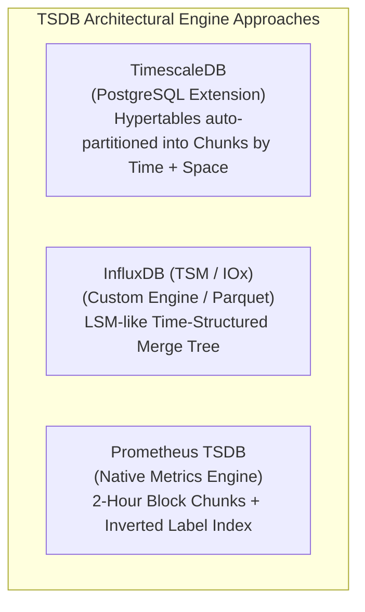

# Time-Series Databases — InfluxDB, TimescaleDB, Prometheus Storage

## Mental Model

Think of a **Time-Series Database (TSDB)** as a specialized digital electrocardiogram (ECG) recorder designed for high-frequency, append-only sensor measurements, financial ticks, and metric telemetry. 

Unlike traditional OLTP databases where data is constantly updated in-place (`UPDATE users SET status = ...`), time-series data is **strictly append-only** ($99.9\%$ writes are timestamped `INSERT`s) and **queries are heavily time-bucketed** (`SELECT AVG(cpu) GROUP BY time(1m)`). 

To ingest millions of events per second without crashing storage, TSDBs use specialized columnar compression algorithms (**Gorilla XOR compression** for floats and **Delta-of-Delta** for timestamps), partitioning continuous time into auto-managed physical chunks (**Hypertables**).

---

## 1. Time-Series Data Characteristics & Workload Constraints

Time-series workloads differ fundamentally from traditional relational OLTP workloads:



### OLTP vs. TSDB Workload Matrix

| Workload Attribute | General OLTP (PostgreSQL/MySQL) | Time-Series Engine (TimescaleDB / Prometheus) |
|---|---|---|
| **Write Pattern** | Frequent `UPDATE` and `DELETE` in-place. | **100% Append-Only `INSERT`**. Deletes via partition drop. |
| **Primary Indexing** | Random point lookups (`WHERE id = 42`). | **Time-Range Lookups** (`WHERE time >= NOW() - 1h`). |
| **Data Lifecycle** | Indefinite retention of entity rows. | **Retention Policies** (e.g., drop raw metrics after 30 days). |
| **Compression Ratio** | Low (uncompressed or page-level 2x). | **Extreme (10x to 40x compression)** using XOR/Delta math. |

---

## 2. Special Time-Series Compression Algorithms

TSDBs achieve 90%+ storage savings by using domain-specific numeric compression.

### A. Delta-of-Delta Timestamp Compression
Timestamps recorded at regular intervals (e.g., every 10 seconds: $T_1 = 1000$, $T_2 = 1010$, $T_3 = 1020$) have identical deltas ($\Delta = 10$).

$$\text{Delta-of-Delta} = (T_i - T_{i-1}) - (T_{i-1} - T_{i-2}) = 10 - 10 = 0$$

- **Encoding:** Storing value `0` requires **only 1 single bit** instead of an 8-byte (64-bit) integer!

---

### B. Facebook Gorilla Floating-Point Compression (XOR Encoding)
Floating-point values (e.g., CPU temperature `36.5`, `36.5`, `36.6`) share identical IEEE 754 exponent and sign bits.



> **Result:** Gorilla compression reduces 64-bit floats down to an average of **1.37 bytes per value** (a 5x memory saving!).

---

## 3. Architecture Deep Dives: TimescaleDB, InfluxDB, Prometheus



### A. TimescaleDB (Hypertables & Chunks)
TimescaleDB is packaged as a native extension to PostgreSQL. To the user, a **Hypertable** appears as a single unified PostgreSQL table. Under the hood, TimescaleDB automatically partitions data into physical child tables called **Chunks** based on time ranges and space keys.

```text
Hypertable: 'conditions' (Logical View)
+-------------------------------------------------------------------------+
| Chunk 1: [Jan 01 - Jan 07] | Chunk 2: [Jan 08 - Jan 14] | Chunk 3...   |
| (Physical Table 1)         | (Physical Table 2)         | ...         |
+-------------------------------------------------------------------------+
```

- **Chunk Ingestion Benefit:** Incoming writes target ONLY the active chunk in memory, fitting entirely within the Buffer Pool RAM and avoiding B+ Tree page splits on cold historic data!

---

### B. Prometheus TSDB Storage
Prometheus stores metric time series in **2-Hour Block Directories**.

```text
/data/prometheus/
├── 01BK6W5B2VRB6B37C09FDF13E6/   <-- 2-Hour Block Directory
│   ├── meta.json                <-- Block Metadata
│   ├── chunk/                   <-- Raw Metric Samples (Gorilla Compressed)
│   │   └── 000001
│   ├── index                    <-- Inverted Index (Maps Labels -> Series ID)
│   └── tombstones
```

- **Inverted Label Index:** Maps metric labels (e.g., `job="api-server", env="prod"`) to a compact 32-bit Series ID list, enabling sub-millisecond metric series discovery.

---

## 4. Production Operations & SQL Code Examples

### Creating and Managing Hypertables in TimescaleDB

```sql
-- Create standard PostgreSQL table
CREATE TABLE metric_data (
    time TIMESTAMPTZ NOT NULL,
    device_id INT NOT NULL,
    cpu_usage DOUBLE PRECISION NULL,
    memory_usage DOUBLE PRECISION NULL
);

-- Convert standard table into a TimescaleDB Hypertable (Partition by 7-day time chunks)
SELECT create_hypertable('metric_data', 'time', chunk_time_interval => INTERVAL '7 days');

-- Enable Columnar Compression for chunks older than 7 days
ALTER TABLE metric_data SET (
    timescaledb.compress,
    timescaledb.compress_segmentby = 'device_id',
    timescaledb.compress_orderby = 'time DESC'
);

-- Add Automated Compression Policy (Compress chunks older than 7 days)
SELECT add_compression_policy('metric_data', INTERVAL '7 days');

-- Add Data Retention Policy (Automatically drop chunks older than 90 days)
SELECT add_retention_policy('metric_data', INTERVAL '90 days');
```

### High-Performance Time-Bucket Analytical Queries

```sql
-- Aggregate metrics into 5-minute time buckets using TimescaleDB gapfilling
SELECT 
    time_bucket('5 minutes', time) AS five_min,
    device_id,
    AVG(cpu_usage) AS avg_cpu,
    MAX(cpu_usage) AS max_cpu
FROM metric_data
WHERE time >= NOW() - INTERVAL '24 hours'
GROUP BY five_min, device_id
ORDER BY five_min DESC;
```

---

## 5. Failure Modes and Trade-offs

1. **High-Cardinality Explosion (Label Inflation)** — Creating metrics with unbounded dynamic labels (e.g., storing `user_id` or raw `uuid` as a Prometheus metric label or InfluxDB tag). Result: The inverted label index explodes into billions of unique series, consuming 100% of RAM and crashing the TSDB instance. *Mitigation*: Restrict metric labels strictly to low-cardinality metadata (`env`, `region`, `service_name`).
2. **Out-of-Order Ingestion Performance Collapse** — Ingesting log data with timestamps hours or days in the past. This forces TSDBs to uncompress historic chunks, perform expensive merges, and re-compress. *Mitigation*: Use TimescaleDB out-of-order chunk buffers or route historical backfills to separate batch ingestion pipelines.
3. **Uncompressed Cold Storage Cost Spikes** — Leaving raw time-series data uncompressed on disk. Raw float telemetry consumes 10x more storage than compressed columnar chunks. *Mitigation*: Configure automated compression policies after chunks age out of active write windows.

---

## 6. Active-Recall Prompts

1. **How do Delta-of-Delta timestamp encoding and Gorilla XOR floating-point compression achieve 90%+ storage reductions in Time-Series Databases?**
2. **What is a TimescaleDB Hypertable, how are Chunk partitions generated, and why does chunking keep write ingestion fast in PostgreSQL?**
3. **What is High Cardinality Explosion in time-series monitoring, and why does putting `user_id` in a Prometheus metric label crash the TSDB index?**
4. **How does data retention management in TSDBs (dropping time chunks) differ from traditional `DELETE FROM table WHERE...` statements?**

---

## Related Notes

- [[Search Engines - Elasticsearch, Inverted Index, TF-IDF, BM25, Relevance Scoring]]
- [[Vector Databases - Embeddings, HNSW, ANN Search, pgvector]]
- [[Wide-Column Stores - Apache Cassandra, SSTable, Consistent Hashing, Tunable Consistency]]
- [[LSM Tree - Log-Structured Merge Tree, Compaction, RocksDB]]

> **Interview Style Question:** *"Design a telemetry monitoring infrastructure ingesting 2,000,000 metric samples/sec from 50,000 Kubernetes pods. Evaluate TimescaleDB vs. Prometheus TSDB vs. InfluxDB, detailing chunk partitioning, Gorilla compression math, retention policies, and how you enforce strict linter rules against High-Cardinality label inflation."*

---
