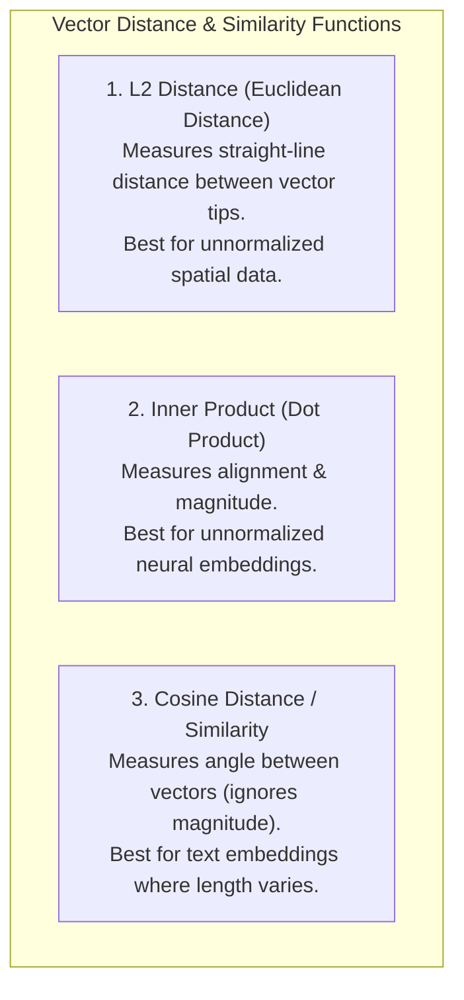
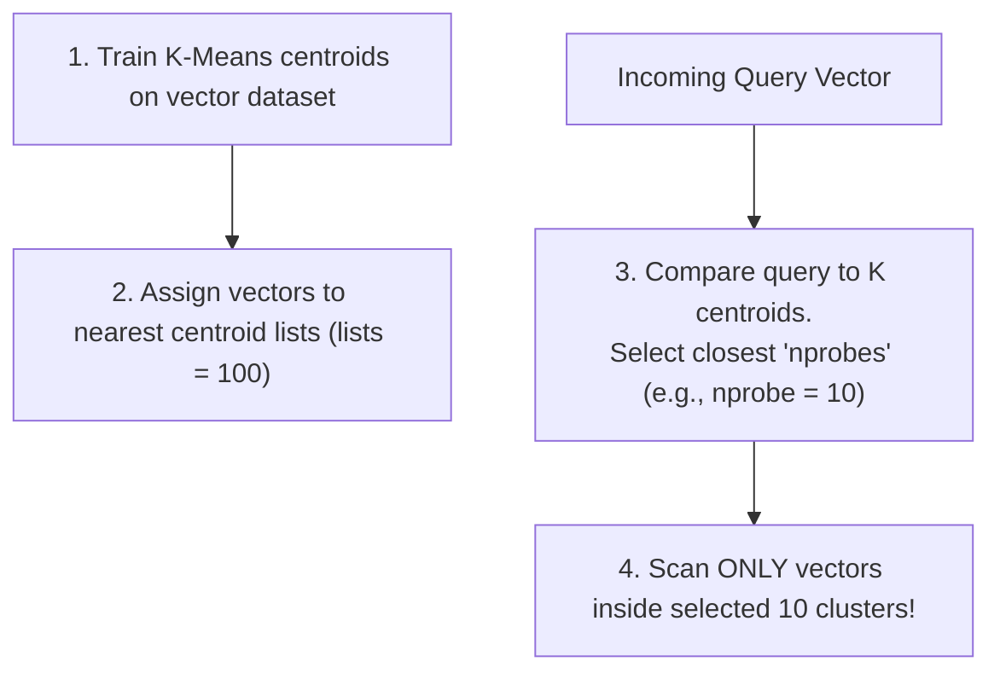
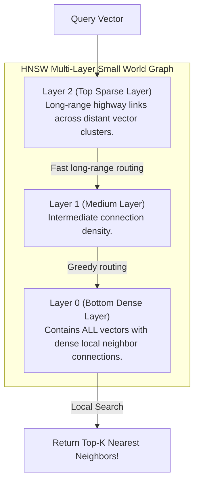
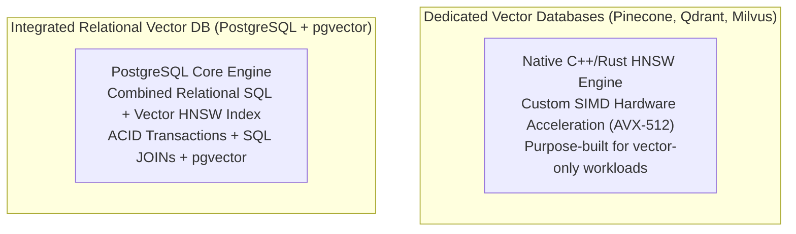

# Vector Databases — Embeddings, HNSW, ANN Search, pgvector

## Mental Model

Think of a **Vector Database** as a multi-dimensional semantic navigation space for artificial intelligence. 

Traditional keyword search indexes text literally ("bank" matching "bank"). Deep learning models transform text, images, or audio into dense mathematical arrays of numbers called **Vector Embeddings** (e.g., a 1,536-dimensional float array from OpenAI `text-embedding-3-small`). In this multi-dimensional space, concepts with similar meanings sit physically close to each other. 

Because finding the exact nearest neighbors across millions of 1,536-D vectors via brute-force Euclidean distance is computationally impossible ($O(N \cdot D)$), Vector DBs use **Approximate Nearest Neighbor (ANN)** algorithms like **HNSW (Hierarchical Navigable Small World graphs)** to skip through multi-layered spatial skip-lists in logarithmic time ($O(\log N)$).

---

## 1. Vector Embeddings & Distance Metrics

A Vector Embedding is a dense vector representation $\vec{v} \in \mathbb{R}^D$ where geometric proximity captures semantic similarity.

```text
3D Simplified Embedding Space Visualization:
"King"   -> [0.85, 0.92, 0.12]
"Queen"  -> [0.82, 0.90, 0.88]  <-- Very Close Distance!
"Apple"  -> [0.05, 0.10, 0.75]  <-- Far Away!
```

### The 3 Core Vector Distance Metrics



| Metric | Formula | Best Use Case | Values Range |
|---|---|---|---|
| **Euclidean Distance ($L_2$)** | $d(\vec{u}, \vec{v}) = \sqrt{\sum_{i=1}^D (u_i - v_i)^2}$ | Computer vision, spatial embeddings. | $[0, \infty)$ (0 = Identical) |
| **Dot Product (Inner Product)** | $\langle \vec{u}, \vec{v} \rangle = \sum_{i=1}^D u_i \cdot v_i$ | Recommendation engines, normalized models. | $(-\infty, \infty)$ (Higher = More Similar) |
| **Cosine Similarity** | $\cos(\theta) = \frac{\vec{u} \cdot \vec{v}}{\|\vec{u}\| \|\vec{v}\|}$ | NLP text embeddings (OpenAI, HuggingFace). | $[-1, 1]$ (1 = Identical direction) |

---

## 2. Approximate Nearest Neighbor (ANN) Indexing Algorithms

Searching exact $K$-nearest neighbors (KNN) requires scanning every vector in the dataset ($O(N \cdot D)$ brute force), which fails at scale. **ANN algorithms** trade a tiny fraction of accuracy ($1\%$ recall drop) for a **1,000x speedup**.

### A. IVFFlat (Inverted File Flat) Index
Divides the vector space into $K$ clusters using $K$-Means clustering.



- **Pros:** Low memory footprint; fast index build time.
- **Cons:** Lower recall if $nprobe$ is too small; requires re-training if dataset distribution changes dramatically.

---

### B. HNSW (Hierarchical Navigable Small World) Index

HNSW is the current gold standard algorithm for vector search (used by Pinecone, Milvus, Qdrant, and `pgvector`). It constructs a multi-layer graph based on SkipList principles.



#### HNSW Graph Parameters:
- **$M$ (Max Edges per Node):** Number of bi-directional links per node (e.g., $M = 16$). Higher $M$ = higher recall & memory usage.
- **`ef_construction`:** Size of dynamic candidate list evaluated during index construction (e.g., $200$).
- **`ef_search`:** Size of dynamic candidate list evaluated during query execution (e.g., $40$). Higher `ef_search` = higher recall & search latency.

---

## 3. Vector DB Architectural Approaches: Dedicated vs. Integrated



### Dedicated vs. Integrated Matrix

| Feature | Dedicated Vector DB (Qdrant / Milvus) | Integrated Extension (`pgvector` / PG) |
|---|---|---|
| **Query Flexibility** | Vector-centric API. Metadata filtering restricted. | Full SQL support (`JOIN`, `WHERE`, `GROUP BY` + Vector). |
| **ACID & Consistency** | Eventual consistency; limited transaction support. | **Full ACID Transactions** & MVCC safety. |
| **Operational Overhead** | Requires managing new isolated cluster infrastructure. | Uses existing PostgreSQL cluster & backup tools. |
| **Raw QPS Scale** | Extremely High ($>50,000$ QPS on single node). | High ($10,000$ QPS using HNSW). |

---

## 4. Production Operations & SQL Code Examples (`pgvector`)

### Setting up `pgvector` in PostgreSQL

```sql
-- Enable pgvector extension
CREATE EXTENSION IF NOT EXISTS vector;

-- Create table storing 1536-dimensional OpenAI embeddings
CREATE TABLE document_embeddings (
    id BIGSERIAL PRIMARY KEY,
    document_id INT NOT NULL,
    content TEXT,
    embedding vector(1536) -- 1536-dimensional float vector column
);
```

### Building HNSW and IVFFlat Indexes

```sql
-- Build HNSW Index using Cosine Distance (<=> operator)
CREATE INDEX idx_embeddings_hnsw_cosine 
ON document_embeddings 
USING hnsw (embedding vector_cosine_ops)
WITH (m = 16, ef_construction = 64);

-- Alternatively: Build IVFFlat Index
CREATE INDEX idx_embeddings_ivfflat_l2 
ON document_embeddings 
USING ivfflat (embedding vector_l2_ops)
WITH (lists = 100);
```

### Executing Hybrid Semantic + Relational SQL Search

```sql
-- Tune HNSW search candidate pool for current session
SET hnsw.ef_search = 40;

-- Execute Hybrid Search: Filter by document_id and rank by vector similarity
SELECT 
    id, 
    content, 
    1 - (embedding <=> '[0.015, -0.022, 0.089, ...]'::vector) AS cosine_similarity
FROM document_embeddings
WHERE document_id = 42
ORDER BY embedding <=> '[0.015, -0.022, 0.089, ...]'::vector -- HNSW Cosine Distance
LIMIT 5;
```

---

## 5. Failure Modes and Trade-offs

1. **RAM Saturated OOM Crashing (HNSW Index Size)** — HNSW indexes MUST reside entirely in RAM for fast search performance. A 1,536-dimensional float vector requires $1536 \times 4 \text{ bytes} = 6.14 \text{ KB}$ per vector. An index for 10 million vectors consumes **~80 GB of RAM**! *Mitigation*: Use **Product Quantization (PQ)** or Scalar Quantization (SQ8) to compress 32-bit floats into 8-bit integers, reducing memory footprint by 75%.
2. **Pre-Filtering Performance Collapse in Hybrid Queries** — Executing `WHERE category = 'electronics' ORDER BY embedding <=> query LIMIT 10`. If the scalar filter matches only 5 rows out of 1 million, the HNSW graph search traverses thousands of nodes before finding a single node matching `category = 'electronics'`, causing query execution to stall for seconds. *Mitigation*: Use Single-Stage Iterative Scan in `pgvector` v0.5+.
3. **Huge HNSW Index Build Time & Resource Lock** — Building an HNSW index over 5 million 1,536-D vectors can consume 100% CPU across all cores for 2 hours. *Mitigation*: Tune `max_parallel_workers` and build index concurrently (`CREATE INDEX CONCURRENTLY`).

---

## 6. Active-Recall Prompts

1. **What is a Vector Embedding, and how does Cosine Similarity differ from Euclidean ($L_2$) Distance?**
2. **Explain how the HNSW (Hierarchical Navigable Small World) algorithm uses a multi-layer graph skip-list to achieve $O(\log N)$ search time.**
3. **Compare dedicated vector databases (Qdrant/Milvus) with integrated extensions (`pgvector` in PostgreSQL) across ACID transactions, filtering, and operational complexity.**
4. **What is Product Quantization (PQ), and how does it prevent RAM exhaustion when storing millions of 1536-dimensional vectors?**

---

## Related Notes

- [[Search Engines - Elasticsearch, Inverted Index, TF-IDF, BM25, Relevance Scoring]]
- [[Time-Series Databases - InfluxDB, TimescaleDB, Prometheus Storage]]
- [[Document Databases - MongoDB Architecture, WiredTiger, Aggregation Pipeline]]
- [[B-Tree and B+ Tree Indexes - Structure, Search, Insert, Split]]

> **Interview Style Question:** *"Design a real-time Retrieval-Augmented Generation (RAG) search pipeline processing 10,000 queries/sec over 20 million 1536-dimensional document chunks. Detail your choice between dedicated vector DB vs. PostgreSQL `pgvector`, your HNSW index tuning parameters ($M, ef\_construction, ef\_search$), product quantization compression strategy, and how you solve the pre-filtering performance collapse when combined with strict SQL security filters."*

---
