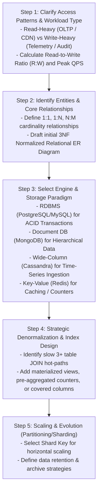
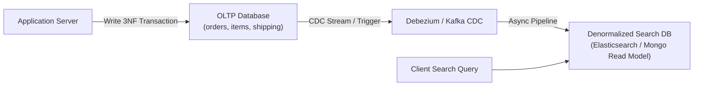
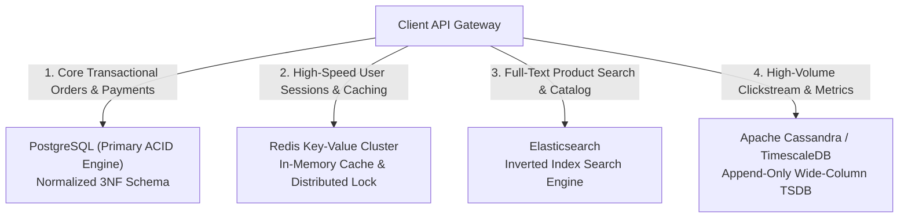

# Database Design Interview Patterns — Normalization vs. Denormalization Trade-offs

## Mental Model

Think of **Database Schema Design** as balancing a high-stakes architectural seesaw between **Write Integrity (Normalization)** and **Read Performance (Denormalization)**. 

When you normalize a database to Third Normal Form (3NF), you eliminate redundant data by placing every fact in exactly one place. Writes are fast, atomic, and safe from anomalies, but complex reads require joining 6 tables together. 

When you denormalize, you duplicate data or pre-calculate aggregates into single tables or document documents. Reads execute at lightspeed in 1 step, but every update forces you to write to 5 duplicate locations simultaneously, risking severe **data inconsistency** if a write fails mid-way. In system design interviews, senior software engineers must demonstrate when, why, and how to apply each pattern based on read-to-write ratios ($R:W$).

---

## 1. System Design Framework: The 5-Step Data Modeling Workflow

When presented with a database design problem in a Staff/Principal System Design interview (e.g., *"Design the database schema for Uber / Twitter / E-commerce Payment Platform"*), follow this structured 5-step framework:



---

## 2. Normalization vs. Denormalization Trade-off Matrix

| Engineering Metric | Normalized Design (3NF / BCNF) | Denormalized Design (Pre-aggregated / Document) |
|---|---|---|
| **Primary Goal** | **Data Integrity:** Eliminate redundancy & update anomalies. | **Read Speed:** Eliminate multi-table JOINs and disk seeks. |
| **Read Performance** | Slower (requires multi-table JOINs, group-bys, and index traversals). | **Ultra Fast** (Single table/document lookup, pre-calculated fields). |
| **Write Performance** | **Fast & Lightweight** (Write data in exactly one place). | Slower & Complex (Must update multiple duplicate fields/tables). |
| **Storage Footprint** | Minimal (Compact, no duplicated text strings). | Higher (Duplicated columns, redundant text payloads). |
| **Data Consistency Risk** | **Zero Risk:** Single source of truth. | **High Risk:** Duplicated data can drift out of sync on partial failure. |
| **Best Workload Fit** | OLTP systems, banking, core transactional engines ($R:W \approx 1:1$). | Read-heavy web apps, dashboards, feeds ($R:W \ge 100:1$). |

---

## 3. High-Frequency Interview Design Patterns

### Pattern 1: Pre-Aggregated Counters (e.g., Social Media Likes / Views)

#### Problem:
Calculating post likes via `SELECT COUNT(*) FROM likes WHERE post_id = 42` scans millions of rows on a viral post, saturating database CPU.

#### Solution (Denormalized Counter + Triggers / Atomic Updates):

```sql
-- Normalized Post & Likes Tables
CREATE TABLE posts (
    post_id BIGSERIAL PRIMARY KEY,
    author_id BIGINT NOT NULL,
    content TEXT NOT NULL,
    like_count BIGINT NOT NULL DEFAULT 0 -- Denormalized Pre-Calculated Counter!
);

CREATE TABLE post_likes (
    post_id BIGINT REFERENCES posts(post_id),
    user_id BIGINT REFERENCES users(user_id),
    liked_at TIMESTAMPTZ DEFAULT NOW(),
    PRIMARY KEY (post_id, user_id)
);

-- Atomic Increment on Like Event (Avoids COUNT(*) Scan!)
BEGIN;
INSERT INTO post_likes (post_id, user_id) VALUES (42, 9001);
UPDATE posts SET like_count = like_count + 1 WHERE post_id = 42;
COMMIT;
```

---

### Pattern 2: Materialized Views & Out-of-Band Sync (e.g., E-Commerce Order History)

#### Problem:
Order search requires joining `orders`, `customers`, `order_items`, `products`, and `shipments` across 5 tables.

#### Solution:
Maintain an asynchronous **Search Materialized View** (or Elasticsearch index) populated via Change Data Capture (CDC / Debezium) or Database Triggers.



---

### Pattern 3: Polyglot Persistence Architecture

Never attempt to force a single database technology to satisfy every workload requirement.



---

## 4. Production Design Case Study: Uber / Ride-Sharing Ride History

### Requirements:
- **Write Path:** Driver updates location every 4 seconds. Rider completes ride ($1,000$ writes/sec).
- **Read Path:** Rider views active trip status ($10,000$ reads/sec). Rider views 5-year ride history.

### Architectural Solution:

```sql
-- 1. Active Rides (Hot OLTP Data: Normalized 3NF in PostgreSQL / Spanner)
CREATE TABLE active_rides (
    ride_id UUID PRIMARY KEY,
    rider_id UUID NOT NULL,
    driver_id UUID NOT NULL,
    status VARCHAR(20) NOT NULL, -- 'REQUESTED', 'MATCHED', 'IN_PROGRESS'
    pickup_geom GEOMETRY(Point, 4326),
    dropoff_geom GEOMETRY(Point, 4326),
    fare_amount DECIMAL(10, 2),
    created_at TIMESTAMPTZ DEFAULT NOW()
);

-- 2. Driver Location Tracking (High-Velocity Ingestion: Redis Geo / Cassandra)
-- Redis Command: GEOADD driver_locations -122.4194 37.7749 "driver_1045"

-- 3. Historical Completed Rides (Cold Immutable Read Model: Cassandra / Dynamodb)
CREATE TABLE completed_ride_history (
    rider_id UUID,
    ride_year_month INT, -- Partition Key Component (Bucketing)
    completed_at TIMESTAMPTZ,
    ride_id UUID,
    driver_name VARCHAR,
    fare_amount DECIMAL(10, 2),
    route_summary TEXT,
    PRIMARY KEY ((rider_id, ride_year_month), completed_at, ride_id)
) WITH CLUSTERING ORDER BY (completed_at DESC);
```

---

## 5. Failure Modes and Trade-offs

1. **Denormalization Data Drift (Inconsistency Bug)** — Updating a user's `email` or `name` in the primary `users` table, but failing to update the denormalized `author_name` cached across 50,000 `posts` records. Result: Data inconsistency across UI screens. *Mitigation*: Use event-driven eventual consistency reconciliation workers or asynchronous event buses (Kafka/RabbitMQ).
2. **Premature Denormalization Complexity** — Denormalizing schemas early in a project's lifecycle when read queries are low ($R:W \approx 2:1$). Writes become overly complex, transactions require double-writes, and schema evolution becomes painful. *Mitigation*: Start with clean 3NF relational schemas; denormalize **only** after empirical profiling demonstrates JOIN bottlenecks under load.
3. **Write Amplification Saturation** — Denormalizing 10 fields into an index to achieve Index-Only Scans, causing disk write volume to explode during batch updates. *Mitigation*: Calculate Write Amplification Factor before adding non-essential covered columns.

---

## 6. Active-Recall Prompts

1. **What is the fundamental trade-off between 3NF Normalization and Denormalization regarding Read Latency, Write Latency, and Data Consistency?**
2. **How does the 5-Step Data Modeling Workflow guide engine selection between RDBMS, Document DBs, Wide-Column Stores, and Key-Value caches?**
3. **Explain the Pre-Aggregated Counter design pattern and why atomic increments (`UPDATE ... SET count = count + 1`) are superior to `SELECT COUNT(*)`.**
4. **What is Polyglot Persistence, and why should an enterprise application use different database engines for OLTP vs. Search vs. Caching?**

---

## Related Notes

- [[Database Performance Tuning - EXPLAIN ANALYZE, Slow Query Log, Connection Pooling]]
- [[Relational Model - Tables, Keys, Functional Dependencies, Normalization]]
- [[Document Databases - MongoDB Architecture, WiredTiger, Aggregation Pipeline]]
- [[Database Sharding - Horizontal Partitioning, Consistent Hashing, Routing]]

> **Interview Style Question:** *"Design the database architecture for a global social network like Twitter/X. Detail your schema choices for User Profiles, Follow Graphs, Tweet Posts, and Home Timelines. Explain how you handle the 'Celebrity Fanout Problem' (a user with 100M followers posting a tweet) using hybrid push/pull denormalization strategies and polyglot persistence."*

---
