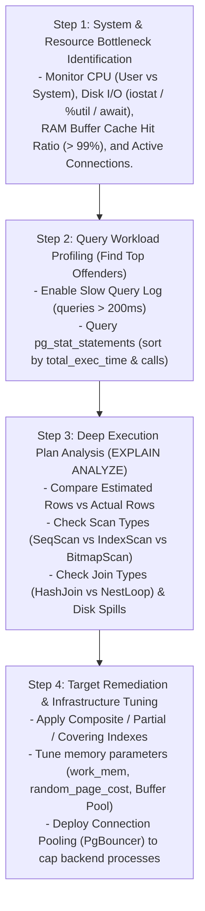
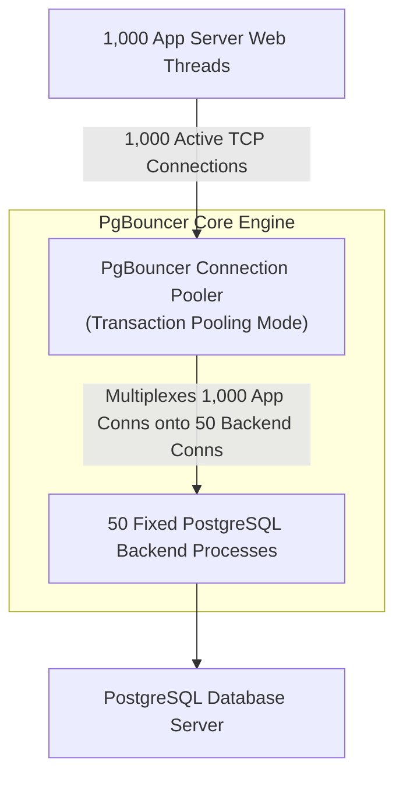

# Database Performance Tuning — EXPLAIN ANALYZE, Slow Query Log, Connection Pooling

## Mental Model

Think of **Database Performance Tuning** as diagnosing and optimizing an emergency room workflow in a hospital. 

When database CPU hits 100% or API latency spikes, guessing or blindly adding indexes is like prescribing random medicine without running blood tests. 

Tuning follows a strict empirical diagnostic hierarchy: First, **System & Bottleneck Monitoring** (CPU, Disk I/O, Buffer Pool Hit Ratio) identifies which resource is saturated. Second, **Slow Query Logs & Aggregated Statistics** (`pg_stat_statements`) pinpoint the top 1% of queries causing 90% of database load. Third, **Execution Plan Inspection (`EXPLAIN ANALYZE`)** reveals the exact internal failure—whether it is a missing index, a 1,000x cardinality misestimation, disk spill sorting, or connection exhaustion. Finally, **Connection Pooling (PgBouncer)** prevents process thrashing under high concurrency.

---

## 1. The 4-Step Performance Tuning Diagnostic Framework



---

## 2. EXPLAIN (ANALYZE, BUFFERS) Deep Dive

Reading and interpreting execution plans is the single most important skill in database tuning.

### Anatomy of PostgreSQL EXPLAIN Output

```sql
EXPLAIN (ANALYZE, BUFFERS, VERBOSE, COSTS)
SELECT o.order_id, c.customer_name, o.total_amount
FROM orders o
JOIN customers c ON o.customer_id = c.customer_id
WHERE o.status = 'PENDING' 
  AND o.created_at >= '2026-01-01';
```

### Deciphering the Execution Node Tree

```text
Nested Loop  (cost=0.42..1254.20 rows=5 width=48) (actual time=0.045..420.180 rows=15000 loops=1)
  Buffers: shared hit=420 read=12400
  ->  Index Scan using idx_orders_status_date on orders o  (cost=0.28..85.40 rows=5 width=16) (actual time=0.030..12.40 rows=15000 loops=1)
        Index Cond: ((status = 'PENDING'::text) AND (created_at >= '2026-01-01'::timestamptz))
        Buffers: shared hit=120 read=450
  ->  Index Scan using customers_pkey on customers c  (cost=0.14..0.22 rows=1 width=32) (actual time=0.025..0.026 rows=1 loops=15000)
        Index Cond: (customer_id = o.customer_id)
        Buffers: shared hit=300 read=11950
```

#### Diagnostic Red Flags in This EXPLAIN Output:

| Warning Indicator in EXPLAIN | Root Cause Analysis | Corrective Action Required |
|---|---|---|
| **Rows Misestimation** (`rows=5` vs `actual rows=15000`) | Stale column statistics or attribute correlation mask ($3000\text{x}$ off!). | Run `ANALYZE orders;` or create `CREATE STATISTICS`. |
| **Catastrophic Nested Loop Choice** (`loops=15000`) | Planner expected 5 rows, so it picked Nested Loop. Re-executing inner index scan 15,000 times caused **11,950 disk reads**! | Fixing cardinality estimation will force planner to choose a fast **Hash Join**. |
| **High Disk Reads vs Hits** (`shared hit=420 read=12400`) | Query is reading pages from physical disk instead of RAM. | Increase `shared_buffers` / Buffer Pool size or add a **Covering Index**. |

---

## 3. Profiling Workloads with `pg_stat_statements` & Slow Query Logs

Never optimize queries based on intuition. Use system statistics views to target the top queries consuming the most cumulative database time.

### Identifying Top Resource-Consuming Queries in PostgreSQL

```sql
-- Enable pg_stat_statements extension
CREATE EXTENSION IF NOT EXISTS pg_stat_statements;

-- Find Top 5 queries by Total Execution Time
SELECT 
    ROUND(total_exec_time::numeric / 1000, 2) AS total_time_sec,
    calls,
    ROUND(mean_exec_time::numeric, 2) AS mean_time_ms,
    ROUND(rows / calls, 0) AS avg_rows,
    ROUND(100.0 * shared_blks_hit / NULLIF(shared_blks_hit + shared_blks_read, 0), 2) AS hit_percent,
    SUBSTRING(query, 1, 100) AS truncated_query
FROM pg_stat_statements
ORDER BY total_exec_time DESC
LIMIT 5;
```

---

## 4. Connection Pooling Architecture (PgBouncer)

In PostgreSQL, every client connection spawns a **separate backend OS process** (`postgres: user db [local]`). Spawning a process consumes ~5MB–10MB of RAM and incurs heavy CPU fork overhead.



### PgBouncer Pooling Modes Comparison

| Mode | Connection Assigned | Connection Released | Support for Prepared Statements / Session State |
|---|---|---|---|
| **Session Pooling** (Default) | When client connects. | When client disconnects. | ✅ Full support. Lowest scaling efficiency. |
| **Transaction Pooling** (Recommended) | When transaction starts (`BEGIN`). | When transaction completes (`COMMIT`). | ⚠️ Requires `plan_cache_mode` care. **10x scaling efficiency!** |
| **Statement Pooling** | Per single SQL statement. | Immediately after statement completes. | ❌ Breaks multi-statement transactions. Avoid. |

---

## 5. Production Tuning Configuration Cheat Sheet

### PostgreSQL Production Tuning Parameters (`postgresql.conf` for 64GB RAM Server)

```text
# Memory Configuration
shared_buffers = 16GB                  # 25% of Total System RAM
work_mem = 64MB                         # Per-operator sort/hash memory
maintenance_work_mem = 2GB              # Memory for VACUUM, CREATE INDEX
effective_cache_size = 48GB             # Estimated OS Page Cache + shared_buffers

# Planner Cost Parameters (Tuned for NVMe SSD Storage)
seq_page_cost = 1.0
random_page_cost = 1.1                  # Set to 1.1 for SSDs (default 4.0 is for HDDs!)
effective_io_concurrency = 200          # Concurrent disk I/O channels

# Asynchronous WAL Writer & Checkpoint Tuning
checkpoint_completion_target = 0.9      # Spread checkpoint I/O over 90% of interval
max_wal_size = 16GB
min_wal_size = 2GB
```

---

## 6. Failure Modes and Trade-offs

1. **Connection Starvation / Fork Inflation Outage** — Allowing 2,000 web application instances to open direct connections to PostgreSQL (`max_connections = 2000`). Result: 2000 OS processes compete for 64 CPU cores, context-switching overhead consumes 90% of CPU time, and RAM is exhausted. *Mitigation*: Set `max_connections = 100` on PostgreSQL and deploy **PgBouncer** in transaction pooling mode.
2. **`work_mem` OOM Server Crash** — Setting `work_mem = 1GB` globally when queries perform 4 complex joins and sorts concurrently across 50 active worker threads ($1\text{GB} \times 4 \times 50 = 200\text{GB}$ memory request), triggering Linux Out-Of-Memory (OOM) killer to terminate PostgreSQL. *Mitigation*: Keep global `work_mem` modest (32MB–64MB) and set higher values per-session for batch reports.
3. **Index Over-Tuning Regression** — Creating 25 indexes on a single table to optimize every minor slow query, causing `INSERT`/`UPDATE` operations to slow down by 10x due to write amplification. *Mitigation*: Audit `pg_stat_user_indexes` and drop indexes with `idx_scan = 0`.

---

## 7. Active-Recall Prompts

1. **How do you interpret a 1,000x discrepancy between `rows` (estimated) and `actual rows` in an EXPLAIN ANALYZE output, and why does this cause the optimizer to choose bad joins?**
2. **What is the physical difference between an Index Scan, an Index-Only Scan, and a Bitmap Index Scan in PostgreSQL?**
3. **Why does spawning 1,000 direct database connections degrade PostgreSQL performance, and how does PgBouncer Transaction Pooling resolve it?**
4. **Why should `random_page_cost` be reduced from `4.0` to `1.1` when migrating a database from spinning HDDs to NVMe SSDs?**

---

## Related Notes

- [[Query Processing Pipeline - Parser, Rewriter, Planner, Executor]]
- [[Cost-Based Optimizer - Statistics, Cardinality Estimation, Join Ordering]]
- [[Query Execution - Join Algorithms, Aggregation, Sorting, Parallel Query]]
- [[B-Tree and B+ Tree Indexes - Structure, Search, Insert, Split]]
- [[Index Design Patterns - Composite, Covering, Partial, Expression Indexes]]

> **Interview Style Question:** *"You are called to resolve a high-severity production outage where database CPU is pinned at 100%, active backend connections are maxed out, and API p99 latency has spiked from 25ms to 12 seconds. Walk through your exact step-by-step diagnostic strategy using Linux commands (`top`, `iostat`), PostgreSQL system views (`pg_stat_activity`, `pg_stat_statements`), `EXPLAIN (ANALYZE, BUFFERS)` execution plan inspection, and PgBouncer connection pool tuning to restore cluster health."*

---
