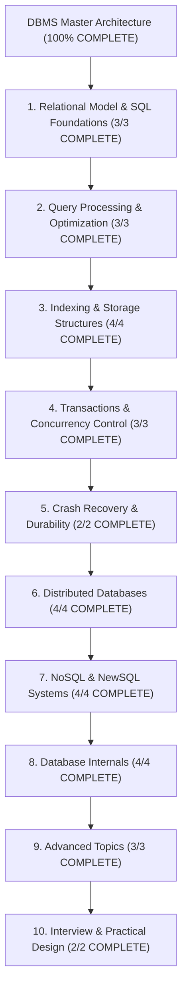

# Database Management Systems (DBMS) — Map of Content

> [!abstract] Architectural Mission
> This Map of Content organizes the complete **Database Management Systems** knowledge base, from relational theory and SQL fundamentals through query optimization, storage internals, concurrency control, crash recovery, distributed databases, and NoSQL/NewSQL systems. Coverage targets principal/staff engineer depth with production systems context (PostgreSQL, MySQL, SQLite, Spanner, Cassandra, MongoDB, Redis).

---

## 1. Relational Model & SQL Foundations (3/3 COMPLETE)

- [x] [[Relational Model - Tables, Keys, Functional Dependencies, Normalization]]
- [x] [[SQL Foundations - DDL, DML, Joins, Subqueries, Window Functions]]
- [x] [[SQL Advanced - CTEs, Recursive Queries, JSON Operations, Full-Text Search]]

---

## 2. Query Processing & Optimization (3/3 COMPLETE)

- [x] [[Query Processing Pipeline - Parser, Rewriter, Planner, Executor]]
- [x] [[Cost-Based Optimizer - Statistics, Cardinality Estimation, Join Ordering]]
- [x] [[Query Execution - Join Algorithms, Aggregation, Sorting, Parallel Query]]

---

## 3. Indexing & Storage Structures (4/4 COMPLETE)

- [x] [[B-Tree and B+ Tree Indexes - Structure, Search, Insert, Split]]
- [x] [[Hash Indexes and Adaptive Hash Index in MySQL InnoDB]]
- [x] [[LSM Tree - Log-Structured Merge Tree, Compaction, RocksDB]]
- [x] [[Index Design Patterns - Composite, Covering, Partial, Expression Indexes]]

---

## 4. Transactions & Concurrency Control (3/3 COMPLETE)

- [x] [[Transactions and ACID Properties - Atomicity, Consistency, Isolation, Durability]]
- [x] [[Concurrency Control - Two-Phase Locking, Deadlock Detection, Lock Granularity]]
- [x] [[MVCC - Multi-Version Concurrency Control, Snapshot Isolation, PostgreSQL vs MySQL]]

---

## 5. Crash Recovery & Durability (2/2 COMPLETE)

- [x] [[Write-Ahead Logging - WAL, Redo Log, Undo Log, fsync Guarantees]]
- [x] [[ARIES Recovery Protocol - Analysis, Redo, Undo Phases, Checkpointing]]

---

## 6. Distributed Databases (4/4 COMPLETE)

- [x] [[Distributed Database Fundamentals - CAP Theorem, PACELC, Consistency Models]]
- [x] [[Database Replication - Single-Leader, Multi-Leader, Leaderless, Raft Consensus]]
- [x] [[Database Sharding - Horizontal Partitioning, Consistent Hashing, Routing]]
- [x] [[Google Spanner and CockroachDB - TrueTime, Serializable Distributed Transactions]]

---

## 7. NoSQL & NewSQL Systems (4/4 COMPLETE)

- [x] [[Document Databases - MongoDB Architecture, WiredTiger, Aggregation Pipeline]]
- [x] [[Key-Value Stores - Redis Architecture, Data Structures, Persistence, Cluster]]
- [x] [[Wide-Column Stores - Apache Cassandra, SSTable, Consistent Hashing, Tunable Consistency]]
- [x] [[Graph Databases - Neo4j, Property Graph Model, Cypher, Traversal Algorithms]]

---

## 8. Database Internals (4/4 COMPLETE)

- [x] [[Buffer Pool Manager - Page Cache, Replacement Policies, Dirty Pages]]
- [x] [[Disk Storage and Page Format - Heap Files, Page Layout, Tuple Format]]
- [x] [[PostgreSQL Internals - MVCC Implementation, Tuple Header, VACUUM, Toast]]
- [x] [[MySQL InnoDB Architecture - Clustered Index, Buffer Pool, Doublewrite Buffer]]

---

## 9. Advanced Topics (3/3 COMPLETE)

- [x] [[Time-Series Databases - InfluxDB, TimescaleDB, Prometheus Storage]]
- [x] [[Search Engines - Elasticsearch, Inverted Index, TF-IDF, BM25, Relevance Scoring]]
- [x] [[Vector Databases - Embeddings, HNSW, ANN Search, pgvector]]

---

## 10. Interview & Practical Design (2/2 COMPLETE)

- [x] [[Database Design Interview Patterns - Normalization vs Denormalization Trade-offs]]
- [x] [[Database Performance Tuning - EXPLAIN ANALYZE, Slow Query Log, Connection Pooling]]

---

## Cross-Reference Topics

| Topic | Primary Note | Related Notes |
|-------|-------------|---------------|
| MVCC | MVCC note | PostgreSQL Internals, Transactions |
| B+ Tree | B+ Tree note | Buffer Pool, InnoDB Architecture |
| Raft Consensus | Replication note | Distributed Fundamentals, Spanner |
| LSM Tree | LSM Tree note | Cassandra, RocksDB, LevelDB |
| CAP Theorem | Distributed Fundamentals | Spanner, Cassandra, Redis Cluster |

---

*Last updated: 2026-08-18 | Status: COMPLETE (33 Canonical Notes + 1 MOC) | Subject 03 — DBMS*
