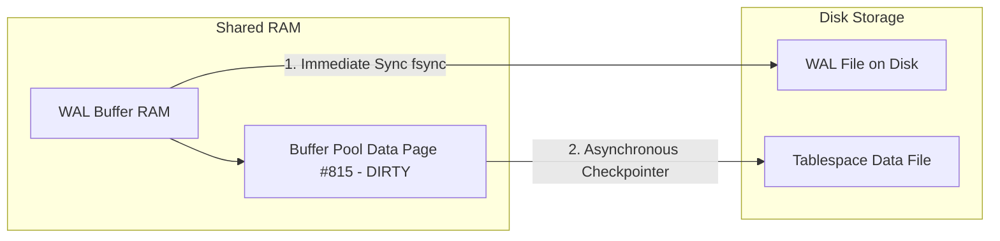

# From User Request to Database Commit

> [!abstract] Mental Model
> Executing a state-modifying HTTP request (e.g. `POST /api/v1/checkout`) triggers an end-to-end transaction pipeline traversing web server thread pools, database connection pooling, SQL parser/planner verification, concurrency control lock acquisition (Row Locks / MVCC tuples), buffer pool memory modification (Dirty Pages), Write-Ahead Log (WAL) sequential disk flushing (`fsync`), and network acknowledgment to guarantee ACID durability.

---

## 1. End-to-End Transaction Flow Architecture

```mermaid
sequenceDiagram
    autonumber
    participant App as App Thread (Spring/Go)
    participant Connection_Pool as DB Connection Pool (HikariCP)
    participant Parser_Planner as DB Parser & Query Planner
    participant Lock_Manager as DB Lock Manager & MVCC Engine
    participant Buffer_Pool as In-Memory Buffer Pool (RAM)
    participant WAL_Buffer as WAL Buffer & Disk (fsync)
    participant Client as Web Client

    App->>Connection_Pool: Rent DB Connection (TCP Socket)
    Connection_Pool->>Parser_Planner: Send "BEGIN; UPDATE accounts SET balance = balance - 100 WHERE id = 42; COMMIT;"
    Parser_Planner->>Parser_Planner: Parse SQL AST & Generate Physical Query Plan
    Parser_Planner->>Lock_Manager: Request Exclusive Row Lock (X-Lock on id=42)
    Lock_Manager-->>Parser_Planner: Lock Granted (Row-level lock in lock table)
    
    Parser_Planner->>Buffer_Pool: Fetch Page #815 containing Row #42
    Note over Buffer_Pool: Page in RAM Buffer Pool
    Buffer_Pool->>WAL_Buffer: Write WAL Record (LSN=1048576, Redo/Undo Payload)
    Buffer_Pool->>Buffer_Pool: Update Tuple in RAM Page #815 (Mark Page as DIRTY)
    
    Parser_Planner->>WAL_Buffer: COMMIT Command Issued -> Flush WAL Buffer to Disk
    WAL_Buffer->>WAL_Buffer: Execute fsync() system call on WAL Log File
    Note over WAL_Buffer: WAL Log Entry Persisted to Non-Volatile Storage (Durability Guaranteed)
    
    WAL_Buffer-->>Lock_Manager: Commit Success -> Release Row Lock
    Lock_Manager-->>App: Transaction Committed Successfully
    App-->>Client: Return HTTP 200 OK (Order Confirmed)
```

---

## 2. Deep Technical Stages & Internal Mechanics

### Stage 1: Connection Leasing & Protocol Parsing
- **Connection Rental**: The backend application leases an established TCP connection from a HikariCP / pgBouncer connection pool, avoiding per-request TCP handshakes.
- **AST Generation**: PostgreSQL server parses the SQL string into an Abstract Syntax Tree (AST), validates table schema against the System Catalog (`pg_class`, `pg_attribute`), and generates a physical execution plan.

### Stage 2: MVCC & Lock Acquisition
- **MVCC Snapshot**: The transaction is assigned a Transaction ID (`XID`).
- **Tuple Versioning**: Under Multi-Version Concurrency Control (MVCC), PostgreSQL does not overwrite the existing tuple in-place immediately; it creates a new tuple version with `xmin = XID` and sets `xmax = XID` on the old tuple.
- **Lock Management**: An Exclusive (`X`) row-level lock is recorded in the Lock Manager's hash table to prevent concurrent updates on `id = 42`.

### Stage 3: Buffer Pool & Write-Ahead Logging (WAL)
- **WAL First (Write-Ahead Logging Paradigm)**: Before any data page in RAM is modified, a Write-Ahead Log (WAL) record containing the Log Sequence Number (LSN), transaction ID, page offset, and redo data is appended to the WAL Buffer.
- **Dirty Page Creation**: The data page in the Shared Buffer Pool is modified in RAM and marked as `DIRTY`.



### Stage 4: Transaction Commit & `fsync`
- **COMMIT Execution**: When `COMMIT` is executed, the database issues an explicit `fsync()` system call flushing all unwritten WAL Buffer pages to non-volatile disk/NVMe storage.
- **ACID Guarantee**: Once `fsync()` completes on the WAL file, the transaction is officially **DURABLE**. Even if power fails 1 millisecond later, ARIES recovery will replay the WAL on startup to restore the modified state.
- **Asynchronous Data Page Flushing**: Background `checkpointer` / `bgwriter` processes write the dirty RAM data pages to actual table disk files lazily in batches, optimizing I/O throughput.

---

## 3. ACID Properties Breakdown

| Property | Implementation Mechanism |
| :--- | :--- |
| **Atomicity** | Transaction Rollback Segments / WAL Undo logs ensure all or no statements commit. |
| **Consistency** | Schema constraints (Unique, Foreign Keys, Check) evaluated before commit. |
| **Isolation** | MVCC tuple visibility rules + 2-Phase Locking (2PL) / SSI (Serializable Snapshot Isolation). |
| **Durability** | WAL append-only log flushed to disk via `fsync()` before returning commit confirmation. |

---

## Failure Modes & Production Performance Tuning

1. **WAL Flush Bottleneck (`fsync` stall)**: High write throughput causes disk I/O bottlenecks during `fsync()`.
   - *Mitigation*: Group Commit (batching WAL flushes across concurrent transactions), NVMe SSDs with battery-backed write caches, or configuring `synchronous_commit = off` for non-financial workloads.
2. **Buffer Pool Eviction Thrashing**: When working dataset exceeds `shared_buffers`, queries trigger synchronous disk page reads, degrading query performance.
3. **Long-Running Transactions & Table Bloat**: Uncommitted long transactions prevent MVCC `VACUUM` from reclaiming dead tuples, leading to storage bloat and slow index scans.

---

## Active Recall & Self-Assessment

1. **Question**: Why does PostgreSQL write changes to the WAL file before updating the data page on disk?
   - *Answer*: Sequential WAL writes are orders of magnitude faster than random data page disk writes. Flushes to WAL guarantee Durability immediately while deferring expensive data file updates to asynchronous background checkpointers.
2. **Question**: What is the role of the `fsync()` system call during transaction commit?
   - *Answer*: `fsync()` forces OS kernel disk buffer caches to physically write data to non-volatile storage media, ensuring the transaction survives hardware power outages.
3. **Question**: How does MVCC handle concurrent updates to the same database row?
   - *Answer*: The first updating transaction acquires an exclusive row lock and writes a new tuple version. Concurrent transactions attempting to update the same row block until the first transaction either commits or rolls back.

---

## Related Notes
- [[Database Management Systems MOC|03 - DBMS]]
- [[Relational Model - Tables, Keys, Functional Dependencies, Normalization|Relational Databases]]
- [[Transactions and ACID Properties - Atomicity, Consistency, Isolation, Durability|ACID Properties]]
- [[Write-Ahead Logging - WAL, Redo Log, Undo Log, fsync Guarantees|Write-Ahead Logging]]
- [[MVCC - Multi-Version Concurrency Control, Snapshot Isolation, PostgreSQL vs MySQL|MVCC]]
- [[Buffer Pool Manager - Page Cache, Replacement Policies, Dirty Pages|Buffer Pool Management]]
- [[Write-Ahead Logging - WAL, Redo Log, Undo Log, fsync Guarantees|ARIES Recovery]]
