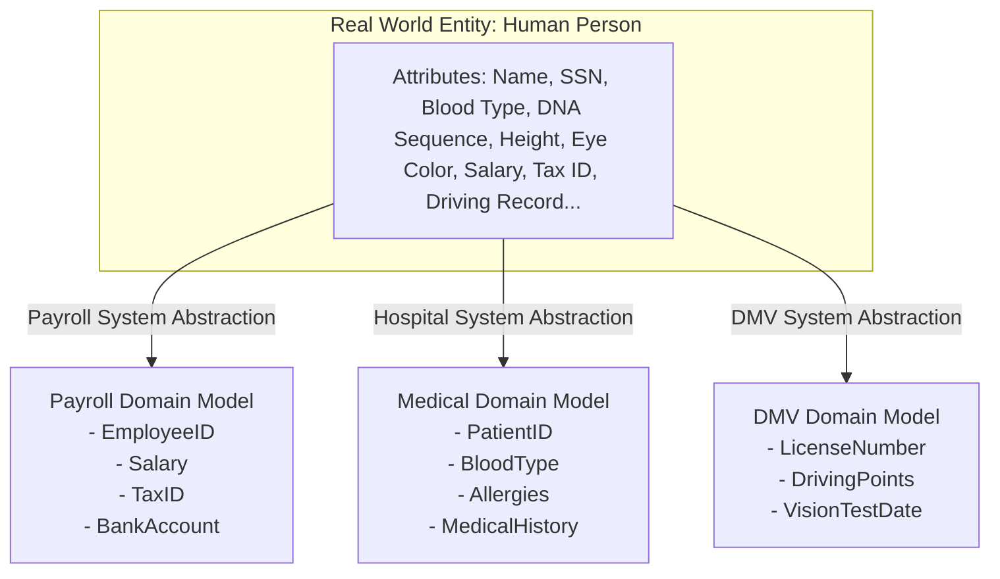
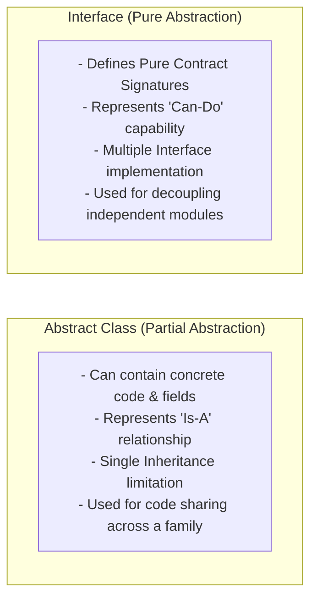
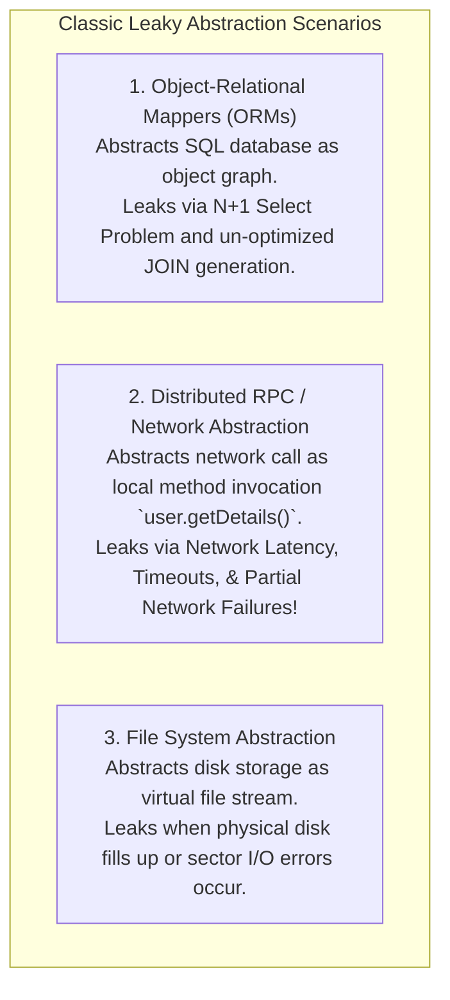

# Abstraction and Interface-Driven Design

## Mental Model

Think of **Abstraction** as the cockpit control panel of a commercial jet airliner. 

The pilot sees a clean, stable interface: a yoke, throttle levers, altitude gauges, and navigation screens (**Interface Abstraction**). The pilot does not need to know whether the jet engine under the wing is a Rolls-Royce Trent or a General Electric GE90, nor do they need to manually adjust internal fuel injector solenoid timings (**Implementation Hiding**). 

By programming the pilot's operations to the cockpit control contract rather than specific engine mechanics (**Program to Interfaces, Not Implementations**), the airline can swap or upgrade jet engines without retraining the pilot or redesigning the cockpit!

---

## 1. Defining Abstraction: Essential Features vs. Irrelevant Detail

**Abstraction** is the process of identifying the essential characteristics of an entity relative to a specific domain perspective, while hiding irrelevant, complex operational details.



> **Key Architectural Insight:** Abstraction is not about deleting information; it is about creating a **purposeful model** that exposes *only* the operations relevant to the caller's context.

---

## 2. Abstract Classes vs. Interfaces

Most modern object-oriented languages provide two primary mechanisms for creating abstractions: **Abstract Classes** and **Interfaces**.



### Architectural Comparison Matrix

| Dimension | Abstract Class | Interface |
|---|---|---|
| **Primary Intent** | Code sharing & partial implementation across closely related classes. | Defining a pure behavioral contract for unrelated classes. |
| **State / Fields** | Can maintain instance fields (`private int count;`). | No instance state (only static constants or immutable properties). |
| **Inheritance Model** | **Single Inheritance** (A class can extend only 1 abstract class). | **Multiple Implementation** (A class can implement 5 interfaces). |
| **Method Implementation** | Mix of concrete methods and abstract methods. | Pure method signatures (default methods in Java 8+ for backward compatibility). |
| **Conceptual Relationship** | **"Is-A"** (e.g., `Dog` is an `Animal`). | **"Can-Do / Behavior"** (e.g., `PaymentService` is `Serializable`, `Loggable`). |

---

## 3. The Core Design Rule: "Program to an Interface, Not an Implementation"

The fundamental guideline from the Gang of Four (GoF) design patterns:
> *"Program to an interface, not an implementation."*

### Anti-Pattern: Tightly Coupled to Concrete Implementation

```java
// BAD: High coupling to concrete MySQL implementation
public class OrderProcessor {
    private MySQLDatabaseConnection database; // Coupled to specific DB!
    private SendGridEmailSender emailSender;   // Coupled to specific Email vendor!

    public OrderProcessor() {
        this.database = new MySQLDatabaseConnection("jdbc:mysql://localhost...");
        this.emailSender = new SendGridEmailSender("api_key_123");
    }

    public void processOrder(Order order) {
        database.saveOrder(order);
        emailSender.sendReceipt(order.getAccountEmail(), order.getTotal());
    }
}
// Consequence: Unit testing is IMPOSSIBLE without a real MySQL server & SendGrid API key!
```

---

### Clean Pattern: Program to Interfaces (Dependency Injection)

```java
// STEP 1: Define Stable Behavior Contracts (Interfaces)
public interface DataRepository {
    void saveOrder(Order order);
}

public interface NotificationService {
    void sendReceipt(String email, double amount);
}

// STEP 2: Client code depends EXCLUSIVELY on Interfaces
public class OrderProcessor {
    private final DataRepository repository;       // Interface Abstraction
    private final NotificationService notifier; // Interface Abstraction

    // Dependencies injected via Constructor (DIP / Inversion of Control)
    public OrderProcessor(DataRepository repository, NotificationService notifier) {
        this.repository = Objects.requireNonNull(repository);
        this.notifier = Objects.requireNonNull(notifier);
    }

    public void processOrder(Order order) {
        this.repository.saveOrder(order);
        this.notifier.sendReceipt(order.getAccountEmail(), order.getTotal());
    }
}

// STEP 3: Plug in ANY Concrete Implementation at Runtime!
// Production Environment:
DataRepository pgRepo = new PostgresOrderRepository(dataSource);
NotificationService awsEmail = new AwsSesNotificationService(awsCredentials);
OrderProcessor prodProcessor = new OrderProcessor(pgRepo, awsEmail);

// Unit Test Environment (Sub-Millisecond Mock In-Memory Test):
DataRepository mockRepo = new InMemoryMockRepository();
NotificationService mockNotifier = new MockNotificationService();
OrderProcessor testProcessor = new OrderProcessor(mockRepo, mockNotifier);
```

---

## 4. Leak-Free Abstractions & The Law of Leaky Abstractions

Joel Spolsky formulated the **Law of Leaky Abstractions**:
> *"All non-trivial abstractions, to some degree, are leaky."*

A **Leaky Abstraction** occurs when underlying implementation details force their way through the abstract interface, compelling the caller to handle internal mechanics.

### Common Leaky Abstractions in Enterprise Systems



#### How to Design Leak-Resistant Abstractions:
1. **Never Leak Vendor-Specific Exceptions:** Catch low-level vendor errors (`SQLException`, `MongoException`) and wrap them in domain-specific abstractions (`DataAccessException`).
2. **Acknowledge Network Realities:** RPC and remote interfaces must explicitly accept network failure modes (e.g., returning `Result<T, NetworkError>` or accepting timeouts).

---

## 5. Architectural Comparison Matrix

| Approach | Coupling Level | Testability | Refactoring Safety | Maintenance Cost |
|---|---|---|---|---|
| **Direct Concrete Classes** | **High** | ❌ Hard (Requires live DB/Network). | ❌ Fragile (Changes ripple across codebase). | High. |
| **Abstract Base Classes** | Medium | ⚠️ Moderate (Requires subclass mocks). | ⚠️ Moderate (Fragile base class risk). | Moderate. |
| **Interface-Driven Design** | **Low** | ✅ **Extremely High** (Instant Mock/Fake injection). | ✅ **Maximum** (Swap implementation completely). | **Low** (Decoupled boundaries). |

---

## 6. Failure Modes and Trade-offs

1. **Interfaceitis (Over-Abstraction)** — Creating a 1-to-1 interface for every single concrete class in the codebase (`IUserService` implemented by `UserService` with zero second implementations). Result: Doubling the number of files and navigate-to-definition steps in IDEs without providing any real architectural decoupling. *Mitigation*: Create interfaces when multiple implementations exist, or when crossing distinct boundary layers (e.g., DB/Network boundaries).
2. **Leaking Implementation Types in Interface Signatures** — Declaring interface methods that leak concrete implementation data types (`public void saveOrder(SQLConnection conn, ResultSet rs)`). Result: The interface is bound to SQL forever. *Mitigation*: Use pure domain DTOs or entities in interface parameters.
3. **Header/Interface Pollution (Bloated Interfaces)** — Adding 50 unrelated methods to a single `IApplicationManager` interface. *Mitigation*: Apply the **Interface Segregation Principle (ISP)** to break large interfaces into focused role interfaces.

---

## 7. Active-Recall Prompts

1. **What does the principle "Program to an interface, not an implementation" mean, and how does constructor dependency injection support it?**
2. **Compare Abstract Classes vs. Interfaces across State, Inheritance models, and Conceptual relationships ("Is-A" vs. "Can-Do").**
3. **What is the Law of Leaky Abstractions? Give two examples of how ORMs or RPC frameworks leak underlying implementation details.**
4. **Why is creating `IUserService` for a single `UserService` class considered an over-abstraction anti-pattern if no second implementation or boundary mock exists?**

---

## Related Notes

- [[Encapsulation, Data Hiding, and Information Hiding]]
- [[Inheritance, Subtyping, and Composition vs Inheritance]]
- [[Interface Segregation Principle - ISP and Decoupling]]
- [[Dependency Inversion Principle - DIP and Dependency Injection Containers]]
- [[Adapter Pattern - Class vs Object Adapters and Interface Translation]]

> **Interview Style Question:** *"Design a multi-cloud storage abstraction layer capable of seamlessly uploading and streaming files to AWS S3, Google Cloud Storage, or a local disk filesystem. Write the core interface contracts in Java/TypeScript, demonstrate Dependency Injection, show how you prevent vendor-specific S3 SDK exceptions from leaking through the abstraction boundary, and write a unit test using an In-Memory Fake implementation."*

---
