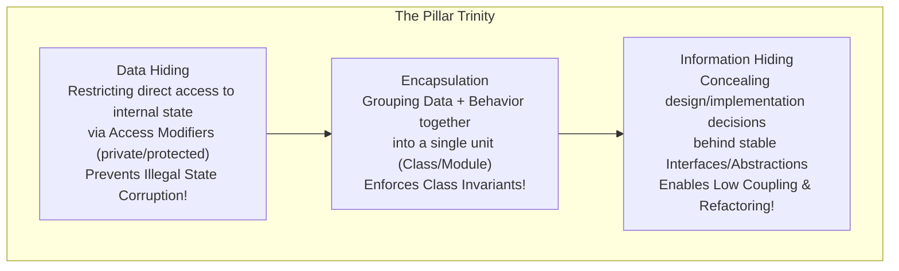

# Encapsulation, Data Hiding, and Information Hiding

## Mental Model

Think of an **Encapsulated Object** as a high-security automated teller machine (ATM). 

You do not reach inside the machine to manually modify the binary balance digits stored in memory (**No Direct Field Access / Data Hiding**). You interact exclusively through a secure, controlled interface: entering your PIN and pressing `Withdraw $100` (**Information Hiding / Abstraction**). The ATM validates your balance, updates internal accounting registers, and dispenses cash while enforcing safety invariants (**Encapsulation**). 

If the internal banking software switches from SQL to Redis or changes integer precision, your external interaction remains completely unchanged—the internal implementation details are hidden behind stable contractual boundaries.

---

## 1. Disambiguating the Three Core Concepts

While often used interchangeably in casual software engineering conversations, **Encapsulation**, **Data Hiding**, and **Information Hiding** represent distinct architectural principles.



### Comparative Analysis Matrix

| Concept | Primary Focus | Mechanism / Implementation | Major Engineering Benefit |
|---|---|---|---|
| **Encapsulation** | **Bundling & Invariant Enforcement:** Grouping state attributes and methods operating on that state into a coherent boundary. | Classes, Structs with methods, Modules, Objects. | **Invariant Protection:** Prevents invalid state transitions (e.g., negative bank balances). |
| **Data Hiding** | **Access Control:** Restricting visibility of internal fields to prevent external mutation. | `private`, `protected`, `package-private` access modifiers, getters/setters. | **Security & Integrity:** External code cannot corrupt internal variables arbitrarily. |
| **Information Hiding** | **Decoupling & Abstraction:** Concealing volatile implementation details behind stable contracts. | Interfaces, Abstract Classes, Pimpl Idiom, Encapsulated Algorithms. | **Maintainability:** Internal implementation can be completely rewritten without breaking callers. |

---

## 2. Enforcing Class Invariants

An **Invariant** is an assertion about an object's internal state that is guaranteed to evaluate to `TRUE` throughout the object's entire lifecycle (after constructor completion and before/after any public method execution).

### The Invariant Violation Anti-Pattern (Un-encapsulated Class)

```java
// BAD: Public fields expose internal state directly (Zero Encapsulation)
public class BankAccount {
    public String accountId;
    public double balance; // DANGER: Any external code can set balance = -99999.99!
    public String currency;
}

// Caller code corrupts invariants anywhere in the codebase:
BankAccount acc = new BankAccount();
acc.balance = -500.00; // INVARIANT BROKEN! No validation or enforcement!
```

---

### Encapsulated Class (Invariant Guarding)

```java
// GOOD: Proper Encapsulation with Data Hiding and Invariant Enforcement
public final class BankAccount {
    private final String accountId;
    private double balance; // Data Hiding
    private final Currency currency;

    public BankAccount(String accountId, double initialDeposit, Currency currency) {
        if (accountId == null || accountId.isBlank()) {
            throw new IllegalArgumentException("Account ID cannot be null or empty.");
        }
        if (initialDeposit < 0.0) {
            throw new IllegalArgumentException("Initial deposit cannot be negative.");
        }
        this.accountId = accountId;
        this.balance = initialDeposit;
        this.currency = Objects.requireNonNull(currency, "Currency is required.");
    }

    // Public API enforces invariants on state transitions
    public synchronized void withdraw(double amount) {
        if (amount <= 0.0) {
            throw new IllegalArgumentException("Withdrawal amount must be positive.");
        }
        if (amount > this.balance) {
            throw new InsufficientFundsException("Insufficient funds. Current balance: " + this.balance);
        }
        this.balance -= amount; // Invariant preserved: balance >= 0.0 ALWAYS!
    }

    public synchronized void deposit(double amount) {
        if (amount <= 0.0) {
            throw new IllegalArgumentException("Deposit amount must be positive.");
        }
        this.balance += amount;
    }

    public double getBalance() {
        return this.balance; // Controlled Read Access
    }
}
```

---

## 3. Information Hiding via Pimpl Idiom (C++)

In C++, including `private` header fields forces client code to recompile whenever internal private fields change (header dependency coupling).

The **Pimpl (Pointer to Implementation) Idiom** achieves strict Information Hiding by moving private members into an opaque internal struct:

```cpp
// ===== AccountService.h (Public Header - ZERO Private Implementation Details) =====
#pragma once
#include <memory>
#include <string>

class AccountService {
public:
    AccountService();
    ~AccountService();
    
    // Public API stable interface
    bool ProcessTransfer(const std::string& sourceId, const std::string& destId, double amount);

private:
    // Opaque pointer hides all private fields, third-party DB drivers, and internal mutexes!
    class Impl;
    std::unique_ptr<Impl> pImpl;
};
```

```cpp
// ===== AccountService.cpp (Private Implementation File) =====
#include "AccountService.h"
#include <mutex>
#include <iostream>

// Private struct hidden completely from callers compiling AccountService.h
class AccountService::Impl {
public:
    std::mutex serviceMutex;
    std::string databaseConnectionString;
    
    bool ExecuteTransferInternal(const std::string& src, const std::string& dst, double amt) {
        std::lock_guard<std::mutex> lock(serviceMutex);
        std::cout << "Executing secure transfer of $" << amt << " from " << src << " to " << dst << "\n";
        return true;
    }
};

AccountService::AccountService() : pImpl(std::make_unique<Impl>()) {}
AccountService::~AccountService() = default;

bool AccountService::ProcessTransfer(const std::string& sourceId, const std::string& destId, double amount) {
    return pImpl->ExecuteTransferInternal(sourceId, destId, amount);
}
```

---

## 4. Encapsulation Leaks & How to Prevent Them

Even when fields are marked `private`, encapsulation can be broken inadvertently via **Reference Leaks**.

### A. Mutable Object Getter Leak

```java
// DANGEROUS: Leaking mutable internal reference
public class UserProfile {
    private Date birthDate; // Date is mutable in Java!

    public Date getBirthDate() {
        return this.birthDate; // LEAK! Returns direct reference to internal private object!
    }
}

// Caller mutates internal state without calling any setter:
UserProfile profile = new UserProfile();
Date leakedDate = profile.getBirthDate();
leakedDate.setTime(0); // MUTATES INTERNAL STATE OF UserProfile DIRECTLY!
```

#### Remediation: Defensive Copying or Immutable Types

```java
// SAFE: Return Defensive Copy or use Instant/LocalDate (Immutable)
public Date getBirthDateDefensive() {
    return new Date(this.birthDate.getTime()); // Defensive Copy
}

// BEST PRACTICE: Use modern immutable types
private final LocalDate birthDate; // Immutable! Safe to return directly.
```

---

### B. Mutable Collection Leak

```java
// DANGEROUS: Returning direct reference to internal collection
public class ShoppingCart {
    private final List<Item> items = new ArrayList<>();

    public List<Item> getItems() {
        return this.items; // LEAK! External callers can call cart.getItems().clear()!
    }
}

// SAFE: Return Unmodifiable View
public List<Item> getItems() {
    return Collections.unmodifiableList(this.items); // Throws UnsupportedOperationException on edit!
}
```

---

## 5. Architectural Comparison Matrix

| Encapsulation Approach | Security / Safety | Refactoring Flexibility | Performance Impact |
|---|---|---|---|
| **Public Fields (No Encapsulation)** | ❌ Zero (Invariants easily broken). | ❌ Zero (Renaming field breaks all callers). | Minimal (Direct memory access). |
| **Naive Getters & Setters** | ⚠️ Low (Anemic Domain Model). | ⚠️ Low (Exposes implementation structure). | Low (Function call overhead inlined by JIT). |
| **Domain-Driven Encapsulation** | ✅ **High** (State modified only via intent methods). | ✅ **High** (Internal layout hidden behind domain API). | Low. |
| **Information Hiding (Pimpl / Interfaces)** | ✅ **Maximum** (Zero private headers visible). | ✅ **Maximum** (ABI compatibility preserved). | Pointer indirection (~1 extra dereference). |

---

## 6. Failure Modes and Trade-offs

1. **Anemic Domain Model (Getter/Setter Overuse)** — Generating public getters and setters for every single private field automatically using IDE generators or Lombok `@Data`. The class becomes a passive data structure, and business logic spreads across external service layers. *Mitigation*: Replace raw setters with intention-revealing domain methods (`applyDiscount()` instead of `setPrice()`).
2. **Performance Overhead in High-Frequency Inner Loops** — Calling deep getter method hierarchies inside a $1,000,000,000$ iteration numerical simulation loop where pointer dereferencing delays processing. *Mitigation*: Allow package-private or C++ `friend` access in tightly coupled performance-critical kernel code, or rely on C++ inline functions / Java JIT inline optimizations.
3. **Serialization Breakage** — Reflection-based serializers (e.g., Jackson JSON parser or Java Native Serialization) bypassing private constructors and encapsulation boundaries to set fields directly, creating un-validated objects. *Mitigation*: Annotate constructors explicitly (`@JsonCreator`) to route deserialization through validation logic.

---

## 7. Active-Recall Prompts

1. **Differentiate between Encapsulation, Data Hiding, and Information Hiding. Give a concrete code example of each.**
2. **What is a Class Invariant, and how does Encapsulation ensure that an object's state is valid upon constructor return and after any public method execution?**
3. **What is the Pimpl (Pointer to Implementation) idiom in C++, and how does it reduce compilation dependencies and preserve ABI compatibility?**
4. **How does returning a direct reference to a private `java.util.Date` or `java.util.List` create an Encapsulation Leak, and how do Defensive Copying or Unmodifiable Views prevent it?**

---

## Related Notes

- [[Abstraction and Interface-Driven Design]]
- [[Single Responsibility Principle - SRP and Cohesion]]
- [[Open-Closed Principle - OCP and Extensibility]]
- [[Process Address Space]]

> **Interview Style Question:** *"In a Staff Engineer code review, a developer presents a `FinancialPortfolio` class containing `private List<Position> positions;` and a public `getPositions()` method returning `this.positions`. Explain the security and architectural vulnerabilities of this design, demonstrate how external code can bypass class validation, and rewrite the class to enforce strict encapsulation, defensive copying, and immutable collection views."*

---
