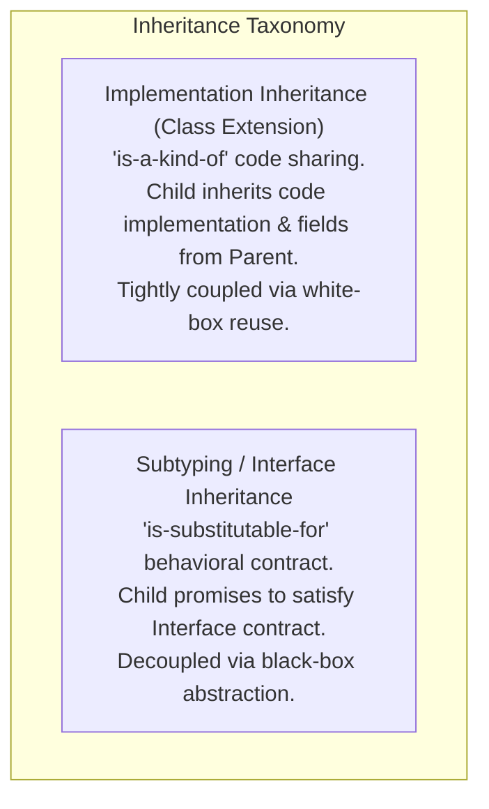
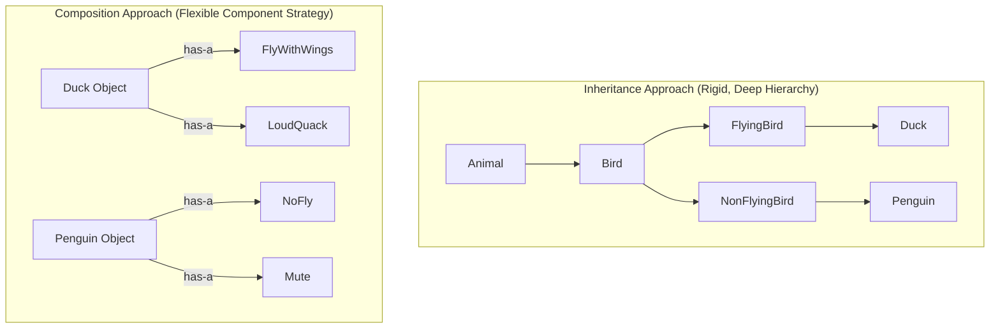

# Inheritance, Subtyping, and Composition vs. Inheritance

## Mental Model

Think of **Class Inheritance ("Is-A")** as a rigid genetic inheritance tree (a *Penguin* inheriting from a *Bird* class that has a `fly()` method). If the base class evolves or makes assumptions about flight, the penguin is forced to inherit behavior it cannot fulfill, breaking the system. 

Think of **Composition ("Has-A")** as a modular Lego system. Instead of creating a complex hierarchy of rigid sub-species, an object contains small, pluggable components (`FlyingBehavior`, `SwimmingBehavior`, `QuackingBehavior`). A *Penguin* object is constructed by composing `NonFlyingBehavior` and `SwimmingBehavior` at runtime. If requirements change, you swap out components dynamically without breaking or inheriting fragile base-class code.

---

## 1. Class Inheritance vs. Subtyping (Interface Inheritance)

In object-oriented programming, developers frequently confuse **Implementation Inheritance** (code reuse via class inheritance) with **Subtyping** (interface inheritance).



### Key Differences

| Property | Implementation Inheritance (`extends Class`) | Subtyping / Interface Inheritance (`implements Interface`) |
|---|---|---|
| **Primary Goal** | **Code Reuse:** Share implementation methods and state variables between classes. | **Polymorphism & Contract:** Guarantee that subtype adheres to interface methods. |
| **Coupling Level** | **High (White-Box Reuse):** Child depends on parent's internal state and private/protected implementation. | **Low (Black-Box Reuse):** Child interacts strictly through public contract signatures. |
| **Flexibility** | Static (Fixed at compile time in languages like Java/C++). | Dynamic (Can switch implementations at runtime). |
| **Fragility Risk** | High (**Fragile Base Class Problem**). | Low (Changing one implementation doesn't break others). |

---

## 2. The Fragile Base Class Problem

The **Fragile Base Class Problem** occurs when an seemingly innocent modification to a base class unintentionally breaks derived child classes because the child relied on internal implementation details of the parent.

### The Classic Fragile Base Class Scenario (Java)

```java
// Base Class (Parent)
public class CustomHashSet<E> {
    private int addCount = 0;

    public boolean add(E element) {
        addCount++;
        // Insert into underlying hash table...
        return true;
    }

    public boolean addAll(Collection<? extends E> elements) {
        boolean modified = false;
        for (E element : elements) {
            // Internal Implementation Detail: Calls add() in a loop!
            if (add(element)) {
                modified = true;
            }
        }
        return modified;
    }

    public int getAddCount() { return addCount; }
}

// Derived Child Class that wants to count total elements added
public class InstrumentedHashSet<E> extends CustomHashSet<E> {
    private int instrumentedCount = 0;

    @Override
    public boolean add(E element) {
        instrumentedCount++;
        return super.add(element);
    }

    @Override
    public boolean addAll(Collection<? extends E> elements) {
        instrumentedCount += elements.size();
        return super.addAll(elements); // DANGER!
    }
    
    public int getInstrumentedCount() { return instrumentedCount; }
}
```

#### What Goes Wrong?
If a developer calls `instrumentedSet.addAll(List.of("A", "B", "C"))`:
1. `InstrumentedHashSet.addAll()` runs: `instrumentedCount += 3` (Count = 3).
2. It calls `super.addAll()`.
3. `CustomHashSet.addAll()` iterates over 3 elements, calling `this.add()` for each.
4. Because method dispatch is dynamic (**Polymorphism**), `this.add()` invokes `InstrumentedHashSet.add()` 3 times!
5. `InstrumentedHashSet.add()` increments `instrumentedCount` 3 more times!
6. **Result:** `instrumentedCount` is **6 instead of 3**! The subclass count is completely corrupted due to white-box implementation coupling!

---

## 3. Favor Composition Over Inheritance (FCoI)

The Gang of Four (GoF) principle states:
> *"Favor object composition over class inheritance."*

Instead of inheriting behavior, a class delegates behavior to internal component interfaces.



### Refactoring to Composition (Strategy Pattern)

```java
// Step 1: Define Behavior Interfaces (Black-box contracts)
public interface FlyBehavior {
    void fly();
}

public interface QuackBehavior {
    void quack();
}

// Step 2: Implement Concrete Behavior Strategies
public class FlyWithWings implements FlyBehavior {
    public void fly() { System.out.println("Flying high in the sky!"); }
}

public class NoFly implements FlyBehavior {
    public void fly() { System.out.println("Cannot fly, I walk on ground."); }
}

public class LoudQuack implements QuackBehavior {
    public void quack() { System.out.println("QUACK! QUACK!"); }
}

// Step 3: Compose Behaviors inside Main Class
public class Duck {
    private FlyBehavior flyBehavior;   // Composition ("Has-A")
    private QuackBehavior quackBehavior; // Composition ("Has-A")

    public Duck(FlyBehavior flyBehavior, QuackBehavior quackBehavior) {
        this.flyBehavior = Objects.requireNonNull(flyBehavior);
        this.quackBehavior = Objects.requireNonNull(quackBehavior);
    }

    public void performFly() {
        this.flyBehavior.fly(); // Delegation!
    }

    public void performQuack() {
        this.quackBehavior.quack(); // Delegation!
    }

    // Dynamic Behavior Swapping at Runtime!
    public void setFlyBehavior(FlyBehavior newFlyBehavior) {
        this.flyBehavior = newFlyBehavior;
    }
}
```

---

## 4. When IS Inheritance Appropriate?

Inheritance is not intrinsically evil; it is misused when applied for simple code reuse instead of true behavioral subtyping.

### The 3 Rules for Valid Inheritance:
1. **The Relationship is a True "Is-A" Relationship:** The child class is genuinely a specialized subtype of the parent, satisfying the **Liskov Substitution Principle (LSP)**.
2. **Subtype Substitutability:** Any client code expecting a parent type `P` can consume child type `C` without knowing the difference or experiencing broken invariants.
3. **Designed and Documented for Inheritance:** The parent class is explicitly designed for extension (e.g., Template Method pattern with `protected` hook methods) or marked `final` to prevent illegal extension.

---

## 5. Trade-off & Decision Matrix

| Dimension | Inheritance (`extends`) | Composition (`has-a`) |
|---|---|---|
| **Coupling** | **Tight (White-Box):** Exposes parent internal implementation. | **Loose (Black-Box):** Interacts via interface methods only. |
| **Runtime Mutability** | Static (Cannot change base class behavior at runtime). | **Dynamic:** Can swap component instances at runtime. |
| **Code Duplication** | Low for simple hierarchies. | Requires small delegation wrappers (`this.b.method()`). |
| **Extensibility** | Hard (Adding a method to parent affects all children). | Easy (Plug new implementation into existing interface). |
| **Class Explosions** | High Risk ($2^N$ subclass combinations for $N$ features). | Zero Risk (Combinations formed via object graph assembly). |

---

## 6. Failure Modes and Trade-offs

1. **The Diamond Problem (Multiple Inheritance)** — Class D extends both B and C, which both extend A. If B and C override `A.method()`, which implementation does D inherit? *Mitigation*: Java and C# forbid multiple class inheritance, allowing multiple interface implementation instead; C++ uses `virtual` base classes (`class B : virtual public A`).
2. **Class Explosion Anti-Pattern** — Creating an inheritance tree for every permutation of features (`Window`, `BorderedWindow`, `ScrollableWindow`, `BorderedScrollableWindow`). Result: 32 subclasses for 5 boolean flags. *Mitigation*: Refactor using the **Decorator Pattern** or **Bridge Pattern** (Composition).
3. **Over-Delegation Boilerplate** — Using composition to wrap an interface with 50 methods, forcing 50 pass-through delegation calls (`public void foo() { target.foo(); }`). *Mitigation*: Use language forwarding features (e.g., Kotlin class delegation `by`) or Lombok `@Delegate`.

---

## 7. Active-Recall Prompts

1. **What is the difference between Implementation Inheritance (`extends`) and Subtyping (`implements`)? Which one creates white-box coupling?**
2. **Demonstrate the Fragile Base Class problem using an example where overriding a parent method causes double-counting due to internal self-use.**
3. **What does the principle "Favor Composition Over Inheritance" mean in terms of object relationships, and how does it enable runtime behavior swapping?**
4. **What is the Class Explosion problem, and how does the Decorator Pattern use Composition to prevent $2^N$ subclass hierarchies?**

---

## Related Notes

- [[Encapsulation, Data Hiding, and Information Hiding]]
- [[Liskov Substitution Principle - LSP and Subtyping Invariants]]
- [[Polymorphism - Dynamic Binding, Virtual Method Tables, Method Overloading vs Overriding]]
- [[Decorator Pattern - Dynamic Behavior Extension and Wrapper Chaining]]

> **Interview Style Question:** *"You are reviewing a game codebase where `Monster`, `Dragon`, `FlyingDragon`, `SwimmingDragon`, `ZombieDragon`, and `ZombieFlyingDragon` form a 5-level deep class inheritance tree. Explain the architectural flaws of this hierarchy, demonstrate how class explosion and the Fragile Base Class problem manifest, and refactor the system to an interface-driven Component/Strategy Composition model."*

---
