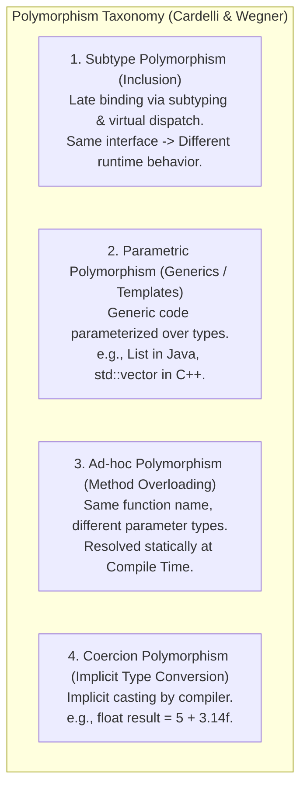
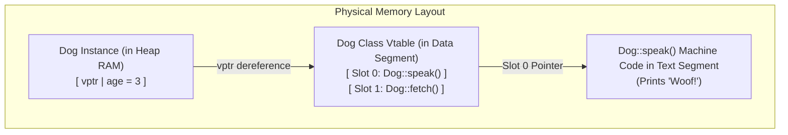

# Polymorphism — Dynamic Binding, Virtual Method Tables, Method Overloading vs. Overriding

## Mental Model

Think of **Polymorphism ("Many Forms")** as a universal AC power socket on a wall. 

The wall socket defines a single uniform contract: "Supply 120V AC Power". You can plug in a toaster, a laptop charger, or a vacuum cleaner (**Subtypes**). The socket does not need to know the internal wiring of each appliance; when it calls `supply_power()`, each appliance reacts with its own unique behavior (**Dynamic Binding / Late Binding**). 

Under the hood, compiled languages like C++ and Java achieve this runtime magic using an array of function pointers stored in memory called a **Virtual Method Table (vtable)**. When a method is called on an abstract pointer, the CPU looks up the vtable offset at runtime to jump directly to the child's machine code instructions.

---

## 1. The Taxonomy of Polymorphism

In computer science, polymorphism spans four major forms:



---

## 2. Compile-Time Overloading vs. Runtime Overriding

| Feature | Method Overloading (Ad-hoc) | Method Overriding (Subtype) |
|---|---|---|
| **Binding Time** | **Compile Time** (Static Binding / Early Binding). | **Run Time** (Dynamic Binding / Late Binding). |
| **Resolution Mechanism** | Compiler selects method based on **static type** of parameters. | CPU selects method based on **actual runtime object type** via vtable. |
| **Class Relationship** | Occurs within the same class or across parent/child. | Occurs across Parent and Child class hierarchy. |
| **Signature Requirement** | Same method name, **different parameter types/counts**. | **Identical method name, parameter types, and return type** (or covariant return). |
| **Performance Overhead** | **Zero Runtime Overhead** (Direct function call in assembly). | Minor Overhead (1 extra memory pointer dereference via vtable). |

---

## 3. Dynamic Dispatch Mechanics: How Vtables Work (C++ / Java Memory Model)

When a class declares a `virtual` method (or any non-final method in Java), the compiler inserts hidden memory structures to support dynamic dispatch.

### Memory Layout of Objects with Virtual Functions

Every object instance of a class with virtual functions contains a hidden 8-byte pointer called the **Virtual Pointer (`vptr`)**, which points to the class's **Virtual Method Table (`vtable`)**.

```text
Memory Layout of Object Instance in RAM:
+------------------------------------+
| vptr (8-byte Pointer to vtable)   | ──► [ Points to Class Vtable in Read-Only Memory ]
+------------------------------------+
| int age (Member Attribute)         |
| double balance (Member Attribute)  |
+------------------------------------+
```

```text
Class Vtable Structure (Read-Only Data Segment):
+-------------------------------------------------------------+
| Slot 0: TypeInfo Pointer (RTTI)                             |
| Slot 1: Function Pointer to Animal::speak()                |
| Slot 2: Function Pointer to Dog::fetch()                    |
+-------------------------------------------------------------+
```

### Visualizing Vtable Resolution Across Hierarchy



### Assembly Execution Comparison: Static vs. Dynamic Call

#### 1. Static Function Call (No Virtual Keyword / Overloaded Method):
```assembly
# Compiler generates direct call to fixed memory address:
call 0x400580 <Animal::eat()>    # Resolved entirely at Compile Time!
```

#### 2. Dynamic Virtual Function Call (`animalPtr->speak()`):
```assembly
# Compiler generates 3-step indirect call via vptr:
mov rax, [rdi]            # Step 1: Load vptr from object (offset 0) into register RAX
mov rax, [rax + 8]        # Step 2: Load function pointer at vtable Slot 1 (offset 8) into RAX
call rax                  # Step 3: Indirect jump to rax! (Resolved at Run Time!)
```

---

## 4. Code Implementation: C++ vs. Java

### C++ Virtual Dispatch & Virtual Destructors

```cpp
#include <iostream>
#include <memory>

class BaseAnimal {
public:
    BaseAnimal() { std::cout << "BaseAnimal Constructor\n"; }
    
    // CRITICAL: Virtual Destructor guarantees Child cleanup on delete!
    virtual ~BaseAnimal() { std::cout << "BaseAnimal Destructor\n"; }

    // Pure Virtual Function -> Makes class Abstract
    virtual void MakeSound() const = 0; 
};

class Dog : public BaseAnimal {
public:
    Dog() { std::cout << "Dog Constructor\n"; }
    ~Dog() override { std::cout << "Dog Destructor (Freeing Dog resources)\n"; }

    void MakeSound() const override {
        std::cout << "Woof! Woof!\n";
    }
};

int main() {
    // Polymorphic pointer assignment
    std::unique_ptr<BaseAnimal> animal = std::make_unique<Dog>();
    
    // Dynamic Binding via Vtable dispatch!
    animal->MakeSound(); // Prints: "Woof! Woof!"
    
    // Unique_ptr goes out of scope -> Calls ~Dog() then ~BaseAnimal() correctly!
    return 0;
}
```

> ⚠️ **CRITICAL C++ WARNING:** If a class has ANY virtual functions, its destructor **MUST** be declared `virtual ~BaseClass()`. Otherwise, deleting a child object through a base pointer (`Base* b = new Child()`) will call ONLY `~Base()`, leaking all child memory!

---

## 5. Architectural Trade-offs & Performance Impact

| Polymorphism Type | Performance Overhead | Flexibility | Memory Overhead |
|---|---|---|---|
| **Static Overloading / C++ Templates** | **Zero** (Inlined machine code). | High at compile-time; zero runtime changes. | Code bloat (template instantiation duplicates assembly). |
| **Dynamic Subtype (Virtual Vtables)** | **1 Extra Memory Load + CPU Branch Misprediction Risk**. | **Maximum** (Pluggable runtime behavior). | +8 bytes per object (`vptr`) + vtable per class. |

### The Micro-benchmark Penalty of Virtual Calls
1. **Instruction Cache (I-Cache) Misses:** Direct function calls jump to predictable code addresses pre-fetched by CPU hardware. Indirect `call rax` jumps to arbitrary addresses, causing I-Cache misses.
2. **Inlining Inhibition:** Compilers cannot inline virtual methods unless the concrete object type can be proven at compile-time (**Devirtualization**).

---

## 6. Failure Modes and Trade-offs

1. **Non-Virtual Destructor Memory Leak (C++)** — Omitting `virtual` on a parent class destructor when deleting child instances via parent pointers (`Base* ptr = new Derived()`). Result: `~Derived()` is never invoked, causing memory leaks, un-closed file descriptors, and dangling pointers. *Mitigation*: Mark base destructors `virtual` or `protected non-virtual`.
2. **Slicing Problem (C++)** — Assigning a derived object value directly to a base object value (`Base b = derivedInstance;`). The derived portion of the object is chopped off ("sliced"), destroying polymorphism and resetting the vptr back to `Base`. *Mitigation*: Pass polymorphic objects by reference (`Base&`) or pointer (`std::unique_ptr<Base>`).
3. **Over-Polymorphism Anti-Pattern** — Creating interface abstractions and virtual hierarchies for classes that will only ever have one single implementation. Result: Unnecessary code indirection and performance penalties without any architectural benefit. *Mitigation*: Follow YAGNI (You Aren't Gonna Need It); introduce interfaces when multiple implementations arise.

---

## 7. Active-Recall Prompts

1. **What is a Virtual Method Table (vtable) and a Virtual Pointer (`vptr`)? How do they enable dynamic method dispatch at runtime?**
2. **Compare Method Overloading (Ad-hoc) vs. Method Overriding (Subtype) across Binding Time, Assembly Execution, and Performance Overhead.**
3. **Why MUST a base class destructor be marked `virtual` in C++ if derived objects are managed via base class pointers?**
4. **Explain Object Slicing in C++ and why passing polymorphic objects by reference or pointer prevents it.**

---

## Related Notes

- [[Inheritance, Subtyping, and Composition vs Inheritance]]
- [[Abstraction and Interface-Driven Design]]
- [[Liskov Substitution Principle - LSP and Subtyping Invariants]]
- [[Strategy Pattern - Algorithmic Interchangeability and Policy Objects]]

> **Interview Style Question:** *"Trace the exact low-level assembly execution steps of a virtual function call `ptr->render()` in C++. Explain how `vptr` and `vtable` interact in RAM, calculate the exact memory layout of an object with 2 virtual methods and an `int`, and explain why calling a virtual function prevents compiler inlining and introduces CPU branch misprediction penalties."*

---
