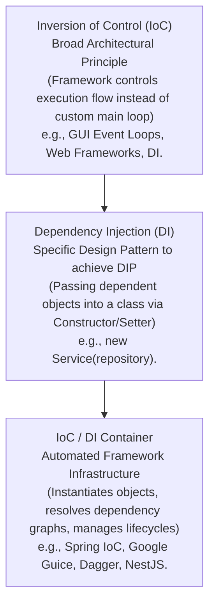
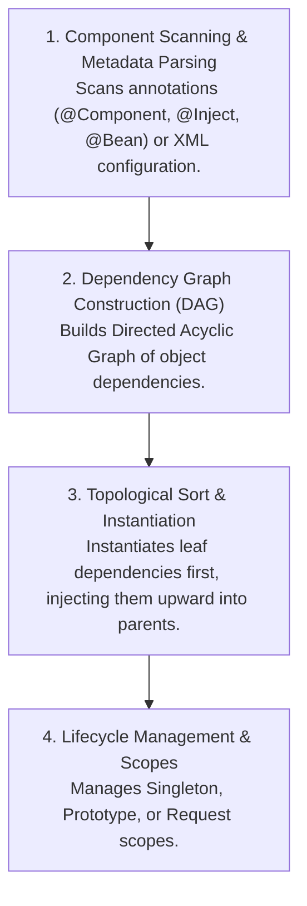

# Dependency Inversion Principle — DIP and Dependency Injection Containers

## Mental Model

Think of the **Dependency Inversion Principle (DIP)** as a standard 3-prong AC electrical wall socket and a lamp. 

If you hardwire your living room lamp directly into the copper electrical cables inside your house wall (**High-Level Module Direct Dependency on Low-Level Concrete Details**), moving the lamp or plugging in a fan requires cutting wires, turning off the main circuit breaker, and calling an electrician. 

By introducing an abstract wall socket interface (**Dependency Inversion**), the house wiring depends on the socket standard, and the lamp plug depends on the exact same socket standard. Both high-level architecture (the house) and low-level appliances (lamps, fans, TVs) meet at an abstract contract boundary. A **Dependency Injection (DI) Container** acts as the automated electrician that plugs the right appliance into the right socket when the house turns on!

---

## 1. Defining DIP: High-Level vs. Low-Level Modules

Formulated by Robert C. Martin, DIP consists of two core mandates:

> 1. **High-level modules should not depend on low-level modules. Both should depend on abstractions.**
> 2. **Abstractions should not depend on details. Details should depend on abstractions.**

```mermaid
flowchart TD
    subgraph TraditionalDependency["Traditional Architecture (Violates DIP)"]
        HighLevel1["High-Level Domain Logic\n(OrderProcessingService)"] -->|Direct Dependency| LowLevel1["Low-Level Detail\n(PostgreSQLDatabase)"]
        HighLevel1 -->|Direct Dependency| LowLevel2["Low-Level Detail\n(SendGridEmailSender)"]
        Note1["DANGER: Changes in Low-Level DB/Email drivers\nforce recompilation of High-Level Domain Rules!"]
    end

    subgraph InvertedDependency["Inverted Architecture (Obeying DIP)"]
        HighLevel2["High-Level Domain Logic\n(OrderProcessingService)"] -->|Depends on| InterfaceDB["OrderRepository (Interface)"]
        HighLevel2 -->|Depends on| InterfaceNotifier["NotificationService (Interface)"]
        
        ConcreteDB["PostgresOrderRepository (Detail)"] ..|Implements / Inverts| InterfaceDB
        ConcreteNotifier["SendGridNotifier (Detail)"] ..|Implements / Inverts| InterfaceNotifier
        
        Note2["BENEFIT: Control Flow goes Down, but\nSource Code Dependency goes UP (Inverted)!"]
    end
```

### High-Level vs. Low-Level Definitions
- **High-Level Module:** Contains the core business logic, domain rules, and use-case workflows (e.g., `OrderProcessor`, `LoanCalculator`). It represents the identity and value of the application.
- **Low-Level Module:** Contains infrastructure implementation details, external I/O, database drivers, UI frameworks, or HTTP clients (e.g., `MySQLDriver`, `AWS_S3_Uploader`).

---

## 2. Inversion of Control (IoC) vs. Dependency Injection (DI)

These three terms are frequently confused in software engineering interviews:



### The 3 Types of Dependency Injection

#### 1. Constructor Injection (Recommended Standard)
Dependencies are passed through the class constructor. Guarantees that the object is **always in a valid state** upon instantiation and allows fields to be marked `final`/`readonly`.

```java
public class OrderProcessor {
    private final DataRepository repository; // immutable & non-null

    public OrderProcessor(DataRepository repository) {
        this.repository = Objects.requireNonNull(repository, "Repository required");
    }
}
```

#### 2. Setter / Property Injection
Dependencies are supplied via public setter methods. Useful for optional dependencies or dynamic reconfiguration, but risks `NullPointerException` if called before setter execution.

```java
public class OrderProcessor {
    private DataRepository repository;

    public void setRepository(DataRepository repository) {
        this.repository = repository;
    }
}
```

#### 3. Interface Injection
The dependency specifies an injection interface that the target class must implement. (Rarely used in modern enterprise Java/C#).

---

## 3. Dependency Injection Containers (Spring IoC / Guice Internals)

Manually constructing complex object graphs (**Pure DI / Poor Man's DI**) becomes cumbersome in large enterprise systems:

```java
// Manual Composition Root (Pure DI without Container)
DataSource ds = new HikariDataSource(config);
OrderRepository repo = new PostgresOrderRepository(ds);
EmailClient emailClient = new SendGridEmailClient(apiKey);
NotificationService notifier = new EmailNotificationService(emailClient);
OrderProcessor processor = new OrderProcessor(repo, notifier);
```

### How an IoC Container Automates Object Graph Construction

An **IoC Container** performs three automated steps at application startup:



### Reflection & DAG Resolution Example

```java
// Spring IoC Container Example (@Service and @Autowired / @Inject)
@Service
public class OrderProcessor {
    private final DataRepository repository;
    private final NotificationService notifier;

    // Spring automatically inspects constructor parameters, locates beans in DAG, and injects them!
    @Autowired
    public OrderProcessor(DataRepository repository, NotificationService notifier) {
        this.repository = repository;
        this.notifier = notifier;
    }
}
```

---

## 4. Architectural Comparison Matrix

| Approach | Coupling Level | Testability | Setup Overhead | Framework Lock-in |
|---|---|---|---|---|
| **Hardcoded `new` Operator** | **High** (Tightly bound to concrete details). | ❌ Zero (Cannot mock DB/Network). | None. | None. |
| **Service Locator Pattern** | Medium (Hides dependencies). | ⚠️ Hard (Dependencies hidden inside locator). | Low. | Low. |
| **Constructor DI (Pure DI)** | **Low** (Explicit contracts). | ✅ **Maximum** (Pass mocks directly). | Moderate (Manual wiring). | **Zero** (Pure OOP). |
| **DI Container (Spring/Guice)** | **Low** (Automated wiring). | ✅ **Maximum** (SpringTest / Mockito). | Low (Automated annotations). | High (Framework annotations). |

---

## 5. Failure Modes and Trade-offs

1. **Service Locator Anti-Pattern** — Replacing DI with a static `ServiceLocator.get(DataRepository.class)` call inside classes. The class signature (`new OrderProcessor()`) pretends it has no dependencies, but calling `processOrder()` throws a runtime crash if the Service Locator wasn't pre-populated! *Mitigation*: Avoid Service Locators; use explicit Constructor Injection.
2. **Circular Dependency Deadlock** — Class A requires Class B in its constructor, while Class B requires Class A (`A -> B -> A`). The DI Container fails to construct the DAG and throws `BeanCurrentlyInCreationException`. *Mitigation*: Redesign domain boundaries; introduce a third coordinating class or use `@Lazy`/Setter injection for one leg.
3. **Field Injection Anti-Pattern (`@Autowired private DataRepository repo;`)** — Injecting dependencies directly into private fields via reflection without constructors. Result: Objects cannot be instantiated or tested in pure JUnit unit tests without booting the entire slow Spring Test Container! *Mitigation*: Always use Constructor Injection.

---

## 6. Active-Recall Prompts

1. **State the two mandates of the Dependency Inversion Principle (DIP). What makes a module "High-Level" vs. "Low-Level"?**
2. **Differentiate between Inversion of Control (IoC), Dependency Injection (DI), and a DI Container.**
3. **Why is Constructor Injection universally preferred over Field Injection (`@Autowired private ...`) in clean architecture?**
4. **Explain the Service Locator Anti-Pattern and why it hides dependencies compared to Constructor Injection.**

---

## Related Notes

- [[Abstraction and Interface-Driven Design]]
- [[Interface Segregation Principle - ISP and Decoupling]]
- [[Single Responsibility Principle - SRP and Cohesion]]
- [[Open-Closed Principle - OCP and Extensibility]]
- [[Factory Method Pattern - Virtual Constructors and Extensible Object Creation]]

> **Interview Style Question:** *"You are reviewing a legacy backend codebase where high-level business services instantiate concrete MySQL and Stripe SDK objects directly using `new MySQLDatabase()`. Demonstrate how this violates DIP, explain why unit testing requires a live database, refactor the application to use DIP with Constructor Injection, and sketch the Directed Acyclic Graph (DAG) an IoC container like Spring constructs to initialize the application."*

---
