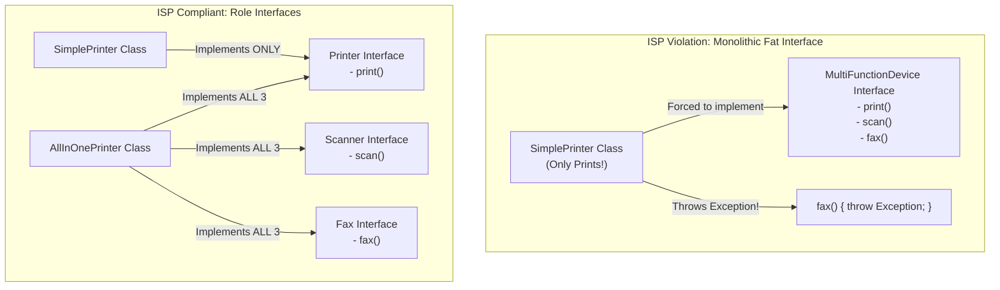
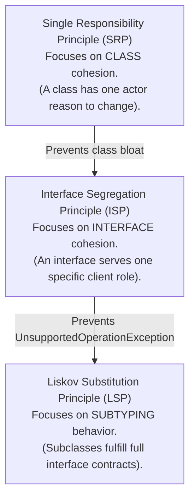

# Interface Segregation Principle — ISP and Decoupling

## Mental Model

Think of the **Interface Segregation Principle (ISP)** as a multi-function electrical wall socket vs. specialized role plugs. 

If a multi-function printer manufacturer forces you to connect to a single monolithic 50-pin cable that includes wiring for Printing, Scanning, Faxing, and Stapling (**Fat Interface / Interface Pollution**), a simple computer that only wants to print is forced to carry wire connections for Faxing and Stapling (**Forced Dependency**). If the Faxing protocol changes, the printing computer must update its driver. 

ISP mandates creating small, dedicated **Role Interfaces** (`Printer`, `Scanner`, `FaxMachine`). A device implements only the specific role interfaces it actually supports, decoupling consumers from capabilities they never use.

---

## 1. Defining ISP: Robert C. Martin’s Formulation

Formulated by Robert C. Martin, ISP states:

> **"Clients should not be forced to depend upon interfaces that they do not use."**



### The Core Architectural Goal
To keep interfaces **small, cohesive, and focused on specific caller roles**, preventing modifications to unused features from causing ripple-effect recompilations or runtime crashes in unrelated modules.

---

## 2. Fat Interfaces vs. Role Interfaces

A **Fat Interface** (Polluted Interface) accumulates methods belonging to multiple distinct responsibilities or caller profiles over time.

### Code Comparison: Monolithic vs. Role-Segregated

#### Violating ISP (Fat Interface Anti-Pattern)

```java
// BAD: Fat Interface polluting multiple client roles
public interface MultiFunctionDevice {
    void print(Document doc);
    void scan(Document doc);
    void fax(Document doc);
    void staple(Document doc);
}

// Simple Desktop Printer forced to implement methods it cannot support
public class EconomicPrinter implements MultiFunctionDevice {
    @Override
    public void print(Document doc) {
        System.out.println("Printing document: " + doc.getTitle());
    }

    // FORCED DUMMY IMPLEMENTATIONS (LSP + ISP VIOLATIONS!)
    @Override
    public void scan(Document doc) {
        throw new UnsupportedOperationException("EconomicPrinter cannot scan!");
    }

    @Override
    public void fax(Document doc) {
        throw new UnsupportedOperationException("EconomicPrinter cannot fax!");
    }

    @Override
    public void staple(Document doc) {
        throw new UnsupportedOperationException("EconomicPrinter cannot staple!");
    }
}
```

---

#### Obeying ISP (Role Interfaces)

```java
// STEP 1: Segregate into Granular Role Interfaces
public interface Printer {
    void print(Document doc);
}

public interface Scanner {
    void scan(Document doc);
}

public interface Fax {
    void fax(Document doc);
}

public interface Stapler {
    void staple(Document doc);
}

// STEP 2: Concrete classes implement ONLY the role interfaces they support!

// Simple Printer implements ONLY Printer
public class EconomicPrinter implements Printer {
    @Override
    public void print(Document doc) {
        System.out.println("Printing document: " + doc.getTitle());
    }
}

// Advanced All-In-One Office Workstation implements multiple interfaces
public class HeavyDutyOfficeWorkstation implements Printer, Scanner, Fax, Stapler {
    @Override public void print(Document doc) { System.out.println("Printing..."); }
    @Override public void scan(Document doc) { System.out.println("Scanning..."); }
    @Override public void fax(Document doc) { System.out.println("Faxing..."); }
    @Override public void staple(Document doc) { System.out.println("Stapling..."); }
}
```

---

## 3. Client-Driven Interface Segregation

In clean architecture, **interfaces belong to the client that consumes them**, not to the concrete service that implements them!

```mermaid
flowchart LR
    subgraph ClientDecoupling["Client-Driven Role Views"]
        BillingClient["Billing Module"] -->|Consumes| PayableIF["Payable Interface\n- getAmount()\n- getTaxID()"]
        ShippingClient["Shipping Module"] -->|Consumes| ShippableIF["Shippable Interface\n- getWeight()\n- getDimensions()"]
        
        OrderEntity["Order Domain Entity"] ..|Implements Both| PayableIF & ShippableIF
    end
```

### Benefits of Client-Driven Role Interfaces
1. **Minimal Recompilation:** A change to the `Shippable` interface recompiles **only** the Shipping Module, leaving the Billing Module unaffected.
2. **Enhanced Security & Principle of Least Privilege:** The `BillingClient` code receives a `Payable` reference—it is physically impossible for the billing system to accidentally invoke shipping logic!

---

## 4. Relationship Between ISP, SRP, and LSP

The SOLID principles are deeply interconnected:



- Violating **ISP** (creating a Fat Interface) almost always forces subclasses to throw `UnsupportedOperationException`, which directly violates **LSP**!
- Applying **SRP** to classes naturally leads to applying **ISP** to interfaces.

---

## 5. Architectural Decision Matrix

| Metric | Monolithic Fat Interface | Segregated Role Interfaces |
|---|---|---|
| **Interface Size** | Large ($10-50+$ methods). | Small ($1-5$ methods). |
| **Coupling Level** | **High:** Clients recompile on unrelated changes. | **Low:** Clients depend only on needed methods. |
| **LSP Compliance** | Low (Dummy methods / Exceptions). | **High** (100% of methods implemented). |
| **Mocking / Unit Testing** | Complex (Must mock 20 unused methods). | **Trivial** (Mock 1 or 2 target methods). |

---

## 6. Failure Modes and Trade-offs

1. **Micro-Interface Explosion (Single-Method Extravaganza)** — Over-segregating interfaces until every interface has exactly 1 method (`IValuable`, `IDescribable`, `INameable`, `IPrintable`, `ISavable`). Result: Class headers become unreadable (`implements I1, I2, I3, I4, I5, I6, I7, I8`). *Mitigation*: Group methods that are logically cohesive and consumed together by the same client actor into a single role interface.
2. **Default Method Abuse (Java 8+)** — Attempting to solve a Fat Interface by adding `default` empty implementation methods (`default void fax() {}`). While it prevents compile errors in `SimplePrinter`, it hides the design flaw, leaving dead, non-functional methods exposed to callers. *Mitigation*: Refactor to separate interfaces instead of hiding fat interfaces with default methods.
3. **Breaking Client Binary Compatibility** — Adding a new method to an existing published public library interface. Every external client implementation breaks on library upgrade. *Mitigation*: Create a new extended interface (`ExtendedPrinter extends Printer`) or use default methods carefully for library backward compatibility.

---

## 7. Active-Recall Prompts

1. **State the Interface Segregation Principle (ISP). What is a "Fat Interface"?**
2. **How does violating ISP lead directly to violating the Liskov Substitution Principle (LSP)?**
3. **Why do clean architecture guidelines state that "interfaces belong to the client that consumes them, not the service that implements them"?**
4. **Compare Fat Interfaces vs. Role Interfaces regarding client recompilation and unit test mocking.**

---

## Related Notes

- [[Abstraction and Interface-Driven Design]]
- [[Single Responsibility Principle - SRP and Cohesion]]
- [[Liskov Substitution Principle - LSP and Subtyping Invariants]]
- [[Dependency Inversion Principle - DIP and Dependency Injection Containers]]
- [[Adapter Pattern - Class vs Object Adapters and Interface Translation]]

> **Interview Style Question:** *"You are inspecting a legacy Java enterprise repository containing a 40-method `IUserManager` interface used by Authentication, Billing, Customer Service, and Analytics services. Explain how this violates ISP, demonstrate how a change requested by Billing forces re-deployment of the Analytics service, and refactor the architecture into role-segregated interfaces (`Authenticatable`, `BillableUser`, `CustomerProfileView`)."*

---
