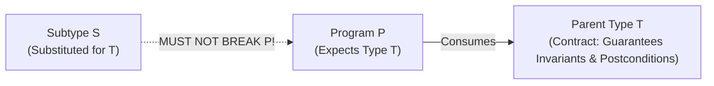
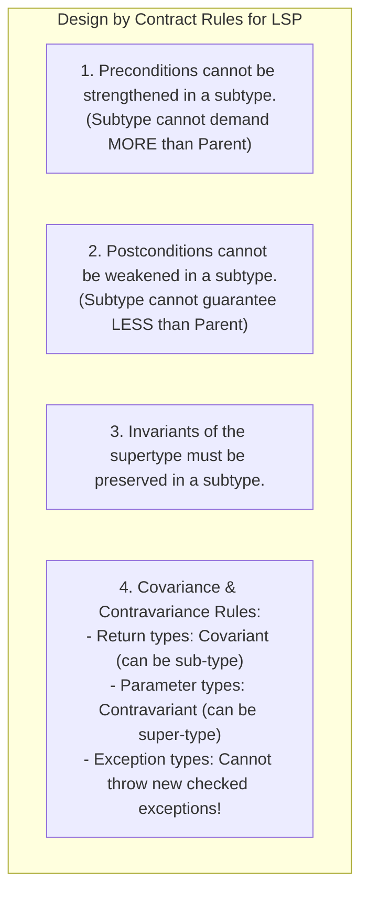

# Liskov Substitution Principle — LSP and Subtyping Invariants

## Mental Model

Think of the **Liskov Substitution Principle (LSP)** as a universal battery standard ($1.5\text{V}$ AA battery). 

If your remote control requires a standard AA battery (**Parent Type Contract**), you can insert an Alkaline battery, a NiMH rechargeable battery, or a Lithium battery (**Subtypes**). The remote control works seamlessly without knowing or caring about the internal chemistry. 

However, if a manufacturer creates a "Custom Battery" that looks like a AA battery but operates at $12\text{V}$ or explodes when requested to deliver current (**LSP Violation**), the remote control breaks. A subtype must **never** break the implicit or explicit assumptions, preconditions, postconditions, or invariants established by the parent type contract.

---

## 1. Defining LSP: Barbara Liskov’s Formal Specification

Formulated by Turing Award winner Barbara Liskov in 1987, LSP provides the mathematical definition for behavioral subtyping:

> **"If for each object $o_1$ of type $S$ there is an object $o_2$ of type $T$ such that for all programs $P$ defined in terms of $T$, the behavior of $P$ is unchanged when $o_1$ is substituted for $o_2$, then $S$ is a subtype of $T$."**



### The Core Mandate of LSP
Subclasses must be **behaviorally substitutable** for their base classes. Derived classes must enhance, not violate, the behavioral contracts established by their parent interfaces.

---

## 2. The Classic LSP Violation: The Square-Rectangle Problem

In elementary geometry, a Square is a special type of Rectangle ($A \subset B$). In object-oriented programming, making `Square` inherit from `Rectangle` breaks LSP!

```mermaid
flowchart TD
    subgraph LSPViolationGeometry["The Square-Rectangle Dilemma"]
        Rect["Rectangle Class\nsetWidth(w)\nsetHeight(h)\nArea = w * h"]
        Square["Square Class (Extends Rectangle)\nsetWidth(w) -> sets BOTH w and h!\nsetHeight(h) -> sets BOTH w and h!"]
        
        Rect <|-- Square
    end
```

### The Broken Code

```java
// Parent Base Class
public class Rectangle {
    protected double width;
    protected double height;

    public void setWidth(double width) { this.width = width; }
    public void setHeight(double height) { this.height = height; }
    public double getArea() { return this.width * this.height; }
}

// Child Class (Breaks LSP!)
public class Square extends Rectangle {
    @Override
    public void setWidth(double width) {
        this.width = width;
        this.height = width; // Enforces square property, BUT BREAKS RECTANGLE INVARIANT!
    }

    @Override
    public void setHeight(double height) {
        this.width = height;
        this.height = height;
    }
}

// Client Code testing Rectangles
public class GeometryTester {
    public static void verifyRectangleArea(Rectangle r) {
        r.setWidth(5);
        r.setHeight(4);
        // Expectation according to Rectangle contract: 5 * 4 = 20!
        assert r.getArea() == 20.0 : "LSP VIOLATION! Expected 20, got " + r.getArea();
    }
}

// Execution:
Rectangle rect = new Rectangle();
GeometryTester.verifyRectangleArea(rect); // PASSES!

Rectangle square = new Square();
GeometryTester.verifyRectangleArea(square); // FAILS! Assertion Error: Expected 20, got 16!
```

#### Why `Square extends Rectangle` Fails LSP:
The `Rectangle` class establishes a postcondition for `setHeight(h)`: *Updating height alters height without modifying width.* `Square` violates this postcondition by mutating width as a side-effect, breaking client code!

---

## 3. Formal Design by Contract (DbC) Rules for LSP

To satisfy LSP, a subtype must adhere to Bertrand Meyer's **Design by Contract (DbC)** rules across four dimensions:



### 1. Preconditions (Input Validation Rules)
- **Rule:** A subtype can **loosen (weaken)** preconditions, but **cannot strengthen** them.
- *Violation Example:* Parent accepts any integer `x`. Subtype throws `IllegalArgumentException` if `x < 0`. Subtype strengthened preconditions $\to$ **LSP Violation!**

### 2. Postconditions (Output Guarantees)
- **Rule:** A subtype can **strengthen** postconditions, but **cannot weaken** them.
- *Violation Example:* Parent guarantees returned list is non-null and sorted. Subtype returns unsorted list. Subtype weakened postconditions $\to$ **LSP Violation!**

### 3. Subtype Variance Rules (Signatures)

| Signature Element | Standard Rule | Description |
|---|---|---|
| **Return Types** | **Covariant** | Subtype method can return a **more specific** child type (`Dog` instead of `Animal`). |
| **Parameter Types** | **Contravariant** | Subtype method can accept a **more general** parent type. |
| **Exceptions Thrown** | **Covariant** | Subtype method can throw fewer or sub-typed exceptions, but **never new checked exceptions**! |

---

## 4. Common LSP Violation Anti-Patterns in Enterprise Code

### Anti-Pattern 1: Throwing `UnsupportedOperationException` (The Refused Bequest)

```java
// BAD: Violates LSP! ReadOnlyFile is NOT substitutable for File System write methods!
public class ReadOnlyFile extends CustomFile {
    @Override
    public void write(byte[] data) {
        // REFUSED BEQUEST: Throws Exception on base class method!
        throw new UnsupportedOperationException("ReadOnlyFile does not support writing!");
    }
}

// Client code suffers runtime crash:
public void ProcessFiles(List<CustomFile> files) {
    for (CustomFile f : files) {
        f.write(new byte[]{0x01}); // CRASH when f is ReadOnlyFile!
    }
}
```

#### Remediation: Segregate Interfaces (ISP + LSP)
Split `CustomFile` into `ReadableFile` and `WritableFile` interfaces!

---

### Anti-Pattern 2: `instanceof` / Type Checking Code Smells

If client code is forced to check `if (object instanceof SpecialChild)` before invoking methods, LSP is violated!

```java
// BAD: Violates LSP! Client MUST type-check because child breaks parent expectations!
public void renderShape(Shape shape) {
    if (shape instanceof Circle) {
        ((Circle) shape).drawCircle();
    } else if (shape instanceof Square) {
        ((Square) shape).drawSquare();
    }
}

// GOOD: Proper Polymorphic Subtyping (LSP Compliant)
public void renderShape(Shape shape) {
    shape.draw(); // Polymorphic dispatch works for ALL shapes without type-checking!
}
```

---

## 5. Architectural Decision Matrix

| Code Symptom | LSP Status | Root Cause | Architectural Remediation |
|---|---|---|---|
| `throw new UnsupportedOperationException()` in subclass | ❌ **Violated** | Forcing subclass to inherit behavior it cannot support. | Segregate parent into focused role interfaces. |
| `if (obj instanceof SubClass)` in client code | ❌ **Violated** | Subclass requires special handling due to broken abstraction. | Refactor to pure virtual polymorphic methods. |
| Subclass method mutates side-effect fields | ❌ **Violated** | Subclass breaks superclass postconditions (Square/Rectangle). | Replace inheritance with **Composition**. |
| Subclass overrides methods cleanly adhering to contract | ✅ **Compliant** | True behavioral subtyping. | Continue using. |

---

## 6. Failure Modes and Trade-offs

1. **"Is-A" Real-World Mental Trap** — Assuming real-world relationships dictate class inheritance (e.g., "An Ostrich is a Bird, so `Ostrich extends Bird`"). In code, `Bird` has a `fly()` method, which `Ostrich` cannot fulfill. *Mitigation*: Design hierarchies based on **Behavioral Capabilities**, not real-world taxonomy.
2. **Weakening Exception Contracts** — Adding broad `throws Exception` to child overrides in languages like C++, breaking caller try-catch logic. *Mitigation*: Restrict child exceptions strictly to covariant exception types declared in the parent contract.
3. **Leaky Subclass State Invariants** — Subclass allowing `null` values into a field that the parent class guaranteed was non-null, causing downstream `NullPointerException` crashes in inherited parent methods.

---

## 7. Active-Recall Prompts

1. **State the Liskov Substitution Principle (LSP). What does it mean for a subtype to be "behaviorally substitutable"?**
2. **Why does making `Square extends Rectangle` break LSP even though a Square is geometrically a Rectangle?**
3. **Explain the Design by Contract (DbC) rules for LSP regarding Preconditions, Postconditions, and Exception throwing.**
4. **Why is throwing `UnsupportedOperationException` inside an overridden base class method a clear indicator of an LSP violation?**

---

## Related Notes

- [[Inheritance, Subtyping, and Composition vs Inheritance]]
- [[Open-Closed Principle - OCP and Extensibility]]
- [[Interface Segregation Principle - ISP and Decoupling]]
- [[Encapsulation, Data Hiding, and Information Hiding]]

> **Interview Style Question:** *"In a Staff Engineer architectural review, a developer presents a `ReadOnlyAccount` class inheriting from `BankAccount` that overrides `withdraw()` to throw a `RuntimePermissionException`. Identify the SOLID principle violated, explain why this breaks client code, and demonstrate how to refactor the account hierarchy using interface segregation (ISP) and composition to enforce strict LSP compliance."*

---
