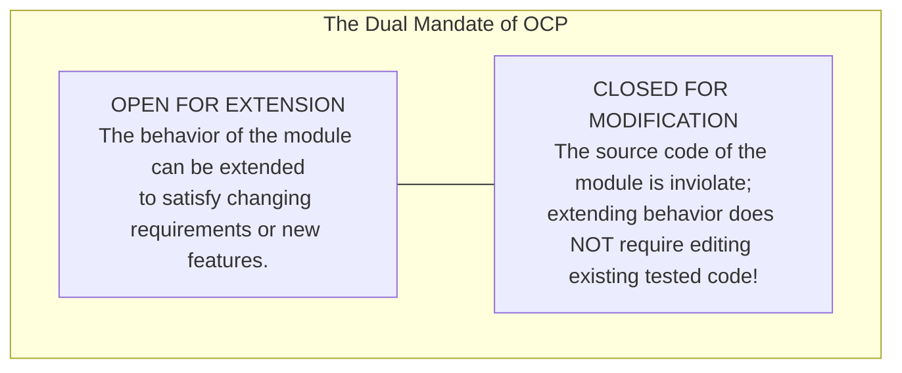
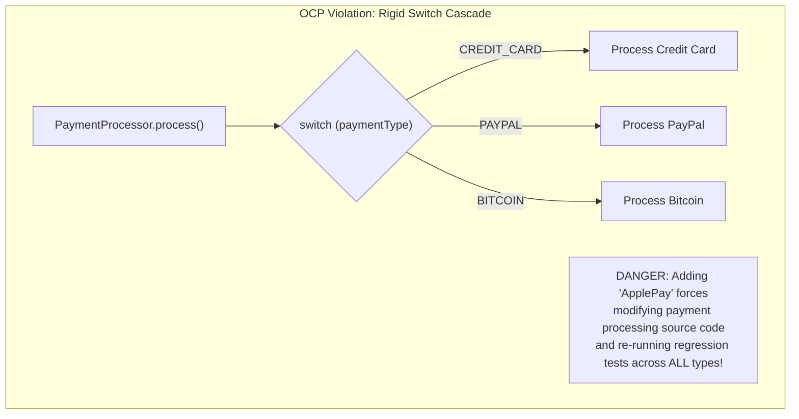
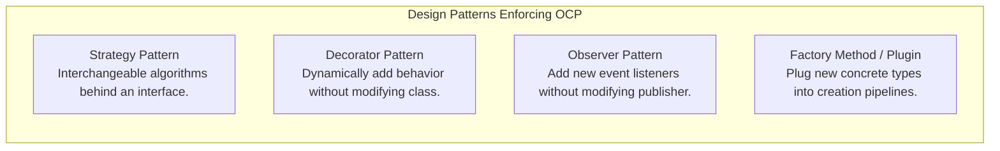

# Open-Closed Principle — OCP and Extensibility

## Mental Model

Think of the **Open-Closed Principle (OCP)** as a smartphone operating system (iOS / Android) and its App Store. 

If you want your phone to support a new feature (e.g., scanning QR codes or editing 4K video), Apple engineers do not open the operating system source code, modify core kernel files, and push a dangerous OS patch to 1 billion devices (**Modifying Existing Code / OCP Violation**). 

Instead, the OS exposes stable, well-defined Extension APIs (**Closed for Modification**). Third-party developers create new standalone applications that plug into these APIs (**Open for Extension**). You add infinite new capabilities without ever touching or risking regression in the existing core operating system.

---

## 1. Defining OCP: Bertrand Meyer & Uncle Bob

Formulated by Bertrand Meyer in 1988 and popularized by Robert C. Martin, OCP states:

> **"Software entities (classes, modules, functions) should be open for extension, but closed for modification."**



### The Architectural Goal of OCP
To design software components such that new requirements are met by **adding new code**, not by **altering existing, working code**.

$$\text{New Requirement} \implies \text{Add New Class} \quad (\text{NOT } \text{Modify Existing Class})$$

---

## 2. The Switch/If-Else Smells vs. Polymorphic Abstraction

The classic indicator of an OCP violation is a method containing a growing `switch` statement or `if-else` chain checking object types or enum flags.



### Violating OCP (Modifying Code for New Features)

```java
public enum PaymentType { CREDIT_CARD, PAYPAL, BITCOIN }

// BAD: Violates OCP! Adding ApplePay requires editing this class!
public class PaymentProcessor {
    public void processPayment(PaymentType type, double amount) {
        if (type == PaymentType.CREDIT_CARD) {
            System.out.println("Processing credit card payment of $" + amount);
        } else if (type == PaymentType.PAYPAL) {
            System.out.println("Processing PayPal payment of $" + amount);
        } else if (type == PaymentType.BITCOIN) {
            System.out.println("Processing Bitcoin payment of $" + amount);
        } else {
            throw new IllegalArgumentException("Unsupported payment type");
        }
    }
}
```

---

### Obeying OCP (Polymorphic Strategy Abstraction)

```mermaid
flowchart TD
    Processor["PaymentProcessor (CLOSED FOR MODIFICATION)"] -->|Depends on Interface| Strategy["PaymentStrategy (Interface)"]
    
    Strategy <|.. CreditCardStrategy["CreditCardPayment (OPEN FOR EXTENSION)"]
    Strategy <|.. PayPalStrategy["PayPalPayment (OPEN FOR EXTENSION)"]
    Strategy <|.. ApplePayStrategy["ApplePayPayment (NEW CLASS ADDED WITHOUT TOUCHING PROCESSOR!)"]
```

```java
// STEP 1: Define Stable Abstraction Boundary (CLOSED FOR MODIFICATION)
public interface PaymentStrategy {
    void process(double amount);
}

// STEP 2: Implement Standalone Concrete Strategies (OPEN FOR EXTENSION)
public class CreditCardPayment implements PaymentStrategy {
    @Override
    public void process(double amount) {
        System.out.println("Processing Credit Card: $" + amount);
    }
}

public class PayPalPayment implements PaymentStrategy {
    @Override
    public void process(double amount) {
        System.out.println("Processing PayPal: $" + amount);
    }
}

// STEP 3: Adding a NEW Payment Method REQUIRES ZERO MODIFICATION TO EXISTING CLASSES!
public class ApplePayPayment implements PaymentStrategy {
    @Override
    public void process(double amount) {
        System.out.println("Processing Apple Pay: $" + amount);
    }
}

// STEP 4: Execution Engine is Completely Decoupled
public class PaymentProcessor {
    public void executePayment(PaymentStrategy strategy, double amount) {
        Objects.requireNonNull(strategy, "Payment strategy cannot be null");
        strategy.process(amount); // Polymorphic dispatch!
    }
}
```

---

## 3. OCP Design Patterns & Architectural Idioms

Several Gang of Four (GoF) design patterns exist specifically to achieve OCP compliance:



1. **Strategy Pattern:** Encapsulates algorithms in separate classes. Adding a new algorithm requires zero changes to context callers.
2. **Decorator Pattern:** Wraps existing components to append responsibilities dynamically (`BufferedInputStream(GZIPInputStream(FileInputStream))`) without editing base streams.
3. **Plugin Architecture (SPI / OSGi):** Systems like IDEs (VS Code / IntelliJ) load `.jar` or `.js` plugins dynamically using Service Provider Interfaces.

---

## 4. Strategic Closure: Don't Predict the Future

A common trap is attempting to make **every single line of code** 100% open for extension from day one.

> **Uncle Bob's Warning:** *"Foolish consistency is the hobgoblin of little minds. Resisting premature abstraction is as important as applying OCP."*

### The Rule of Strategic Closure
1. **First Pass (Simple & Direct):** Write simple, readable code without complex abstractions.
2. **First Change (Refactor to OCP):** When a change request occurs for the *first time*, introduce abstractions (interfaces, strategies) to guard against future modifications of that *specific* type.

---

## 5. Architectural Comparison Matrix

| Approach | Extensibility | Code Safety | Complexity / Over-Engineering |
|---|---|---|---|
| **Direct `if/else` Cascades** | ❌ Poor (Requires editing working code). | ❌ Low (Risk of regression across existing paths). | Low (Simple to write initially). |
| **Polymorphic Strategy (OCP)** | ✅ **Unlimited** (Add new class files). | ✅ **Maximum** (Existing code untouched & un-recompiled). | Low-to-Medium. |
| **Premature Pre-emptive OCP** | Over-engineered | Complex indirection | **High** (Dozens of unused interfaces). |

---

## 6. Failure Modes and Trade-offs

1. **Premature Abstraction / Over-Engineering** — Creating abstract factories, strategies, and decorators for simple data transformations that never change. Result: Codebase becomes a maze of indirection where tracking execution requires 10 IDE definition jumps. *Mitigation*: Apply OCP reactively when extension points actually emerge.
2. **Leaky Strategy Interfaces** — Designing an interface `PaymentStrategy` with a method `process(CreditCardInfo card)`. Adding `PayPalPayment` fails because PayPal doesn't use credit card numbers! The abstraction was not generic enough. *Mitigation*: Ensure interface parameters represent domain abstractions (`PaymentRequest`), not vendor-specific fields.
3. **Modification in Disguise (Configuration Bloat)** — Claiming a system is OCP-compliant because no Java code is modified, but requiring developers to edit a 5,000-line XML/JSON configuration file with complex wiring rules. Editing config files still incurs regression risk!

---

## 7. Active-Recall Prompts

1. **State the Open-Closed Principle (OCP). What does it mean for a module to be "Open for Extension" and "Closed for Modification"?**
2. **Why is a growing `switch` statement or `if-else` chain checking enums/types considered a smell violating OCP?**
3. **How does the Strategy Pattern enable OCP compliance when introducing a new feature?**
4. **What is Strategic Closure, and why is premature abstraction harmful in software engineering?**

---

## Related Notes

- [[Single Responsibility Principle - SRP and Cohesion]]
- [[Liskov Substitution Principle - LSP and Subtyping Invariants]]
- [[Abstraction and Interface-Driven Design]]
- [[Strategy Pattern - Algorithmic Interchangeability and Policy Objects]]
- [[Decorator Pattern - Dynamic Behavior Extension and Wrapper Chaining]]

> **Interview Style Question:** *"You are designing a high-throughput notification gateway for an enterprise SaaS platform. Initially, it supports SMS (Twilio) and Email (SendGrid). The product roadmap demands adding Push Notifications (Firebase), WhatsApp, and Slack within 6 months. Demonstrate how you apply OCP and the Strategy Pattern to build a plugin architecture where new notification providers are added as isolated JARs/packages with zero modifications or regression risk to core routing logic."*

---
