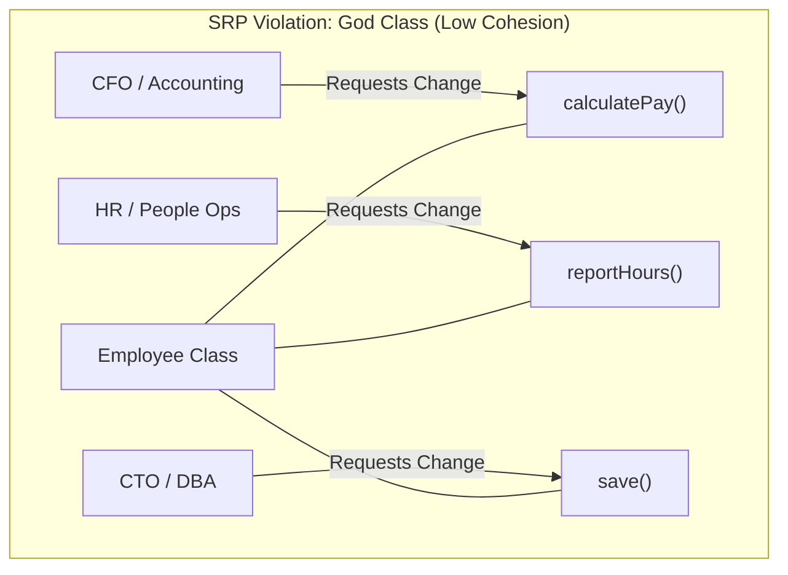
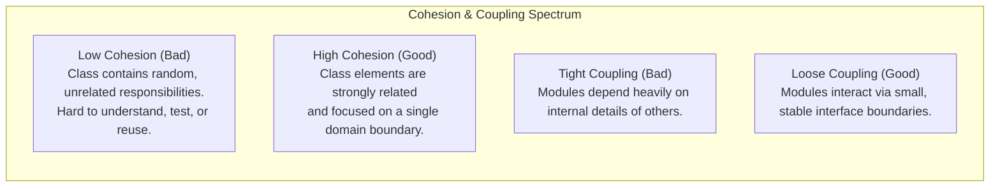
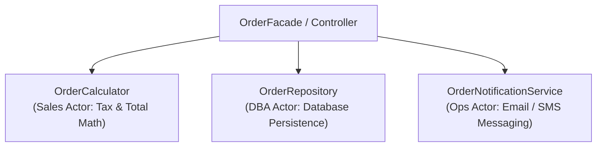

# Single Responsibility Principle — SRP and Cohesion

## Mental Model

Think of the **Single Responsibility Principle (SRP)** as a specialized surgical medical team in a hospital. 

If a single doctor acts as the surgeon, anesthesiologist, nurse, billing accountant, and janitor (**God Object / Low Cohesion**), a policy change in hospital billing software or an update to anesthesia regulations forces that same doctor to change their daily routines. The risk of operational failure is extreme. 

Instead, SRP assigns **one clear responsibility** to each role: the Anesthesiologist is responsible *only* to the Anesthesia Protocol, the Accountant is responsible *only* to the Financial Billing System, and the Surgeon focuses *only* on the operation (**High Cohesion**). Each class or module responds to **one single actor or stakeholder group**.

---

## 1. Defining SRP: Robert C. Martin’s True Definition

The most common misconception about SRP is that *"a class should do only one thing"*. That is the definition of a small function, not SRP!

Robert C. Martin ("Uncle Bob") defines SRP as:

> **"A module should be responsible to one, and only one, actor."**

An **Actor** is a single user group, stakeholder group, or business department that requests changes to the software system (e.g., Accounting Department, HR Department, Operations Team).



### Why the "God Class" Causes Production Bugs
Suppose `calculatePay()` and `reportHours()` both rely on an internal private helper method `calculateRegularHours()`. 
If HR requests a change to how regular hours are computed for overtime tracking, a developer modifies `calculateRegularHours()`. 
**Unintended Consequence:** Accounting's payroll calculations are silently corrupted, resulting in incorrect employee paychecks!

---

## 2. Cohesion vs. Coupling

SRP is the primary mechanism for achieving **High Cohesion** and **Low Coupling**.



### Types of Cohesion (Best to Worst)

| Cohesion Level | Quality | Description | Example |
|---|---|---|---|
| **Functional Cohesion** | **Best** | Every element in the module contributes to a single well-defined task. | `XMLParser.parse()`, `RSAEncryptor.encrypt()`. |
| **Sequential Cohesion** | Good | Output of one operation forms input to the next inside the module. | `OrderPipeline (validate -> charge -> ship)`. |
| **Communicational Cohesion** | Acceptable | Operations operate on the same shared data structure. | `UserPreferencesStore`. |
| **Coincidental Cohesion** | **Worst** | Elements are grouped together randomly ("Utils" / "Helpers"). | `CommonUtils.java` containing String formats, DB helpers, and Math calculations. |

---

## 3. Code Refactoring: Violating vs. Obeying SRP

### Violating SRP (Monolithic Order Service)

```java
// BAD: Violates SRP. Responds to Sales, DB Admin, and Email Notification Actors!
public class OrderService {
    
    public void processOrder(Order order) {
        // 1. Business Logic (Sales Actor)
        double total = 0;
        for (OrderItem item : order.getItems()) {
            total += item.getPrice() * item.getQuantity();
        }
        order.setTotalAmount(total);

        // 2. Database Persistence Logic (DBA Actor)
        try (Connection conn = DriverManager.getConnection("jdbc:postgresql://localhost/db")) {
            PreparedStatement stmt = conn.prepareStatement("INSERT INTO orders VALUES (?, ?)");
            stmt.setLong(1, order.getId());
            stmt.setDouble(2, order.getTotalAmount());
            stmt.executeUpdate();
        } catch (SQLException e) {
            throw new RuntimeException("Database error", e);
        }

        // 3. Email Notification Logic (Marketing / Ops Actor)
        String smtpHost = "smtp.sendgrid.net";
        // Connect to SMTP server and send email...
        System.out.println("Sending receipt email to " + order.getCustomerEmail());
    }
}
```

---

### Obeying SRP (Separation into Single-Actor Classes)



```java
// 1. Domain Calculation (Responsible to Sales Actor)
public class OrderCalculator {
    public double calculateTotal(Order order) {
        return order.getItems().stream()
                .mapToDouble(item -> item.getPrice() * item.getQuantity())
                .sum();
    }
}

// 2. Persistence Contract (Responsible to DBA / Data Infrastructure Actor)
public interface OrderRepository {
    void save(Order order);
}

public class PostgresOrderRepository implements OrderRepository {
    private final DataSource dataSource;
    public PostgresOrderRepository(DataSource dataSource) { this.dataSource = dataSource; }
    
    @Override
    public void save(Order order) {
        // Execute SQL statement...
    }
}

// 3. Notification Contract (Responsible to Marketing / Ops Actor)
public interface OrderNotificationService {
    void sendOrderReceipt(Order order);
}

public class EmailNotificationService implements OrderNotificationService {
    @Override
    public void sendOrderReceipt(Order order) {
        // Send SMTP email...
    }
}

// 4. Clean Orchestrator (Facade)
public class OrderProcessor {
    private final OrderCalculator calculator;
    private final OrderRepository repository;
    private final OrderNotificationService notifier;

    public OrderProcessor(OrderCalculator calculator, OrderRepository repository, OrderNotificationService notifier) {
        this.calculator = calculator;
        this.repository = repository;
        this.notifier = notifier;
    }

    public void processOrder(Order order) {
        double total = calculator.calculateTotal(order);
        order.setTotalAmount(total);
        repository.save(order);
        notifier.sendOrderReceipt(order);
    }
}
```

---

## 4. Architectural Impact of SRP on Testability

Classes that obey SRP are trivial to unit test because their dependencies are small and focused.

```java
// Unit Testing OrderProcessor using Mocks (Zero Live DB / Email required!)
@Test
void shouldProcessOrderSuccessfully() {
    OrderCalculator calculator = new OrderCalculator();
    OrderRepository mockRepo = mock(OrderRepository.class);
    OrderNotificationService mockNotifier = mock(OrderNotificationService.class);
    
    OrderProcessor processor = new OrderProcessor(calculator, mockRepo, mockNotifier);
    Order order = new Order(1L, "customer@example.com", List.of(new OrderItem("Item 1", 50.0, 2)));

    processor.processOrder(order);

    assertEquals(100.0, order.getTotalAmount());
    verify(mockRepo, times(1)).save(order);
    verify(mockNotifier, times(1)).sendOrderReceipt(order);
}
```

---

## 5. Failure Modes and Trade-offs

1. **Shotgun Surgery (Over-Splitting / Fragmented Cohesion)** — Over-applying SRP by breaking a single logical concept into dozens of micro-classes (`OrderValidator`, `OrderTaxCalculator`, `OrderPriceFormatter`, `OrderLogger`, `OrderPersister`). Changing a single business rule requires modifying 15 different files (**Shotgun Surgery**). *Mitigation*: Group elements that change together for the *same reason* into the same class.
2. **The "Utils" / "Manager" Dumping Ground Anti-Pattern** — Creating generic classes like `StringUtils`, `UserManager`, or `PaymentHelper`. Over time, developers dump unrelated static methods into these files, degrading them into low-cohesion God objects. *Mitigation*: Prohibit generic `Manager`/`Helper` class names; name classes by explicit domain capability.
3. **Confusing SRP with Method-Level Single Action** — Assuming a class can only have 1 public method. A class like `ArrayList` has many methods (`add`, `remove`, `get`, `size`), but it obeys SRP because all methods serve a single unified responsibility: managing an ordered list in memory.

---

## 6. Active-Recall Prompts

1. **What is Robert C. Martin's definition of the Single Responsibility Principle, and why is an "Actor" central to understanding it?**
2. **Explain the difference between High Cohesion and Low Coupling. Give an example of a class with Coincidental Cohesion.**
3. **What is "Shotgun Surgery", and how is it the opposite extreme of a "God Object"?**
4. **How does refactoring a monolithic God class into SRP-compliant components improve unit testability?**

---

## Related Notes

- [[Open-Closed Principle - OCP and Extensibility]]
- [[Interface Segregation Principle - ISP and Decoupling]]
- [[Encapsulation, Data Hiding, and Information Hiding]]
- [[Abstraction and Interface-Driven Design]]

> **Interview Style Question:** *"You are conducting a code review on an enterprise codebase where a 4,000-line `UserManager` class handles HTTP request extraction, password hashing, SQL database queries, JWT token generation, and PDF invoice generation. Explain how this violates SRP, identify the distinct business Actors involved, and present a refactored architecture using UML diagrams or code interfaces."*

---
