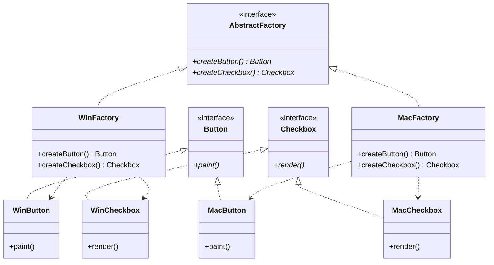
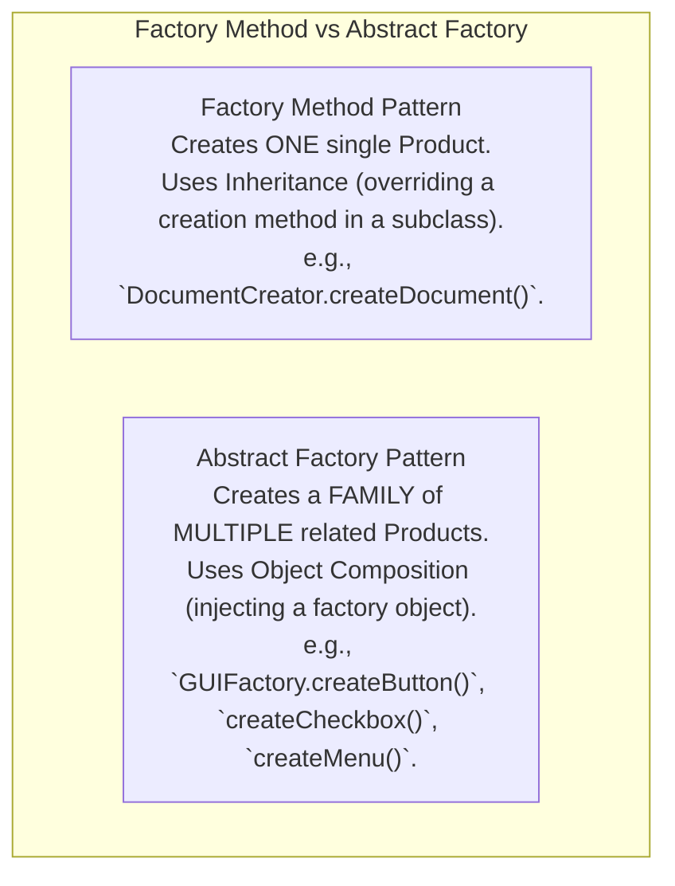

# Abstract Factory Pattern — Product Families and Platform Decoupling

## Mental Model

Think of an **Abstract Factory** as an interior design furniture suite manufacturer (e.g., *IKEA Minimalist Suite* vs. *Victorian Antique Suite*). 

If you decide to furnish your living room in the **Minimalist Style**, you do not buy a Victorian Velvet Couch alongside a Minimalist Glass Table (**Incompatible Mix Match / Violation of Product Family Invariant**). 

The `MinimalistFurnitureFactory` guarantees that when you request a `createChair()`, `createTable()`, and `createSofa()`, all produced items belong to the exact same matching **Minimalist Family**. If you swap to the `VictorianFurnitureFactory`, the entire room transforms into matching Victorian furniture with zero changes to your living room layout code.

---

## 1. Intent & Structural Definition

The **Abstract Factory Pattern** provides an interface for creating families of related or dependent objects without specifying their concrete classes.



### Key Intent & Constraints
1. **Product Families:** Guarantee that concrete products created by the factory belong to the exact same matching family.
2. **Platform Decoupling:** Isolate client code from concrete platform classes (e.g., Windows vs. macOS UI components, PostgreSQL vs. Oracle database connectors).
3. **Single Responsibility for Family Enforcement:** The factory acts as the sole authority enforcing compatible product creation.

---

## 2. Factory Method vs. Abstract Factory

The distinction between Factory Method and Abstract Factory is a classic interview question:



### Comparative Summary

| Dimension | Factory Method Pattern | Abstract Factory Pattern |
|---|---|---|
| **Creation Scope** | Creates **1 single product** type. | Creates a **family of multiple related products**. |
| **Primary Mechanism** | **Class Inheritance** (overriding a virtual factory method). | **Object Composition** (passing a factory interface instance). |
| **Extensibility Focus** | Easily add a **new Product subtype**. | Easily add a **new Product Family** (e.g., Dark Theme). |
| **Complexity** | Low (Single creation method). | Higher (Interface with multiple creation methods). |

---

## 3. Production Code Implementation: Cross-Platform UI Engine

```java
// ============================================================================
// 1. ABSTRACT PRODUCTS (Interfaces for individual components)
// ============================================================================
public interface Button {
    void paint();
}

public interface Checkbox {
    void render();
}

// ============================================================================
// 2. CONCRETE PRODUCTS (Family 1: Windows Suite)
// ============================================================================
public class WindowsButton implements Button {
    @Override public void paint() { System.out.println("Rendering Windows Style Button"); }
}

public class WindowsCheckbox implements Checkbox {
    @Override public void render() { System.out.println("Rendering Windows Style Checkbox"); }
}

// ============================================================================
// 3. CONCRETE PRODUCTS (Family 2: macOS Suite)
// ============================================================================
public class MacButton implements Button {
    @Override public void paint() { System.out.println("Rendering macOS Style Rounded Button"); }
}

public class MacCheckbox implements Checkbox {
    @Override public void render() { System.out.println("Rendering macOS Style Checkbox"); }
}

// ============================================================================
// 4. ABSTRACT FACTORY INTERFACE (Enforces Product Family Contract)
// ============================================================================
public interface GUIFactory {
    Button createButton();
    Checkbox createCheckbox();
}

// ============================================================================
// 5. CONCRETE FACTORIES (Implements Product Family Building)
// ============================================================================
public class WindowsGUIFactory implements GUIFactory {
    @Override public Button createButton() { return new WindowsButton(); }
    @Override public Checkbox createCheckbox() { return new WindowsCheckbox(); }
}

public class MacGUIFactory implements GUIFactory {
    @Override public Button createButton() { return new MacButton(); }
    @Override public Checkbox createCheckbox() { return new MacCheckbox(); }
}

// ============================================================================
// 6. CLIENT CODE (Completely Decoupled from Concrete Platform Classes!)
// ============================================================================
public class Application {
    private final Button button;
    private final Checkbox checkbox;

    // Factory is injected via Dependency Injection
    public Application(GUIFactory factory) {
        // Guarantees button and checkbox belong to the EXACT SAME FAMILY!
        this.button = factory.createButton();
        this.checkbox = factory.createCheckbox();
    }

    public void renderUI() {
        this.button.paint();
        this.checkbox.render();
    }
}

// ============================================================================
// 7. APP BOOTSTRAP / COMPOSITION ROOT
// ============================================================================
public class Main {
    public static void main(String[] args) {
        String osName = System.getProperty("os.name").toLowerCase();
        GUIFactory factory;

        if (osName.contains("mac")) {
            factory = new MacGUIFactory();
        } else {
            factory = new WindowsGUIFactory();
        }

        // Entire Application executes with matching platform suite!
        Application app = new Application(factory);
        app.renderUI();
    }
}
```

---

## 4. Architectural Comparison Matrix

| Approach | Family Consistency | Adding New Family (e.g., Linux) | Adding New Product (e.g., Dropdown) |
|---|---|---|---|
| **Direct `new` Operator** | ❌ None (Mix-match bugs easy). | ❌ Hard (Edit all client code). | ❌ Hard (Edit all client code). |
| **Multiple Factory Methods** | ⚠️ Unenforced | ⚠️ Moderate | ⚠️ Moderate |
| **Abstract Factory Pattern** | ✅ **100% Guaranteed** | ✅ **Easy (Add 1 new Factory class)** | ❌ **Hard (Must update Factory Interface!)** |

---

## 5. Failure Modes and Trade-offs

1. **The Rigid Interface Problem (Adding New Product Types)** — Adding a new product type (e.g., `createDropdown()`) to the `GUIFactory` interface forces **every single existing concrete factory** (`WindowsGUIFactory`, `MacGUIFactory`, `LinuxGUIFactory`) to be modified and recompiled! *Mitigation*: Combine Abstract Factory with the Prototype Pattern or use dynamic reflection parameterization.
2. **Combinatorial Explosion of Factories** — If a system has 5 product families and 4 style themes, creating concrete factories for every combination requires $5 \times 4 = 20$ factory classes. *Mitigation*: Combine Abstract Factory with the Builder Pattern to construct custom family variants.
3. **Incompatible Factory Injection** — Mixing two separate abstract factory instances in the same application component, creating unmatched product items. *Mitigation*: Register the Abstract Factory instance as a **Singleton** inside your Dependency Injection (DI) container.

---

## 6. Active-Recall Prompts

1. **What is the primary intent of the Abstract Factory Pattern, and how does it guarantee Product Family consistency?**
2. **Compare Factory Method vs. Abstract Factory in terms of creation scope (1 product vs. product family) and primary OOP mechanisms.**
3. **Why is adding a new concrete Product Family easy under Abstract Factory, but adding a new Product Type hard?**
4. **How does the Abstract Factory Pattern enforce platform decoupling in cross-platform UI or multi-database applications?**

---

## Related Notes

- [[Factory Method Pattern - Virtual Constructors and Extensible Object Creation]]
- [[Builder Pattern - Fluent Interfaces, Step Builders, and Immutable Object Construction]]
- [[Singleton Pattern - Thread-Safe Initialization, Double-Checked Locking, Enum Singleton]]
- [[Open-Closed Principle - OCP and Extensibility]]

> **Interview Style Question:** *"You are designing a cloud-agnostic database driver framework supporting AWS (DynamoDB + SQS), GCP (Bigtable + PubSub), and Azure (CosmosDB + ServiceBus). Demonstrate how the Abstract Factory Pattern enforces that an AWS application receives matching AWS storage and messaging instances, write the complete interface hierarchy, and explain how you handle adding a new Azure provider with zero modifications to client application logic."*

---
