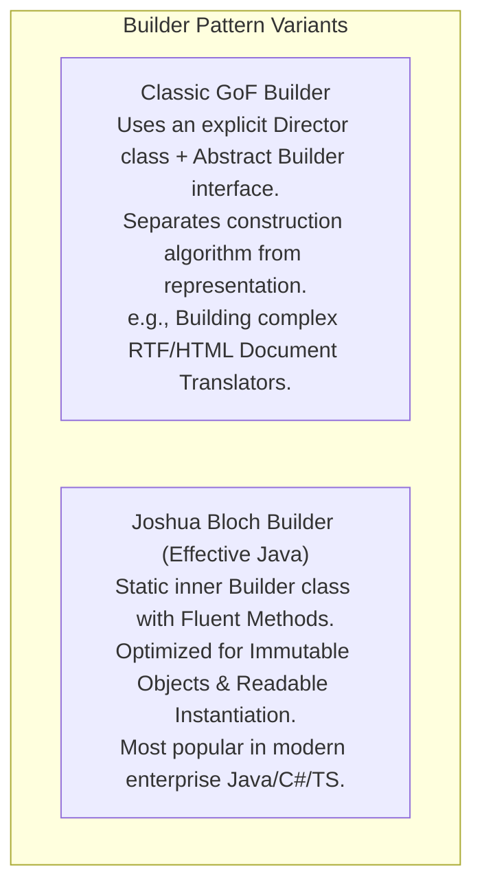
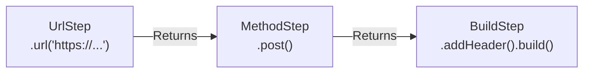

# Builder Pattern — Fluent Interfaces, Step Builders, and Immutable Object Construction

## Mental Model

Think of the **Builder Pattern** as a custom gourmet burger ordering kiosk at a high-end restaurant. 

Instead of forcing you to memorize a massive 15-parameter constructor order (`new Burger("Brioche", "Beef", true, false, true, null, "Cheddar", ...)`), the kiosk presents a step-by-step interactive builder: `"Select Bun -> Select Patty -> Add Cheese -> Add Sauce -> Build"`. 

The builder guides you through construction, validates that mandatory components (Bun + Patty) are selected before allowing you to complete the order (**Step Builder / Compile-Time Validation**), and delivers a fully assembled, immutable `Burger` object that cannot be tampered with after creation (**Immutable Object Guarantee**).

---

## 1. The Telescoping Constructor & JavaBean Mutability Anti-Patterns

When constructing complex objects with many optional parameters (e.g., HTTP Requests, Database Configurations, User Profiles), developers historically used two flawed approaches:

### Anti-Pattern 1: Telescoping Constructors
Creating multiple overloaded constructors with 2, 3, 4, 5+ arguments.

```java
// BAD: Telescoping Constructor Anti-Pattern (Unreadable & Error-Prone!)
public class HttpResponse {
    public HttpResponse(int status) { ... }
    public HttpResponse(int status, String body) { ... }
    public HttpResponse(int status, String body, Map<String, String> headers) { ... }
    public HttpResponse(int status, String body, Map<String, String> headers, int timeoutMs) { ... }
    // DANGER: What if status and timeoutMs are both ints? Accidentally swapping arguments compiles silently!
}
```

### Anti-Pattern 2: JavaBeans Pattern (No-Arg Constructor + Setters)
Instantiating an empty object and calling setters.

```java
// BAD: JavaBeans Mutability Anti-Pattern
HttpResponse response = new HttpResponse();
response.setStatus(200);
response.setBody("OK");
// DANGER 1: Object is in an INCOMPLETE, INVALID STATE between setter calls!
// DANGER 2: Object is MUTABLE! Any thread can alter status after creation!
```

---

## 2. GoF Classic Builder vs. Joshua Bloch Builder



---

## 3. Production Code Implementation: Joshua Bloch Fluent Builder

```java
public final class HttpRequest {
    // Immutable Fields (final)
    private final String url;               // Mandatory
    private final String method;            // Mandatory
    private final Map<String, String> headers; // Optional
    private final String body;              // Optional
    private final int timeoutMs;            // Optional

    // Private Constructor: Can ONLY be instantiated by the Builder!
    private HttpRequest(Builder builder) {
        this.url = builder.url;
        this.method = builder.method;
        this.headers = Map.copyOf(builder.headers); // Defensive Copy!
        this.body = builder.body;
        this.timeoutMs = builder.timeoutMs;
    }

    // Getters ONLY (No Setters -> 100% Immutable!)
    public String getUrl() { return url; }
    public String getMethod() { return method; }
    public Map<String, String> getHeaders() { return headers; }
    public String getBody() { return body; }
    public int getTimeoutMs() { return timeoutMs; }

    // Static Inner Builder Class
    public static class Builder {
        // Mandatory Fields
        private final String url;
        private final String method;

        // Optional Fields (Initialized to sensible defaults)
        private Map<String, String> headers = new HashMap<>();
        private String body = "";
        private int timeoutMs = 5000;

        // Builder Constructor accepts MANDATORY parameters
        public Builder(String url, String method) {
            this.url = Objects.requireNonNull(url, "URL cannot be null");
            this.method = Objects.requireNonNull(method, "HTTP Method cannot be null");
        }

        // Fluent Chaining Methods (Return 'this')
        public Builder addHeader(String name, String value) {
            this.headers.put(name, value);
            return this;
        }

        public Builder body(String body) {
            this.body = body != null ? body : "";
            return this;
        }

        public Builder timeoutMs(int timeoutMs) {
            if (timeoutMs <= 0) throw new IllegalArgumentException("Timeout must be positive");
            this.timeoutMs = timeoutMs;
            return this;
        }

        // Final Assembly & Validation Method
        public HttpRequest build() {
            // Validate Cross-Field Invariants before object creation!
            if ("POST".equals(method) && (body == null || body.isEmpty())) {
                throw new IllegalStateException("HTTP POST requests must contain a non-empty body");
            }
            return new HttpRequest(this); // Guarantees 100% Valid & Immutable Object!
        }
    }
}
```

### Usage (Fluent Execution)

```java
HttpRequest request = new HttpRequest.Builder("https://api.example.com/orders", "POST")
        .addHeader("Authorization", "Bearer token_123")
        .addHeader("Content-Type", "application/json")
        .body("{\"orderId\": 42}")
        .timeoutMs(2000)
        .build(); // Validates invariants and returns immutable HttpRequest!
```

---

## 4. Advanced Pattern: Step Builder (Compile-Time Mandatory Enforcement)

Standard builders allow developers to accidentally call `build()` before supplying mandatory parameters, causing runtime errors. 

A **Step Builder** uses wizard-like interface chaining to enforce mandatory parameter selection at **compile time**!



```java
// Step Builder Interfaces
public class StepHttpRequestBuilder {

    public interface UrlStep {
        MethodStep url(String url);
    }

    public interface MethodStep {
        BuildStep method(String method);
    }

    public interface BuildStep {
        BuildStep addHeader(String name, String value);
        BuildStep body(String body);
        HttpRequest build();
    }

    // Builder Entry Point
    public static UrlStep newBuilder() {
        return new InnerBuilder();
    }

    private static class InnerBuilder implements UrlStep, MethodStep, BuildStep {
        private String url;
        private String method;
        private final Map<String, String> headers = new HashMap<>();
        private String body = "";

        @Override public MethodStep url(String url) { this.url = url; return this; }
        @Override public BuildStep method(String method) { this.method = method; return this; }
        @Override public BuildStep addHeader(String k, String v) { this.headers.put(k, v); return this; }
        @Override public BuildStep body(String body) { this.body = body; return this; }

        @Override
        public HttpRequest build() {
            // Build logic...
            return new HttpRequest.Builder(url, method).body(body).build();
        }
    }
}

// Compile-Time Enforced Usage: IDE FORCES step order! Calling build() early is a COMPILE ERROR!
HttpRequest req = StepHttpRequestBuilder.newBuilder()
    .url("https://api.example.com") // Step 1: Returns MethodStep
    .method("GET")                   // Step 2: Returns BuildStep
    .build();                        // Step 3: Returns HttpRequest
```

---

## 5. Architectural Comparison Matrix

| Approach | Readability | Immutability | Cross-Field Validation | Mandatory Fields Checked At |
|---|---|---|---|---|
| **Telescoping Constructor** | ❌ Horrible | ✅ Yes | In Constructor | Compile Time (Position) |
| **JavaBeans (Setters)** | ⚠️ Moderate | ❌ **No (Mutable)** | ❌ Hard | Runtime (Risky) |
| **Joshua Bloch Builder** | ✅ **Excellent** | ✅ **Yes** | In `build()` Method | Runtime (`build()`) |
| **Step Builder** | ✅ **Excellent** | ✅ **Yes** | In `build()` Method | **Compile Time Interface** |

---

## 6. Failure Modes and Trade-offs

1. **Duplicate Field Boilerplate** — Declaring every field twice (once in the immutable class, once in the static Inner Builder). For classes with 40 fields, this creates 300 lines of repetitive builder methods. *Mitigation*: Use Lombok `@Builder` or code generators in Java; use TypeScript `Partial<T>` options bags.
2. **Runtime Validation Delay in Standard Builder** — Un-validated mandatory fields are caught only when `build()` is executed at runtime rather than at compile time. *Mitigation*: Use **Step Builders** for critical domain entities with mandatory parameters.
3. **Memory Allocation Overhead** — Creating short-lived `Builder` instances on every object creation in high-frequency numerical loops. *Mitigation*: Use standard constructors for small data DTOs ($\le 3$ fields).

---

## 7. Active-Recall Prompts

1. **What problems do Telescoping Constructors and JavaBeans (Setters) introduce, and how does the Builder Pattern solve them?**
2. **How does a Joshua Bloch Builder guarantee that the created domain object is 100% immutable and thread-safe?**
3. **What is a Step Builder, and how does interface chaining enforce mandatory parameter completion at compile time?**
4. **Where should cross-field invariant validation take place inside a Builder class?**

---

## Related Notes

- [[Factory Method Pattern - Virtual Constructors and Extensible Object Creation]]
- [[Abstract Factory Pattern - Product Families and Platform Decoupling]]
- [[Encapsulation, Data Hiding, and Information Hiding]]
- [[Singleton Pattern - Thread-Safe Initialization, Double-Checked Locking, Enum Singleton]]

> **Interview Style Question:** *"You are designing a core `DatabaseConnectionConfig` library for an enterprise infrastructure. The configuration requires mandatory host and port, but supports 15 optional parameters (SSL certs, connection timeouts, max pool size, query retry counts). Demonstrate how Telescoping Constructors fail, write a complete Java/TypeScript Joshua Bloch Builder enforcing immutability and defensive copying, and refactor it into a Step Builder to enforce mandatory host/port parameters at compile time."*

---
