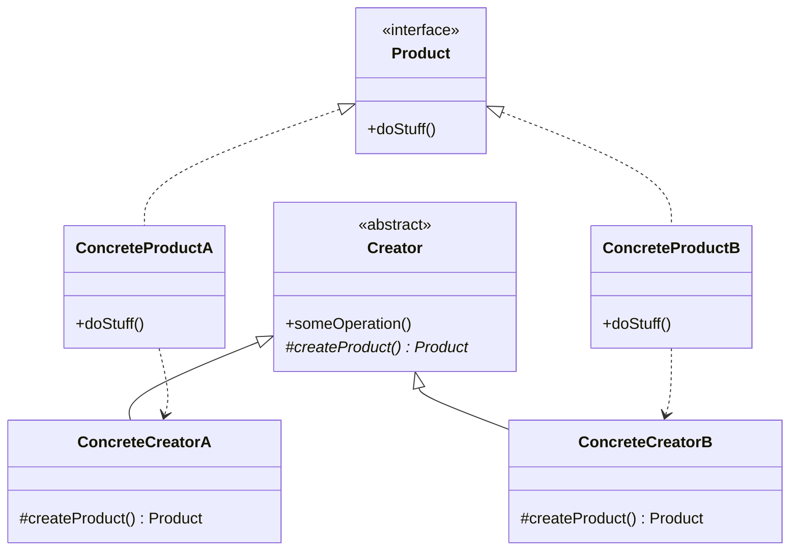
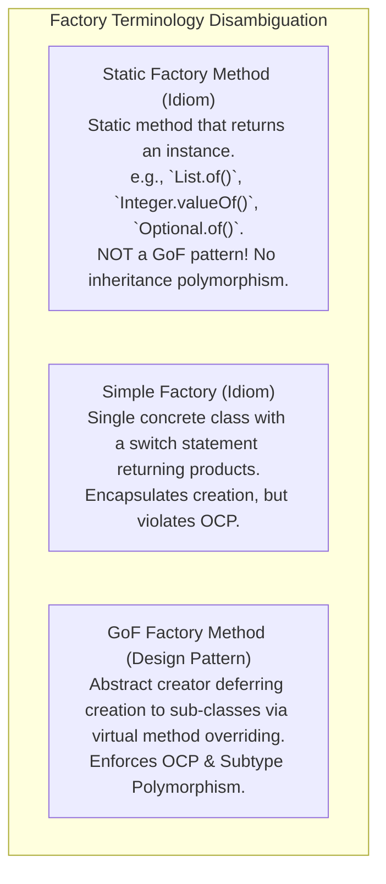

# Factory Method Pattern — Virtual Constructors and Extensible Object Creation

## Mental Model

Think of the **Factory Method Pattern** as a commercial logistics company's standardized shipping dispatch protocol. 

The core logistics pipeline (`Logistics` class) defines the high-level workflow: `"Accept Package -> Dispatch Transport -> Track Delivery"`. However, the core pipeline does **not** hardcode whether the physical transport is a truck, cargo ship, or freight plane (**Decoupled Creation**). 

Instead, it delegates the actual object creation to a virtual factory method (`createTransport()`). A `RoadLogistics` subclass overrides the factory method to instantiate a `Truck` object, while a `SeaLogistics` subclass instantiates a `Ship` object. The core workflow operates seamlessly on the abstract `Transport` interface without ever needing modification when new transport types are added.

---

## 1. Intent & Structural Definition

The **Factory Method Pattern** defines an interface for creating an object, but lets subclasses decide which class to instantiate. Factory Method lets a class defer instantiation to subclasses.



### Key Intent & Constraints
1. **Virtual Constructor:** Provide an abstract factory method acting as a virtual constructor.
2. **Decouple Usage from Creation:** High-level framework/creator code uses `Product` interfaces without depending on `ConcreteProduct` classes.
3. **OCP Compliance:** Add new product types by creating a new `ConcreteCreator` subclass without altering existing code.

---

## 2. Code Implementation: From Anti-Pattern to Clean Factory Method

### Anti-Pattern: Hardcoded Direct Instantiation (Violates OCP & DIP)

```java
// BAD: High-level document processor tightly coupled to concrete export classes
public class DocumentApp {
    public void exportDocument(String format) {
        Document doc;
        if (format.equalsIgnoreCase("PDF")) {
            doc = new PdfDocument(); // Tight Coupling!
        } else if (format.equalsIgnoreCase("WORD")) {
            doc = new WordDocument(); // Tight Coupling!
        } else {
            throw new IllegalArgumentException("Unknown format");
        }
        doc.render();
        doc.save();
    }
}
```

---

### Clean Factory Method Implementation

```java
// STEP 1: Product Interface
public interface Document {
    void render();
    void save();
}

// STEP 2: Concrete Product Implementations
public class PdfDocument implements Document {
    @Override public void render() { System.out.println("Rendering PDF layout..."); }
    @Override public void save() { System.out.println("Saving PDF file to disk..."); }
}

public class WordDocument implements Document {
    @Override public void render() { System.out.println("Rendering Word document..."); }
    @Override public void save() { System.out.println("Saving DOCX file to disk..."); }
}

// STEP 3: Abstract Creator (Defines Factory Method & Business Logic)
public abstract class DocumentCreator {
    
    // THE FACTORY METHOD (Virtual Constructor)
    protected abstract Document createDocument();

    // High-Level Workflow (Operates on Product Interface)
    public void processDocument() {
        // Defer creation to subclass factory method!
        Document doc = createDocument();
        doc.render();
        doc.save();
    }
}

// STEP 4: Concrete Creators (Override Factory Method)
public class PdfDocumentCreator extends DocumentCreator {
    @Override
    protected Document createDocument() {
        return new PdfDocument();
    }
}

public class WordDocumentCreator extends DocumentCreator {
    @Override
    protected Document createDocument() {
        return new WordDocument();
    }
}

// STEP 5: Adding a NEW Product (e.g., Markdown) requires ZERO modification to existing code!
public class MarkdownDocument implements Document {
    @Override public void render() { System.out.println("Rendering Markdown..."); }
    @Override public void save() { System.out.println("Saving .md file..."); }
}

public class MarkdownDocumentCreator extends DocumentCreator {
    @Override
    protected Document createDocument() {
        return new MarkdownDocument();
    }
}
```

---

## 3. Static Factory Methods vs. GoF Factory Method Pattern

In modern languages (Java, TypeScript), the term "Factory" is overloaded. It is crucial to distinguish between **Static Factory Methods** and the **GoF Factory Method Pattern**.



### Static Factory Method Example (Effective Java Item 1)

```java
public class ComplexNumber {
    private final double real;
    private final double imaginary;

    private ComplexNumber(double real, double imaginary) {
        this.real = real;
        this.imaginary = imaginary;
    }

    // Static Factory Methods with Intention-Revealing Names!
    public static ComplexNumber fromCartesian(double real, double imaginary) {
        return new ComplexNumber(real, imaginary);
    }

    public static ComplexNumber fromPolar(double magnitude, double angle) {
        return new ComplexNumber(magnitude * Math.cos(angle), magnitude * Math.sin(angle));
    }
}
```

#### Advantages of Static Factory Methods:
1. **Intention-Revealing Names:** Unlike constructors (`ComplexNumber(...)`), static factories have clear descriptive names (`fromPolar(...)`).
2. **Not Required to Create New Objects:** Can return cached instances (like `Integer.valueOf()`).
3. **Can Return Subtypes:** Can return any subtype of the declared return type.

---

## 4. Architectural Comparison Matrix

| Pattern / Idiom | OCP Compliance | Mechanism | Subclass Customization |
|---|---|---|---|
| **Direct `new` Operator** | ❌ None | Direct construction. | None. |
| **Static Factory Method** | ⚠️ Limited | Static helper method. | ❌ No (Static methods cannot be overridden). |
| **Simple Factory** | ❌ Violates OCP | Single class with switch/if-else. | ❌ No. |
| **GoF Factory Method Pattern** | ✅ **Full OCP** | **Polymorphic Method Overriding**. | ✅ **Yes** (Subclasses override creation). |

---

## 5. Failure Modes and Trade-offs

1. **Subclass Parallel Hierarchy Explosion** — Applying Factory Method requires creating a `ConcreteCreator` class for every single `ConcreteProduct` class. Creating 20 products forces creating 20 creator subclasses! *Mitigation*: Use parameterized factory methods (`createProduct(String type)`) or pass lambdas/function pointers to creator constructors.
2. **Over-Engineering Simple Creation** — Introducing full Factory Method hierarchies for simple objects that will never have alternative subtypes. *Mitigation*: Start with standard constructors or static factory methods; refactor to Factory Method pattern when polymorphic creation is required.
3. **Leaky Product Initialization** — Allowing factory methods to return partially configured product instances that require callers to invoke secondary setup methods (`doc.init()`). *Mitigation*: Ensure the product returned by the factory method is **fully initialized and ready for immediate use**.

---

## 6. Active-Recall Prompts

1. **What is the core intent of the GoF Factory Method Pattern, and how does it defer object instantiation to subclasses?**
2. **Differentiate between a Static Factory Method (e.g., `Integer.valueOf()`) and the GoF Factory Method Pattern.**
3. **How does the Factory Method Pattern enforce the Open-Closed Principle (OCP) when adding new product types to a system?**
4. **What is the Parallel Class Hierarchy drawback of the Factory Method Pattern, and how can Lambda functions mitigate it in modern languages?**

---

## Related Notes

- [[Abstract Factory Pattern - Product Families and Platform Decoupling]]
- [[Builder Pattern - Fluent Interfaces, Step Builders, and Immutable Object Construction]]
- [[Singleton Pattern - Thread-Safe Initialization, Double-Checked Locking, Enum Singleton]]
- [[Open-Closed Principle - OCP and Extensibility]]

> **Interview Style Question:** *"Design a cross-platform UI framework (supporting Windows, macOS, and Linux). The core framework contains a `Dialog` class that must render a `Button` component. Demonstrate how the Factory Method Pattern allows `WindowsDialog` to instantiate a `WindowsButton` and `MacDialog` to instantiate a `MacButton` without coupling the core `Dialog` rendering logic to specific platform button implementations."*

---
