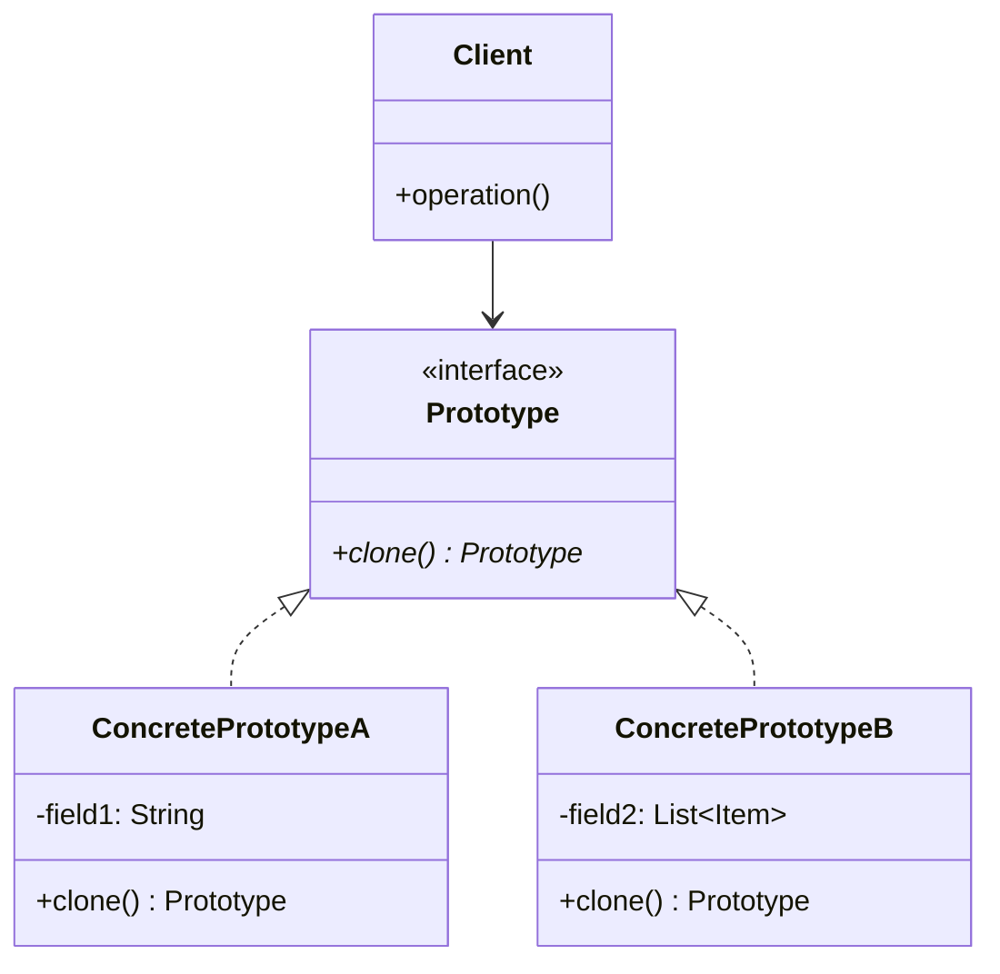
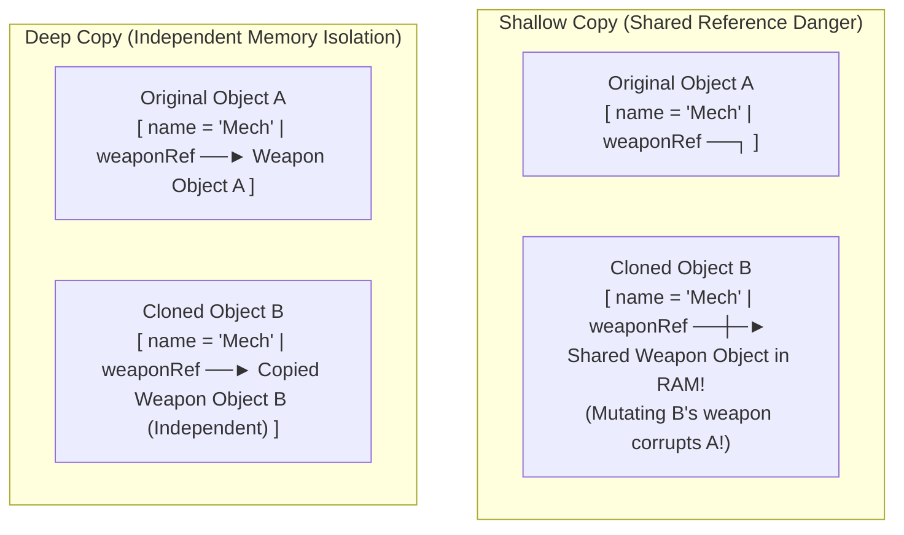

# Prototype Pattern — Deep vs. Shallow Copying and Prototype Managers

## Mental Model

Think of the **Prototype Pattern** as a biological cellular mitosis or a 3D printing studio scanning a master sculpture to create instant replicas. 

Suppose creating a complex 3D game NPC (e.g., a *High-Detail Cyberpunk Mech*) requires querying 10 SQL database tables, parsing 50MB of 3D mesh files, and initializing complex animation trees (**Expensive Construction Cost**). 

Instead of executing the slow 5-second database and disk I/O initialization sequence every time a new Mech spawns in the game world, you create **one master prototype object** in memory. When 100 new Mechs spawn during a battle, you simply **clone the prototype in RAM** in sub-microsecond time, modifying only individual unique attributes (e.g., position, health, or color tint).

---

## 1. Intent & Structural Definition

The **Prototype Pattern** specifies the kinds of objects to create using a prototypical instance, and creates new objects by copying this prototype.



### Key Intent & Constraints
1. **Performance Optimization:** Avoid expensive initialization logic (database queries, network calls, heavy disk I/O) by cloning an existing memory instance.
2. **Dynamic Instantiation:** Allow client code to duplicate objects without knowing their concrete classes.
3. **Deep Copy Isolation:** Ensure cloned instances receive independent copies of mutable state.

---

## 2. Deep Copy vs. Shallow Copying

The most critical technical requirement when implementing the Prototype Pattern is understanding the difference between a **Shallow Copy** and a **Deep Copy**.



### Comparative Summary

| Metric | Shallow Copy | Deep Copy |
|---|---|---|
| **Primitive Fields (`int`, `double`)** | Copies primitive values directly. | Copies primitive values directly. |
| **Object References / Collections** | Copies **memory address pointers** (Original and Clone share same inner objects!). | Recursively **duplicates inner objects** to create new independent memory instances. |
| **Execution Speed** | Fast ($O(1)$ pointer copy). | Slower ($O(N)$ recursive object graph traversal). |
| **Side-Effect Safety** | ❌ **Dangerous:** Mutating clone inner fields corrupts original instance! | ✅ **Safe:** Clone is 100% memory-isolated from original. |

---

## 3. Production Code Implementation (Copy Constructors vs. Cloneable)

> ⚠️ **Java `Cloneable` Flaw:** Java's native `Object.clone()` and `Cloneable` interface are broken and flawed (creates shallow copies by default, lacks constructor execution, throws checked `CloneNotSupportedException`). **Always use Copy Constructors or Copy Factories instead!**

### Clean Prototype Implementation using Copy Constructors

```java
// STEP 1: Prototype Interface
public interface Prototype<T> {
    T clone();
}

// Complex Nested Object
public class Weapon implements Prototype<Weapon> {
    private String name;
    private int damage;

    public Weapon(String name, int damage) {
        this.name = name;
        this.damage = damage;
    }

    // Copy Constructor for Deep Copying
    public Weapon(Weapon target) {
        if (target != null) {
            this.name = target.name;
            this.damage = target.damage;
        }
    }

    @Override
    public Weapon clone() {
        return new Weapon(this); // Invoke Copy Constructor
    }

    // Getters and Setters...
    public void setDamage(int damage) { this.damage = damage; }
    public int getDamage() { return damage; }
}

// Concrete Prototype Class
public class GameCharacter implements Prototype<GameCharacter> {
    private String characterClass;
    private int health;
    private Weapon weapon; // Mutable Reference!

    public GameCharacter(String characterClass, int health, Weapon weapon) {
        this.characterClass = characterClass;
        this.health = health;
        this.weapon = weapon;
    }

    // Deep Copy Constructor
    public GameCharacter(GameCharacter target) {
        if (target != null) {
            this.characterClass = target.characterClass;
            this.health = target.health;
            // CRITICAL: Perform Deep Copy on mutable inner reference!
            this.weapon = target.weapon != null ? target.weapon.clone() : null;
        }
    }

    @Override
    public GameCharacter clone() {
        return new GameCharacter(this); // Perform Deep Copy
    }

    public Weapon getWeapon() { return weapon; }
}
```

### Testing Memory Isolation

```java
public class Main {
    public static void main(String[] args) {
        // Create Master Prototype
        Weapon laser = new Weapon("Plasma Cannon", 100);
        GameCharacter bossPrototype = new GameCharacter("BossMech", 5000, laser);

        // Spawn Cloned Instance via Prototype Pattern
        GameCharacter clonedBoss = bossPrototype.clone();

        // Mutate Cloned Character's Weapon Damage
        clonedBoss.getWeapon().setDamage(250);

        // Verify Deep Copy Memory Isolation
        System.out.println("Original Boss Weapon Damage: " + bossPrototype.getWeapon().getDamage()); // 100 (Un-mutated!)
        System.out.println("Cloned Boss Weapon Damage:   " + clonedBoss.getWeapon().getDamage());   // 250
    }
}
```

---

## 4. The Prototype Manager (Registry Pattern)

A **Prototype Manager** (Prototype Registry) is a centralized cache mapping string keys to pre-configured prototype instances.

```mermaid
flowchart LR
    Client["Client Code\n.getPrototype('FIRE_MECH')"] --> Registry["Prototype Manager (Registry Map)\n'FIRE_MECH' -> FireMechInstance\n'ICE_MECH'  -> IceMechInstance"]
    Registry -->|Invokes .clone() on cached prototype| ReturnClone["Return Deep Cloned Object Instance"]
```

```java
public class PrototypeRegistry {
    private final Map<String, Prototype<?>> registry = new HashMap<>();

    public void registerPrototype(String key, Prototype<?> prototype) {
        registry.put(key, prototype);
    }

    @SuppressWarnings("unchecked")
    public <T extends Prototype<T>> T getClonedInstance(String key) {
        Prototype<?> prototype = registry.get(key);
        if (prototype == null) {
            throw new IllegalArgumentException("No prototype registered under key: " + key);
        }
        return (T) prototype.clone(); // Returns DEEP COPY
    }
}
```

---

## 5. Architectural Comparison Matrix

| Approach | Creation Speed | Memory Isolation | Object Graph Handling |
|---|---|---|---|
| **Direct `new` + DB Queries** | ❌ Slow (Heavy I/O overhead). | ✅ Complete | Fresh construction. |
| **Shallow Copy (`Object.clone()`)** | ✅ Sub-microsecond | ❌ **Dangerous** (Shared references). | Single-level pointer copy. |
| **Deep Copy Constructor (Prototype)** | ✅ **Fast** (RAM object copy). | ✅ **100% Isolated** | Recursive object graph cloning. |
| **Serialization Copy (Jackson/Kryo)** | ⚠️ Moderate (Byte stream overhead). | ✅ 100% Isolated | Automatic Graph Traversal. |

---

## 6. Failure Modes and Trade-offs

1. **Circular Reference Infinite Recursion** — Deep copying an object graph containing cyclic references (`Node A -> Node B -> Node A`). A naive deep copy constructor recurses indefinitely, throwing a `StackOverflowError`. *Mitigation*: Maintain an `IdentityHashMap<Object, Object> visitedMap` during deep cloning to track already-copied objects.
2. **Accidental Shallow Copying of Collections** — Calling `new ArrayList<>(originalList)` assuming it creates a deep copy. It creates a new list container, but **the elements inside the list still point to the original objects!** *Mitigation*: Iterate through collection elements and clone each item explicitly.
3. **Cloning Un-Cloneable System Resources** — Attempting to clone objects holding external OS handles (`FileDescriptor`, `Socket`, `Thread`, `DbConnection`). OS handles cannot be cloned via RAM copy. *Mitigation*: Exclude system handles from cloning (`transient` / `nullptr`) and re-initialize them in the clone.

---

## 7. Active-Recall Prompts

1. **What is the primary intent of the Prototype Pattern, and why is it preferred over `new` for expensive object creation?**
2. **Differentiate between a Shallow Copy and a Deep Copy. What happens if you mutate a nested object inside a Shallow Copy?**
3. **Why is Java's native `Cloneable` interface considered broken, and why are Copy Constructors preferred?**
4. **How does a Prototype Manager (Registry) act as a centralized factory for prototype instances?**

---

## Related Notes

- [[Factory Method Pattern - Virtual Constructors and Extensible Object Creation]]
- [[Abstract Factory Pattern - Product Families and Platform Decoupling]]
- [[Builder Pattern - Fluent Interfaces, Step Builders, and Immutable Object Construction]]
- [[Encapsulation, Data Hiding, and Information Hiding]]

> **Interview Style Question:** *"Design a high-frequency game engine spawner that instantiates 10,000 complex `Monster` objects per second. Demonstrate why using standard constructor initialization with database reads causes frame drops, implement the Prototype Pattern with deep-copy constructors for nested weapon and armor graphs, build a thread-safe `PrototypeRegistry`, and explain how you handle cyclic object references during cloning."*

---
