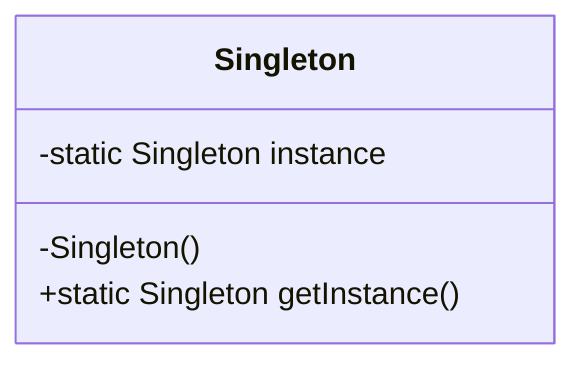
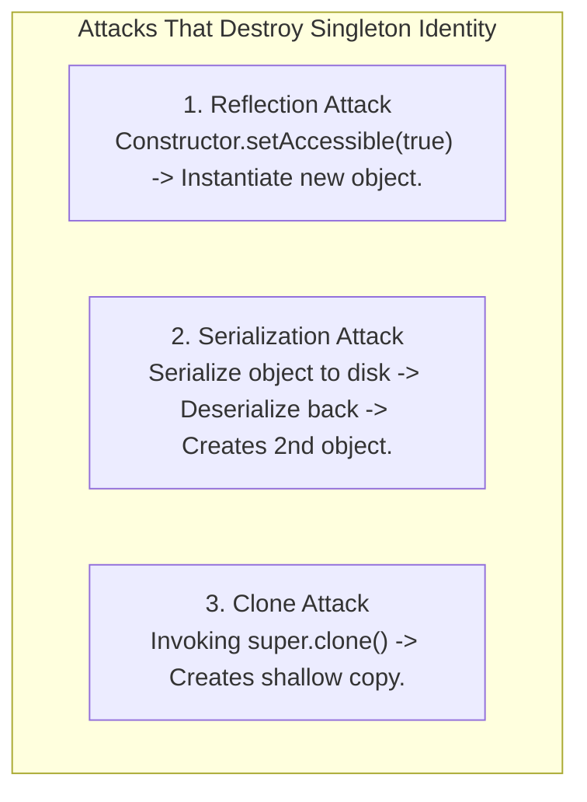

# Singleton Pattern — Thread-Safe Initialization, Double-Checked Locking, Enum Singleton

## Mental Model

Think of a **Singleton Class** as a nation's single, central Presidential Office or a database's unified Connection Pool Manager. 

No matter how many citizens or background threads request an audience with the President, there is physically **only one President in office at any given time**. Creating a new President for every incoming request would cause chaos and resource exhaustion. 

The Singleton pattern guarantees that a class has **exactly one instance in memory** throughout the entire application lifecycle, providing a single, thread-safe global point of access to that instance.

---

## 1. Intent & Structural Definition



### Key Intent & Constraints
1. **Single Instance Guarantee:** Ensure that a class has only one instance created within a JVM process / memory address space.
2. **Global Access Point:** Provide a controlled, lazy or eager global access point (`getInstance()`) to that single instance.
3. **Private Constructor:** Prevent external code from instantiating the class directly using the `new` operator.

---

## 2. Evolution of Thread-Safe Singleton Implementations

Achieving true thread-safety without incurring massive synchronization performance penalties requires deep understanding of memory models, CPU instruction reordering, and volatile semantics.

---

### Implementation 1: Eager Initialization (Simple & Thread-Safe)

```java
// Thread-Safe via JVM Class Loader mechanics (Instantiated at class load time)
public final class EagerSingleton {
    private static final EagerSingleton INSTANCE = new EagerSingleton();

    private EagerSingleton() {
        // Prevent Reflection Attack
        if (INSTANCE != null) {
            throw new IllegalStateException("Instance already created!");
        }
    }

    public static EagerSingleton getInstance() {
        return INSTANCE;
    }
}
```
- **Pros:** 100% thread-safe; zero synchronization overhead; simple code.
- **Cons:** **No Lazy Loading:** Instantiated even if the application never uses it, wasting RAM if initialization is expensive.

---

### Implementation 2: Naive Lazy Initialization (Thread-UNSAFE!)

```java
// DANGER: Thread-Unsafe! Multi-threaded access creates MULTIPLE instances!
public class LazyUnsafeSingleton {
    private static LazyUnsafeSingleton instance;

    private LazyUnsafeSingleton() {}

    public static LazyUnsafeSingleton getInstance() {
        if (instance == null) { // RACE CONDITION! Thread A and B both pass check simultaneously!
            instance = new LazyUnsafeSingleton();
        }
        return instance;
    }
}
```

---

### Implementation 3: Synchronized Method (Thread-Safe but SLOW)

```java
public class SynchronizedSingleton {
    private static SynchronizedSingleton instance;

    private SynchronizedSingleton() {}

    // Thread-safe, BUT severe bottleneck! Synchronizes EVERY call to getInstance()!
    public static synchronized SynchronizedSingleton getInstance() {
        if (instance == null) {
            instance = new SynchronizedSingleton();
        }
        return instance;
    }
}
```
- **Cons:** 99.99% of `getInstance()` calls are pure read reads *after* initialization. Synchronizing the entire method forces 1,000 threads to wait in line, reducing throughput by 100x!

---

### Implementation 4: Double-Checked Locking (DCL) with `volatile`

To avoid synchronizing every call, Double-Checked Locking checks if the instance is null *before* acquiring the lock, and checks again *after* acquiring the lock.

```java
public final class DoubleCheckedLockingSingleton {
    // CRITICAL: volatile is MANDATORY to prevent Instruction Reordering!
    private static volatile DoubleCheckedLockingSingleton instance;

    private DoubleCheckedLockingSingleton() {}

    public static DoubleCheckedLockingSingleton getInstance() {
        DoubleCheckedLockingSingleton result = instance;
        if (result == null) { // First Check (No Lock)
            synchronized (DoubleCheckedLockingSingleton.class) {
                result = instance;
                if (result == null) { // Second Check (With Lock)
                    instance = result = new DoubleCheckedLockingSingleton();
                }
            }
        }
        return result;
    }
}
```

#### Why `volatile` is Mandatory in DCL (Instruction Reordering Danger)
Constructing an object `new DoubleCheckedLockingSingleton()` consists of 3 low-level assembly operations:

```text
1. memory = allocate(sizeof(Singleton)); // Allocate RAM block
2. ctorSingleton(memory);                 // Run Constructor logic (initialize fields)
3. instance = memory;                     // Assign reference pointer to 'instance'
```

Without the `volatile` keyword, compilers and CPUs can reorder instructions to `1 -> 3 -> 2`. 
If Thread A executes step 1 then step 3 (pointer assigned but constructor NOT yet run!), Thread B arrives at the first `if (instance == null)` check. Thread B sees `instance != null`, returns the **partially constructed, uninitialized object**, and crashes with a `NullPointerException` or corrupted state!

> The `volatile` keyword establishes a **Happens-Before Memory Barrier**, preventing instruction reordering across the assignment.

---

### Implementation 5: Bill Pugh Singleton (Lazy Initialization Holder Class)

The **Bill Pugh Singleton** relies on the JVM class loading specification to achieve lazy, thread-safe initialization without any locks or volatile overhead!

```java
public final class BillPughSingleton {
    private BillPughSingleton() {}

    // Inner static helper class. NOT loaded into memory until getInstance() is called!
    private static class SingletonHolder {
        private static final BillPughSingleton INSTANCE = new BillPughSingleton();
    }

    public static BillPughSingleton getInstance() {
        return SingletonHolder.INSTANCE; // Triggers loading of SingletonHolder class (Thread-Safe by JVM spec!)
    }
}
```
- **Pros:** 100% Lazy Loading; 100% Thread-Safe; Zero synchronization overhead; Cleanest Java implementation.

---

### Implementation 6: Enum Singleton (Effective Java Best Practice)

As recommended by Joshua Bloch in *Effective Java*:

> *"A single-element enum type is the best way to implement a singleton."*

```java
public enum EnumSingleton {
    INSTANCE;

    // Singleton State & Business Methods
    private int configurationValue = 42;

    public void doSomething() {
        System.out.println("Enum Singleton executing with config: " + configurationValue);
    }
}
```

#### Why Enum Singleton Beats All Other Implementations:
1. **Thread-Safety Guaranteed:** Enums are guaranteed thread-safe by JVM specification.
2. **Reflection Proof:** Reflection API (`Constructor.newInstance()`) explicitly throws `IllegalArgumentException: Cannot reflectively create enum objects`.
3. **Serialization Proof:** Standard singletons break during deserialization (creating a second object). Enums guarantee absolute single-instance identity across serialization byte streams.

---

## 3. Breaking Singletons: Reflection, Serialization, Cloning

If not using Enum Singleton, standard singletons can be broken via 3 reflection/serialization loopholes:



### Defensive Measures for Non-Enum Singletons

```java
public class DefensiveSingleton implements Serializable, Cloneable {
    private static final long serialVersionUID = 1L;
    private static final DefensiveSingleton INSTANCE = new DefensiveSingleton();

    private DefensiveSingleton() {
        // 1. Guard against Reflection Attack
        if (INSTANCE != null) {
            throw new IllegalStateException("Cannot re-instantiate Singleton via Reflection!");
        }
    }

    // 2. Guard against Serialization Attack (Preserves Singleton identity on readObject)
    protected Object readResolve() {
        return INSTANCE;
    }

    // 3. Guard against Clone Attack
    @Override
    protected Object clone() throws CloneNotSupportedException {
        throw new CloneNotSupportedException("Cloning Singleton is forbidden!");
    }
}
```

---

## 4. Architectural Comparison Matrix

| Implementation Pattern | Thread Safety | Lazy Loading | Performance (Ops/sec) | Reflection / Serialization Safe |
|---|---|---|---|---|
| **Eager Initialization** | ✅ Yes | ❌ No | High | ❌ No (requires `readResolve`) |
| **Double-Checked Locking (Volatile)** | ✅ Yes | ✅ Yes | High | ❌ No |
| **Bill Pugh (Holder Class)** | ✅ **Yes** | ✅ **Yes** | **Maximum** | ❌ No |
| **Enum Singleton** | ✅ **Yes** | ❌ No (At enum load) | **Maximum** | ✅ **100% Safe** |

---

## 5. Failure Modes and Trade-offs

1. **Singleton as a Global Variable Anti-Pattern** — Using Singletons as global state dumping grounds. Testing becomes impossible because tests share state across runs, introducing hidden order-dependent unit test failures. *Mitigation*: Manage object lifecycles using **Dependency Injection (DI) Containers** (Spring `@Singletons`) rather than hardcoded `getInstance()` calls.
2. **Missing `volatile` in Double-Checked Locking** — Omitting `volatile` on the instance field in C++/Java DCL, leading to CPU instruction reordering crashes in multi-threaded production environments. *Mitigation*: Use Bill Pugh Holder class or `volatile`.
3. **Class Loader Duplication** — Running an application inside a container with multiple custom ClassLoaders. Each ClassLoader loads the Singleton class independently, creating multiple "Singletons" per JVM process! *Mitigation*: Specify parent ClassLoader scope.

---

## 6. Active-Recall Prompts

1. **Why is the `volatile` keyword mandatory in Double-Checked Locking (DCL) implementations of Singleton in Java/C++?**
2. **Explain how the Bill Pugh Singleton uses the JVM Class Loader mechanism to achieve lazy, thread-safe initialization without locks.**
3. **Why does Joshua Bloch recommend Enum Singleton as the ultimate singleton implementation? What 3 attacks does it inherently prevent?**
4. **Why is Singleton considered an Anti-Pattern when overused, and how do Dependency Injection containers manage singleton lifecycles cleanly?**

---

## Related Notes

- [[Factory Method Pattern - Virtual Constructors and Extensible Object Creation]]
- [[Abstract Factory Pattern - Product Families and Platform Decoupling]]
- [[Dependency Inversion Principle - DIP and Dependency Injection Containers]]
- [[Encapsulation, Data Hiding, and Information Hiding]]

> **Interview Style Question:** *"In a Staff Engineer concurrency interview, analyze 4 different Singleton implementations (Eager, Synchronized Method, Double-Checked Locking with `volatile`, and Enum). Trace the assembly instruction reordering failure mode of non-volatile DCL, write code to defend a Singleton against Reflection and Serialization attacks, and justify why Spring Framework uses DI container-managed singletons over class-level Singletons."*

---
