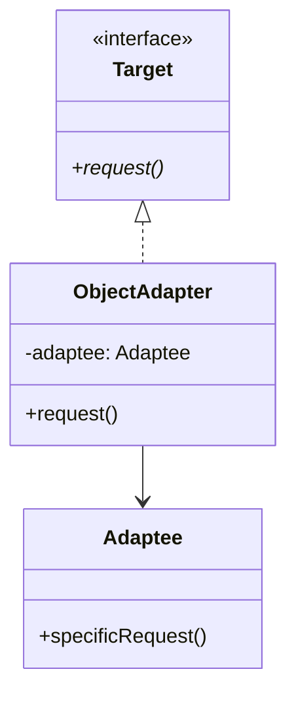
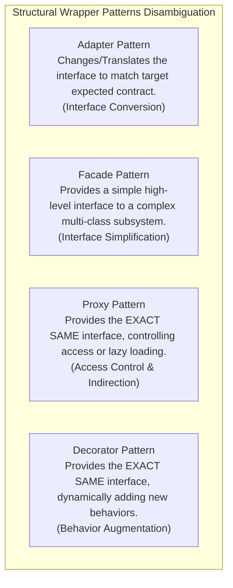

# Adapter Pattern — Class vs. Object Adapters and Interface Translation

## Mental Model

Think of an **Adapter Pattern** as an international physical electrical power plug adapter. 

You are traveling in Europe with a US laptop charger (**Target Interface** expects a 3-prong flat plug). The hotel wall socket in London accepts only 3-prong rectangular UK plugs (**Adaptee Interface**). 

You do not re-wire your laptop charger's internal electronics (**Do Not Modify Existing Code**), nor do you smash open the hotel wall socket to rewire the building (**Cannot Modify Third-Party Code**). Instead, you plug your US charger into a physical **Plug Adapter** (**The Adapter**). The adapter translates the flat-prong connection into a rectangular-prong connection on the fly, bridging the incompatible interfaces seamlessly.

---

## 1. Intent & Structural Definition

The **Adapter Pattern** converts the interface of a class into another interface clients expect. Adapter lets classes work together that couldn't otherwise because of incompatible interfaces.



### Key Intent & Constraints
1. **Interface Translation:** Wrap an incompatible existing class (Adaptee) to expose a target interface expected by client code.
2. **Zero Modification Rule:** Integrate third-party libraries, legacy code, or external SDKs without altering their source code.
3. **Decoupled Architecture:** Keep client code cleanly isolated from vendor-specific API structures.

---

## 2. Object Adapter vs. Class Adapter

There are two primary structural approaches for implementing the Adapter Pattern: **Object Adapters** (using Composition) and **Class Adapters** (using Multiple Inheritance).

```mermaid
flowchart TD
    subgraph ObjectAdapterDiag["Object Adapter (Composition - Recommended)"]
        Target1["Target Interface"] <|.. ObjAdapter["ObjectAdapter Class"]
        ObjAdapter -->|has-a (composition)| Adaptee1["Adaptee Class (Third-Party SDK)"]
        Note1["Uses Object Delegation.\nFlexible, works with Adaptee and all its subclasses."]
    end

    subgraph ClassAdapterDiag["Class Adapter (Multiple Inheritance - Rare)"]
        Target2["Target Interface"] <|.. ClassAdapter["Class Adapter Class"]
        Adaptee2["Adaptee Class"] <|-- ClassAdapter
        Note2["Uses Multiple Inheritance (`extends Adaptee implements Target`).\nRigid, requires language support for multiple inheritance (C++)."]
    end
```

### Architectural Comparison Matrix

| Metric | Object Adapter (Composition) | Class Adapter (Inheritance) |
|---|---|---|
| **OOP Mechanism** | **Composition ("Has-A"):** Holds a reference pointer to `Adaptee`. | **Inheritance ("Is-A"):** Extends `Adaptee` and implements `Target`. |
| **Language Support** | Universal (Java, C++, C#, Python, TS). | Restricted (C++ only; Java/C# forbid multiple class inheritance). |
| **Subclass Flexibility** | **High:** Can adapt an `Adaptee` AND any of its derived subclasses. | Low: Can adapt only the specific single inherited `Adaptee` class. |
| **Method Overriding** | Cannot easily override Adaptee internal methods. | Can override Adaptee methods directly (since it is a subclass). |
| **Coupling** | **Loose (Black-Box)** | Tight (White-Box) |

---

## 3. Production Code Implementation (Object Adapter Pattern)

### Scenario:
Your E-Commerce core system uses a unified `PaymentGateway` interface expecting `pay(String orderId, double amountInDollars)`. You need to integrate a legacy third-party payment library `LegacyPaypalSDK` that uses `makePayment(long accountNumber, centsAmount)`.

```java
// ============================================================================
// 1. TARGET INTERFACE (What your application code expects)
// ============================================================================
public interface PaymentGateway {
    boolean processPayment(String orderId, double amountInDollars);
}

// ============================================================================
// 2. ADAPTEE (Third-Party / Legacy Incompatible Class - CANNOT BE MODIFIED)
// ============================================================================
public class LegacyPaypalSDK {
    public boolean makePayment(long accountNumber, long amountInCents) {
        System.out.println("LegacyPaypalSDK processing account " + accountNumber + 
                           " for " + amountInCents + " cents.");
        return true; // Payment success
    }
}

// ============================================================================
// 3. OBJECT ADAPTER (Translates Target Interface -> Adaptee Operations)
// ============================================================================
public class PaypalPaymentAdapter implements PaymentGateway {
    private final LegacyPaypalSDK legacyPaypalSDK;

    public PaypalPaymentAdapter(LegacyPaypalSDK legacyPaypalSDK) {
        this.legacyPaypalSDK = Objects.requireNonNull(legacyPaypalSDK, "SDK required");
    }

    @Override
    public boolean processPayment(String orderId, double amountInDollars) {
        // Step 1: Translate orderId (String) -> accountNumber (long)
        long accountNumber = parseOrderIdToAccount(orderId);

        // Step 2: Translate Dollars (double) -> Cents (long)
        long amountInCents = Math.round(amountInDollars * 100.0);

        // Step 3: Delegate operation to Adaptee
        return legacyPaypalSDK.makePayment(accountNumber, amountInCents);
    }

    private long parseOrderIdToAccount(String orderId) {
        // Translation utility logic...
        return Math.abs(orderId.hashCode());
    }
}

// ============================================================================
// 4. CLIENT CODE (Uses Target Interface - Completely Decoupled!)
// ============================================================================
public class OrderProcessor {
    private final PaymentGateway paymentGateway;

    public OrderProcessor(PaymentGateway paymentGateway) {
        this.paymentGateway = paymentGateway;
    }

    public void checkout(String orderId, double total) {
        if (paymentGateway.processPayment(orderId, total)) {
            System.out.println("Checkout successful for order: " + orderId);
        } else {
            System.out.println("Payment failed!");
        }
    }
}
```

---

## 4. Adapter vs. Facade vs. Proxy vs. Decorator

These structural patterns are frequently confused because all four act as wrappers around existing objects.



### Pattern Wrapper Comparison Matrix

| Pattern | Does it Change the Interface? | Primary Intent |
|---|---|---|
| **Adapter** | **YES (Converts Interface A $\to$ Interface B)** | Make incompatible interfaces work together. |
| **Facade** | **YES (Simplifies Many $\to$ One High-Level API)** | Provide a unified entry point to a complex subsystem. |
| **Proxy** | **NO (Exact Same Interface)** | Control access, lazy-load, or add remote indirection. |
| **Decorator** | **NO (Exact Same Interface)** | Add new responsibilities dynamically without inheritance. |

---

## 5. Failure Modes and Trade-offs

1. **Over-Adapting (Complex Two-Way Translation)** — Attempting to build a two-way adapter that translates every method bidirectionally between two massive incompatible 50-method interfaces. Result: The adapter becomes a complex, unmaintainable 2,000-line monster. *Mitigation*: Restrict the Target interface to only the methods the client actually requires (**ISP**).
2. **Loss of Adaptee Precision during Conversion** — Translating high-precision data types (e.g., converting a 64-bit `Decimal128` from a legacy banking SDK to a 32-bit `float` in the target interface). Result: Silent rounding errors and financial calculation drift. *Mitigation*: Ensure target interfaces maintain equivalent or higher numerical precision than the adaptee.
3. **Performance Overhead of Deep Adapters** — Chaining multiple adapters together (`AdapterA -> AdapterB -> AdapterC -> Adaptee`). Result: Multiple layers of memory allocations and function call indirection.

---

## 6. Active-Recall Prompts

1. **What is the primary intent of the Adapter Pattern, and how does it enable integration without modifying existing code?**
2. **Compare Object Adapters vs. Class Adapters across composition vs. inheritance, language support, and flexibility.**
3. **How does an Adapter differ from a Decorator and a Proxy in terms of interface preservation?**
4. **Why is the Object Adapter preferred over Class Adapter in modern clean software architecture?**

---

## Related Notes

- [[Facade Pattern - Simplifying Subsystem Interfaces and Boundary Layering]]
- [[Proxy Pattern - Virtual, Remote, Protection, and Smart Proxies]]
- [[Decorator Pattern - Dynamic Behavior Extension and Wrapper Chaining]]
- [[Abstraction and Interface-Driven Design]]
- [[Interface Segregation Principle - ISP and Decoupling]]

> **Interview Style Question:** *"Your software system is migrating from a legacy XML SOAP web service to a modern JSON REST microservice. The client codebase contains 50,000 lines of code expecting the legacy `SoapUserClient` interface. Demonstrate how to implement an Object Adapter (`RestToSoapAdapter`) that allows client code to consume the new REST microservice with zero changes to existing client application logic."*

---
