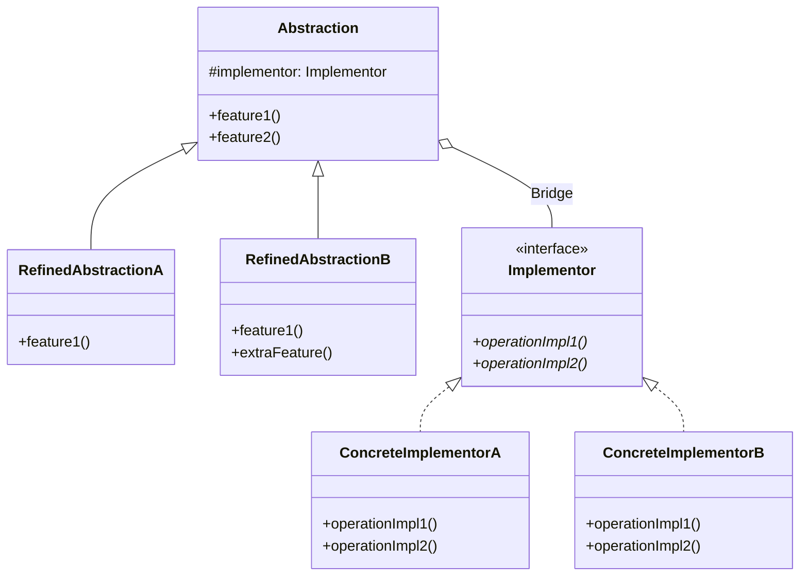
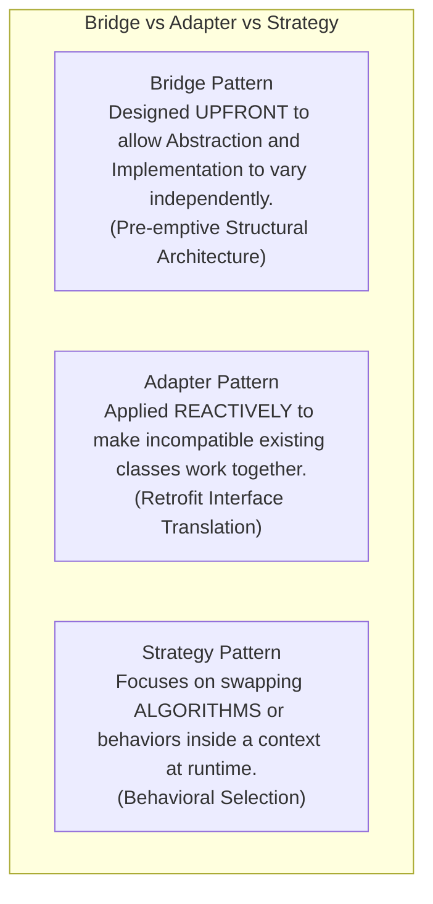

# Bridge Pattern — Decoupling Abstraction from Implementation

## Mental Model

Think of the **Bridge Pattern** as a universal remote control system for home electronics. 

You have high-level remote controls (**Abstractions**: *Basic Remote*, *Advanced Touchscreen Remote*, *Voice Control Remote*), and you have home appliances (**Implementations**: *Sony TV*, *LG TV*, *Philips Smart Lights*). 

Without a Bridge, if you try to build specialized remote classes for every appliance via inheritance, you end up with an unmanageable class explosion: `BasicSonyTVRemote`, `AdvancedSonyTVRemote`, `BasicLGTVRemote`, `AdvancedLGTVRemote`, `BasicPhilipsLightRemote` ($N \times M$ classes!). 

With the Bridge Pattern, you split the system into two independent hierarchies connected by a bridge pointer (Composition). The high-level Remote holds an `Appliance` interface pointer. You can add new remote types or new TV brands independently without multiplying classes!

---

## 1. Intent & Structural Definition

The **Bridge Pattern** decouples an abstraction from its implementation so that the two can vary independently.



### Key Intent & Constraints
1. **Defeat Class Explosion:** Replace $N \times M$ inheritance hierarchies with $N + M$ composed classes.
2. **Independent Evolution:** Allow the high-level control logic (Abstraction) and low-level platform code (Implementation) to be extended independently.
3. **Hide Implementation Details:** Hide platform-specific primitive operations completely from client code.

---

## 2. The $N \times M$ Class Explosion Problem

Consider a GUI framework supporting 3 Types of Windows (*Simple Window*, *Icon Window*, *Transient Window*) across 3 Operating Systems (*Windows*, *macOS*, *Linux*).

### Inheritance Approach (Class Explosion Anti-Pattern)

```text
Class Hierarchy (9 Subclasses Required!):
Window (Base)
  ├── SimpleWindow
  │     ├── WindowsSimpleWindow
  │     ├── MacSimpleWindow
  │     └── LinuxSimpleWindow
  ├── IconWindow
  │     ├── WindowsIconWindow
  │     ├── MacIconWindow
  │     └── LinuxIconWindow
  └── TransientWindow
        ├── WindowsTransientWindow
        ├── MacTransientWindow
        └── LinuxTransientWindow
```

> **The Problem:** Adding 1 new Window Type and 1 new OS increases total classes from **9 to 16 ($4 \times 4$)**!

---

### Bridge Approach (Composition Solution)

Split into 2 independent hierarchies connected via a Bridge reference pointer:
1. **Abstraction Hierarchy ($N=3$):** `Window`, `IconWindow`, `TransientWindow`.
2. **Implementor Hierarchy ($M=3$):** `WindowImp`, `WindowsWindowImp`, `MacWindowImp`, `LinuxWindowImp`.

$$\text{Total Classes} = N + M = 3 + 3 = \mathbf{6 \text{ Classes!}} \quad (\text{vs. } 9)$$

---

## 3. Production Code Implementation (Remote Control & Devices)

```java
// ============================================================================
// 1. IMPLEMENTOR INTERFACE (Low-level platform operations)
// ============================================================================
public interface Device {
    boolean isEnabled();
    void enable();
    void disable();
    int getVolume();
    void setVolume(int percent);
}

// ============================================================================
// 2. CONCRETE IMPLEMENTORS (Low-level platform implementations)
// ============================================================================
public class TvDevice implements Device {
    private boolean on = false;
    private int volume = 30;

    @Override public boolean isEnabled() { return on; }
    @Override public void enable() { on = true; System.out.println("TV powered ON"); }
    @Override public void disable() { on = false; System.out.println("TV powered OFF"); }
    @Override public int getVolume() { return volume; }
    @Override public void setVolume(int percent) { 
        this.volume = Math.max(0, Math.min(100, percent));
        System.out.println("TV volume set to: " + this.volume);
    }
}

public class RadioDevice implements Device {
    private boolean on = false;
    private int volume = 15;

    @Override public boolean isEnabled() { return on; }
    @Override public void enable() { on = true; System.out.println("Radio playing..."); }
    @Override public void disable() { on = false; System.out.println("Radio silent"); }
    @Override public int getVolume() { return volume; }
    @Override public void setVolume(int percent) { 
        this.volume = percent;
        System.out.println("Radio volume set to: " + this.volume);
    }
}

// ============================================================================
// 3. ABSTRACTION HIERARCHY (High-level control logic containing the Bridge!)
// ============================================================================
public class RemoteControl {
    // THE BRIDGE POINTER (Composition)
    protected final Device device;

    public RemoteControl(Device device) {
        this.device = Objects.requireNonNull(device, "Device required");
    }

    public void togglePower() {
        if (device.isEnabled()) {
            device.disable();
        } else {
            device.enable();
        }
    }

    public void volumeUp() {
        device.setVolume(device.getVolume() + 10);
    }

    public void volumeDown() {
        device.setVolume(device.getVolume() - 10);
    }
}

// ============================================================================
// 4. REFINED ABSTRACTION (Extends high-level functionality without touching Device!)
// ============================================================================
public class AdvancedRemoteControl extends RemoteControl {
    public AdvancedRemoteControl(Device device) {
        super(device);
    }

    public void mute() {
        System.out.println("Advanced Remote: Muting device");
        device.setVolume(0);
    }
}

// ============================================================================
// 5. CLIENT CODE
// ============================================================================
public class Main {
    public static void main(String[] args) {
        Device tv = new TvDevice();
        RemoteControl basicRemote = new RemoteControl(tv);
        basicRemote.togglePower(); // TV powered ON

        Device radio = new RadioDevice();
        AdvancedRemoteControl advancedRemote = new AdvancedRemoteControl(radio);
        advancedRemote.togglePower(); // Radio playing...
        advancedRemote.mute();        // Radio volume set to: 0
    }
}
```

---

## 4. Bridge vs. Adapter vs. Strategy



### Comparative Summary

| Pattern | Architectural Phase | Primary Objective |
|---|---|---|
| **Bridge** | **Upfront Architecture** | Avoid $N \times M$ class explosion by separating control logic from platform rendering. |
| **Adapter** | **Reactive Integration** | Retrofit existing incompatible code to match a target interface. |
| **Strategy** | **Behavioral Design** | Make algorithms or business policies interchangeable at runtime. |

---

## 5. Failure Modes and Trade-offs

1. **Over-Engineered Monomorphic Bridge** — Applying the Bridge Pattern to a system that will only ever have 1 Abstraction and 1 Implementor. Result: Adds unnecessary indirection files and interface overhead without providing value. *Mitigation*: Apply Bridge only when multiple dimensions of variation ($N \ge 2, M \ge 2$) are present or planned.
2. **Coupling Refined Abstractions to Concrete Implementors** — Casting the `device` pointer inside `AdvancedRemoteControl` to `(TvDevice) device`. This breaks the Bridge pattern and restores tight coupling! *Mitigation*: Ensure Refined Abstractions interact **exclusively** with the `Device` implementor interface.
3. **Leaky Implementor Interfaces** — Designing the `Device` implementor interface with high-level methods like `showTVChannelGuide()`. Radios don't have channel guides! *Mitigation*: Keep the Implementor interface strictly primitive and platform-focused (`setVolume`, `enable`).

---

## 6. Active-Recall Prompts

1. **What is the primary intent of the Bridge Pattern, and how does it prevent an $N \times M$ class explosion?**
2. **Explain the structural role of the Abstraction, Refined Abstraction, Implementor, and Concrete Implementor in the Bridge Pattern.**
3. **How does the Bridge Pattern differ from the Adapter Pattern regarding when they are applied in the software lifecycle?**
4. **Why should the Implementor interface contain low-level primitives while the Abstraction contains high-level business logic?**

---

## Related Notes

- [[Inheritance, Subtyping, and Composition vs Inheritance]]
- [[Adapter Pattern - Class vs Object Adapters and Interface Translation]]
- [[Strategy Pattern - Algorithmic Interchangeability and Policy Objects]]
- [[Abstract Factory Pattern - Product Families and Platform Decoupling]]

> **Interview Style Question:** *"Design a cross-platform Database Reporting Framework supporting 3 Report Types (Summary, Detailed, Audit) across 3 Database Engines (PostgreSQL, MySQL, Oracle). Demonstrate how standard class inheritance leads to a 9-class explosion, refactor the system using the Bridge Pattern into Abstraction and Implementor hierarchies, and prove how adding a 4th Database Engine requires adding only 1 new class."*

---
