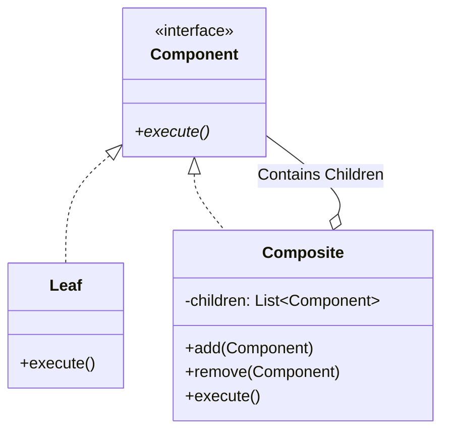
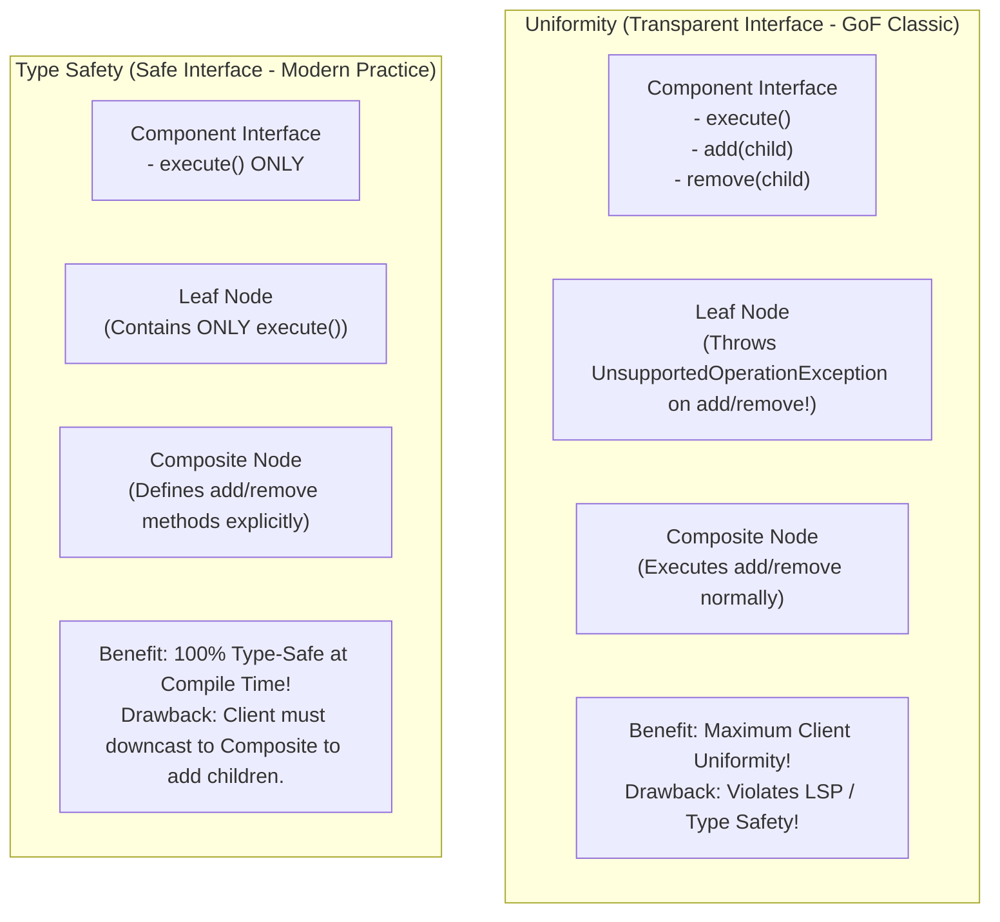
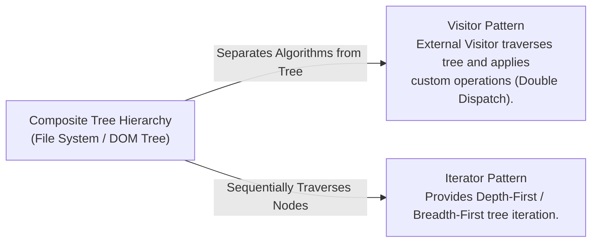

# Composite Pattern — Tree Structures, Uniformity vs. Type Safety

## Mental Model

Think of the **Composite Pattern** as a computer file system directory hierarchy. 

A file system contains individual **Files** (Leaf elements) and **Folders** (Composite elements containing files and sub-folders). 

When you select a Folder and click `Get Size` or `Delete`, you do not write separate conditional logic for files vs. folders (**Uniformity**). The folder automatically iterates over all its children, invoking `Get Size` on each file and sub-folder recursively. Client code treats a single individual File and a massive nested 100GB Folder structure through the exact same unified interface!

---

## 1. Intent & Structural Definition

The **Composite Pattern** composes objects into tree structures to represent part-whole hierarchies. Composite lets clients treat individual objects and compositions of objects uniformly.



### Key Intent & Constraints
1. **Part-Whole Hierarchies:** Model recursive tree structures (e.g., File Systems, GUI Component Trees, Bill of Materials, DOM Trees).
2. **Polymorphic Uniformity:** Enable clients to execute operations on leaf elements and composite branch nodes via a single common component interface.
3. **Recursive Dispatch:** Composite operations automatically propagate down the tree structure recursively.

---

## 2. Uniformity vs. Type Safety Trade-off

Designers of the Composite Pattern face a fundamental trade-off between **Uniformity** (Transparent Interface) and **Type Safety** (Safe Interface).



### Trade-off Summary Matrix

| Design Variant | `add()` / `remove()` Declared Where? | Type Safety | Client Uniformity | LSP Compliance |
|---|---|---|---|---|
| **Uniform (Transparent)** | Inside `Component` Base Interface. | ❌ Low (Runtime exception if `add()` called on Leaf). | ✅ **Maximum** (All nodes have identical methods). | ❌ Violates LSP. |
| **Type-Safe (Safe)** | Inside `Composite` Class ONLY. | ✅ **100% Compile-Time Safe** (Leaf has no `add()`). | ⚠️ Lower (Client must know node type to add children). | ✅ Obeyes LSP. |

---

## 3. Production Code Implementation: File System & Directory Tree

```java
// ============================================================================
// 1. COMPONENT INTERFACE (Type-Safe Approach)
// ============================================================================
public interface FileSystemNode {
    String getName();
    long getSizeInBytes(); // Recursive Calculation Operation!
    void printStructure(String indent);
}

// ============================================================================
// 2. LEAF ELEMENT (Individual File)
// ============================================================================
public class FileLeaf implements FileSystemNode {
    private final String name;
    private final long sizeInBytes;

    public FileLeaf(String name, long sizeInBytes) {
        this.name = Objects.requireNonNull(name);
        this.sizeInBytes = sizeInBytes;
    }

    @Override public String getName() { return name; }
    @Override public long getSizeInBytes() { return sizeInBytes; }

    @Override
    public void printStructure(String indent) {
        System.out.println(indent + "- File: " + name + " (" + sizeInBytes + " bytes)");
    }
}

// ============================================================================
// 3. COMPOSITE ELEMENT (Directory Folder)
// ============================================================================
public class DirectoryComposite implements FileSystemNode {
    private final String name;
    private final List<FileSystemNode> children = new ArrayList<>();

    public DirectoryComposite(String name) {
        this.name = Objects.requireNonNull(name);
    }

    // Composite Management Methods (Type-Safe)
    public void add(FileSystemNode node) {
        children.add(Objects.requireNonNull(node));
    }

    public void remove(FileSystemNode node) {
        children.remove(node);
    }

    @Override public String getName() { return name; }

    // RECURSIVE OPERATION DISPATCH!
    @Override
    public long getSizeInBytes() {
        long totalSize = 0;
        for (FileSystemNode child : children) {
            totalSize += child.getSizeInBytes(); // Recursive Call!
        }
        return totalSize;
    }

    @Override
    public void printStructure(String indent) {
        System.out.println(indent + "+ Directory: " + name + " [Total: " + getSizeInBytes() + " bytes]");
        for (FileSystemNode child : children) {
            child.printStructure(indent + "  "); // Recursive Call!
        }
    }
}

// ============================================================================
// 4. CLIENT EXECUTION
// ============================================================================
public class Main {
    public static void main(String[] args) {
        // Build Tree: root/
        //              ├── file1.txt (100 B)
        //              └── docs/
        //                   ├── resume.pdf (500 B)
        //                   └── photo.png (2000 B)
        
        FileLeaf file1 = new FileLeaf("file1.txt", 100);
        FileLeaf resume = new FileLeaf("resume.pdf", 500);
        FileLeaf photo = new FileLeaf("photo.png", 2000);

        DirectoryComposite docs = new DirectoryComposite("docs");
        docs.add(resume);
        docs.add(photo);

        DirectoryComposite root = new DirectoryComposite("root");
        root.add(file1);
        root.add(docs);

        // Uniform Execution on Root Composite Node!
        root.printStructure("");
        System.out.println("Root Size: " + root.getSizeInBytes() + " bytes"); // 2600 bytes
    }
}
```

---

## 4. Traversing Composite Trees: Visitor & Iterator Patterns

As composite trees grow large, adding new operations (e.g., `exportToJSON()`, `virusScan()`) directly into the `Component` interface pollutes the classes (**Violates OCP & SRP**).



---

## 5. Failure Modes and Trade-offs

1. **Infinite Recursive Loops (Cyclic Graphs)** — Adding a parent node as a child of one of its own descendants (`A -> B -> A`). Calling `getSizeInBytes()` recurses endlessly until `StackOverflowError`. *Mitigation*: Maintain parent pointers and validate cyclic constraints during `add()`.
2. **Violating LSP in Uniform Design** — Calling `leaf.add(child)` in the Transparent design throws runtime exceptions, surprising client code. *Mitigation*: Use the **Type-Safe** design where child management methods exist only on the `Composite` class.
3. **Deep Tree Stack Overflow** — Traversing a tree with depth $> 10,000$ using native recursion can exhaust the call stack. *Mitigation*: Replace recursion with an explicit iterative stack (`java.util.ArrayDeque`) in high-depth production environments.

---

## 6. Active-Recall Prompts

1. **What is the primary intent of the Composite Pattern, and what is a part-whole hierarchy?**
2. **Explain the trade-off between Uniformity (Transparent Interface) and Type Safety (Safe Interface) in Composite design.**
3. **How does recursive operation dispatch allow a client to invoke `getSize()` on a root directory without knowing the tree depth?**
4. **Why does adding cyclic references to a Composite tree cause stack overflow, and how can parent pointer validation prevent it?**

---

## Related Notes

- [[Abstraction and Interface-Driven Design]]
- [[Inheritance, Subtyping, and Composition vs Inheritance]]
- [[Decorator Pattern - Dynamic Behavior Extension and Wrapper Chaining]]
- [[Visitor Pattern - Double Dispatch and Operations over Heterogeneous Trees]]

> **Interview Style Question:** *"Design an Organizational Hierarchy tree for an enterprise SaaS platform containing individual `Employee` leaves and `Department` composites. Write the complete component interface, demonstrate how calculating total team salary executes recursively, compare the Uniform vs. Type-Safe design trade-offs, and show how you prevent circular reporting loops (`Employee A reports to B who reports to A`)."*

---
