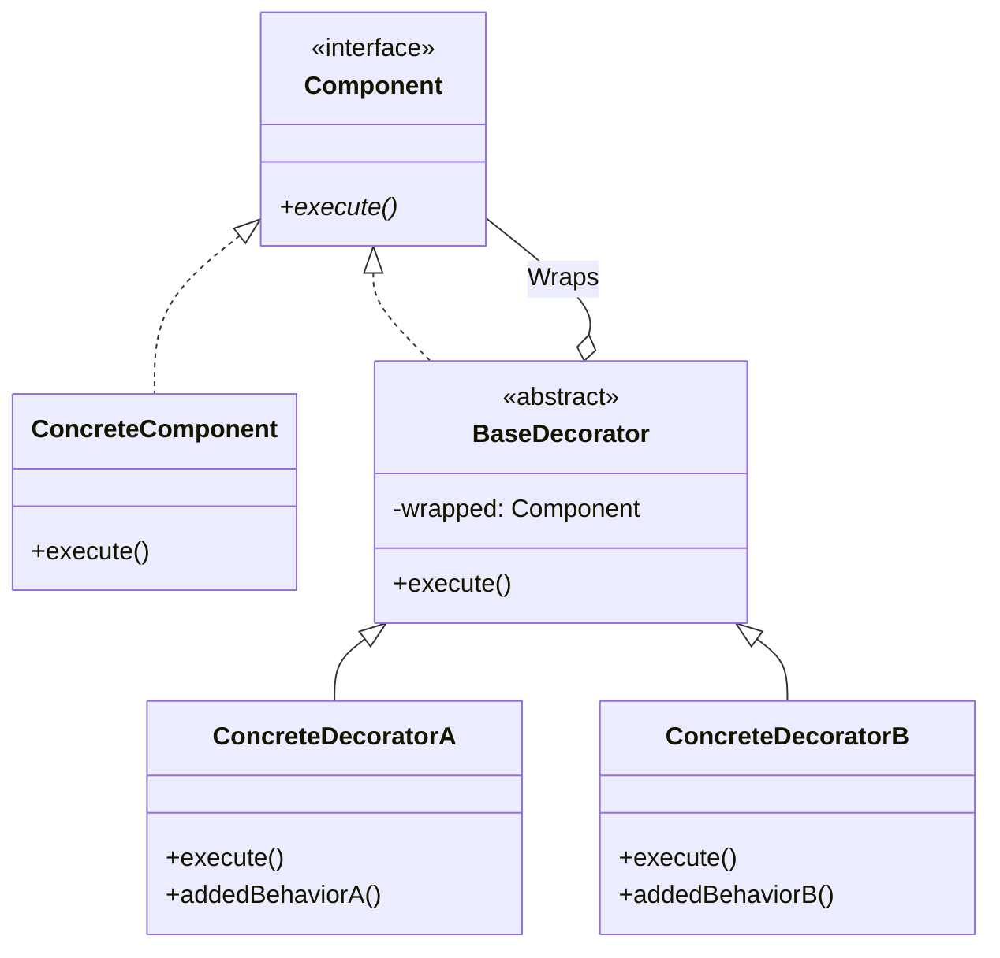
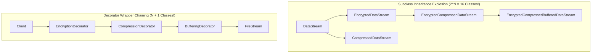
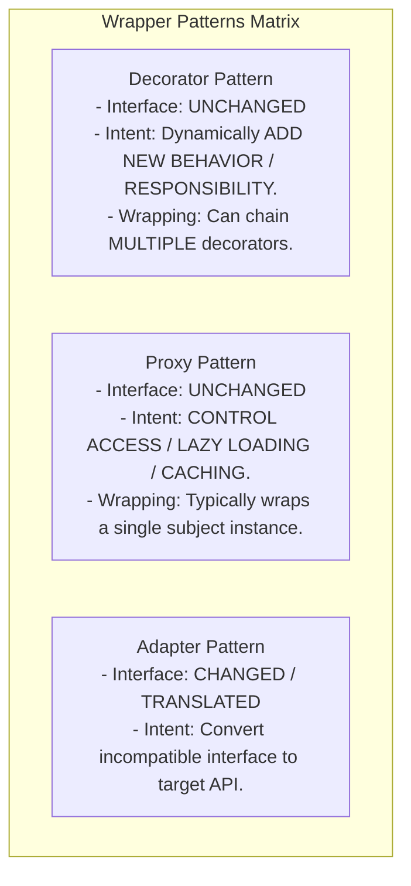

# Decorator Pattern — Dynamic Behavior Extension and Wrapper Chaining

## Mental Model

Think of the **Decorator Pattern** as bundling up in clothing for winter weather. 

You start with your bare body (**Concrete Component**). When it gets cold outside, you don't undergo genetic surgery to alter your core skin (**No Modification of Base Class / No Inheritance Explosion**). 

Instead, you wrap yourself in a `ThermalShirt` (**First Decorator**). If it starts raining, you wrap a `WaterproofJacket` over the thermal shirt (**Second Decorator**). If it gets extremely cold, you wrap a `HeavyParka` over the jacket (**Wrapper Chaining**). Each layer implements the exact same interface ("Wearable Protection"), wrapping the inner layer and executing its own responsibility before or after delegating to the wrapped core.

---

## 1. Intent & Structural Definition

The **Decorator Pattern** attaches additional responsibilities to an object dynamically. Decorators provide a flexible alternative to subclassing for extending functionality.



### Key Intent & Constraints
1. **Dynamic Extension:** Add behaviors to individual objects at runtime without affecting other instances of the same class.
2. **Wrapper Chaining:** Chain multiple decorators together by having each decorator implement the component interface AND wrap a component reference.
3. **OCP Compliance:** Add new responsibilities by creating new Decorator classes without altering existing code.

---

## 2. Preventing Class Explosions

Without the Decorator Pattern, combining multiple independent features (e.g., *Encryption*, *Compression*, *Caching*, *Logging*) using class inheritance creates an **exponential $2^N$ subclass explosion**.



---

## 3. Production Code Implementation: Stream I/O & Coffee Builder

### Classic Java I/O Example (Real-World Decorators)
Java's `java.io` package is the classic enterprise implementation of the Decorator Pattern:

```java
// Standard Java I/O Decorator Chaining
InputStream stream = new BufferedInputStream(       // Decorator 2: In-Memory Buffering
                        new GZIPInputStream(        // Decorator 1: De-compression
                            new FileInputStream("data.txt.gz") // Core Component
                        )
                     );
```

---

### Production Implementation: Dynamic Encryption & Compression Stream

```java
// ============================================================================
// 1. COMPONENT INTERFACE
// ============================================================================
public interface DataSource {
    void writeData(String data);
    String readData();
}

// ============================================================================
// 2. CONCRETE COMPONENT (Base File I/O)
// ============================================================================
public class FileDataSource implements DataSource {
    private final String filename;
    private String fileContent = ""; // Simulated Disk Storage

    public FileDataSource(String filename) {
        this.filename = filename;
    }

    @Override
    public void writeData(String data) {
        System.out.println("FileDataSource: Writing raw bytes to file [" + filename + "]");
        this.fileContent = data;
    }

    @Override
    public String readData() {
        System.out.println("FileDataSource: Reading raw bytes from file [" + filename + "]");
        return this.fileContent;
    }
}

// ============================================================================
// 3. BASE DECORATOR (Implements Component & Wraps Component)
// ============================================================================
public abstract class DataSourceDecorator implements DataSource {
    protected final DataSource wrappee; // Wrapped Inner Component

    public DataSourceDecorator(DataSource wrappee) {
        this.wrappee = Objects.requireNonNull(wrappee, "Wrapped DataSource required");
    }

    @Override
    public void writeData(String data) {
        wrappee.writeData(data); // Delegation
    }

    @Override
    public String readData() {
        return wrappee.readData(); // Delegation
    }
}

// ============================================================================
// 4. CONCRETE DECORATOR A: Encryption
// ============================================================================
public class EncryptionDecorator extends DataSourceDecorator {
    public EncryptionDecorator(DataSource wrappee) {
        super(wrappee);
    }

    @Override
    public void writeData(String data) {
        String encrypted = encode(data);
        System.out.println("EncryptionDecorator: Encrypted data");
        super.writeData(encrypted); // Forward to next layer
    }

    @Override
    public String readData() {
        String data = super.readData();
        System.out.println("EncryptionDecorator: Decrypted data");
        return decode(data);
    }

    private String encode(String data) { return "ENCRYPTED(" + data + ")"; }
    private String decode(String data) { return data.replace("ENCRYPTED(", "").replace(")", ""); }
}

// ============================================================================
// 5. CONCRETE DECORATOR B: Compression
// ============================================================================
public class CompressionDecorator extends DataSourceDecorator {
    public CompressionDecorator(DataSource wrappee) {
        super(wrappee);
    }

    @Override
    public void writeData(String data) {
        String compressed = "COMPRESSED[" + data + "]";
        System.out.println("CompressionDecorator: Compressed data");
        super.writeData(compressed); // Forward to next layer
    }

    @Override
    public String readData() {
        String data = super.readData();
        System.out.println("CompressionDecorator: Uncompressed data");
        return data.replace("COMPRESSED[", "").replace("]", "");
    }
}

// ============================================================================
// 6. CLIENT CODE (Runtime Dynamic Wrapper Chaining!)
// ============================================================================
public class Main {
    public static void main(String[] args) {
        String record = "Confidential User Data Payload";

        // Chain Decorators at Runtime: Encrypt THEN Compress THEN Write to File
        DataSource encodedStream = new CompressionDecorator(
                                       new EncryptionDecorator(
                                           new FileDataSource("secret.dat")
                                       )
                                   );

        // Execute Write Pipeline: Compression -> Encryption -> File
        encodedStream.writeData(record);

        System.out.println("\n-----------------------------------\n");

        // Execute Read Pipeline: File -> Encryption -> Compression
        String restored = encodedStream.readData();
        System.out.println("Restored Payload: " + restored);
    }
}
```

---

## 4. Decorator vs. Proxy vs. Adapter

All three patterns use composition to wrap an object.



### Pattern Comparison Matrix

| Pattern | Modifies Interface? | Primary Architectural Goal | Can Chain Wrappers? |
|---|---|---|---|
| **Decorator** | ❌ **No (Identical Interface)** | Add new responsibilities dynamically. | ✅ **Yes (Infinite Chaining)** |
| **Proxy** | ❌ **No (Identical Interface)** | Access control, lazy initialization, caching. | ❌ Rarely (Single Proxy layer). |
| **Adapter** | ✅ **Yes (Converts A $\to$ B)** | Interface compatibility. | ❌ No. |

---

## 5. Failure Modes and Trade-offs

1. **Order-Dependent Decorator Bugs** — Decorators executed in the wrong order cause bugs (e.g., `Encrypt(Compress(Data))` vs. `Compress(Encrypt(Data))`). Encrypting data first produces high-entropy random bytes, completely ruining compression efficiency! *Mitigation*: Document decorator ordering rules or use Builder factories to assemble chains safely.
2. **Identity Crisis (`this` Pointer Leakage)** — A decorated object calls a internal method via `this.method()`. The call executes on the *undecorated* core object, bypassing all outer decorators! *Mitigation*: Ensure decorated components interact through external interface references.
3. **Small Object Memory Bloat** — Creating dozens of small wrapper objects (`DecoratorA(DecoratorB(DecoratorC(Core)))`) adds garbage collector tracking overhead.

---

## 6. Active-Recall Prompts

1. **What is the primary intent of the Decorator Pattern, and how does wrapper chaining prevent a $2^N$ class explosion?**
2. **Compare Decorator vs. Proxy vs. Adapter in terms of interface modification and primary intent.**
3. **Why does the order of decorator wrapping matter in pipeline execution (e.g., Encryption vs. Compression)?**
4. **How does `java.io.BufferedInputStream` demonstrate the Decorator Pattern in the standard JDK?**

---

## Related Notes

- [[Inheritance, Subtyping, and Composition vs Inheritance]]
- [[Open-Closed Principle - OCP and Extensibility]]
- [[Adapter Pattern - Class vs Object Adapters and Interface Translation]]
- [[Proxy Pattern - Virtual, Remote, Protection, and Smart Proxies]]

> **Interview Style Question:** *"Design a dynamic HTTP middleware processing engine (supporting Rate Limiting, JWT Authentication, Logging, and GZip Compression). Demonstrate how the Decorator Pattern allows chaining these middlewares dynamically around a core HTTP Handler, write the complete Java/TypeScript code, and analyze how decorator wrapping order affects security and performance."*

---
