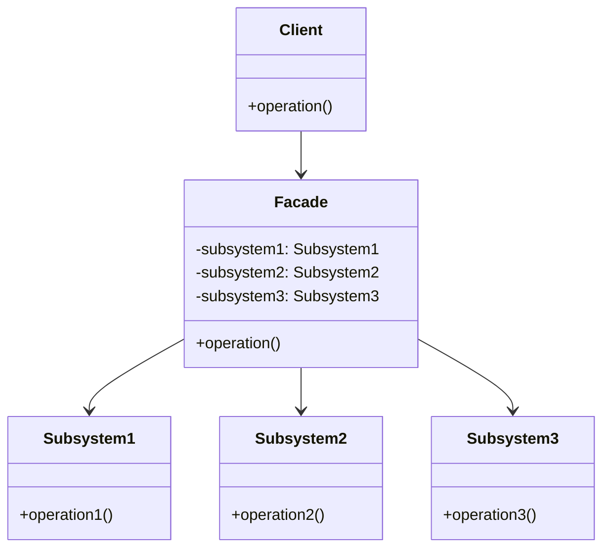
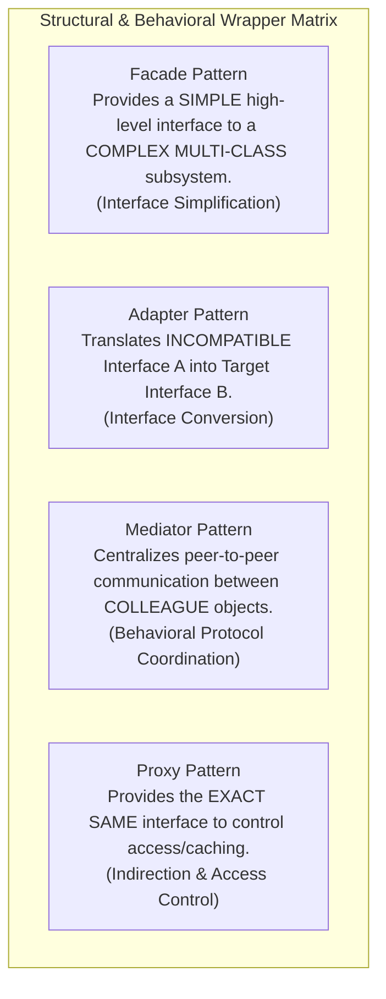

# Facade Pattern — Simplifying Subsystem Interfaces and Boundary Layering

## Mental Model

Think of a **Facade Pattern** as a single, friendly receptionist desk in a massive hospital or corporate headquarters. 

Behind the scenes, a hospital contains 40 complex subsystems: Radiology, Blood Labs, Billing, Insurance Verification, Pharmacy, Surgical Scheduling, and Patient Records. If a patient had to coordinate, call, and execute workflows across all 40 subsystems individually (**High Coupling / Subsystem Complexity**), obtaining treatment would be impossible. 

The Receptionist (**The Facade**) exposes a single, high-level interaction point: `"Book Surgery Appointment"`. The Facade handles all multi-step orchestration across the 40 complex subsystems under the hood, presenting a clean, simplified interface to the patient.

---

## 1. Intent & Structural Definition

The **Facade Pattern** provides a unified interface to a set of interfaces in a subsystem. Facade defines a higher-level interface that makes the subsystem easier to use.



### Key Intent & Constraints
1. **Simplified API:** Provide a simple, high-level interface to a complex multi-class subsystem.
2. **Decoupled Boundary Layer:** Isolate client code from the internal mechanics and class dependencies of subsystems.
3. **Optional Access:** Facades do not encapsulate or hide subsystem classes; power users can still access low-level subsystem classes directly if fine-grained control is required.

---

## 2. Production Code Implementation: Home Theater & E-Commerce Orders

### Complex Subsystem Classes (Low-Level Mechanics)

```java
// Complex Subsystem 1: Inventory
public class InventorySystem {
    public boolean checkStock(String sku, int qty) {
        System.out.println("Inventory: Checking stock for SKU " + sku);
        return true;
    }
    public void reserveStock(String sku, int qty) {
        System.out.println("Inventory: Reserved " + qty + " units of " + sku);
    }
}

// Complex Subsystem 2: Payment Gateway
public class PaymentGateway {
    public boolean chargeCreditCard(String cardToken, double amount) {
        System.out.println("Payment: Charged $" + amount + " to card " + cardToken);
        return true;
    }
}

// Complex Subsystem 3: Shipping Logistics
public class ShippingService {
    public String createShippingLabel(String sku, String address) {
        System.out.println("Shipping: Created label for delivery to " + address);
        return "TRACK_998877";
    }
}

// Complex Subsystem 4: Notification Engine
public class NotificationEngine {
    public void sendConfirmationEmail(String email, String trackingCode) {
        System.out.println("Notification: Sent confirmation email to " + email);
    }
}
```

---

### The Order Processing Facade

```java
// THE FACADE CLASS
public class OrderProcessingFacade {
    private final InventorySystem inventory;
    private final PaymentGateway payment;
    private final ShippingService shipping;
    private final NotificationEngine notification;

    public OrderProcessingFacade() {
        // Initializes or injects complex subsystems
        this.inventory = new InventorySystem();
        this.payment = new PaymentGateway();
        this.shipping = new ShippingService();
        this.notification = new NotificationEngine();
    }

    // High-Level Simplified Entry Point for Clients
    public boolean placeOrder(String sku, int qty, String cardToken, double amount, String address, String email) {
        System.out.println("--- Starting Orchestrated Order Placement ---");

        if (!inventory.checkStock(sku, qty)) {
            System.out.println("Order Failed: Out of stock!");
            return false;
        }

        inventory.reserveStock(sku, qty);

        if (!payment.chargeCreditCard(cardToken, amount)) {
            System.out.println("Order Failed: Payment declined!");
            return false;
        }

        String trackingCode = shipping.createShippingLabel(sku, address);
        notification.sendConfirmationEmail(email, trackingCode);

        System.out.println("--- Order Successfully Placed! ---\n");
        return true;
    }
}
```

### Client Execution (Clean & Simplified)

```java
public class Main {
    public static void main(String[] args) {
        // Client interacts ONLY with the high-level Facade!
        OrderProcessingFacade orderFacade = new OrderProcessingFacade();
        
        // Single line replaces 15 lines of complex multi-subsystem orchestration!
        orderFacade.placeOrder("LAPTOP-01", 1, "card_tok_1234", 1200.00, 
                               "100 Main St", "buyer@example.com");
    }
}
```

---

## 3. Facade vs. Adapter vs. Mediator vs. Proxy



### Comparative Analysis Matrix

| Pattern | Modifies / Simplifies Interface? | Primary Architectural Focus |
|---|---|---|
| **Facade** | **YES (Simplifies Many $\to$ One High-Level API)** | Hide subsystem complexity from client code. |
| **Adapter** | **YES (Converts Interface A $\to$ B)** | Solve interface incompatibility between two classes. |
| **Mediator** | ❌ No (Coordinates peer objects) | Eliminate $N \times N$ direct connections between peer objects. |
| **Proxy** | ❌ No (Exact same interface) | Access control, lazy loading, remote calls. |

---

## 4. Failure Modes and Trade-offs

1. **God Facade Anti-Pattern** — Allowing a Facade class to expand into an all-knowing, 5,000-line "God Object" that contains domain logic, data transformations, and state persistence. *Mitigation*: Ensure the Facade acts strictly as an **orchestration pass-through**; delegate business rules to domain services (**SRP**).
2. **Bypassing the Facade (Architectural Drift)** — Client code bypassing the Facade to directly invoke subsystem classes in un-coordinated, inconsistent ways. *Mitigation*: Make subsystem classes package-private or enforce architecture tests (e.g., ArchUnit in Java).
3. **Leaky Subsystem Errors** — Allowing low-level subsystem exceptions (`SQLException`, `SocketTimeoutException`) to bubble directly through the Facade API. *Mitigation*: Catch low-level subsystem exceptions and wrap them in domain-specific Facade exceptions (`OrderProcessingException`).

---

## 5. Active-Recall Prompts

1. **What is the primary intent of the Facade Pattern, and how does it simplify client interaction with complex subsystems?**
2. **How does a Facade differ from an Adapter and a Mediator?**
3. **Does a Facade prevent clients from accessing low-level subsystem classes directly? Why or why not?**
4. **What is the "God Facade" anti-pattern, and how do you ensure a Facade remains high-cohesion?**

---

## Related Notes

- [[Adapter Pattern - Class vs Object Adapters and Interface Translation]]
- [[Mediator Pattern - Decoupling Peer Communication and Centralized Coordination]]
- [[Proxy Pattern - Virtual, Remote, Protection, and Smart Proxies]]
- [[Single Responsibility Principle - SRP and Cohesion]]

> **Interview Style Question:** *"You are re-architecting a legacy banking application where clients must invoke 6 different microservices (Credit Check, Risk Assessment, Account Ledger, Fraud Detection, Sanctions Screening, Notification) to approve a loan. Design a `LoanApprovalFacade` in Java/TypeScript, demonstrate how it decouples client code from microservice orchestration, and explain how you handle partial failures during multi-service execution."*

---
