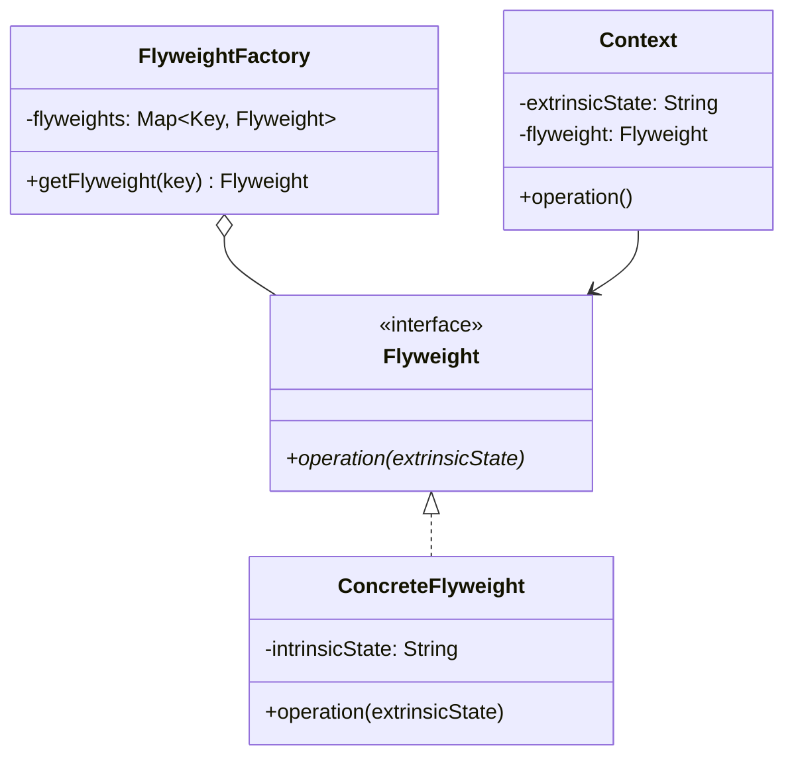
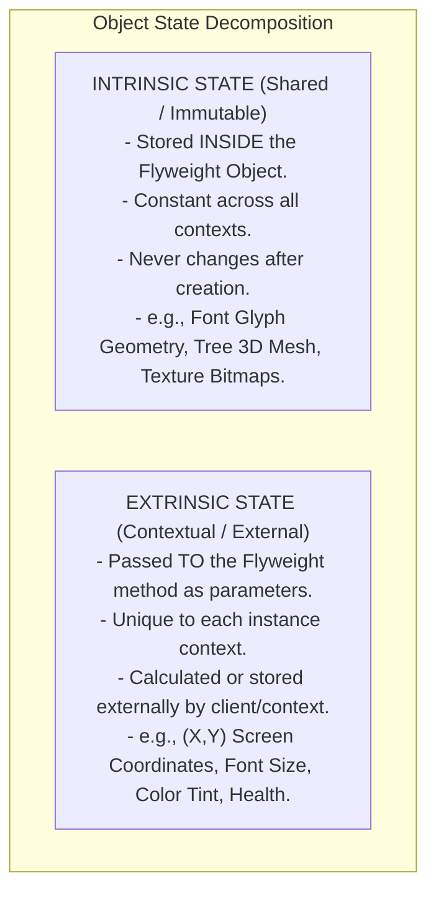

# Flyweight Pattern — Intrinsic vs. Extrinsic State and Memory Optimization

## Mental Model

Think of the **Flyweight Pattern** as a high-density forest rendering engine in a AAA video game (e.g., *Red Dead Redemption 2* or *Minecraft*). 

Rendering a forest containing **1,000,000 trees** by instantiating 1,000,000 individual object instances—each holding its own 3D mesh model, texture maps, leaf geometry, and shader programs (**Intrinsic State**) plus its 3D coordinates ($X, Y, Z$) and health (**Extrinsic State**)—would consume 50GB of RAM and instantly crash the GPU. 

The Flyweight pattern separates the heavy, immutable **Intrinsic State** (the shared 3D tree mesh & texture—stored ONCE in RAM) from the light, unique **Extrinsic State** (the 3D coordinates $(X,Y,Z)$—passed into the draw method at runtime). 1,000,000 tree instances consume 2MB of RAM instead of 50GB!

---

## 1. Intent & Structural Definition

The **Flyweight Pattern** uses sharing to support large numbers of fine-grained objects efficiently.



### Key Intent & Constraints
1. **Drastic RAM Reduction:** Share identical immutable state among thousands or millions of small objects.
2. **State Separation:** Divide object state into **Intrinsic State** (shared, immutable, context-independent) and **Extrinsic State** (unique, mutable, context-dependent).
3. **Flyweight Factory:** Manage a central lookup cache/pool to ensure flyweights are shared and never duplicated.

---

## 2. Intrinsic vs. Extrinsic State Breakdown

Understanding how to split state is the core technical challenge when implementing Flyweight:



### State Comparison Matrix

| Property | Intrinsic State | Extrinsic State |
|---|---|---|
| **Storage Location** | Stored **INSIDE** the Flyweight Object in RAM. | Stored **OUTSIDE** in client context / arrays / tables. |
| **Mutability** | **Immutable** (Read-Only). | Mutable (Varies per instance context). |
| **Sharing Level** | Shared across thousands of contexts. | Unique to a single context instance. |
| **Passed As** | Set during Flyweight creation. | Passed as method arguments during execution: `flyweight.draw(x, y)`. |

---

## 3. Production Code Implementation: Game Forest Engine

### Without Flyweight (RAM Disaster: 1,000,000 Tree Objects)

```java
// BAD: Un-optimized Tree Class (RAM Overhead: ~500 bytes per tree * 1M = 500 MB!)
public class UnoptimizedTree {
    private int x; // Extrinsic
    private int y; // Extrinsic
    private String name;        // Intrinsic (Duplicated 1,000,000 times!)
    private Color color;        // Intrinsic (Duplicated 1,000,000 times!)
    private byte[] textureMesh; // Intrinsic (Duplicated 1,000,000 times! 100KB each!)
}
```

---

### Clean Flyweight Implementation

```java
// ============================================================================
// 1. INTRINSIC FLYWEIGHT (Shared, Immutable Tree Type Data)
// ============================================================================
public final class TreeType {
    private final String name;
    private final Color color;
    private final String textureData; // Heavy Asset Data (Stored ONCE in RAM)

    public TreeType(String name, Color color, String textureData) {
        this.name = name;
        this.color = color;
        this.textureData = textureData;
    }

    // Extrinsic State (x, y) is passed AS PARAMETERS to the operation method!
    public void draw(int x, int y) {
        System.out.println("Drawing [" + name + "] tree at coordinates (" + x + ", " + y + ")");
    }
}

// ============================================================================
// 2. FLYWEIGHT FACTORY (Manages Shared Pool of Intrinsic Objects)
// ============================================================================
public class TreeFactory {
    private static final Map<String, TreeType> treeTypes = new HashMap<>();

    public static TreeType getTreeType(String name, Color color, String textureData) {
        String key = name + "_" + color.toString();
        TreeType result = treeTypes.get(key);
        if (result == null) {
            result = new TreeType(name, color, textureData);
            treeTypes.put(key, result);
            System.out.println("TreeFactory: Created NEW shared TreeType Flyweight for [" + name + "]");
        }
        return result;
    }

    public static int getFlyweightCount() {
        return treeTypes.size();
    }
}

// ============================================================================
// 3. CONTEXT OBJECT (Stores Light Extrinsic State + Flyweight Pointer)
// ============================================================================
public class Tree {
    private final int x; // Extrinsic
    private final int y; // Extrinsic
    private final TreeType type; // Shared Flyweight Reference (8-byte pointer!)

    public Tree(int x, int y, TreeType type) {
        this.x = x;
        this.y = y;
        this.type = type;
    }

    public void draw() {
        // Delegates execution, passing extrinsic coordinates to flyweight!
        type.draw(x, y);
    }
}

// ============================================================================
// 4. FOREST SCENE (Renders 1 Million Trees using 2 Flyweights!)
// ============================================================================
public class Forest {
    private final List<Tree> trees = new ArrayList<>();

    public void plantTree(int x, int y, String name, Color color, String textureData) {
        TreeType type = TreeFactory.getTreeType(name, color, textureData);
        Tree tree = new Tree(x, y, type);
        trees.add(tree);
    }

    public void draw() {
        for (Tree tree : trees) {
            tree.draw();
        }
    }
}

// ============================================================================
// 5. CLIENT EXECUTION
// ============================================================================
public class Main {
    public static void main(String[] args) {
        Forest forest = new Forest();

        // Plant 500,000 Oak trees and 500,000 Pine trees
        for (int i = 0; i < 500000; i++) {
            forest.plantTree(i, i * 2, "Oak", Color.GREEN, "OakTexture_100KB");
            forest.plantTree(i * 3, i * 4, "Pine", Color.DARK_GRAY, "PineTexture_120KB");
        }

        System.out.println("Total Trees Planted: 1,000,000");
        System.out.println("Total Flyweight Intrinsic Objects in RAM: " + TreeFactory.getFlyweightCount()); // Output: 2!
    }
}
```

---

## 4. Real-World Implementations: Java `String.intern()` & `Integer.valueOf()`

Java uses the Flyweight Pattern natively in its runtime environment:

```java
// 1. Integer Cache Flyweight (Caches values -128 to 127)
Integer a = Integer.valueOf(100);
Integer b = Integer.valueOf(100);
System.out.println(a == b); // TRUE! Same flyweight memory instance!

// 2. String Pool Flyweight
String s1 = "hello"; // Stored in String Pool Flyweight
String s2 = "hello";
System.out.println(s1 == s2); // TRUE! Same memory pointer!
```

---

## 5. Failure Modes and Trade-offs

1. **CPU Overhead from Extrinsic Parameter Passing** — Passing extrinsic parameters into flyweight methods in a high-frequency loop can introduce CPU register parameter-passing overhead that outweighs memory savings. *Mitigation*: Pack extrinsic state into primitive arrays or contiguous memory buffers.
2. **Mutating Intrinsic State (Thread-Safety Corruption)** — Accidentally making intrinsic fields mutable (`public setTexture()`). Because the flyweight is shared across 500,000 objects, mutating it corrupts 500,000 objects simultaneously! *Mitigation*: Enforce strict immutability (`final` fields, no setters).
3. **Flyweight Factory Memory Leaks** — Failing to bound or clear the `FlyweightFactory` cache when managing dynamic keys. The factory holds strong references to all flyweights, preventing garbage collection. *Mitigation*: Use `WeakHashMap` or bounded LRU caches for factory storage.

---

## 6. Active-Recall Prompts

1. **What is the difference between Intrinsic State and Extrinsic State in the Flyweight Pattern?**
2. **How does the Flyweight Pattern reduce RAM consumption from $O(N \times \text{Size})$ to $O(K \times \text{Size} + N \times \text{PointerSize})$?**
3. **How do Java `Integer.valueOf()` and `String.intern()` demonstrate the Flyweight Pattern natively?**
4. **Why MUST the Intrinsic State of a Flyweight object be strictly immutable?**

---

## Related Notes

- [[Prototype Pattern - Deep vs Shallow Copying and Prototype Managers]]
- [[Composite Pattern - Tree Structures, Uniformity vs Type Safety]]
- [[Singleton Pattern - Thread-Safe Initialization, Double-Checked Locking, Enum Singleton]]
- [[Factory Method Pattern - Virtual Constructors and Extensible Object Creation]]

> **Interview Style Question:** *"You are designing a rich-text document editor (like Microsoft Word or Google Docs) holding 10,000,000 character glyphs. Demonstrate how instantiating a separate object for every character consumes 2GB of RAM, design a Flyweight architecture separating Font/Glyph Intrinsic data from Position/Format Extrinsic data, calculate the resulting RAM savings, and show how Java's String Pool utilizes Flyweight principles."*

---
