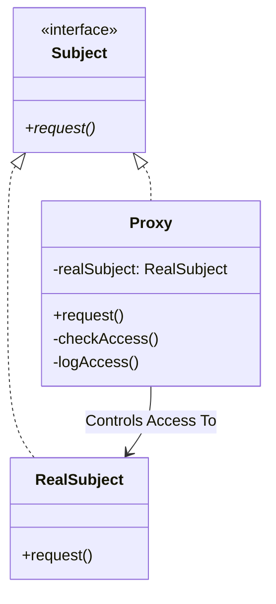
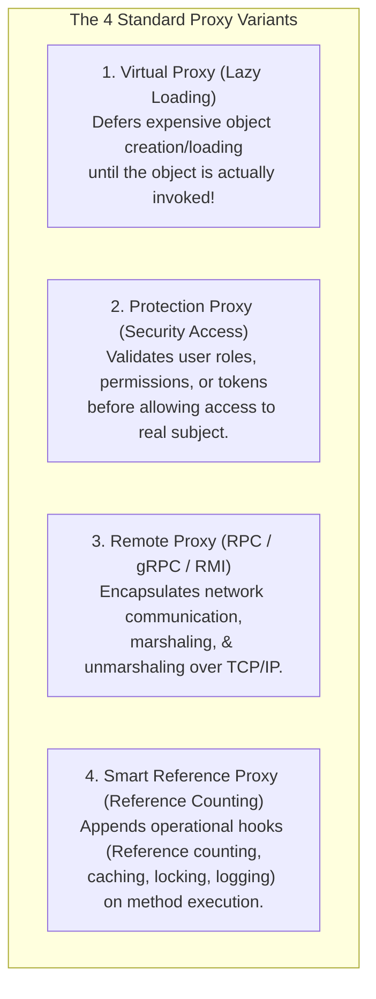
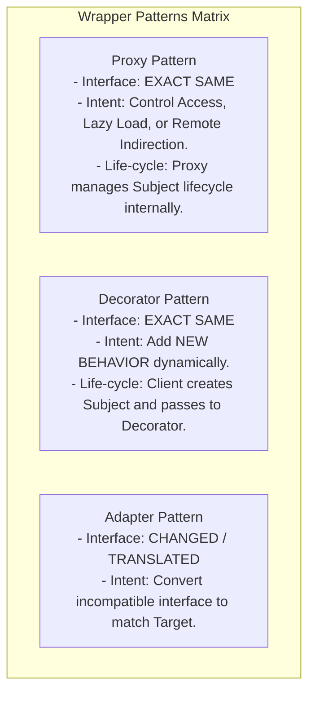

# Proxy Pattern — Virtual, Remote, Protection, and Smart Proxies

## Mental Model

Think of a **Proxy Pattern** as a corporate debit card issued to an employee. 

The debit card implements the exact same payment interface as physical cash or a gold bar ("Pay $500 for business travel"). However, instead of carrying $50,000 in physical cash in your briefcase (**Heavy Real Subject / Security Hazard**), you carry a lightweight plastic card (**The Proxy**). 

When you swipe the card, the Proxy intercepts the request, verifies your spending limits and authorization (**Protection Proxy**), checks if the funds are available, logs the transaction for accounting (**Smart Reference Proxy**), and contacts the bank via network API to transfer the funds (**Remote Proxy**). Client code interacts with the Proxy without needing to know that a complex, secure, or remote process is running behind the scenes.

---

## 1. Intent & Structural Definition

The **Proxy Pattern** provides a surrogate or placeholder for another object to control access to it.



### Key Intent & Constraints
1. **Access Control:** Intercept operations to perform access control, lazy initialization, remote communication, or logging before delegating to the real subject.
2. **Identical Interface:** The Proxy implements the **exact same interface** as the Real Subject, making it completely transparent to client code.
3. **Indirection Layer:** Introduce a controlled boundary between client code and resource-heavy, remote, or sensitive objects.

---

## 2. The 4 Major Variants of the Proxy Pattern



### Proxy Variant Comparison Matrix

| Proxy Type | Primary Motivation | Implementation Mechanism | Typical Use Case |
|---|---|---|---|
| **Virtual Proxy** | **Performance & Memory Optimization** | Defer instantiation of heavy object until first method call. | High-resolution image loading, DB connection pools. |
| **Protection Proxy** | **Security & Access Control** | Check caller roles/permissions before delegating. | Role-Based Access Control (RBAC), Admin APIs. |
| **Remote Proxy** | **Network Transparence** | Handle RPC marshaling, sockets, and network timeouts. | gRPC Stubs, Java RMI, REST client SDKs. |
| **Smart Reference** | **Lifecycle & Resource Management** | Track active references, lock resources, or cache results. | C++ `std::shared_ptr`, Caching Proxies. |

---

## 3. Production Code Implementation

### A. Virtual Proxy (Lazy Loading Heavy Video Object)

```java
// ============================================================================
// 1. SUBJECT INTERFACE
// ============================================================================
public interface Video {
    void display();
}

// ============================================================================
// 2. REAL SUBJECT (Heavy Object: 500MB Video Loading from Disk/Network)
// ============================================================================
public class RealVideo implements Video {
    private final String filename;

    public RealVideo(String filename) {
        this.filename = filename;
        loadHeavyVideoFromDisk(); // Expensive I/O operation (3 seconds!)
    }

    private void loadHeavyVideoFromDisk() {
        System.out.println("RealVideo: Loading 500MB video file [" + filename + "] from disk...");
    }

    @Override
    public void display() {
        System.out.println("RealVideo: Displaying video frame stream for [" + filename + "]");
    }
}

// ============================================================================
// 3. VIRTUAL PROXY (Lazy Loads RealSubject on First display() Call)
// ============================================================================
public class ProxyVideo implements Video {
    private final String filename;
    private RealVideo realVideo; // Lazy Reference (null initially)

    public ProxyVideo(String filename) {
        this.filename = filename;
        // Instantiation is Instant! Zero disk I/O performed in constructor!
    }

    @Override
    public void display() {
        // LAZY INITIALIZATION PATTERN
        if (realVideo == null) {
            System.out.println("ProxyVideo: First access detected! Instantiating RealVideo...");
            realVideo = new RealVideo(filename); // Expensive load deferred until now!
        }
        realVideo.display(); // Delegate to real subject
    }
}
```

---

### B. Dynamic Proxies (Java Reflection `java.lang.reflect.Proxy`)

In modern frameworks (Spring AOP, Hibernate), proxies are created dynamically at runtime without writing explicit proxy classes!

```java
import java.lang.reflect.InvocationHandler;
import java.lang.reflect.Method;
import java.lang.reflect.Proxy;

// Dynamic Logging & Security Invocation Handler
public class AuditLoggingHandler implements InvocationHandler {
    private final Object target;

    public AuditLoggingHandler(Object target) {
        this.target = target;
    }

    @Override
    public Object invoke(Object proxy, Method method, Object[] args) throws Throwable {
        System.out.println("[AUDIT LOG] Entering method: " + method.getName());
        long start = System.nanoTime();

        // Delegate method invocation to real target
        Object result = method.invoke(target, args);

        long duration = (System.nanoTime() - start) / 1000;
        System.out.println("[AUDIT LOG] Exited method: " + method.getName() + " (Execution Time: " + duration + " µs)");
        return result;
    }
}

// Usage: Create Dynamic Proxy at Runtime
DocumentService realService = new RealDocumentService();
DocumentService proxyService = (DocumentService) Proxy.newProxyInstance(
    DocumentService.class.getClassLoader(),
    new Class<?>[]{ DocumentService.class },
    new AuditLoggingHandler(realService)
);

// Executing proxy automatically triggers logging aspect!
proxyService.openDocument("doc_42");
```

---

## 4. Proxy vs. Decorator vs. Adapter

All three structural patterns use object wrappers.



---

## 5. Failure Modes and Trade-offs

1. **Un-Expected Network Latency (Remote Proxy Leakage)** — A client invokes a method on a Remote Proxy assuming it is an in-memory method call (`account.getBalance()`). The remote proxy makes a blocking TCP HTTP call across a WAN, introducing a 500ms latency spike or throwing `SocketTimeoutException`. *Mitigation*: Ensure Remote Proxies handle network timeouts explicitly or use reactive async signatures (`CompletableFuture`).
2. **Infinite Recursion in Dynamic Proxies** — Accidentally invoking a method on the `proxy` instance inside an `InvocationHandler` (`proxy.toString()`) instead of the `target` instance. Result: Triggers `invoke()` recursively, causing a `StackOverflowError`. *Mitigation*: Invoke methods strictly on `target`.
3. **Hibernate Lazy Initialization Exception** — Accessing an un-initialized Virtual Proxy entity outside an active database session in Hibernate (`LazyInitializationException: could not initialize proxy - no Session`). *Mitigation*: Fetch required entities eagerly or initialize proxies within session boundaries.

---

## 6. Active-Recall Prompts

1. **What is the primary intent of the Proxy Pattern, and how does it preserve transparency for client code?**
2. **Explain the differences between Virtual Proxies, Protection Proxies, Remote Proxies, and Smart Reference Proxies.**
3. **How does a Proxy differ from a Decorator and an Adapter?**
4. **How do Dynamic Proxies (Spring AOP / Java `Proxy.newProxyInstance`) execute cross-cutting aspects like logging and transactions at runtime?**

---

## Related Notes

- [[Adapter Pattern - Class vs Object Adapters and Interface Translation]]
- [[Decorator Pattern - Dynamic Behavior Extension and Wrapper Chaining]]
- [[Facade Pattern - Simplifying Subsystem Interfaces and Boundary Layering]]
- [[Abstraction and Interface-Driven Design]]

> **Interview Style Question:** *"Design a high-throughput Image Caching and Security proxy for a CDN processing 100,000 requests/sec. Demonstrate how a Virtual Proxy defers 50MB image loading from disk until first request, show how a Protection Proxy validates JWT tokens before image access, and explain how Spring AOP uses Dynamic Proxies (JDK Dynamic Proxy vs. CGLIB) for `@Transactional` annotation enforcement."*

---
