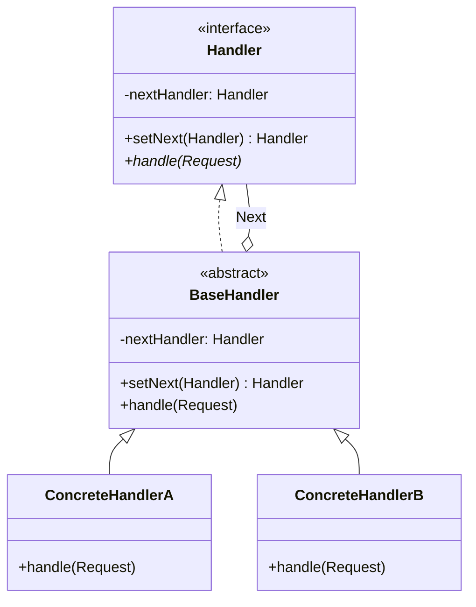
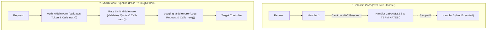

# Chain of Responsibility Pattern — Handler Chains and Middleware Pipelines

## Mental Model

Think of the **Chain of Responsibility Pattern** as a corporate technical support ticketing escalation system (Level 1 Support $\to$ Level 2 Support $\to$ Senior Systems Engineer). 

When a user submits a support ticket, it enters the front desk. Level 1 Support checks if they can resolve the issue (e.g., "Reset Password"). If yes, they handle it and terminate the request. If no, they pass the ticket down the chain to Level 2 Support. Level 2 handles network issues; if the issue is a kernel bug, they pass it up to the Senior Systems Engineer. 

The customer submitting the ticket does not need to know which specific engineer will resolve it (**Sender Decoupling**). The ticket flows along a linked chain of handlers until one handles it or it reaches the end of the chain.

---

## 1. Intent & Structural Definition

The **Chain of Responsibility Pattern** avoids coupling the sender of a request to its receiver by giving more than one object a chance to handle the request. Chain the receiving objects and pass the request along the chain until an object handles it.



### Key Intent & Constraints
1. **Decouple Sender from Receiver:** The sender issues a request without knowing which specific handler in the processing pipeline will fulfill it.
2. **Dynamic Handler Reconfiguration:** Handlers can be added, removed, or re-ordered dynamically at runtime.
3. **Single Responsibility per Handler:** Each handler focuses exclusively on a single validation, transformation, or processing task.

---

## 2. Classic CoR vs. Middleware Pipelines (Servlet Filters / Express.js)

There are two major variations of the Chain of Responsibility pattern:



### Comparison Matrix

| Property | Classic Chain of Responsibility | Middleware Pipeline (Filter Chain) |
|---|---|---|
| **Execution Flow** | **Exclusive:** Exactly ONE handler processes and terminates the request. | **Pass-Through:** ALL valid handlers process the request sequentially in series. |
| **Termination Criteria** | Stops when a handler returns a result. | Stops ONLY if a handler throws an error or omits `next()`. |
| **Typical Use Cases** | GUI Event Dispatchers, Technical Support Escalation, Exception Handling. | Web HTTP Request Pipelines (Java Servlet Filters, Express.js, ASP.NET Middleware). |

---

## 3. Production Code Implementation: HTTP Request Middleware Pipeline

```java
// ============================================================================
// 1. DOMAIN REQUEST CONTEXT
// ============================================================================
public class HttpRequestContext {
    private final String url;
    private final String userRole;
    private final String clientIp;
    private boolean authenticated = false;

    public HttpRequestContext(String url, String userRole, String clientIp) {
        this.url = url;
        this.userRole = userRole;
        this.clientIp = clientIp;
    }

    public String getUrl() { return url; }
    public String getUserRole() { return userRole; }
    public String getClientIp() { return clientIp; }
    public boolean isAuthenticated() { return authenticated; }
    public void setAuthenticated(boolean authenticated) { this.authenticated = authenticated; }
}

// ============================================================================
// 2. ABSTRACT HANDLER / MIDDLEWARE INTERFACE
// ============================================================================
public abstract class MiddlewareHandler {
    private MiddlewareHandler next;

    public MiddlewareHandler linkWith(MiddlewareHandler next) {
        this.next = next;
        return next; // Returns next handler to enable fluent chaining!
    }

    public abstract boolean check(HttpRequestContext request);

    protected boolean checkNext(HttpRequestContext request) {
        if (next == null) {
            return true; // Reached end of chain successfully!
        }
        return next.check(request); // Pass to next in chain
    }
}

// ============================================================================
// 3. CONCRETE HANDLER 1: Rate Limiting Middleware
// ============================================================================
public class RateLimitMiddleware extends MiddlewareHandler {
    private int requestCount = 0;

    @Override
    public boolean check(HttpRequestContext request) {
        requestCount++;
        if (requestCount > 100) {
            System.out.println("RateLimitMiddleware: [REJECTED] Rate limit exceeded for IP: " + request.getClientIp());
            return false; // Terminate chain!
        }
        System.out.println("RateLimitMiddleware: [PASSED] Request quota OK.");
        return checkNext(request); // Forward to next
    }
}

// ============================================================================
// 4. CONCRETE HANDLER 2: Authentication Middleware
// ============================================================================
public class AuthenticationMiddleware extends MiddlewareHandler {
    @Override
    public boolean check(HttpRequestContext request) {
        if (!"guest".equalsIgnoreCase(request.getUserRole())) {
            request.setAuthenticated(true);
            System.out.println("AuthenticationMiddleware: [PASSED] User authenticated as role: " + request.getUserRole());
            return checkNext(request);
        }
        System.out.println("AuthenticationMiddleware: [REJECTED] Unauthenticated guest user!");
        return false;
    }
}

// ============================================================================
// 5. CONCRETE HANDLER 3: Role Authorization Middleware
// ============================================================================
public class AuthorizationMiddleware extends MiddlewareHandler {
    @Override
    public boolean check(HttpRequestContext request) {
        if (request.getUrl().startsWith("/admin") && !"ADMIN".equalsIgnoreCase(request.getUserRole())) {
            System.out.println("AuthorizationMiddleware: [REJECTED] Admin privilege required for: " + request.getUrl());
            return false;
        }
        System.out.println("AuthorizationMiddleware: [PASSED] Access granted to: " + request.getUrl());
        return checkNext(request);
    }
}

// ============================================================================
// 6. CLIENT PIPELINE EXECUTION
// ============================================================================
public class Main {
    public static void main(String[] args) {
        // Build Pipeline Chain Fluent Links: RateLimit -> Auth -> Authorization
        MiddlewareHandler pipeline = new RateLimitMiddleware();
        pipeline.linkWith(new AuthenticationMiddleware())
                .linkWith(new AuthorizationMiddleware());

        // Test Request 1: Valid Admin
        System.out.println("--- Processing Request 1 ---");
        HttpRequestContext req1 = new HttpRequestContext("/admin/dashboard", "ADMIN", "192.168.1.1");
        boolean success1 = pipeline.check(req1);
        System.out.println("Pipeline Result 1: " + (success1 ? "SUCCESS" : "FAILED") + "\n");

        // Test Request 2: Unauthorized User
        System.out.println("--- Processing Request 2 ---");
        HttpRequestContext req2 = new HttpRequestContext("/admin/dashboard", "USER", "192.168.1.2");
        boolean success2 = pipeline.check(req2);
        System.out.println("Pipeline Result 2: " + (success2 ? "SUCCESS" : "FAILED"));
    }
}
```

---

## 4. Architectural Comparison Matrix

| Approach | Coupling | Flexibility | Execution Predictability |
|---|---|---|---|
| **Direct Monolithic `if/else`** | **High** | ❌ Rigid (Hardcoded sequence). | Deterministic. |
| **Classic Chain of Responsibility** | **Low** | ✅ **Dynamic** (Re-order handlers at runtime). | Variable (Stops on first handler match). |
| **Middleware Pipeline Filter** | **Low** | ✅ **Dynamic** (Plug-and-play middleware). | Sequential pass-through until error. |

---

## 5. Failure Modes and Trade-offs

1. **Unhandled Request Drop (End of Chain Cliff)** — A request reaches the end of the chain without any handler processing or acknowledging it. *Mitigation*: Always append a default fallback handler at the end of the chain or throw an unhandled request exception.
2. **Infinite Chain Loops** — Accidentally creating a cyclic chain link (`Handler A -> Handler B -> Handler A`). Calling `handle()` causes an infinite loop resulting in a `StackOverflowError`. *Mitigation*: Enforce strict acyclic DAG validation when assembling handler chains.
3. **Deep Chain Latency Accumulation** — Building a chain of 50 middleware handlers where every handler performs network or disk I/O. Request latency becomes the sum of all 50 handlers. *Mitigation*: Keep handlers in-memory or group I/O tasks into asynchronous parallel handlers.

---

## 6. Active-Recall Prompts

1. **What is the primary intent of the Chain of Responsibility Pattern, and how does it decouple senders from receivers?**
2. **Differentiate between Classic CoR (Exclusive handling) and Middleware Pipelines (Pass-through filtering).**
3. **How does handler chaining enable compliance with the Single Responsibility Principle (SRP) and Open-Closed Principle (OCP)?**
4. **What happens if a request reaches the end of a Chain of Responsibility without being handled, and how do you prevent unhandled drops?**

---

## Related Notes

- [[Command Pattern - Encapsulating Requests, Undo-Redo, and Macro Commands]]
- [[Decorator Pattern - Dynamic Behavior Extension and Wrapper Chaining]]
- [[Single Responsibility Principle - SRP and Cohesion]]
- [[Open-Closed Principle - OCP and Extensibility]]

> **Interview Style Question:** *"Design a high-throughput API Gateway middleware engine in Java/TypeScript processing 50,000 requests/sec. Build a Chain of Responsibility supporting CORS Validation, Rate Limiting, JWT Authentication, and Payload Sanitization. Demonstrate how you allow dynamic registration of new middlewares at runtime without modifying the gateway core engine, and write unit tests for unhandled request drops."*

---
