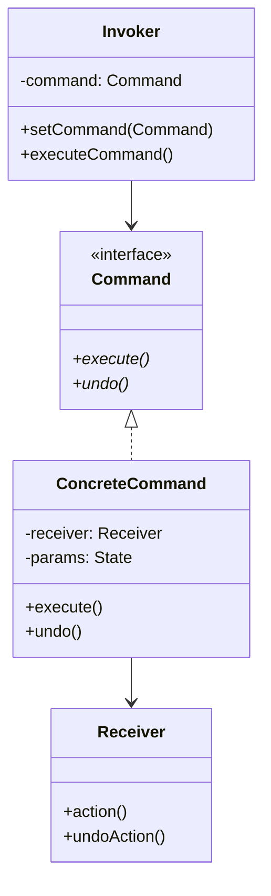
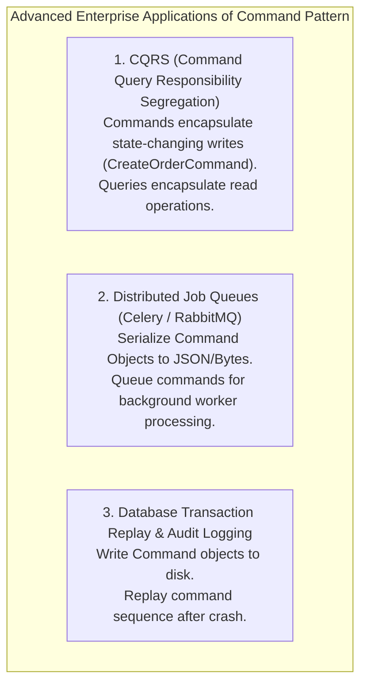

# Command Pattern — Encapsulating Requests, Undo-Redo, and Macro Commands

## Mental Model

Think of the **Command Pattern** as an order ticket written by a waiter at a restaurant. 

When you order a steak, the waiter writes the order onto a physical paper ticket (**The Command Object**). The waiter does not cook the steak themselves (**Invoker Decoupled from Receiver**), nor do they immediately scream instructions into the kitchen. 

The paper order ticket encapsulates all parameters (`Item: Steak, Doneness: Medium-Rare, Table: 4`). The ticket can be queued in a order rack (**Task Queue**), logged for daily financial accounting (**Audit Log**), passed to different line cooks (**Receivers**), or canceled and thrown away before cooking begins (**Undo Support**).

---

## 1. Intent & Structural Definition

The **Command Pattern** encapsulates a request as an object, thereby letting you parameterize clients with different requests, queue or log requests, and support undoable operations.



### Key Roles & Responsibilities

| Role | Object Name | Primary Responsibility |
|---|---|---|
| **Command Interface** | `Command` | Declares execution contract (`execute()`, `undo()`). |
| **Concrete Command** | `CopyTextCommand`, `PayInvoiceCommand` | Binds parameter state to a Receiver and implements execution/undo steps. |
| **Receiver** | `TextEditor`, `DatabaseEngine` | The target domain object that performs the actual business work. |
| **Invoker** | `Button`, `KeyboardShortcut`, `JobQueue` | Stores the Command and triggers `execute()` when an event fires. |
| **Client** | `MainApp` | Creates Concrete Commands, assigns Receivers, and registers Commands with Invokers. |

---

## 2. Production Code Implementation: Text Editor with Undo/Redo Engine

```java
// ============================================================================
// 1. RECEIVER (The domain object that performs actual operations)
// ============================================================================
public class TextEditor {
    private final StringBuilder text = new StringBuilder();

    public void insertText(int position, String newText) {
        text.insert(position, newText);
    }

    public void deleteText(int position, int length) {
        text.delete(position, position + length);
    }

    public String getText() { return text.toString(); }
}

// ============================================================================
// 2. COMMAND INTERFACE
// ============================================================================
public interface Command {
    void execute();
    void undo();
}

// ============================================================================
// 3. CONCRETE COMMAND 1: Write Text Command
// ============================================================================
public class WriteCommand implements Command {
    private final TextEditor editor;
    private final String textToWrite;
    private int insertedPosition; // State saved for undo!

    public WriteCommand(TextEditor editor, String textToWrite) {
        this.editor = editor;
        this.textToWrite = textToWrite;
    }

    @Override
    public void execute() {
        this.insertedPosition = editor.getText().length(); // Record insertion point
        editor.insertText(insertedPosition, textToWrite);
    }

    @Override
    public void undo() {
        // Reverse insertion by deleting written text length!
        editor.deleteText(insertedPosition, textToWrite.length());
    }
}

// ============================================================================
// 4. CONCRETE COMMAND 2: Erase All Text Command
// ============================================================================
public class ClearCommand implements Command {
    private final TextEditor editor;
    private String backupText = ""; // Backup previous state for undo!

    public ClearCommand(TextEditor editor) {
        this.editor = editor;
    }

    @Override
    public void execute() {
        this.backupText = editor.getText(); // Save snapshot
        editor.deleteText(0, backupText.length());
    }

    @Override
    public void undo() {
        editor.insertText(0, backupText); // Restore snapshot
    }
}

// ============================================================================
// 5. MACRO COMMAND (Composite Command for Batch Operations)
// ============================================================================
public class MacroCommand implements Command {
    private final List<Command> commands = new ArrayList<>();

    public void add(Command cmd) { commands.add(cmd); }

    @Override
    public void execute() {
        for (Command cmd : commands) {
            cmd.execute();
        }
    }

    @Override
    public void undo() {
        // Reverse undo execution in BACKWARD order!
        for (int i = commands.size() - 1; i >= 0; i--) {
            commands.get(i).undo();
        }
    }
}

// ============================================================================
// 6. INVOKER & UNDO/REDO ENGINE (Manages Command Stacks)
// ============================================================================
public class CommandHistoryEngine {
    private final Deque<Command> undoStack = new ArrayDeque<>();
    private final Deque<Command> redoStack = new ArrayDeque<>();

    public void executeCommand(Command cmd) {
        cmd.execute();
        undoStack.push(cmd);
        redoStack.clear(); // Clear redo stack on new action
    }

    public void undo() {
        if (!undoStack.isEmpty()) {
            Command cmd = undoStack.pop();
            cmd.undo();
            redoStack.push(cmd);
        }
    }

    public void redo() {
        if (!redoStack.isEmpty()) {
            Command cmd = redoStack.pop();
            cmd.execute();
            undoStack.push(cmd);
        }
    }
}

// ============================================================================
// 7. CLIENT EXECUTION
// ============================================================================
public class Main {
    public static void main(String[] args) {
        TextEditor editor = new TextEditor();
        CommandHistoryEngine history = new CommandHistoryEngine();

        // Type "Hello "
        history.executeCommand(new WriteCommand(editor, "Hello "));
        System.out.println("Current Text: " + editor.getText()); // "Hello "

        // Type "World!"
        history.executeCommand(new WriteCommand(editor, "World!"));
        System.out.println("Current Text: " + editor.getText()); // "Hello World!"

        // Undo last write ("World!")
        history.undo();
        System.out.println("After Undo 1: " + editor.getText()); // "Hello "

        // Redo last write ("World!")
        history.redo();
        System.out.println("After Redo 1: " + editor.getText()); // "Hello World!"
    }
}
```

---

## 3. Advanced Applications: CQRS & Transaction Logging

The Command Pattern extends far beyond GUI text editors:



---

## 4. Architectural Comparison Matrix

| Approach | Invoker-Receiver Coupling | Undo/Redo Support | Queuing / Serialization Support |
|---|---|---|---|
| **Direct Method Calls** | **High** (Invoker knows Receiver). | ❌ Hard (No state history). | ❌ No. |
| **Lambda / Function Pointers** | Low (Anonymous functions). | ⚠️ Complex (No state storage). | ⚠️ Limited. |
| **GoF Command Pattern** | **Low** (Decoupled via Object). | ✅ **Built-in (`undo()`)** | ✅ **100% Supported** (Serializable Objects). |

---

## 5. Failure Modes and Trade-offs

1. **Memory Inflation from Deep Undo Stacks** — Storing full state snapshots in `Command` objects (`backupText = editor.getText()`) across 10,000 edits consumes gigabytes of RAM. *Mitigation*: Combine Command Pattern with the **Memento Pattern** to store delta differences, or bound the undo stack depth (`maxSize = 100`).
2. **Command Class Proliferation** — Creating a separate class for every button, shortcut, and menu item (`SaveCommand`, `OpenCommand`, `PrintCommand`, `ExitCommand`). *Mitigation*: Use Lambda expressions (`Runnable` / `Consumer`) for simple actions that do not require undo history.
3. **Macro Command Undo Order Inversion** — Replaying Macro Command `undo()` in forward order instead of backward order. Result: Reversing `[DrawShape, FillColor]` in forward order fills color before drawing shape, causing bugs! *Mitigation*: Always iterate backward (`size() - 1 down to 0`) during macro undos.

---

## 6. Active-Recall Prompts

1. **What is the primary intent of the Command Pattern, and how does it decouple the Invoker from the Receiver?**
2. **How does the Command Pattern support Undo and Redo operations using dual stacks?**
3. **What is a Macro Command, and why must its `undo()` method iterate through child commands in reverse order?**
4. **How is the Command Pattern applied in modern CQRS (Command Query Responsibility Segregation) microservice architectures?**

---

## Related Notes

- [[Memento Pattern - Capturing and Restoring State without Violating Encapsulation]]
- [[Chain of Responsibility Pattern - Handler Chains and Middleware Pipelines]]
- [[Strategy Pattern - Algorithmic Interchangeability and Policy Objects]]
- [[Composite Pattern - Tree Structures, Uniformity vs Type Safety]]

> **Interview Style Question:** *"Design a multi-level Undo/Redo engine for a vector graphics editor (supporting Draw Shape, Move Shape, and Rotate Shape operations). Write the complete Java/TypeScript Command pattern implementation, demonstrate Macro Commands for grouped actions, and explain how you manage RAM consumption when the undo history reaches 1,000,000 operations."*

---
