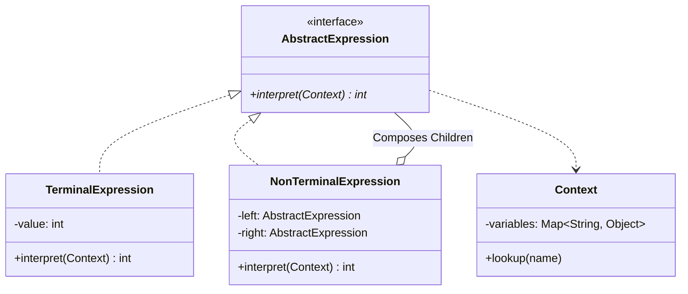
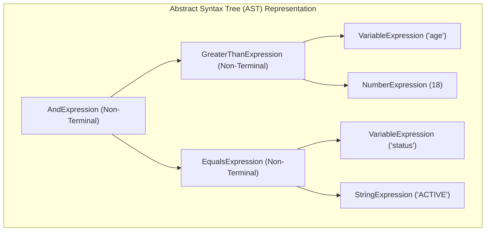
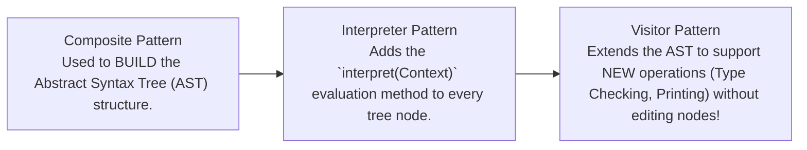

# Interpreter Pattern — Domain-Specific Languages and Abstract Syntax Trees

## Mental Model

Think of the **Interpreter Pattern** as a specialized mathematical calculator evaluating an algebraic expression tree like `(5 + 3) * 2`. 

Instead of writing a massive 1,000-line monolithic parser string function (**Low Cohesion / Unmaintainable Grammar**), the expression is parsed into an **Abstract Syntax Tree (AST)** composed of small, recursive expression classes (`AddExpression`, `MultiplyExpression`, `NumberExpression`). 

Evaluating `(5 + 3) * 2` becomes a simple recursive traversal down the tree: `MultiplyExpression` calls `interpret()` on its left child (`AddExpression`), which calls `interpret()` on `5` and `3` to return `8`, which is then multiplied by `2` to return `16`. You can add new grammar rules (e.g., `SubtractExpression` or `PowerExpression`) by introducing a new expression class without touching existing grammar rules.

---

## 1. Intent & Structural Definition

The **Interpreter Pattern** given a language, defines a representation for its grammar along with an interpreter that uses the representation to interpret sentences in the language.



### Key Components

| Component | Role in Interpreter Pattern | Example |
|---|---|---|
| **AbstractExpression** | Interface declaring the `interpret(Context)` method. | `Expression` interface |
| **TerminalExpression** | Evaluates a leaf node in the grammar tree containing no child expressions. | `NumberExpression(5)`, `VariableExpression("x")` |
| **NonTerminalExpression** | Evaluates a branch node containing one or more child expressions. | `AddExpression(left, right)`, `AndExpression(a, b)` |
| **Context** | Stores global environmental state shared across evaluations. | Variable lookup table `{"x": 10, "y": 20}` |

---

## 2. Grammar Representation: Terminal vs. Non-Terminal Expressions

Consider a simple boolean expression language used for enterprise business rule evaluation: `age > 18 AND status = 'ACTIVE'`.



---

## 3. Production Code Implementation: Business Rule DSL Evaluator

```java
// ============================================================================
// 1. EVALUATION CONTEXT (Global Variable Lookup Table)
// ============================================================================
public class EvaluationContext {
    private final Map<String, Object> variables = new HashMap<>();

    public void setVariable(String name, Object value) {
        variables.put(name, value);
    }

    public Object getValue(String name) {
        return variables.get(name);
    }
}

// ============================================================================
// 2. ABSTRACT EXPRESSION INTERFACE
// ============================================================================
public interface BooleanExpression {
    boolean interpret(EvaluationContext context);
}

// ============================================================================
// 3. TERMINAL EXPRESSIONS (Leaf Nodes)
// ============================================================================
public class VariableExpression implements BooleanExpression {
    private final String varName;

    public VariableExpression(String varName) {
        this.varName = varName;
    }

    @Override
    public boolean interpret(EvaluationContext context) {
        Object val = context.getValue(varName);
        if (val instanceof Boolean) {
            return (Boolean) val;
        }
        throw new IllegalStateException("Variable [" + varName + "] is not boolean");
    }
}

public class EqualsExpression implements BooleanExpression {
    private final String varName;
    private final Object expectedValue;

    public EqualsExpression(String varName, Object expectedValue) {
        this.varName = varName;
        this.expectedValue = expectedValue;
    }

    @Override
    public boolean interpret(EvaluationContext context) {
        Object actualValue = context.getValue(varName);
        return Objects.equals(actualValue, expectedValue);
    }
}

// ============================================================================
// 4. NON-TERMINAL EXPRESSIONS (Branch Nodes)
// ============================================================================
public class AndExpression implements BooleanExpression {
    private final BooleanExpression left;
    private final BooleanExpression right;

    public AndExpression(BooleanExpression left, BooleanExpression right) {
        this.left = left;
        this.right = right;
    }

    @Override
    public boolean interpret(EvaluationContext context) {
        // Short-circuit evaluation!
        return left.interpret(context) && right.interpret(context);
    }
}

public class OrExpression implements BooleanExpression {
    private final BooleanExpression left;
    private final BooleanExpression right;

    public OrExpression(BooleanExpression left, BooleanExpression right) {
        this.left = left;
        this.right = right;
    }

    @Override
    public boolean interpret(EvaluationContext context) {
        return left.interpret(context) || right.interpret(context);
    }
}

// ============================================================================
// 5. CLIENT EXECUTION
// ============================================================================
public class Main {
    public static void main(String[] args) {
        // Rule: (status == 'VIP') AND (accountActive == true)
        BooleanExpression isVip = new EqualsExpression("status", "VIP");
        BooleanExpression isActive = new VariableExpression("accountActive");
        BooleanExpression rule = new AndExpression(isVip, isActive);

        // Test Case 1: Matching Context
        EvaluationContext ctx1 = new EvaluationContext();
        ctx1.setVariable("status", "VIP");
        ctx1.setVariable("accountActive", true);
        System.out.println("User 1 Rule Evaluation: " + rule.interpret(ctx1)); // TRUE

        // Test Case 2: Non-matching Context
        EvaluationContext ctx2 = new EvaluationContext();
        ctx2.setVariable("status", "REGULAR");
        ctx2.setVariable("accountActive", true);
        System.out.println("User 2 Rule Evaluation: " + rule.interpret(ctx2)); // FALSE
    }
}
```

---

## 4. Relationship to Composite & Visitor Patterns

The Interpreter Pattern relies directly on the **Composite Pattern** to structure AST trees:



---

## 5. Failure Modes and Trade-offs

1. **Complex Grammar Performance Degradation** — Attempting to use the Interpreter Pattern for full programming languages (e.g., SQL or Java). Building an AST of 1,000,000 nodes using Java objects creates massive memory overhead and slow recursive execution. *Mitigation*: For complex languages, use compiler generators (ANTLR, Lex/Yacc, Bytecode compilation).
2. **Deep AST Stack Overflow** — Evaluating deeply nested AST expressions ($>5,000$ tree depth) causes recursive `interpret()` calls to throw a `StackOverflowError`. *Mitigation*: Use an iterative stack or convert the AST to a flat bytecode instruction stream.
3. **Parsing vs. Interpreting Confusion** — The Interpreter Pattern evaluates a pre-constructed AST; it does **not** construct the AST from raw text strings. *Mitigation*: Pair the Interpreter pattern with a Lexer/Parser stage to construct ASTs from raw text DSL strings.

---

## 6. Active-Recall Prompts

1. **What is the primary intent of the Interpreter Pattern, and what is an Abstract Syntax Tree (AST)?**
2. **Differentiate between Terminal Expressions and Non-Terminal Expressions with concrete code examples.**
3. **How does the Interpreter Pattern utilize the Composite Pattern to represent domain grammars?**
4. **Why is the Interpreter Pattern unsuited for complex programming languages, and what tools should be used instead (ANTLR/Bytecode)?**

---

## Related Notes

- [[Composite Pattern - Tree Structures, Uniformity vs Type Safety]]
- [[Visitor Pattern - Double Dispatch and Operations over Heterogeneous Trees]]
- [[Command Pattern - Encapsulating Requests, Undo-Redo, and Macro Commands]]
- [[Abstraction and Interface-Driven Design]]

> **Interview Style Question:** *"Design a Domain-Specific Language (DSL) rule engine for an insurance platform that evaluates rules like `(age > 65 OR pre_existing == false) AND state == 'CA'`. Write the complete AST expression classes in Java/TypeScript, demonstrate short-circuit evaluation in `AndExpression`, and explain why ANTLR or bytecode compilation is preferred over the Interpreter Pattern for high-performance compilers."*

---
